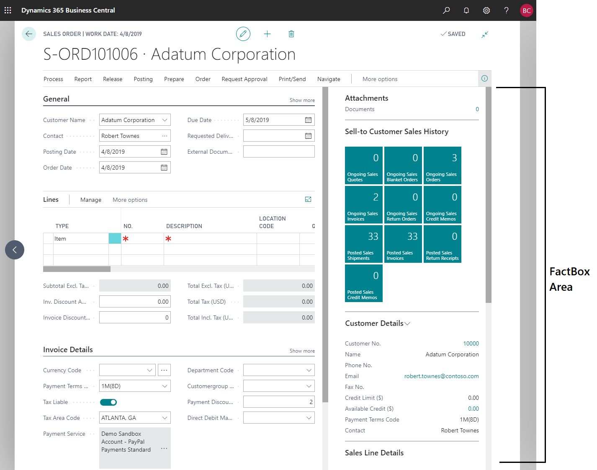

# Adding a FactBox to a Page

A FactBox is the area that is located on the right-most side of a page and it is divided into one or more parts that are arranged vertically. This area is used to display content including other pages, charts, and system parts such as Notes, and Links. Typically, you can use a FactBox to display information that is related to an item on the main content page. For example, on a page that shows a sales order list, you can use a FactBox to show sell-to customer sales history for a selected sales order in the list as shown below.  

  

The following list highlights a few categories of FactBoxes:

- Show related records/fields which are modeled as ListParts or CardParts.
- Show related KPIs which are modeled as CardParts with charts or Cues. For more information, see [Designing Role Centers](devenv-designing-role-centers.md).
- Visualize related data or display from external sources which are modeled as CardParts containing a Client AddIn. For example, Bing maps, PowerBI, Microsoft Social Engagement, and more.


## Adding a FactBox area to a page
You define the FactBox by adding a FactBox area container control to the page. The FactBox area control acts as a placeholder to which you can add different parts for the FactBox. You can add a FactBox area control on the following page types. 
  
- Card  
  
- Document  
  
- ListPlus  

- List  
  
- Worksheet 

> [!NOTE]  
> Only one FactBox area control is allowed on a page. 

> [!WARNING]  
> You can add a part to the FactBox area that displays an existing page of the CardPart or ListPart type only. If you attempt to use another page type, you will get an error. 

### Example

```AL
page 50100 "Simple Customercard Page"
{
    PageType = Card;
 
    layout
    {
        area(FactBoxes)
        {
            part(MyPart; "Acc. Sched. KPI Web Srv. Lines")
            {
                ApplicationArea = All;
                SubPageView = SORTING ("Acc. Schedule Name");
            }
            systempart(Links; Links)
            {
                ApplicationArea = All;
            }         
            systempart(Notes; Notes)
            {
                ApplicationArea = All;
            }       
        }
    }
}
```

> [!TIP]  
> When used on Lists, FactBoxes can be used to show information about the entire list, or more contextually about the user’s current selection; the currently selected rows. You can control the filter which gets passed to the FactBox that determines its contextual contents. 

### System Parts
There are two system parts that you can define by using the `systempart()` keyword: `Links` and `Notes`:

|  Value | Description |
|--------|-------------|
|  Links | Allows the user to add links to a URL or path on the record shown in the page. For example, on an Item card, a user can add a link to the supplier's item catalog. The links will appear with the record when it is viewed. When a user chooses a link, the target file opens.|
|  Notes | Allows the user to write a note on the record shown in the page. For example, when creating a sales order, a user can add a note about the order. The note will appear with the item when it is viewed.|

> [!NOTE] 
> The `systempart` keyword also includes an `Outlook` and `MyNotes`value, for example, `systempart(Outlook; Outlook)`. These values are only supported by the [!INCLUDE[nav_windows_md](includes/nav_windows_md.md)] (which has been deprecated after [!INCLUDE[prod_short](includes/prod_short.md)] Spring 2019). These values are ignored in the [!INCLUDE[nav_web_md](includes/nav_web_md.md)].

## Filtering data that is displayed on a page in a FactBox

In many cases, you want to change the content that is displayed on the page in the FactBox based on the content of the main page. For example, if the main page is a Customer List, you can have a FactBox that includes the Customer Details page that shows information about a customer. When a user selects a customer in the Customer List, the Customer Details page displays information about the selected customer. To implement this functionality, you set up a table filter that associates a field in the table that is used by the Customer Details page with a field in the table that is used by the Customer List page, as shown in the example below. You can also filter on a constant value or set of conditions. 

### Example

```AL
page 50101 "Simple Customerlist Page"
{
    PageType = List;
    SourceTable = Customer;

    layout
    {
        area(content)
        {
            repeater(Control)
            {
                field("No."; "No.")
                {
                    ApplicationArea = All;
                }
            }

        }

        area(FactBoxes)
        {
            part(CustomerList; "Customer Details FactBox")
            {
                ApplicationArea = All;
                SubPageLink = "No." = FIELD ("No.");
            }
        }
    }
}
```

## Performance considerations

Having a page composed of multiple FactBox pages that each process data from different sources can degrade performance. To improve responsiveness and the time it takes to load the page, [!INCLUDE[prod_short](includes/prod_short.md)] 2020 release wave 2 and later optimizes the sequence in which content is loaded. The sequence is as follows:

1. Content on the hosting page is loaded first, and users can immediately begin interacting with it.
2. The FactBox pane is loaded next, where each FactBox is loaded independently in sequence starting from the top.
    1. FactBoxes having the `Visible` property evaluate to `false` won't be loaded.
    2. FactBoxes that aren't within view are only loaded when the user scrolls them into view.
If the FactBox pane is collapsed, no FactBoxes are loaded until the user expands the FactBox pane.

Below are some practical tips to help you make the most of this optimization:
 - Consider hiding any FactBoxes that represent secondary content that only some users will require. Learn more about [Choosing the Visibility of Parts](devenv-designing-parts.md#choosing-the-visibility-of-parts).  
 - For FactBoxes that require heavy processing, consider processing in the page background task. Learn more about [Using Page Background Tasks](devenv-designing-parts.md#using-page-background-tasks).  
 - Avoid having triggers on the hosting page that call into a FactBox because this condition forces the FactBox to ignore performance optimizations and load along with the content of the hosting page, adding to the total loading time. 
 
### FAQ about performance

#### Are any FactBox triggers run when the FactBox is hidden?
No. The trigger is only run when the FactBox is visible and within the user's view.

#### How often are triggers run if the FactBox pane is expanded, collapsed, and then expanded again?
In this scenario, the `OnOpenPage` trigger is only run the first time. Once a FactBox is loaded, it isn't loaded again for as long as the page remains open.

#### Are FactBoxes processed asynchronously?
No. This optimization is simply a controlled sequence in which triggers are run, still within the same session as the hosting page. For more information about asynchronous processing in the background, see [Designing page parts for page background tasks](devenv-page-background-tasks.md#partpages).

#### Does this optimization work with SubPageLink or SubPageView properties?
The use of these properties has no effect on the sequence of loading content on a page. Using properties such as `SubPageView` is preferred to writing trigger code to update a FactBox.

#### Does this optimization apply to parts that aren't FactBoxes?
This optimization doesn't apply to Role Center pages. When parts are used in the content area of a page, such as on a Card page, they aren't loaded if their `Visible` property evaluates to `false`. 

#### Can I force a FactBox to load along with page content?
There's no AL API to force FactBoxes to load along with the content of the hosting page.

#### Can I set the FactBox pane to start collapsed on all pages?
No. The default state of the FactBox pane is set by the [!INCLUDE[prod_short](includes/prod_short.md)] platform and modifed by the user.

#### Does the experience vary on different browsers?
Each browser has its own definition of whether a FactBox is considered within view or not. For example, opening [!INCLUDE[prod_short](includes/prod_short.md)] in a new browser tab and quickly switching back to the original tab may pause loading of any FactBoxes in the new tab.

#### Does this optimization apply to other form factors?
This applies to desktop, tablet, and phone clients.

## See Also 
 
[Pages Overview](devenv-pages-overview.md)   
[Page and Page Extension Properties Overview](properties/devenv-page-property-overview.md)  
[Designing Role Centers](devenv-designing-role-centers.md)  
[Using Designer](devenv-inclient-designer.md)  
[Arranging Fields on a Fasttab](devenv-arranging-fields-on-fasttab.md)  
[Actions Overview](devenv-actions-overview.md)

