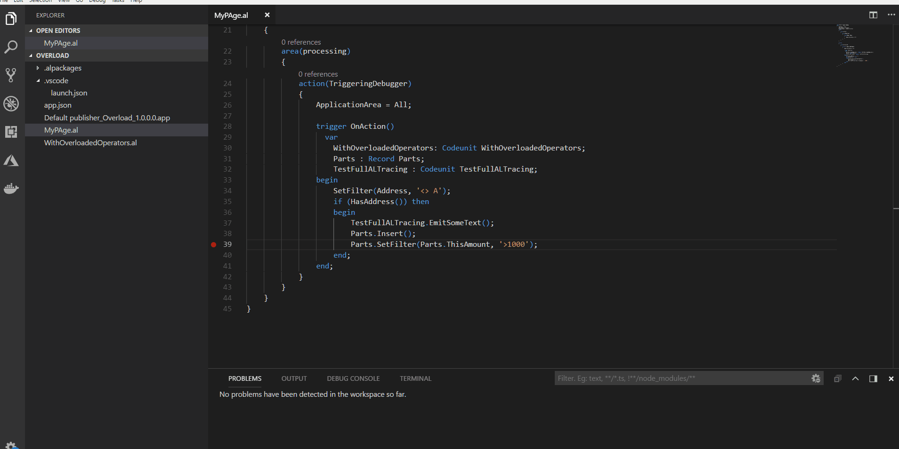

# AL Code Navigation

When you develop an AL extension, you may want to navigate around the source code frequently. To jump around the code or to access the reference code, you use the Go To Definition feature in Visual Studio Code. 

## Go To Definition

The **Go to Definition** feature navigates to the source of a type and opens the result in a new tab. You can use the `F12` shortcut key or right-click and select the **Go to Definition** feature from the right-click menu. The **Go to Definition** opens the source in the `.dal` format which contains the base application code. For example, the base application code may contain table metadata and application methods. In the following illustration, the Address type and the HasAddress type opens the `Customer.dal` file and locates the reference code of those types by using the Go To Definition feature. 

With **Go to Definition**, you can step into the referenced code and set breakpoints on the external code and base application code. For more information, see [Debugging in AL](devenv-debugging.md).

You can always use **Go to Definition** on [!INCLUDE[d365fin_long_md](includes/d365fin_long_md.md)] code. However, if you want to use it on other extensions, the extension package which is now referenced, when originally published, must have the `showMyCode` property set to `true`. For example, if A is referencing B you can only use the Go To Definition on types of B, if B, when it was published, had the `showMyCode` flag set to `true`. For more information, see [Security Setting and IP Protection](devenv-security-settings-and-ip-protection.md). 

## Runtime 5.2 and Go to Definition

From runtime 5.2 and onwards, **Go to Definition** will resolve sources from the downloaded application dependency. You can navigate from within a symbol source file (.dal) to another symbol source file. For example, you can use **Go to Definition** from the `Customer` source DAL file in the Base App to the `Customer List` DAL source also defined in the Base App.

The following conditions still apply:

- **Go to Definition** is forward only. This is due how Visual Studio Code handles preview documents (DAL files). There is no backward navigation support for preview files within Visual Studio Code. This means that if you navigate from your AL file to the `Customer` DAL source, and from there to the `Customer List` DAL source, and you issue a backward navigation (**Alt+Left arrow**), you will get back to the AL file and not what you would have expected; the `Customer` DAL source. 

- Transitive references can only be resolved if the symbol app that defines the reference is a dependency on the project that contains the entry point for the **Go to Definition** symbol. For example, assume that you are in `HelloWorld.al` and want to **Go to Definition** on the `Car` table defined in the `Car.app` which is a dependency on your app. Then navigation will open the `CarTable.dal` preview file. And assume that from here you want to **Go to Definition** on `CarDistributor` table defined in the `CarDistributor.app` which is a dependency on `Car.app`, but *not* a dependency on the `HelloWorld.app`. In this case the source code **Go to Definition** will not work.

For more information about code navigation in Visual Studio Code, see [Code Navigation](https://code.visualstudio.com/docs/editor/editingevolved).

## See Also  

[Developing Extensions in AL](devenv-dev-overview.md)  
[JSON Files](devenv-json-files.md)  
[Debugging in AL](devenv-debugging.md)  
[AL Code Actions](devenv-code-actions.md)  
