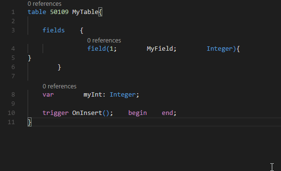
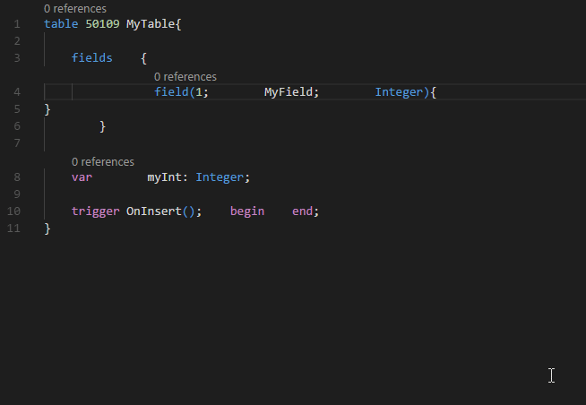

[!INCLUDE[d365fin_dev_blog](includes/d365fin_dev_blog.md)]

# AL Formatter
The AL Language extension offers users the option to automatically format their source code. This capability increases the usability of the editor by allowing developers to instantly fix the indentation and formatting of their code. 
The auto-formatter analyzes the syntax tree of the AL code that you are formatting and, using rules developed based on the coding and style guidelines for AL, inserts and removes whitespace from key points in the document to make it more readable.
The rules used by the auto-formatter cannot be configured by the user. This limitation is present to allow for a uniform style to be used throughout the community of AL developers.

## Invoking the AL formatter
The auto-formatter can be invoked to format an entire AL document or a pre-selected range. In an existing project, open the document that you want to format, right-click inside the document, and select **Format Document**. In the default configuration for Visual Studio Code, the command can be run using the shortcut Alt+Shift+F.

  

To format a range, in an already opened project, open the document that you want to modify, select the specific range to format, right-click, and select **Format Selection**. In the default configuration for Visual Studio Code, the command can be run using the shortcut Ctrl+K, Ctrl+F.

## See Also
[AL Development Environment](devenv-reference-overview.md)  
