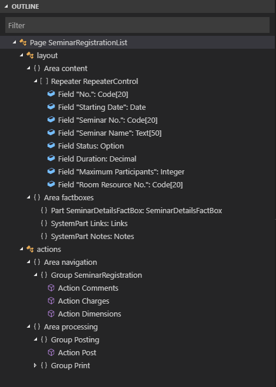

# AL Outline View

Working with the [!INCLUDE[d365al_ext_md](../includes/d365al_ext_md.md)] you have access to the **Outline** view. The **Outline** view is a separate section in the lower left corner, right under the **Explorer** view.

The **Outline** view is enabled by default and shows the symbol tree of the currently active cursor, it also allows you to filter as you type. Double-clicking on any node makes your cursor jump to the selected definition or keyword. The **Outline** view will also display any errors in your project for easy inspection.

You manage the look and feel of the **Outline** view by defining a number of settings, that are all enabled by default. To set these, press **Ctrl+Shift+P**, and then choose **Preferences: Open Settings (UI)** for workspace settings, or choose **Preferences: Open User Settings** for user settings. Under **Extensions**, and **AL Language extension configuration** you will find the settings that are available for the AL Language extension for the `settings.json` file.

+ `outline.icons` - Outline elements displayed with icons
+ `outline.problems.enabled` - Show errors and warnings on outline elements
+ `outline.problems.badges` - Badges displayed for errors and warnings
+ `outline.problems.colors` - Colors used for errors and warnings

## See Also
[AL Development Environment](devenv-reference-overview.md)  
[AL Formatter](devenv-al-formatter.md)  
