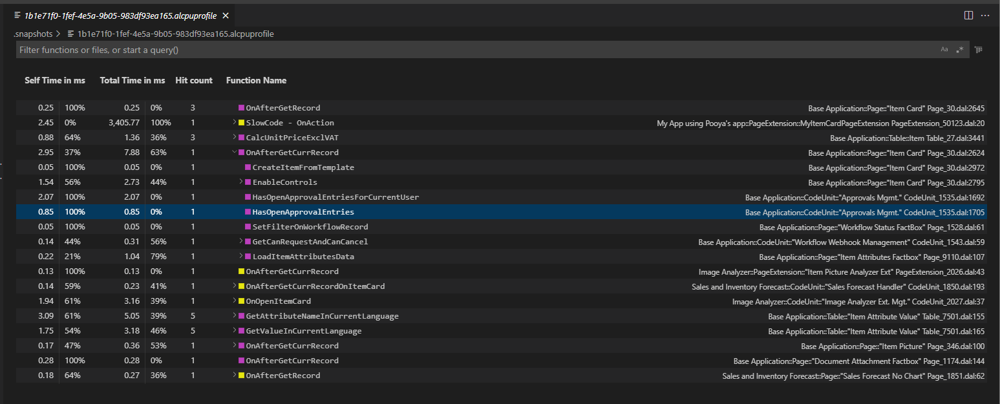

# AL Profiler Overview

With the AL Profiler for [!INCLUDE[d365al_ext_md](../includes/d365al_ext_md.md)] you can capture a performance profile of the executed code for a snapshot. Using the performance profiling editor view in Visual Studio Code, you can investigate the time spent on execution, either using top-down and bottom-up call stack views, or flame graphs.

The AL profiler works on a snapshot of running code. For more information, see [Snapshot Debugging](devenv-snapshot-debugging.md). This means that in order to do profiling on code, you must capture a snapshot of running code first. Then, when the snapshot file is downloaded, you can generate a profile file, based on the snapshot by using the **AL: Generate profile file** option. 

The profile file for AL code has the extension `.alcpuprofile` and When you open the file, it displays in the performance profiling editor view in Visual Studio Code.

## Graph of method calls

When you open the profile file, it looks similar to the illustration below:



To investigate the data shown in the graph, you can use different view modes as described in the following. Choose a method to navigate to code. The color legend of the graph is:

|Color|Layer|
|-----|-----|
|Teal |System|
|Purple| Base|
|Yellow| Other|

### View modes

To switch between views, use the small button in the upper right corner. There are two different view modes; top-down and bottom-up. When sorting the stack top-down, the graph sorts the methods according to call sequence, which means that the child nodes are the methods called from the parent node. And when sorting bottom-up, the graph is sorted as a reverse call stack, which means that the child nodes are methods who called the parent node.

### Details

To investigate further, the **Self-time** and **Total time** columns are important indicators of where time is spent in the code. The **Self-time** is the amount of time spent in the method only, excluding any calls out of the method. The **Total time** is the amount of **Self-time** plus any calls out of the method. 

**Hit count** shows the number of times a specific method was called. Time spent is aggregated.

### Filtering

The nodes in the graph can be filtered. The syntax is the following:

```
@<column name | alias> <op> <value> where <column name> := [function, url, path, selfTime, totalTime, id, objectType, objectName, declaringApplication]

```
The aliases that are available for the column names are:

`<alias> := [f, u, p, s, t, id, ot, on, da]`
`<op> := [numeric operators, boolean operators, string operators]`
`numeric operators : []`


## Inline CodeLens for AL profiling results

The option for adding a lower limit for time spent on statement execution is `al.statementLensMin`. To activate this setting, press **Ctrl+Shift+P**, and then choose **Preferences: Open Settings (UI)** for workspace settings, or choose **Preferences: Open User Settings** for user settings. <!-- Setting..., which will be shown when opening a code file through the AL profiler`al.statementLensMin` -->

## See Also

[Snapshot Debugging](devenv-snapshot-debugging.md)  
[AL Language Extension Configuration](devenv-al-extension-configuration.md)