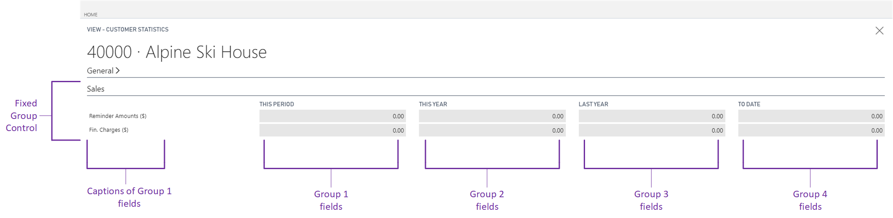
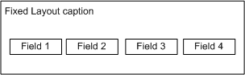
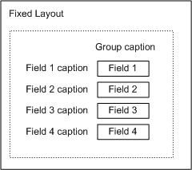
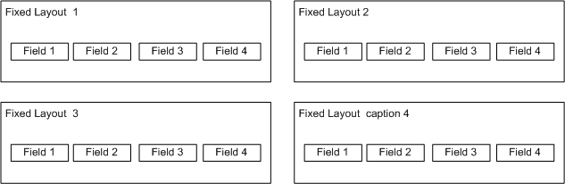

# Arranging Fields in Rows and Columns Using the Fixed Control
By default, fields on a FastTab are arranged automatically in two columns based on the number of fields. For more information on how the fields are placed on a page, see [Field Arrangement on a Fasttab](devenv-arranging-fields-on-fasttab.md). To manually arrange fields, you can either use a Grid control to design the page to look like a grid-like format, or a Fixed control to design the page to look like a matrix-like format. To understand the differences between the two controls to help you determine which control to use, see [Comparing Grid and Fixed controls](devenv-arranging-fields-using-grid-and-fixed-controls.md). 

## How Fixed control works

You use the Fixed control to arrange page fields in rows and columns to form a matrix-like layout except that the Fixed control contains a specific number of fields, and a matrix can contain an unspecified number of fields. A Fixed group control is typically used to display statistical data. The following illustration shows an example of a page that uses a Fixed control to show sales totals for different time periods.   

 

You can also use a Fixed control to display information in the details section of a Worksheet page. If you are using the [!INCLUDE[demolong](includes/demolong_md.md)], then you can see examples of these uses in page 151, Customer Statistics, and page 40, Item Journal.
  
## Adding fields  
You can add fields directly in the Fixed control. However, when you add fields directly in the Fixed control, all the fields will display in an equal size and the larger fields will get compressed. The following illustration shows the resulting field layout on a page.  
  
 

## Grouping fields in a Fixed control  
By placing the fields in a Fixed control throughout a group control, you can define separate rows and columns to create a matrix-like arrangement. The group control caption appears as the column header, and the field control captions appear as the row headers. If you add two more group controls that contain fields, then the layout on the page will display like a table format.

### Example
The following AL code uses **Fixed** control to display four fields on a page inside the group called Fixed Layout.

```AL
page 50114 "Fixed Control Example"
{    
    layout
    {
        area(content)
        {
            group("Fixed Layout")
            {
                fixed(DefiningFixedControl)
                {
                    group("Group Caption")
                    {
                        field("Field 1"; "Field 1")
                        {
                            ApplicationArea = All;
                        }
                        field("Field 2"; "Field 2")
                        {
                            ApplicationArea = All;
                        }
                        field("Field 3"; "Field 3")
                        {
                            ApplicationArea = All;
                        }
                        field("Field 4"; "Field 4")
                        {
                           ApplicationArea = All;
                        }                   
                    }
                }
            }
        }
    }
   var
        "Field 1": Integer;
        "Field 2": Integer;
        "Field 3": Integer;
        "Field 4": Integer; 
}
```

The following illustration shows the resulting field layout on a page.  
  
  
  
The group control caption appears as the column header, and the field control captions appear as the row headers. If you add two more group controls that contain fields, then the layout on the page will resemble the following illustration.  

> [!NOTE]  
> Only the captions of fields in the first column define the row headings. Therefore, only the field captions for the first group control appear. The field captions in other group controls are ignored.  
  
 

## Using multiple Fixed controls  
You can also set up more than one Fixed control in a group control. The page area will then divide the fields into two columns that contain the separate Fixed fields. For example, the following illustration shows the page layout if you have four Fixed controls.  

 

> [!NOTE]  
> The fields in the Fixed controls in the illustration are not in a group control. If they were in a group control, then they would follow the same principle as described in the previous section about how to group fields. 

> [!IMPORTANT]  
> In previous versions, having a Fixed control directly under a content area was supported. However, in [!INCLUDE[d365_bus_central_md](includes/d365_bus_central_md.md)], you must make sure that the Fixed control is nested in a Group control. For more information, see [Supported Structure for Using the Grid and Fixed Controls](devenv-arranging-fields-using-grid-and-fixed-controls.md#supported-structure-for-using-the-grid-and-fixed-controls).

## Editing fields in a Fixed control  
Fields in a fixed layout are not editable even if the **Editable** property is set to **true**. However, if the field drills down to a page where the field source is defined, then you can modify the field. For more information, see [Editable Property](properties/devenv-editable-property.md).
  
## See Also  
[Field Arrangement on a FastTab](devenv-arranging-fields-on-fasttab.md)  
[Pages Overview](devenv-pages-overview.md)  
[Arranging Fields Using Grid and Fixed Controls](devenv-arranging-fields-using-grid-and-fixed-controls.md)  
[Arranging Fields in Rows and Columns Using the GridLayout Control](devenv-arrange-fields-in-rows-and-columns-using-gridlayout-control.md)  