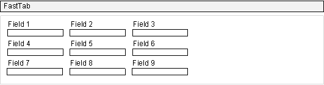
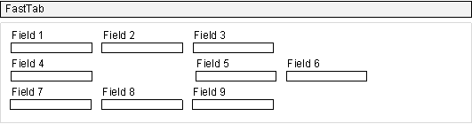
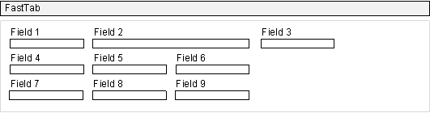

# Arranging Fields in Rows and Columns Using the Grid Control

By default, fields in a FastTab are arranged automatically in two columns that are based on the number of fields. For more information, see [Field Arrangement on a FastTab](devenv-arranging-fields-on-fasttab.md). You can use a Grid control or a Fixed control to arrange fields in rows and columns on a page and design it to look like a grid-like format or a matrix-like format. To understand the differences between the two controls to help you determine which control to use, see [Comparing Grid and Fixed controls](devenv-arranging-fields-using-grid-and-fixed-controls.md). 

> [!NOTE]  
> Grid control for arranging page fields is partially supported. 

Using the **Grid** control, you can arrange the fields manually in one or more rows and columns. The **Grid** control gives you the following options:  
  
- Set up your grid row-by-row or column-by-column.  
  
- Span a field across multiple rows and columns.  
  
- Show or hide field captions.  
  
## Setting-up fields in rows and columns in a FastTab  
To set up a grid in row-by-row or column-by-column format, you define the **Grid** control in a FastTab of a page. You must define the **Grid** control in a group and specify how you want to arrange the fields by using the **GridLayout** property. For more information, see [GridLayout Property](properties/devenv-gridlayout-property.md). 

#### Example
The following example demonstrates how to structure a page in a grid-like format. 

```AL
page 50113 "Customers Page"
{
    PageType = Card;
    SourceTable = Customer;
    layout
    {
        area(content)
        {
            group(General)
            {
                grid(MyGrid)
                {
                    group("General Info")
                    {
                        field("No."; "No.")
                        {
                            ApplicationArea = All;
                        }
                        field(Name; Name)
                        {
                            ApplicationArea = All;
                        }
                        field("E-Mail"; "E-Mail")
                        {
                            ShowCaption = false;
                            ApplicationArea = All;
                        }
                    }
                    group("Address Details")
                    {
                        grid(Grid2)
                        {
                            group(GridForm)
                            {
                                field(Address; Address)
                                {
                                    ApplicationArea = All;
                                }
                                field("Post Code"; "Post Code")
                                {
                                    ApplicationArea = All;
                                }
                            }
                        }
                    }
                }
            }
        }
    }
}
```
The following screenshot shows how the resulting page looks like from the [!INCLUDE[d365fin_web_md_md](includes/d365fin_web_md.md)].  

   


## Setting fields to span multiple rows and columns  
You can set a field to span multiple rows or columns. When you set a field to span multiple rows, the field occupies the cells in the rows below it, and existing fields in the occupied cells are moved to the right. When you set a field to span multiple columns, the field occupies the cells in the columns to the left, and existing fields in the occupied cells are moved to the right. You can also set a field to span multiple rows and columns. 

> [!IMPORTANT]  
> The [!INCLUDE[d365_bus_central_md](includes/d365_bus_central_md.md)] web client does not support row and column spanning for fields. If the page displays in the [!INCLUDE[d365_bus_central_md](includes/d365_bus_central_md.md)] web client, the fields appear without spanning.  

 For example, the following figure illustrates a **Grid** control that consists of six fields arranged in three rows.  

   

 If you set **Field 2** to span two rows, then the following layout is displayed:  

   

 When you set a field to span multiple columns, the field occupies the cells in the columns to the right, and existing fields in the occupied cells are moved to the right. Using the previous **Grid** example, if you set **Field 2** to span two columns instead of two rows, the following layout is displayed:  

   

 You can also set a field to span multiple rows and columns. For example, if you set **Field 2** to span two rows and two columns, the following layout is displayed:  

 +
  
#### To set a field to span rows and columns  
  
When you set the **Grid** control, the fields of that group can be set to span rows or columns.
  
- To set a field to span one or more rows, set the value of the **RowSpan** property to the number of rows. For more information, see [RowSpan Property](properties/devenv-rowspan-property.md). 
  
- To set a field to span one or more columns, set the value of the **ColumnSpan** property to the number of columns. For more information, see [ColumnSpan Property](properties/devenv-columnspan-property.md).   

> [!NOTE]  
> The **RowSpan** and **ColumnSpan** properties on fields in the grid layout are not supported in the [!INCLUDE[d365_bus_central_md](includes/d365_bus_central_md.md)] web client. The **Rows** layout on the grid control itself is not supported.
  
##  <a name="position"></a> Hiding field captions  
  
You can hide the caption of a group or a field. To hide the caption of a field, set the value of the **ShowCaption** property to **False**. For more information, see [ShowCaption Property](properties/devenv-showcaption-property.md).

  
## See Also  
[Field Arrangement on FastTabs](devenv-arranging-fields-on-fasttab.md)  
[Arranging Fields Using Grid and Fixed Controls](devenv-arranging-fields-using-grid-and-fixed-controls.md)  
[Arranging Fields in Rows and Columns Using the Fixed Control](devenv-arrange-fields-in-rows-and-columns-using-fixedlayout-control.md).