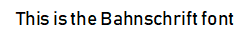

 

# Control Add-in Style Guide
This article offers a variety of stylistic definitions that are used throughout [!INCLUDE[d365fin_md](includes/d365fin_md.md)], which you can apply to your control add-ins to create an experience that complements [!INCLUDE[d365fin_md](includes/d365fin_md.md)].

## Introduction
Control add-ins for [!INCLUDE[d365fin_md](includes/d365fin_md.md)] extend a business solution by surfacing contextual functionality alongside business data. Control add-ins empower users to get more done without costly context switching, no matter which device they access Dynamics 365 from. Typical uses of control add-ins include unique data visualizations, surfacing controls from a third party service, or displaying related content from another data source.

Apart from the functionality, an important aspect of creating a control add-in is making sure the control add-in looks good and blends seamlessly into [!INCLUDE[d365fin_md](includes/d365fin_md.md)]. To achieve this, you should follow these basic principles:

- Apply similar patterns for command, navigation and presentation of data.
- Favor content over chrome
- Design for all platforms and input methods.
- Make it accessible to all users.
- Make it enjoyable and keep users in control.

[!INCLUDE[d365fin_md](includes/d365fin_md.md)] uses a set of specific colors and fonts. You can employ these colors and fonts in your control add-ins to give it a style that matches the rest of client's user interface.  

> [!IMPORTANT]  
> This article is currently in progress and contents will change.

## Colors
Choosing the right color gives the interface visual continuity. Color can be used to convey information to users, indicate interactivity, give feedback, and more. The following sections describe the colors used in [!INCLUDE[d365fin_md](includes/d365fin_md.md)]. The colors can be used on all aspects of a UI element, such background, border, text, and more. 

### Main colors

The following colors represent the [!INCLUDE[d365fin_md](includes/d365fin_md.md)] theme main palette.

|  Color  |  Name  |  Use  |  HEX value  |
|---------|--------|-------|-------------|
|")|Primary color|Prominent UI elements and areas.|#00B7C3|
| ")|Secondary color| UI elements and areas in default or subdued state.|#505C6D|

### Style colors
The following colors are used to express or accent conditions or user activity in the UI. For example, these colors are used as sentiments, or color indication, on Cues.
  
|  Color  |  Description  | HEX value|
|---------|---------------|----------|
|")|Standard|#212121|
|")|Accent|#00B7C3|
|")|Strong|#212121|
|")|Favorable|#35AB22|
|")|Ambiguous|#9F9700|
|")|Unfavorable|#EB6965|
|")|Attention|#EB6965|
|")|Subordinate|#A7ADB6|

### More palette colors
The following table includes additional colors that you can use in the UI.

|  Color  |  Description  | HEX value|
|---------|---------------|----------|
|")|Yellow|#C9C472|
|")|Green|#88CE81|
|")|Red|#E97768|
|")|Blue|#75B5E7|
|")|Light green|#59CCB4|
|")|Sky|75D8E7|
|")|Egg|EEEA86|
|")|Orange|#E89E63|
|")|Violet|#DBBDEB|
|")|Teal|#39B294|
|")|Grass|#73BA5A|
|")|Scarlet|#E65E6D|

### Chart colors
The following table describes the colors used in charts.

|  Color  |  Description  | HEX value|
|---------|---------------|----------|
| ")|-|#505C6D|
| ")|-|#008089|
|")|Primary color|#00B7C3|
|")|Yellow|#C9C472|
|")|Red|#E97768|
|")|Blue|#75B5E7|
|")|Light green|#59CCB4|
|")|Sky|75D8E7|
|")|Egg|EEEA86|
|")|Violet|#DBBDEB|
|")|Teal|#39B294|
|")|Grass|#73BA5A|


### Applying colors
To apply a color scheme to the control add-in, you specify CSS rule-sets that use the following properties:

|  Property  |  Description  |
|------------|---------------|
|`color`|Specifies font color.|
|`background-color`|Specifies background colors.|
|`border-color`|Specifies Border colors. |

For example, to change the background of a part of your UI to use the `Secondary (#505C6D)` color, write the following CSS:

```css
.my-ui-part {
    background-color: #505C6D;
}
```

If you want to change the text color of a caption to the Primary (#00B7C3) color, use the following CSS:

```css
.my-caption {
    color: #00B7C3;
}
```
## Typography

The main goal of typography is to provide clean and readable text in the user interface. Similar to colors, typgraphy can also be used to convey or communicate conditions to the user. 

### Font Families

[!INCLUDE[d365fin_md](includes/d365fin_md.md)] uses the following font families to specify the typeface and weight for text elements, such as headings, captions, messages, and so on:

|  Example  |  Name  | Value |
|-----------|--------|:-----------:|
|| Segoe UI | `"Segoe UI", "Segoe WP", Segoe, device-segoe, Tahoma, Helvetica, Arial, sans-serif` |
|| Segoe UI Light | `"Segoe UI Light", "Segoe WP Light", device-segoe-light, "Segoe WP Semilight", "Segoe UI", "Segoe WP", Segoe, Tahoma, Helvetica, Arial, sans-serif` |
|| Segoe UI Semilight | `"Segoe UI Semilight", "Segoe WP Semilight", device-segoe-semilight, "Segoe UI", "Segoe WP", Segoe, Tahoma, Helvetica, Arial, sans-serif` |
|| Segoe UI Semibold | `"Segoe UI Semibold", "Segoe WP Semibold", device-segoe-semibold, "Segoe UI", "Segoe WP", Segoe, Tahoma, Helvetica, Arial, sans-serif` |
|| Bahnschrift | `webclient-standard, device-standard, "Segoe UI", "Segoe WP", Segoe, Tahoma, Helvetica, Arial, sans-serif` |

### Sizes
[!INCLUDE[d365fin_md](includes/d365fin_md.md)] uses the following font sizes for text. The same font family on different clients may apply different sizes.

|  Example  | Name | Value |
|-----------|------|:-----:|
|")| largest-plus-font-size | `37.5pt` |
|")| largest-font-size | `30pt` |
|")| large-plus-font-size | `22.5pt` |
|")| large-font-size | `18pt` |
|")| medium-plus-font-size | `15pt` |
|")| medium-font-size | `13.5pt` |
|")| small-plus-font-size | `12pt` |
|")| small-font-size | `10.5pt` |
|")| smallest-font-size | `9pt` |

<!-- 
| Large | `16pt` |
| Medium+ | `14pt` |
| Medium | `12pt` |
| Small | `10pt` |
| Smallest | `9pt` |

#### Phone client

| Name | Value |
|------------|:-----:|
| Largest | `24pt` |
| Large | `18pt` |
| Medium+ | `14pt` |
| Medium | `14pt` |
| Small | `12pt` |
| Smallest | `10pt` |
-->

### Applying Font Families and Sizes
To apply fonts and sizes to text elements in the UI, you need specify the following CSS properties:

- Font family. use property `font-family`.
- Font size. use property `font-size`.

For example, to change a UI element for the Web client to use the font family *Segoe UI Light* and the size *Small* (10.5pt), write the following CSS:

```css
.my-ui-part {
    font-family: "Segoe UI Light", "Segoe WP Light", device-segoe-light, "Segoe WP Semilight", "Segoe UI", "Segoe WP", Segoe, Tahoma, Helvetica, Arial, sans-serif;
    font-size: 10.5pt;
}
```

> [!IMPORTANT]
>   To ensure that the correct fonts are used on devices, do not omit fonts or change the order of the fonts.

## Example
This examples illustrates how to use CSS to style a simple HTML UI part of a control add-in. The example includes three UI controls, as shown in the following HTML code:

```html
<div class="addin">
    <div class="control">
        <div class="caption">Name:</div>
        <div class="value">
            <input type="text" name="name">
        </div>
    </div>

    <div class="control">
        <div class="caption">Surname:</div>
        <div class="value">
            <input type="text" name="name">
        </div>
    </div>

    <div class="control">
        <div class="submit">Submit</div>
    </div>
</div>
```

The following is CSS code for styling the controls, including padding, background colors, and fonts:

```css
.addin {
    padding: 1em;
    background-color: #505C6D; /* Sets the background color to "Secondary" */
}

.addin .control {
     border-color: #00B7C3; /* Sets the border color to "Primary" */
}

.addin .control .caption {
    color: #00B7C3; /* Sets the captions to "Primary" */

    /* Segoe UI Light, small */
    font-family: "Segoe UI Light", "Segoe WP Light", device-segoe-light, "Segoe WP Semilight", "Segoe UI", "Segoe WP", Segoe, Tahoma, Helvetica, Arial, sans-serif; /* Sets the font of the caption to ""Segoe UI Light" */
    font-size: 10.5pt;
}

.addin .control .value {
    color: #008089; /* Tertiary shade 2 */

    /* Segoe UI, medium */
    font-family: "Segoe UI", "Segoe WP", Segoe, device-segoe, Tahoma, Helvetica, Arial, sans-serif;
    font-size: 12pt;
}

.addin .control .submit {
    color: white; /* Sets the caption text to "white" */
    background-color: #00B7C3; /* Sets the background to "Primary */

    /* Segoe UI Semibold, medium */
    font-family: "Segoe UI Semibold", "Segoe WP Semibold", device-segoe-semibold, "Segoe UI", "Segoe WP", Segoe, Tahoma, Helvetica, Arial, sans-serif;
    font-size: 12pt;
    text-transform: uppercase; /* Sets the caption to use all uppercase letters */
}
```

<!--
## See Also  
 [Development](Development.md)
-->
