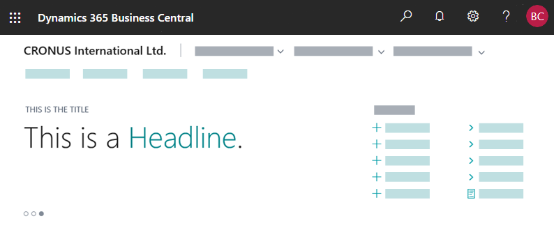

# Creating a Role Center Headline

You can set up a Role Center to display a series of headline texts that appear one by one for a predefined period of time.



The headlines can provide users with up-to-date information and insight into the business and daily work. Typical categories of headlines might include:

- My performance
- My workday
- Organizational health  
- Productivity tips
- Cross-tenant insights (performance relative to peers)
- Getting started information

> [!IMPORTANT]
> Headlines will only appear in the [!INCLUDE[d365fin_web_md](includes/d365fin_web_md.md)]; they will not be shown on other client types.

> [!Note]
> Headlines can display numbers and letters only. For example, headlines cannot display images.

## Design concept

### In development

In short, the Headline is basically a page that contains one or more fields. The page must be the **HeadlinePart** type page. Each field defines an individual headline to be displayed. The source for a field can be an expression or a field in an underlying table.

- The **HeadlinePart** page is designed for Role Centers, that is, pages that have the type **RoleCenter**. If you use a **HeadlinePart** page on another page type, the part will not render in the client.

- Using the OnDrillDown trigger, headlines can be made interactive, meaning that users can select the headline to dig deeper into numbers or values that are shown in the headline or link to another page or URL.

- You can dynamically toggle visibility of a specific headline, for example based on its relevancy, by setting the Visible property on the field.  

- There are only a few field properties that apply to fields that are used on a **HeadlinePart** type page, including Expression, Visible, ApplicationArea, Drilldown, and DrillDownPageID. All other properties are ignored.

### In the client

The Role Center will start by displaying the first visible headline that is defined on the HeadlinePart page. The headline will appear for 5 seconds, then the next headline will appear for 5 seconds, and so on. When all the headlines have been displayed, it will cycle back to the first headline, and continue from there.

- If a headline is interactive, users can select the headline to open the target defined in the headline.

- Users can pause on a headline by pointing to it. 

- Users can manually switch among headlines by selecting a corresponding dot that is displayed under the headlines. 

- Users can personalize their Role Center to show or hide the Headline part as they like.

## Creating a HeadlinePart page

1. Implement the logic that resolves field expressions for the headlines that you will use on the page. 

    You can apply more flexible and complex patterns,  such as having data tables drive the text, drill-down and relevance engine for headlines.

2. Create a page that has the [PageType property](properties/devenv-pagetype-property.md) set to `HeadlinePart`.
3. For each headline, add a field, and set the [Expression property](./properties/devenv-properties.md). The order of the fields, determines the order in which they appear.

    The following example shows the AL code for a simple **HeadlinePart** page that consists of four fields that display static text. 

    ```AL
    page 50100 RoleCenterHeadline
    {
    PageType = HeadLinePart;

    layout
    {
        area(content)
        {
            field(Headline1; hdl1Txt)
            {

            }
            field(Headline2; hdl2Txt)
            {

            }
            field(Headline3; hdl3Txt)
            {

            }
            field(Headline4; hdl4Txt)
            {

            }
        }
    }

    var
        hdl1Txt: Label 'This is headline 1';
        hdl2Txt: Label 'This is headline 2';
        hdl3Txt: Label 'This is headline 3';
        hdl4Txt: Label 'This is headline 4';
    }
    ```

4. You can now add the **HeadlinePart** page to the **RoleCenter** page.

## Constructing Headlines with the Expression property

The `Expression` property supports the following syntax that enables you to specify a title for the headline, the headline text itself, and emphasize a string of text in the headline:

```
'<qualifier>Title</qualifier><payload>This is the <emphasize>Headline</emphasize>.</payload>'
```

|Tag|Description|
|---|-----------|
|`<qualifier></qualifier>`|Specifies the title that appears above the headline. If you omit this tag, the text **HEADLINE** will be used by default.|
|`<payload></payload>`|Specifies the actual headline text.|
|`<emphasize></emphasize>`|Applies the style to the text.|

The `Expression` property must evaluate to the correct syntax. For example, looking back at the previous example, the label `hdl1Txt` could be:

```
hdl1Txt: Label '<qualifier>The first headline</qualifier><payload>This is the <emphasize>Headline 1</emphasize>.</payload>';
```

## Making headlines interactive

You can use the [OnDrillDown trigger](triggers-auto/pagefield/devenv-ondrilldown-pagefield-trigger.md) of a headline field to link the headline to more details or relevant information about what is shown in the headlines. For example, if the headline announced the largest sales order for the month, you could set up the headline to open a page that shows a sorted list of sales order for the month.

The following code uses the OnDrillDown trigger to link `Headline1` to the [!INCLUDE[d365fin_md](includes/d365fin_md.md)] online help.

```AL
field(Headline1; hdl1Txt)
{
    trigger OnDrillDown()
    var
        DrillDownURLTxt: Label 'https://go.microsoft.com/fwlink/?linkid=867580', Locked = True;
    begin
        Hyperlink(DrillDownURLTxt)
    end;
}
```

## Changing the visibility of headlines

You can use the [Visible property](properties/devenv-visible-property.md) to show or hide headlines that are defined on the **HeadlinePart** page. With the `Visible` property, you can show or hide the control either statically by setting the property to **true** or **false**, or dynamically by using a `Boolean` variable. 

### Static visibility

With static visibility, you can simply set the `Visible` property on specific fields. For example, following code hides `Headline3`: 

```AL
{
    field(Headline1; hdl1Txt)
    {

    }
    field(Headline2; hdl2Txt)
    {

    }
    field(Headline3; hdl3Txt)
    {
         Visible=false;
    }
    field(Headline4; hdl4Txt)
    {
    }
}
```

By adding fields under `Group` controls, you can hide or show more than one headline by setting the `Visible` property on the `Group` control. For example, the following code hides headings `Headline3` and `Headline4`:

```AL
group(Group1)
{
    field(Headline1; hdl1Txt)
    {
    }
    field(Headline2; hdl2Txt)
    {

    }
    }
group(Group2)
{
    Visible=false;
    field(Headline3; hdl3Txt)
    {
    }
    field(Headline4; hdl4Txt)
    {
    }
}
```

> [!IMPORTANT]
> Unlike other page types, the `group` control has no effect on the UI on pages of type **HeadlinePart**. Its primary purpose is to enable developers to group headlines for controlling visibility.

### Dynamic visibility

With dynamic visibility, you can show or hide a headline based on a condition that evaluates to `true` or `false`. 

- To dynamically show or hide a headline when the **HeadlinePart** page opens, the headline field must be in `group` control, and you set the `Visible` property on the `group` control to the `Boolean` variable that determines the visibility. For example, you could add code on the page's `OnAfterGetRecord` trigger that evaluates the relevance of displaying `Headline3` and results in a `Boolean` variable being set to `true` or `false`.  

- To dynamically show or hide a headline while a page is open, you set the `Visible` property on the `field` control to the `Boolean` variable that determines the visibility.

```AL
group(Group1)
{
    field(Headline1; hdl1Txt)
    {
    }
    field(Headline2; hdl2Txt)
    {

    }
    }
group(Group2)
{
    // Determines visibility when the page opens
    Visible=ShowHeadline3;
    field(Headline3; hdl3Txt)
    {
        // Determines visibility while the page is open
        Visible=ShowHeadline3;
    }
    field(Headline4; hdl4Txt)
    {
    }
}
```

## Extending the built-in headlines

Maybe you don't want to create your own role center and your own headline part, but just want to add some headlines to the built-in role centers in [!INCLUDE[prod_short](includes/prod_short.md)] application? You can do this by doing the following:

1. Navigate to the Role Center in which you want to add headlines.
1. Open the Page Inspector tool. For more information, see [Inspecting pages in Business Central](/dynamics365/business-central/across-inspect-page).
1. Choose the HeadlinePart on the role center.
1. In the Page Inspection pane, you can now see the name and id of the page hosting the HeadlinePart part in the [!INCLUDE[prod_short](includes/prod_short.md)] application. 
1. Now you can use a normal page extension to add new headlines to the page.


For example, the following code adds a heading `headlineTextYoutube` to the Business Manager role center:

```AL
pageextension 50100 BCLEHeadlines extends "Headline RC Business Manager"
{
    layout
    {
        addfirst(Control1)
        {
            field(headlineTextYoutube; headlineTextYoutube)
            {
                ApplicationArea = All;

                trigger OnDrillDown()
                var
                    DrillDownURLTxt: Label 'https://aka.ms/bcYoutube', Locked = True;
                begin
                    Hyperlink(DrillDownURLTxt)
                end;
            }
        }
    }

    trigger OnOpenPage()
    begin
        headlineTextYoutube := 'Subscribed to Business Central Youtube yet? Visit aka.ms/bcYoutube';
    end;

    var
        headlineTextYoutube: Text;
}


```


## See Also

[Pages Overview](devenv-pages-overview.md)  
[Page Object](devenv-page-object.md)