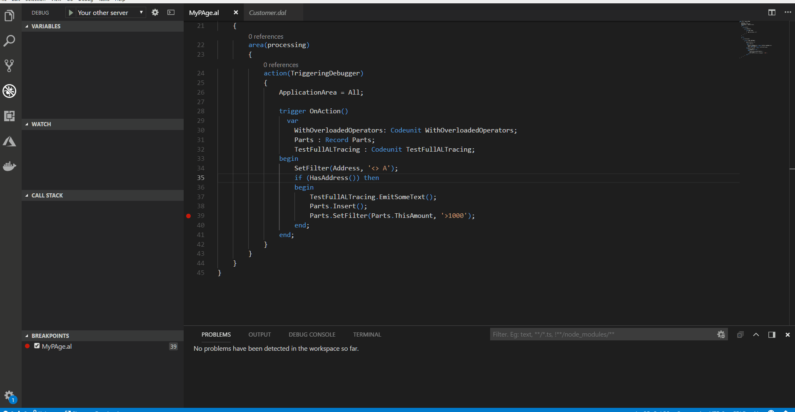

# Debugging

The process of finding and correcting errors is called *debugging*. With Visual Studio Code and the [!INCLUDE[d365al_ext_md](../includes/d365al_ext_md.md)] you get an integrated debugger to help you inspect your code to verify that your application can run as expected. You start a debugging session by pressing **F5**. For more information about Debugging in Visual Studio Code, see [Debugging](https://code.visualstudio.com/docs/editor/debugging). 

An alternative to classic debugging, is snapshot debugging, which allows you to record running code, and later debug it. For more information, see [Snapshot Debugging](devenv-snapshot-debugging.md).

> [!IMPORTANT]  
> To enable debugging in versions before [!INCLUDE[prod_short](../includes/prod_short.md)] April 2019, the `NetFx40_LegacySecurityPolicy` setting in the Microsoft.Dynamics.Nav.Server.exe.config file must be set to **false**. This requires a server restart.

> [!IMPORTANT]  
> To use the development environment and debugger, you must make sure that port `7049` is available.

There are a number of limitations to be aware of:

- "External code" can only be debugged if the code has the `showMyCode` flag set. For more information, see [Security Setting and IP Protection](devenv-security-settings-and-ip-protection.md). 
- The debugger launches a new client instance each time you press **F5**. If you close the debugging session, and then start a new session, this new session will rely on a new client instance. We recommend that you close the Web client instances when you close a debugging session.
- Pausing the debugging session is not supported.

To control table data synchronization between each debugging session, see [Retaining table data after publishing](devenv-retaining-data-after-publishing.md).  

> [!TIP]  
> To be able to debug an online environment with an Embed app published in it, make sure to specify the `applicationFamily` parameter in your launch.json file. You define the application family for your Embed app during onboarding. 

## Breakpoints
  
The basic concept in debugging is the *breakpoint*, which is a mark that you set on a statement. When the program flow reaches the breakpoint, the debugger stops execution until you instruct it to continue. Without any breakpoints, the code runs without interruption when the debugger is active. You can set a breakpoint by using the **Debug Menu** in Visual Studio Code. For more information, see [Debugging Shortcuts](#debugging-shortcuts). 
 
Set breakpoints on the external code that is not part of your original project. You can step into the base application code by using the **Go to Definition** feature, and set breakpoints on the referenced code which is generally a `.dal` file. To set a breakpoint on the external code or base application code, you do the following: 

- Use **Go to Definition** which opens the "external file" and then a breakpoint can be set.  
- Using the debugger, step into the code, and then set a breakpoint.

In the following video illustration, the `Customer.dal` is an external file. A breakpoint is set in the `Customer.dal` file which is referenced from your AL project to stop execution at the marked point. 

For more information about **Go to Definition**, see [AL Code Navigation](devenv-al-code-navigation.md). 

## Break on errors

Specify if the debugger breaks on the next error by using the `breakOnError` property. If the debugger is set to `breakOnError`, then it stops execution both on errors that are handled in code and on unhandled errors.

The default value of the `breakOnError` property is **true**, which means the debugger stops execution that throws an error by default. To skip the error handling process, set the `breakOnError` property to **false** in the `launch.json` file. 

> [!TIP]  
> If the debugging session takes longer, you can refresh the session by pressing the **Ctrl+Shift+P** keys, and select **Reload Window**.

## Break on record changes

Specify if the debugger breaks on record changes by using the `breakOnRecordWrite` property. If the debugger is set to break on record changes, then it breaks before creating, modifying, or deleting a record. The following table shows each record change and the AL methods that cause each change. 

|Record change|AL Methods|  
|-------------------|---------------------|  
|Create a new record|[Insert Method (Record)](methods-auto/record/record-insert-method.md)|  
|Update an existing record|[Modify Method (Record)](methods-auto/record/record-modify-method.md), [ModifyAll Method (Record)](methods-auto/record/record-modifyall-method.md), [Rename Method (Record)](methods-auto/record/record-rename-method.md)|  
|Delete an existing record|[Delete Method (Record)](methods-auto/record/record-delete-method.md), [DeleteAll Method (Record)](methods-auto/record/record-deleteall-method.md)|  

The default value of the `breakOnRecordWrite` property is **false**, which means that the debugger is not set to break on record changes by default. To break on record changes, you can set the `breakOnRecordWrite` property to **true** in the `launch.json` file. For more information, see [JSON Files](devenv-json-files.md).

## Debugging large size variable values

Variables that contain values that are larger than 1024 bytes are truncated (`…`) and cannot be fully inspected from the **VARIABLES** window. In order to inspect a large size variable value, instead use the **DEBUG CONSOLE** and write the name of the variable to inspect at the prompt and then press **Enter**.

## Attach and Debug Next

If you do not want to publish and invoke functionality to debug it, you can instead attach a session to a specified server and await a process to trigger the breakpoint you have set. For more information, see [Attach and Debug Next](devenv-attach-debug-next.md).

## Debugging shortcuts

|Keystroke    |Action         |
|-------------|---------------|
|**F5**           |Start debugging|
|**Ctrl+F5**      |Start without debugging|
|**Shift+F5**     |Stop debugging|
|**Ctrl+Shift+F5**|Start debugging without publishing.   Using this command on a changed, but not published code may trigger false existing breakpoints. For example, if you modify method "foo", add two lines and put a breakpoint on the second line and then start debugging without publishing, that breakpoint will not be hit, or if it is hit is not your new code that it breaks. If it breaks, it will break on the line that the server thinks the breakpoint is, based on the last published code.|
|**Alt+F5**       |Start RAD with debugging. For more information, see [Working with Rapid Application Development](devenv-rad-publishing.md).|
|**F10**          |Step over|
|**F11**          |Step into|
|**Shift+F11**    |Step out|
|**F12**          |Go To Definition| 

For more shortcuts, see [Debugging in Visual Studio Code](https://code.visualstudio.com/docs/editor/debugging). For working with Snapshot Debugging, see [Snapshot Debugging](devenv-snapshot-debugging.md).

<!-- 
To use the Go To Definition on local server, it requires that the AL symbols are rebuilt and downloaded from C/SIDE. The application symbols that were built with the previous version of C/SIDE would not make it possible to have Go To Definition work on base application methods. -->

## Debugging SQL behavior

Traditionally, debugging AL has been about examining behavior of the language runtime, for example, looking into the content of local variables at a breakpoint. As of [!INCLUDE[prod_short](includes/prod_short.md)] April 2019, the AL debugger also offers the capability to examine the impact that your AL code has on the [!INCLUDE[prod_short](includes/prod_short.md)] database. The `enableSQLInformationDebugger` setting enables this functionality. For more information, see [JSON Files](devenv-json-files.md#Launchjson).

### View database statistics

In the **VARIABLES** pane in debugger, expand the **\<Database statistics\>** node to get insights such as the current network latency between the [!INCLUDE[server](includes/server.md)] and the [!INCLUDE[prod_short](includes/prod_short.md)] database, the total number of SQL statements executed, and the total number of rows read, as well as insights into the most recent SQL statements executed by the server. The following insights are part of the database statistics:

|Insight | Description  |
|-------|-------|
|Current SQL latency (ms) | When the debugger hits a breakpoint, the [!INCLUDE[server](includes/server.md)] will send a short SQL statement to the database and measure how long time it takes. The value is in milliseconds.| 
|Number of SQL Executes | This number shows the total number of SQL statements executed in the debugging session since the debugger was started.|
|Number of SQL Rows Read | This number shows the total number of rows read from the [!INCLUDE[prod_short](includes/prod_short.md)] database in the debugging session since the debugger was started.|

> [!TIP]
> You can also get database insights from the AL runtime by using the [SqlStatementsExecuted()](methods-auto/sessioninformation/sessioninformation-sqlstatementsexecuted-method.md) and [SqlRowsRead()](methods-auto/sessioninformation/sessioninformation-sqlrowsread-method.md) methods.

### View SQL statement statistics

The database insights also let you peek into the most recent and the latest long running SQL statements executed by the server. To view a list if these, expand either the **\<Last Executed SQL Statements\>** or **\<Last Long Running SQL Statements\>** node. The following insights are part of the SQL statement statistics:

| Insight    | Description      |
|-------|-------|
|Statement | The SQL statement that the AL server sent to the [!INCLUDE[prod_short](includes/prod_short.md)] database. You can copy this into other database tools, such as SQL Server Management Studio, for further analysis.| 
|Execution time (UTC) | The timestamp (in UTC) of when the SQL statement was executed. You can use this to infer whether the SQL statement was part of the AL code between current and last breakpoint (if set).
|Duration (ms) | The duration in milliseconds of the total execution time of the SQL statement measured inside the [!INCLUDE[server](includes/server.md)]. You can use this to analyze whether you are missing indexes ([!INCLUDE[prod_short](includes/prod_short.md)] keys), or to experiment with performance of database partitioning and/or compression.|
|Approx. Rows Read | This number shows the approximate number of rows read from the [!INCLUDE[prod_short](includes/prod_short.md)] database by the SQL statement. You can use this to analyze whether you are missing filters.|

The number of SQL statements tracked by the debugger can be configured in the [!INCLUDE[server](includes/server.md)]. The default value is 10.

> [!NOTE]  
> For [!INCLUDE[prod_short](includes/prod_short.md)] on-premises, the [!INCLUDE[server](includes/server.md)] instance has several configuration settings that control the SQL statistics that are gathered and then displayed in debugger, like whether long running SQL statements or SQL statements are shown. If you are not seeing the insights that you expect to see in debugger, check the server configuration. For more information, see [Configuring Business Central Server](../administration/configure-server-instance.md#Development).

## NonDebuggable attribute

The ability to debug certain methods and/or variables can be restricted. For more information, see [NonDebuggable Attribute](methods/devenv-nondebuggable-attribute.md).

## See Also

[Attach and Debug Next](devenv-attach-debug-next.md)  
[Developing Extensions](devenv-dev-overview.md)  
[JSON Files](devenv-json-files.md)  
[AL Code Navigation](devenv-al-code-navigation.md)  
