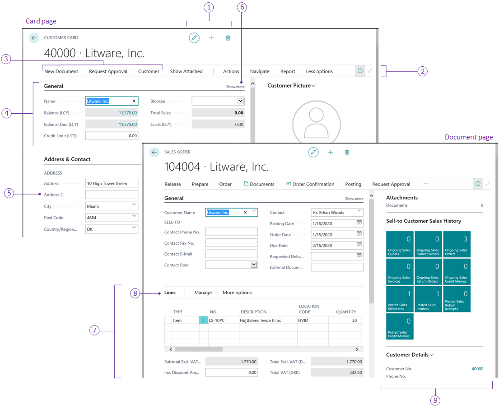

# Designing Card and Document Pages

The *card* page type displays selected fields from an underlying table. The *document* page type is very similar in structure to the card page, but in addition to fields, it also includes a part that includes another page, called a sub-page. 

## [Overview](#tab/about)

### Card pages

You design card pages when you want to enable users to view, create, and modify records (master and reference data) in a table, such as a customer, vendor, or item.

### Document pages

Design document pages when you want to represent a transaction or other important event in the domain of business. Document pages are the computerized counterpart to paper-based documents, such as quotes, invoices, orders, and so on. As such, document pages often have associated workflow or audit trail requirements.

### Associate with a list page

Both page types are typically associated with list pages (like the customers or sales orders list) that uses the same table as their source. From the list page, users can select a record and open it the card or document page for viewing and editing.

### Customizing a card and document pages from the client

In the client, users can personalize card pages by rearranging or hiding content as they like. For more information, see [Personalizing Your Workspace](/dynamics365/business-central/ui-personalization-user). 

As a developer or administrator, you can use Designer to customize a card and document page the same way that individual users personalize their own work spaces. The difference is that changes you make are applied to all users. For more information, see [Using Designer](devenv-inclient-designer.md). 

## [Structure](#tab/structure)

### General definition

A card page is defined by a page that has the [PageType property](properties/devenv-pagetype-property.md) set to `Card`. 
For a simple code example of a list page, see [Simple Card Page Example](devenv-simple-card-page-example.md).

A document page is defined by a page that has the [PageType property](properties/devenv-pagetype-property.md) set to `Document`. A document page is also includes a `part()` control that embeds another page into the document page. This is typically that displays line items from the associated transaction or event.

### Structure

The following figure illustrates the general layout and elements of a card page and document page.

The following table describes the elements of the page.

| No.   |Area|Description|Usage Guidelines|
|----|-------|-----------|----------------|
|1|System actions|The icons provide users the ability to edit the record, create a new record, and delete the current record.  The actions are only active if the [Editable](properties/devenv-editable-property.md) property is set to `true`.|These actions appear on all pages; you cannot remove them or add other actions.  |
|2|Action bar|The action bar provides links to other pages, reports, and codeunits. The action bar is defined by an `actions` control in the page code, and individual actions are defined by an `action()` control.   Actions can be displayed on three standard menus in the action bar, **Actions**, **Navigate**, and **Report**, or in a promoted category. You can arrange actions on menus in the root-level or grouped in a sub-menu.   The objects targeted by these links will open in a separate window.  For more information, see [Adding Actions to a Page](devenv-adding-actions-to-a-page.md).|Organize the action bar to contain the actions that users need to complete a task, such as posting, running a report, and opening another page with related information. Place the most important action at the root-level, and group closely related actions in a sub-menu.|
|3|Promoted actions|Promoted actions are actions that are defined in the `area()` control like any other action in code, but they are configured to display on a higher level in the action bar, in a specific category that you define. You promote actions by setting various `Promoted`-related properties on `action()` controls.   For more information, see [Promoted Actions](devenv-promoted-actions.md). |Promote an action to give it the most prominent placement for users to find it easily. Actions that are promoted appear first in the actions bar. Actions that are not promoted are available to the user by selecting **More options** in the action bar.|
|4|FastTab|A FastTab is group of fields under a common heading. A FastTab is defined by a `group()` control in the `area(content)`. You can have multiple FastTabs on the page. In the client, FastTabs appear in the same order as they are defined in the page code.|FastTabs allow users to find key information on a page by displaying the data in separate groups.  By default, fields in a FastTab are automatically distributed between two columns. However, you can change how fields are arranged by using the `grid()` and `fixed()`  controls of a FastTab. For more information, see [Field Arrangement on FastTabs](devenv-arranging-fields-on-fasttab.md).  |
|5|Field|A field in the source table, You specify a field by adding a `field()` control. The order of the `field()` controls in code determine the order the display in the client.||
|6|Show more/less|Enables users to toggle more or fewer  fields in the FastTab. You specify which fields are shown or hidden in the FastTab by default by setting the `Importance` property on the fields. You can also use the property to display fields in the FastTab header when the FastTab is collapsed.   For more information, see [Importance](properties/devenv-importance-property.md) property.|You use this property to control the amount of information that is visible on a page. It is useful on pages that have a large number of fields, where you can display the most important fields by default, but users have the option to show more as needed.|
|7|Sub-page|Displays line items that are associated with the transaction. This area is defined by a `part(Name; Page)` control that identifies the page to display. In this case, the page is a `listpart` page that displays line items for the sales order. |
|8|Sub-page action bar|Displays actions that are defined on the sub-page. These actions are defined the same way as those in the action bar of the main page. ||
|9|FactBoxes|FactBoxes are located on the right-most side of a page and it is divided into one or more parts that are arranged vertically. Each part can display different content including other pages, charts, and system parts such as Microsoft Outlook, Notes, and Record Links.    For more information, see [Adding a FactBox to a Page](devenv-adding-a-factbox-to-page.md).|Typically, you can use a FactBox to display information that is related to an item on the main content page. For example, on a page that shows a sales order list, you can use a FactBox to show sell-to customer sales history for a selected sales order in the list.|

## [Behavior points](#tab/behavior)

- There are a few system actions that are automatically added to the actions bar, such as **Search**, **See Attached** and **Open in Excel**.

## [Developer tips](#tab/tips)

From the user's perspective, the following are qualities of a well-designed card and document page:

### Card pages

-    It is used only for data that represents master or reference data. 
-    The page title clearly identifies the entity/entry represented in the page.

### Document pages

- It Is used only for data that represents a transaction or other important event in the domain of business.
- The page title clearly identifies the transaction/event represented in the page.

## General

- It is optimized for viewing by organizing data in FastTabs, and fields are either shown or hidden by default based on their importance.
- The most important fields are placed in a the first FastTab (**General**) in the most natural order from the user's perspective.
- It includes one or two FactBoxes to give necessary statistics and quick access to related documents.
- Within a FastTab, you can also use `group()` controls to create sub-groups of fields to improve data organization.
- You can use the [Visible](properties/devenv-visible-property.md) to dynamically show or hide fields based on a defined logic.

## [Designing for devices](#tab/targets)

For the most part, mobile devices will display the same content as the [!INCLUDE[d365fin_web_md](includes/d365fin_web_md.md)], but it is presented in different way to suit how users hold and interact with their mobile device.

You can preview how your page will look on mobile devices directly in Designer.

### Promote actions
Only promoted actions will display on mobile devices, so make sure you promote the actions that are most useful to users. For more information, see [Promoted Actions](devenv-promoted-actions.md). 

### Design of the sub-page lists

- Design for tile view

    On mobile devices, line items are only displayed as tiles. By default, the first 5 fields defined on the page are used in the tiles. So, it is important that you configure a `fieldgroup(Brick; <Field>` control in the table code to display the desired fields. For more information, see [Field Groups](devenv-field-groups.md).

-    Configure actions to display in shortcut menu on line items

        Using the [Scope](properties/devenv-scope-property.md) property, configure actions to display in the shortcut menu that is available on line item. You typically do this for common actions that relate to records in the list, such as the **Line Comments** action. This gives users a more direct way to invoke actions that relate to the selected row or line.

-    Configure the gesture for actions

        Using the [Gesture](properties/devenv-gesture-property.md) property, configure the swipe direction for running actions on a device with a touch interface. For more information, see [Implementation Tips for Gestures](properties/devenv-implementation-tips-gestures-property.md).

 
## See Also
[AL Development Environment](devenv-reference-overview.md)  
[Page Types and Layouts](devenv-page-types-and-layouts.md)  
[Page Extension Object](devenv-page-ext-object.md)  
[Actions Overview](devenv-actions-overview.md)  
[Adding Pages and Reports to Search](devenv-al-menusuite-functionality.md)  
[Personalizing Your Workspace](/dynamics365/business-central/ui-personalization-user)  
[Using Designer](devenv-inclient-designer.md)  
