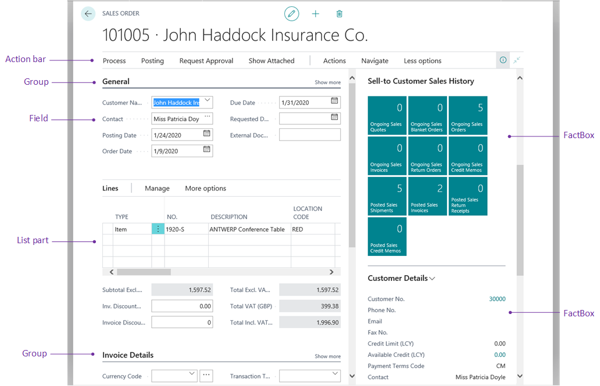

[!INCLUDE[newdev_dev_preview](includes/newdev_dev_preview.md)]

# Designing Card and Document Pages

The *card* page type displays selected fields from an underlying table. The *document* page type is very similar except it 

## [Overview](#tab/about)
 
You design card pages when you want to enable user to view, create, and modify records (master and reference data) in a table, such as Customer, Vendor, and Item entities.

Card pages are typically associated with list pages that use the same table as their source. From the list page, users can select a record and open it the card page for viewing and editing.

Fields can be organized into one or more section called FastTabs. In addition, you can add FactBoxes to display additional information about the record in the page.

### Customizing a card pages from the client

In the client, users can personalize card pages by rearranging or hiding content as they like. For more information, see [Personalizing Your Workspace](https://docs.microsoft.com/en-us/dynamics365/business-central/ui-personalization-user). 

As a developer or administrator, you can use Designer to customize a card page the same way that individual users personalize their own work spaces. The difference is that changes you make are applied to all users assigned to the assigned to the same profile. For more information, see [Using Designer](devenv-inclient-designer.md). 

## [Structure](#tab/structure)

### General definition

A card page is defined by page that has the [PageType property](properties/devenv-pagetype-property.md) set to `Card`. The Role Center page is divided into two main areas: navigation/actions area and content area. The following figure illustrates the general layout and elements of a Role Center page.

Mention system actions at top
importance in list part/show more.

### Structure

The following figure illustrates the general layout and elements of a list page.

The following table describes the elements of a typical list page.

|    |Area|Description|Usage Guidelines|
|----|-------|-----------|----------------|
|1|System actions|**Edit**, **Add Link**, and **Delete** actions. These actions appear on all pages; you cannot remove them or add other actions.  The **Edit** and **Delete** actions are only active if the [Editable](properties/devenv-editable-property.md)] is set to `true`.  The **Add Link** action is only active if the page contains either **RecordLinks** or **Notes** system part in a FactBox. If the page contains both parts, then the Add action pertains to the first part defined in the page code.||
|2|Action bar|The action bar provides links to other pages, reports, and codeunits. The action bar is defined by an `actions` control in the page code, and individual actions are defined by an `action` control.   Actions can be displayed on three standard menus in the action bar, **Actions**, **Navigate**, and **Report**, or in promoted action menus, which are custom menus that you define. You can arrange actions on these menus in the root-level or grouped in a sub-menu.   The objects targeted by these links will open in a separate window.  For more information, see [Adding Actions to a Page](devenv-adding-actions-to-a-page.md).|The action bar is designed for running the most important or most often used tasks and operations required by users. Actions will typically target card type pages that enable users to create new entities, such as customers, invoices, and sales orders, or run reports. Place the most important action at the root-level, and group closely related actions in a sub-menu.|
|3|Promoted actions|Promoted actions are actions that are defined in the `area` control like any other action in code, but are configured to display on a higher level in the action bar, in a specific category that you define. You promote actions by setting various properties on `action` controls.   For more information, see [Promoted Actions](devenv-promoted-actions.md). |Use promoted actions provide quick access to the most common tasks that would be performed by the user. Give categories a name that provides a good description of the included actions.|
|5|FastTab|Displays records of the source table as rows and columns, where each row is a record and the columns are the fields. You define the list by adding a `repeater` control in the page code, and then add `field` controls for field that you want to display.|The order of the `field` controls determines the order they appear on the page.   |
|6|Field|Renders records in a list as tiles (or bricks). Client users can toggle between the list and tile view.   As a developer, to enable a list to be displayed as tiles, you must specify the table fields that you want to include in the tiles. You do this by adding a `fieldgroup(Brick; <Field>` keyword in the code of the source table.   For more information, see [Field Groups](devenv-field-groups.md).|You can design any list page to display as tiles. The tile view is particularly beneficial for lists with records that include media or images, such a customers, contacts, and items lists. For more information about adding media to records, see [Working With Media on Records](devenv-working-with-media-on-records.md).|
|7|Show more/less|Promoted actions are actions that are defined in the `area`control like any other action in code, but are configured to display on a higher level in the action bar, in a specific category that you define. You promote actions by setting various properties on `action` controls.   For more information, see [Promoted Actions](devenv-promoted-actions.md). |Use promoted actions provide quick access to the most common tasks that would be performed by the user. Give categories a name that provides a good description of the included actions.|
|8|Promoted actions|Promoted actions are actions that are defined in the `area`control like any other action in code, but are configured to display on a higher level in the action bar, in a specific category that you define. You promote actions by setting various properties on `action` controls.   For more information, see [Promoted Actions](devenv-promoted-actions.md). |Use promoted actions provide quick access to the most common tasks that would be performed by the user. Give categories a name that provides a good description of the included actions.|
|9|Line action|Promoted actions are actions that are defined in the `area`control like any other action in code, but are configured to display on a higher level in the action bar, in a specific category that you define. You promote actions by setting various properties on `action` controls.   For more information, see [Promoted Actions](devenv-promoted-actions.md). |Use promoted actions provide quick access to the most common tasks that would be performed by the user. Give categories a name that provides a good description of the included actions.|
|10|FactBoxes|FactBoxes are located on the right-most side of a page and it is divided into one or more parts that are arranged vertically. Each part can display different content including other pages, charts, and system parts such as Microsoft Outlook, Notes, and Record Links.    For more information, see [Adding a FactBox to a Page](devenv-adding-a-factbox-to-page.md).|Typically, you can use a FactBox to display information that is related to an item on the main content page. For example, on a page that shows a sales order list, you can use a FactBox to show sell-to customer sales history for a selected sales order in the list.|

### Behavioral points of interest
-   The order of the `area()` controls in the page code is not important. However, the order of the individual actions and groups is important because they will appear in the order in which they appear in page code.  
-   In page code, if the first part in the content area is a Headline part, then in the client, the actions area will be automatically positioned either to the right of the Headline part or after the Headline part, depending on the browser window size. If the first part is not a Headline, the actions area will appear directly after the navigation area, and extend the width of the workspace. 

## Content area
The content area consists of one or more parts that display content from other pages. Unlike the navigation and actions area that is completely defined in the Role Center page code, the content area consists of self-contained, independent page part objects that can be used across Role Centers and in other pages. You define the content area by adding a `layout` control in the page code, and then a `part` control for each individual part to display.  

The following table describes some of the most common parts for Role Centers, as illustrated in the previous figure.

|    |Element|Description|More information|
|----|-------|-----------|----------------|
|4|Headline|Displays a series of automatically changing headlines that provide users with up-to-date information and insight into the business and daily work. This is created by a `HeadlinePart` page type. |[Creating Role Center Headlines](devenv-create-role-center-headline.md)||
|5|Wide data cues | A set of cues for displaying large numbers, like monetary values. This is created by using a `cuegroup` control on a `CardPart` page type, where the [Layout property](properties/devenv-layout-property.md) is set to `wide`. |[Wide Cues](devenv-cues-action-tiles.md#CueWideLayout)|
|6|Data cues |Provide a visual representation of aggregated business data, such as the number of open sales invoices or the total sales for the month. These are created by using a `cuegroup` control on a `CardPart` page type. |[Creating Cues](devenv-cues-action-tiles.md#CreateCue)|
|7|Action cues |Tiles that link to tasks or operations, like opening another page, starting a video, targeting another URL, or running code. These are created by using a `cuegroup` control on a `CardPart` page type|[Action Tiles](devenv-cues-action-tiles.md#ActionTiles)|
|8|Chart|A graphical and interactive representation of your business data that can be sourced by a custom business chart control add-in or an embedded Power BI report.||
|9|CardPart or ListPart page|Displays data fields in a form or tabular layout.|[Page Object](devenv-page-object.md)|
|10|Control add-in|Displays custom content by using HTML-based control add-in.|[Control Add-in Object](devenv-control-addin-object.md)|

### Behavioral points of interest
- In general, the parts will appear in the client according to the order in which they are defined in the Role Center page code and will automatically rearrange horizontally and vertically to fill the available workspace.
- However, in the [!INCLUDE[d365fin_web_md](includes/d365fin_web_md.md)], page parts that contain cues are automatically grouped under a common **Activities** section, no matter where they are placed in the code. All other page parts are grouped under the **Business Assistance** section. Within **Activities** and **Business Assistance** sections, the parts will arrange according to the order in which they are defined in the page code.

## Development tips for overall page design

From the user’s perspective, the following are qualities of a well-designed card page:

-    Use only for data that represents master or reference data
-    The page title clearly identifies the entity/entry represented in the page.
-    Optimize for overview by organizing data in FastTabs and marking relevant fields as Promoted or Additional.
-    Place the most important fields first, in a General FastTab. 
-    Include one or two FactBoxes to give necessary statistics and quick access to related documents.
 
## Design for all display targets
-   Mobile devices will display the same content as the [!INCLUDE[d365fin_web_md](includes/d365fin_web_md.md)], but it is presented in different way to suit how users hold and interact with their mobile device.
-   You can preview how your Role Center will look on mobile devices directly in Designer.
-   Some limitations on mobile devices include the following:
    -   
 
## See Also
[AL Development Environment](devenv-reference-overview.md)  
[Page Extension Object](devenv-page-ext-object.md)  
[Actions Overview](devenv-actions-overview.md)  
[Adding Pages and Reports to Search](devenv-al-menusuite-functionality.md)  
[Personalizing Your Workspace](https://docs.microsoft.com/en-us/dynamics365/business-central/ui-personalization-user)  
[Using Designer](devenv-inclient-designer.md)  