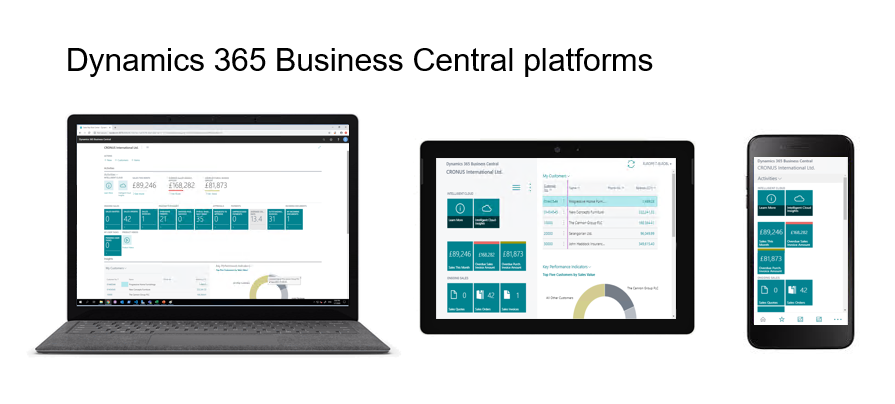

# Designing for Different Screen Sizes on Tablet and Phone
When designing application pages for the [!INCLUDE[nav_tablet](includes/nav_tablet_md.md)] and the [!INCLUDE[nav_phone](includes/nav_phone_md.md)], it is best practice to consider the size of the tablets or phones that your end users have access to. It is an advantage if the solution works well on both small and large screen sizes, but we also recommend that you consider thoroughly the most frequently used screen sizes for your end user experience. 

Designing for small screens can be more challenging, because pages will show fewer fields, columns, and tiles. Therefore, a good way to identify issues on how your application pages are displayed is to test on the smallest supported screen size. 

<!--There are certain requirements for running the [!INCLUDE[nav_uni_app](includes/nav_uni_app_md.md)] on tablets and phones. For more information, see [System Requirements for Business Central](../deployment/system-requirement-business-central.md#DynNAVApp).-->

   

## Form factor considerations  
Users can scroll both the navigation and the content area of the [!INCLUDE[nav_uni_app](includes/nav_uni_app_md.md)] on a tablet to access all data for a given page. However, it is recommended that the scrolling in the navigation bar is minimal. The navigation bar is the area on the left-hand side of [!INCLUDE[nav_uni_app](includes/nav_uni_app_md.md)] and it is designed to provide easy access to important information and tasks that the user should not lose sight of when scrolling on the content area. <!-- The static elements will display only as much data as they can reasonably fit on the screen. Developers should design to make sure that the important static elements are displayed first so that these will be shown even on the smallest, available devices.  -->

On phones the [!INCLUDE[nav_uni_app](includes/nav_uni_app_md.md)] displays only one part at a time on the Role Center. On the Home page, the Activity tiles are always displayed first, and you navigate through the bottom menu to explore the content area.  

### Guidance for page element types on smallest tablet devices  
The following table provides a list of elements that fit in the page content or the app bar without scrolling.  

|Page Type|Displays on smallest tablet device|  
|---------------|----------------------------------------|  
|RoleCenter|4 tiles in 1 group, or 2 groups together with 2 tiles|  
|List Pages|5 columns of type Text50 or 8 columns of type Text20|  
|Card Pages|-   CardPage Factbox with up to 15 fields -   2 CardPage Factboxes with up to 6 fields each -   Activities Factboxes with 4 tiles in 1 group, or 2 groups together with 2 tiles|  
|Document Pages|-   CardPage Factbox with up to 15 fields -   2 CardPage Factboxes with up to 6 fields each -   Activities Factboxes with 4 tiles in 1 group, or 2 groups together with 2 tiles|  

### Testing using a browser  
Using a browser you can test how your application pages will look on various device sizes. For more information, see [Opening the Business Central Tablet or Phone Client from a Browser](devenv-opening-business-central-tablet-or-phone-client-from-browser.md). 
 
When running [!INCLUDE[nav_tablet](includes/nav_tablet_md.md)] or [!INCLUDE[nav_phone](includes/nav_phone_md.md)] in a browser, you can use Microsoft Edge Developer Tools to emulate different screen sizes. For more information, see [Microsoft Edge Developer Tools](https://docs.microsoft.com/microsoft-edge/devtools-guide-chromium).
 <!--Also, for more information see [Troubleshooting: Client Returns Wrong CLIENTTYPE](devenv-troubleshooting-client-returns-wrong-clienttype.md).-->

## See Also  
 [Deciding on Your Tablet and Phone Strategy](devenv-deciding-on-tablet-and-phone-strategy.md)   
 [Differences and Limitations When Developing Pages for the Dynamics 365 Business Central Mobile App](devenv-differences-and-limitations-developing-pages-business-central-mobile-app.md)  
 [Displaying Data as Tiles](devenv-lists-as-tiles.md)  
 [Implementation Tips for Gestures](properties/devenv-implementation-tips-gestures-property.md)  
 [Gesture Property](properties/devenv-gesture-property.md)
