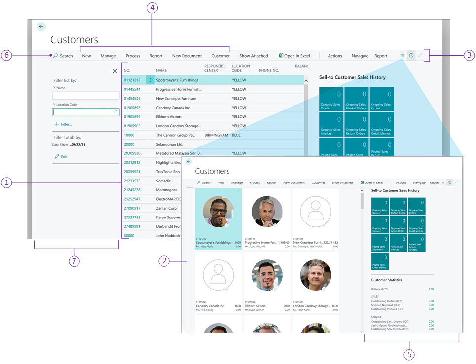

# Designing List Pages

The *List* page type displays records from an underlying table, either as rows and columns or as individual tiles. 

## [Overview](#tab/about)

You design list pages when you want to provide users with a collection of data, enabling them to get an overview of and find entities to work with, such as customers, vendors, or sales orders. Typically, a list page will link to an associated card page that lets users view or modify specific entities in the list.

There are different ways to incorporate a list page into that application: 

- Make the list page available from the navigation of a Role Center page.

    This gives users quick access to the page. With this implementation, the list page opens in the content area of the Role Center page, where the Role Center's navigation area is still present and accessible at the top of the page. For more information about Role Centers, see [Designing Role Centers](devenv-designing-role-centers.md).
- Make the list page available from an action on another page.

    With this implementation, the list page opens in a separate window in front of the current page.
- Make the list page searchable from the **Tell me what you want to do** feature.

    With this implementation, the list page also opens in a separate window. For more information, see [Adding Pages and Reports to Search](devenv-al-menusuite-functionality.md).

### Customizing a list pages from the client
In the client, users can personalize list pages by rearranging or hiding records or FactBoxes as they like. For more information, see [Personalizing Your Workspace](/dynamics365/business-central/ui-personalization-user).

As a developer or administrator, you can use Designer to customize the list page the same way that individual users personalize their own work spaces. The difference is that changes you make are applied to all users. For more information, see [Using Designer](devenv-inclient-designer.md). 

## [Structure](#tab/structure)

### General definition
A list page is defined by a page that has the [PageType property](properties/devenv-pagetype-property.md) set to `List` and [SourceTable property](properties/devenv-sourcetable-property.md) set to the table object that contains the records that you want to display.

To associate a list page with a card page, which enables users to view, edit, or create records, you set the [CardPageId](properties/devenv-cardpageid-property.md) property of the list page.

For a simple code example of a list page, see [Simple List Page Example](devenv-simple-list-page-example.md). 
 
### Structure

The following figure illustrates the general layout and elements of a list page.

The following table describes the elements of a typical list page.

|  No.  |Area|Description|Usage Guidelines|
|----|-------|-----------|----------------|
|1|List|Displays records of the source table as rows and columns, where each row is a record and the columns are the fields. You define the list by adding a `repeater()` control within the `area(Content)` control of the page, and then add `field()` controls for each field that you want to display. For more information about the repeater control, see [Working with Repeater Controls](devenv-repeater-controls.md).|The order of the `field` controls determines the order they appear on the page. |
|2|Tile view|Renders records in a list as tiles (or bricks). Client users can toggle between the list and tile view.   As a developer, to enable a list to be displayed as tiles, you must specify the table fields that you want to include in the tiles. You do this by adding a `fieldgroup(Brick; <Field>)` keyword in the code of the source table.   For more information, see [Displaying Data as Tiles](devenv-lists-as-tiles.md).|You can design any list page to display as tiles. The tile view is particularly beneficial for lists with records that include media or images, such a customers, contacts, and items lists. For more information about adding media to records, see [Working With Media on Records](devenv-working-with-media-on-records.md).|
|3|Action bar|The action bar provides links to other pages, reports, and codeunits. The action bar is defined by an `actions` control in the page code, and individual actions are defined by an `action()` control.   Actions can be displayed on three standard menus in the action bar, **Actions**, **Navigate**, and **Report**, or in promoted categories, which are like custom menus that you define. You can arrange actions on these menus in the root-level or grouped in a sub-menu.   The objects targeted by these links will open in a separate window.  For more information, see [Adding Actions to a Page](devenv-adding-actions-to-a-page.md).|Organize the action bar to contain the actions that users need to complete a task, such as posting, running a report, and opening another page with related information. Place the most important action at the root-level, and group closely related actions in a sub-menu.|
|4|Promoted actions|Promoted actions are actions that are defined in the `area()` control like any other action in code, but are configured to display on a higher level in the action bar, in a specific category that you define. You promote actions by setting various `Promoted`-related properties on `action()` controls.   For more information, see [Promoted Actions](devenv-promoted-actions.md). |Promote an action to give it the most prominent placement for users to find it easily. Actions that are promoted appear first in the actions bar. Actions that are not promoted are available to the user by selecting **More options** in the action bar.|
|5|FactBoxes|FactBoxes are located on the right-most side of a page and it is divided into one or more parts that are arranged vertically. Each part can display different content including other pages, charts, and system parts such as Microsoft Outlook, Notes, and Record Links.    For more information, see [Adding a FactBox to a Page](devenv-adding-a-factbox-to-page.md).|Typically, you can use a FactBox to display information that is related to an item on the main content page. For example, on a page that shows a sales order list, you can use a FactBox to show sell-to customer sales history for a selected sales order in the list.|
|6|Search|A cross-column, text-based search box at the top of the page that provides users a quick and easy way to reduce the records in a list and display only those records that contain the data that they are interested in seeing. The **Search** appears on all list pages, and requires no additional coding.   For more information, see [Searching, Filtering, and Sorting Data](/dynamics365/business-central/ui-enter-criteria-filters) in the user help for Business Central.||
|7|Filter pane|The filter pane enables users to apply filters on one or more fields in the list to limit the records that are displayed. Client users can toggle the filter pane on and off as needed. For more information about how to use the filter pane, see [Searching, Filtering, and Sorting Data](/dynamics365/business-central/ui-enter-criteria-filters)|The Filter pane is available on all list pages, with no extra coding required. However, as a developer, you can define sets of special words, called filter tokens, which are kind of like predefined filters. Users can then enter these filter tokens in the filter pane to quickly filter the list to display the desired data. For more information, see [Adding Filter Tokens](devenv-adding-filter-tokens.md).   Also, you can set FlowFilters on the list that enable users to adjust various dimensions that influence calculated fields. The FlowFilters appear in the **Filter totals by** section of the filter pane. For information about adding FlowFilters, see [FlowFilters](devenv-flowfilter-overview.md).|

> [!IMPORTANT]
> List pages are designed for using a single `repeater()` control within the content area only. If you include more than one repeater or another control like a `group` or `grid`, the page might not behave as expected. If you want to design a page that includes controls in the content area other than a repeater, then try using a `Worksheet` page type instead. For more information, see [Worksheet page layouts](devenv-page-types-and-layouts.md#worksheet-page-layouts).

## [Behavior points](#tab/behavior)

- List pages that are accessed from the Role Center page open embedded within the Role Center framework. The pages are always opened in the read-only mode, regardless of the [Editable](properties/devenv-editable-property.md) property.
- There are a few system actions that are automatically added to the actions bar, such as **Search**, **See Attached** and **Open in Excel**.
- Media and image fields only display in tile view.

## [Developer tips](#tab/tips)

From the user's perspective, the following are qualities of a well-designed list page does the following:

- Displays a single collection of entities or entries that the user needs for their work. 
- Includes page title that clearly identifies the collection and any specific view that is in effect.
- Places the most important columns first, and enable a freeze column, so scrolling is not typically necessary. You enable a freeze column by setting the [FreezeColumn](properties/devenv-freezecolumn-property.md) property of the page.
- The page is accessible from relevant actions on the Role Center page.
- Includes one or two FactBoxes to give necessary statistics and quick access to related documents.
- The most typical actions for users of the page are promoted.

> [!IMPORTANT]
> List pages are designed for using a single `repeater()` control within the content area only. If you include more than one repeater or another control like a `group` or `grid`, the page might not behave as expected. If you want to design a page that includes controls in the content area other than a repeater, then try using a `Worksheet` page type instead.

## [Designing for devices](#tab/targets)

For the most part, mobile devices will display the same content as the [!INCLUDE[d365fin_web_md](includes/d365fin_web_md.md)], but it is presented in different way to suit how users hold and interact with their mobile device.

You can preview how your page will look on mobile devices directly in Designer.

### Limit the columns

Design list pages to avoid having important columns on the far right of the column list. Assume you have no control over how many columns are displayed and consider that only the first few columns will be made visible.

### Design for the tile view

On mobile devices, records are only displayed as tiles. By default, the first 5 fields defined on the page are used in the tiles. So, it is important that you configure a `fieldgroup(Brick; <Field>` control in the table code to display the desired fields. For more information, see [Field Groups](devenv-field-groups.md).

### Promote actions
Only promoted actions will display on mobile devices, so make sure you promote the actions that are most useful to users. For more information, see [Promoted Actions](devenv-promoted-actions.md). 

### Configure actions to display in shortcut menu on rows

Using the [Scope (Action)](properties/devenv-scope-action-property.md) property, configure actions to display in the shortcut menu that is available on each row. You typically do this for common actions that relate to records in the list, such as the **Line Comments** action. This gives users a more direct way to invoke actions that relate to the selected row or line.

### Configure the gesture for actions

Using the [Gesture](properties/devenv-gesture-property.md) property, configure the swipe direction for running actions on a device with a touch interface. For more information, see [Implementation Tips for Gestures](properties/devenv-implementation-tips-gestures-property.md).

## See Also

[AL Development Environment](devenv-reference-overview.md)  
[Page Types and Layouts](devenv-page-types-and-layouts.md)  
[Page Extension Object](devenv-page-ext-object.md)  
[Actions Overview](devenv-actions-overview.md)  
[Adding Pages and Reports to Search](devenv-al-menusuite-functionality.md)  
[Personalizing Your Workspace](/dynamics365/business-central/ui-personalization-user)  
[Using Designer](devenv-inclient-designer.md)  