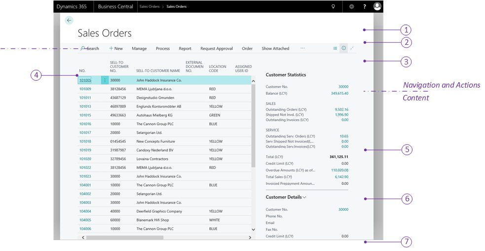

[!INCLUDE[newdev_dev_preview](includes/newdev_dev_preview.md)]

# Designing List Pages for [!INCLUDE[d365fin_web_md](includes/d365fin_web_md.md)]

The *List* page type displays records from an underlying table in rows and columns. 

## About the list page

You design list pages when you want to provide users with a collection of data,  enabling them to get an overview of and find entities to work with, such as customer, vendors, or sales orders. Typically, a list page will in-turn link to an associated card page that lets users view or modify specific entities in the list.

There are different ways to incorporate a list page into that application, depending on what you want to achieve: 

- Add an action in the navigation of a Role Center page that targets the page. This gives users quick access to the page. With this implementation, the list page opens in the content area of the Role Center page, where the Role Center's navigation area is still present and accessible at the top of the page. For more information about Role Centers, see [Designing Role Centers](devenv-designing-role-centers.md).
- Add an action on another page that targets the list page. With this implementation, the list page opens in a separate window in front of the current page.
- Make it searchable in **Tell me what you want to do**. With this implementation, the list page also opens in a separate window.

### Customizing a list pages from the client
In the client, users can personalize list pages by rearranging or hiding records or FactBoxes as they like. For more information, see [Personalizing Your Workspace](https://docs.microsoft.com/en-us/dynamics365/business-central/ui-personalization-user). 

As a developer or administrator, you can use Designer to customize list page the same way that individual users personalize their own workspaces. The difference is that changes you make are applied to all users assigned to the same profile. For more information, see [Using Designer](devenv-inclient-designer.md). 

## List page structure
A list page is defined by page that has the [PageType property](properties/devenv-pagetype-property.md) set to `Card`. The list is divided into three main areas: action, list, and FactBox. The following figure illustrates the general layout and elements of a list page.

## Action bar
The action bar appears at the top of the list page, and provides links to other objects, such as pages, reports, and codeunits. You define the navigation area by adding actions to the Role Center page code, under the `actions` control in the page code. The navigation and actions area is subdivided into smaller areas by using different `area()` controls as described in the following table:

|    |Area|Description|Usage Guidelines|
|----|-------|-----------|----------------|
|1|Navigation menus|The top-level navigation consists of one or more root items that expand to display a submenu of links to other pages. The pages targeted by the submenus will open in the content area of the Role Center.   You define this area with an `area(sections)` control in the page code.|The top-level navigation should provide access to relevant entity lists for the role's areas of business. For example, typical root items for a business manager could be finance, sales, and purchasing. You should place the root items in order of importance, starting from the left.|
|2|Navigation bar|The second-level navigation displays a flat list of links to other pages. The pages targeted by the links will open in the content area of the Role Center.  You define this area with an `area(embedding)` control in the page code.|You should use these items to link to users’ most useful entity lists in thier business process. For example, with a business manager, these could be links to customers, sales orders, and bank accounts. You should place items in the order that reflects the business process sequence. Try to limit the number of second-level items, and consider placing items in the top-level navigation instead, if the number gets too large. |
|3|Action bar|The action bar area provides links to pages, reports, and codeunits. The links can be displayed on the root-level or grouped in a submenu. The objects targeted by these links will open in a separate window in front of the Role Center page.  You can define the actions by using the three different `area()` controls that are described below: |The action area is designed for running the most important or most often used tasks and operations required by users. Actions will typically target card type pages that enable users to create new entities, such as customers, invoices, and sales orders, or run reports. Place the most important action at the root-level, and group closely related actions in a submenu.|
|||`area(creation)` - Actions in this control will appear first in the action area, and will display with a plus (+) icon. |Use this control to target pages that enable the user to create new entities.|
|||`area(processing)` - Actions in this control will appear after the `area(creation)` items. You can group actions in submenus by using a `group` control.|Use this control to target pages that are associated with the work flow for processing documents, such as payments or sales orders. Use the `group` control to organize similar actions under a common parent.|
|||`area(reporting)` - Actions in this control will appear last in the action area. They display with a default report icon. |Use this control to target report objects.|

For more information about navigation, see [Adding to Navigation](devenv-adding-menus-to-navigation-pane.md). 

### Behavioral points of interest
-   The order of the `area()` controls in the page code is not important. However, the order of the individual actions and groups is important because they will appear in the order in which they appear in page code.  
-   In page code, if the first part in the content area is a Headline part, then in the client, the actions area will be automatically positioned either to the right of the Headline part or after the Headline part, depending on the browser window size. If the first part is not a Headline, the actions area will appear directly after the navigation area, and extend the width of the workspace.
- When a list page is opened from the Role Center's navigation, it is always read-only, regardless of the [Editable](properties/devenv-editable-property.md) property.

## Content area
The content area consists of one or more parts that display content from other pages. Unlike the navigation and actions area that is completely defined in the Role Center page code, the content area consists of self-contained, independent page part objects that can be used across Role Centers and in other pages. You define the content area by adding a `layout` control in the page code, and then a `part` control for each individual part to display.  

The following table describes some of the most common parts for Role Centers, as illustrated in the previous figure.

|    |Element|Description|More information|
|----|-------|-----------|----------------|
|4|Headline|Displays a series of automatically changing headlines that provide users with up-to-date information and insight into the business and daily work. This is created by a `HeadlinePart` page type. |[Creating Role Center Headlines](devenv-create-role-center-headline.md)||
|5|Wide data cues | A set of cues for displaying large numbers, like monetary values. This is created by using a `cuegroup` control on a `CardPart` page type, where the [Layout property](properties/devenv-layout-property.md) is set to `wide`. |[Wide Cues](devenv-cues-action-tiles.md#CueWideLayout)|
|6|Data cues |Provide a visual representation of aggregated business data, such as the number of open sales invoices or the total sales for the month. These are created by using a `cuegroup` control on a `CardPart` page type. |[Creating Cues](devenv-cues-action-tiles.md#CreateCue)|
|7|Action cues |Tiles that link to tasks or operations, like opening another page, starting a video, targeting another URL, or running code. These are created by using a `cuegroup` control on a `CardPart` page type|[Action Tiles](devenv-cues-action-tiles.md#ActionTiles)|
|8|Chart|A graphical and interactive representation of your business data that can be sourced by a custom business chart control add-in or an embedded Power BI report.||
|9|CardPart or ListPart page|Displays data fields in a form or tabular layout.|[Page Object](devenv-page-object.md)|
|10|Control add-in|Displays custom content by using HTML-based control add-in.|[Control Add-in Object](devenv-control-addin-object.md)|

### Behavioral points of interest
- In general, the parts will appear in the client according to the order in which they are defined in the Role Center page code and will automatically rearrange horizontally and vertically to fill the available workspace.
- However, in the [!INCLUDE[d365fin_web_md](includes/d365fin_web_md.md)], page parts that contain cues are automatically grouped under a common **Activities** section, no matter where they are placed in the code. All other page parts are grouped under the **Business Assistance** section. Within **Activities** and **Business Assistance** sections, the parts will arrange according to the order in which they are defined in the page code.

## Development tips for overall page design

From the user’s perspective, the following are qualities of a well-designed list page does the following:

-  Displays a single collection of entities or entries that the user needs for their work.
-  Includes  page title that clearly identifies the collection and any specific view that is in effect.
-  Places the most important columns first or enables a freeze column, so scrolling is not typically necessary. 
-  Accessible from relevant actions on the Role Center page.
-  Includes one or two FactBoxes to give necessary statistics and quick access to related documents.
- 
## Design for all display targets
-   Mobile devices will display the same content as the [!INCLUDE[d365fin_web_md](includes/d365fin_web_md.md)], but it is presented in different way to suit how users hold and interact with their mobile device.
-   You can preview how your Role Center will look on mobile devices directly in Designer.
-   Some limitations on mobile devices include the following:
    -   
 
## See Also
[AL Development Environment](devenv-reference-overview.md)  
[Page Extension Object](devenv-page-ext-object.md)  
[Actions Overview](devenv-actions-overview.md)  
[Adding Pages and Reports to Search](devenv-al-menusuite-functionality.md)  
[Personalizing Your Workspace](https://docs.microsoft.com/en-us/dynamics365/business-central/ui-personalization-user)  
[Using Designer](devenv-inclient-designer.md)  