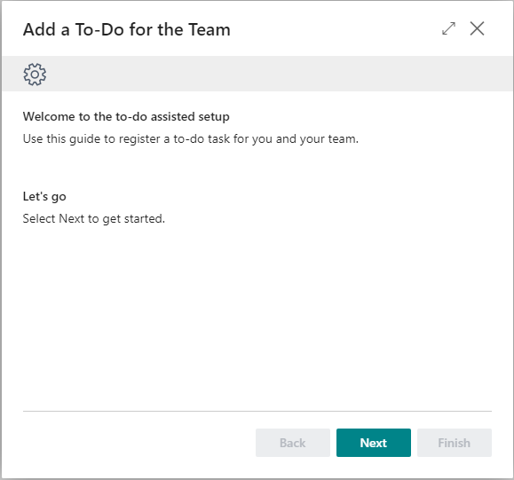
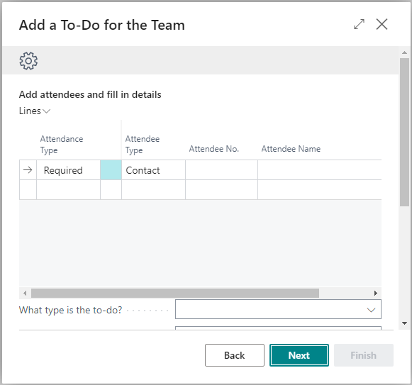
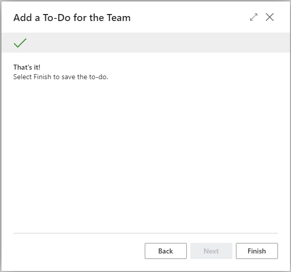

# Designing Assisted Setup Guides

In [!INCLUDE[prod_short](includes/prod_short.md)], you use the `NavigatePage` page type to create an assisted setup. An assisted setup, also called a wizard, is a page that consists of one or more user input pages or steps. These steps are linked together, enabling users to carry out infrequently performed tasks, such as configuration or specific business tasks. In the client, the `NavigatePage` page doesn't an action bar. It's designed to have buttons at the bottom that let users move back and forth through the steps by selecting the **Back** and **Next** buttons, until they finish by selecting the **Finish** button.



An example in [!INCLUDE[prod_short](includes/prod_short.md)] is the **Company Setup** assisted setup, page 1803.  

## Build the assisted setup

This section describes the basic tasks for creating an assisted setup. It gives you an understanding of the general structure of an assisted setup guide. Knowing this information will help you build assisted setup guides that look and feel like the ones provided by Microsoft. This section includes some basic AL code for the various steps involved in creating an assisted setup guide. For more information about the code and logic, see the [full example](#example) in this article. The example code for reference only, and your implementation may vary.

1. Create a page for the assisted setup, for example:

    ```al
    page 50100 ToDoAssistedSetup
    {
    PageType = NavigatePage;
    SourceTable = "To-do";
    SourceTableTemporary = true;
    Caption = 'Add a To-Do for the Team';
    }
    ```

    Set the following properties:

    |Property|Description and value|
    |-|-|
    |[PageType property](properties/devenv-pagetype-property.md)|Set to `NavigatePage`.|
    |[SourceTable](properties/devenv-sourcetable-property.md)|Set to the name of the table that stores the data for the assisted setup.|
    |[SourceTableTemporary](properties/devenv-sourcetabletemporary-property.md)|Set to `true`. The reason is because Business Central automatically stores all modifications to database tables as soon as users move focus to another field or close the page. Using a temporary table let's users exit the assisted setup guide at any point, without saving the changes they've made so far to the database. Instead, the data modifications are only stored in memory, until code is run to transfer the data to the database.|
    |[Caption](properties/devenv-caption-property.md)|Set to the title that you want to show on the top of each step of the assisted guide.|

2. Add the steps that comprise the assisted setup.

   For each step that you want in the guide, add a `group()` control to the root-level of the `layout` >  `area(Content)` control. For example, the following code adds three steps.

    ```al
    layout
    {
        area(Content)
        {
            group(Step1)
            {
                Caption = '';
                InstructionalText = '';
                Visibility = Step1Visible;

            }
            group(Step2)
            {
                Caption = '';
                InstructionalText = '';
                Visibility = Step2Visible;

                field(Field2; "Field2")
                {
                    ApplicationArea = All;
                    Caption = '';
                }
            }
            group(Step3)
            {
                Caption = '';
                InstructionalText = '';
                Visibility = Step3Visible;
            }
        }
    }

    var
        Step1Visible: Boolean;
        Step2Visible: Boolean;
        Step3Visible: Boolean;
        Step: Option Start,Fill,Finish;

    local procedure EnableControls()
    begin
        ResetControls();
        case Step of
            Step::Start:
                ShowStep1();
            Step::Fill:
                ShowStep2();
            Step::Finish:
                ShowStep3();
        end;
    end;
    ```

   - The individual `group()` controls define the content to display for the step, like text and data entry fields. For example, use the [Caption](properties/devenv-caption-property.md) and [InstructionalText](properties/devenv-instructionaltext-property.md) properties to add text. Use `field()` controls for source table fields.
   - The order of the `group()` controls doesn't necessarily determine the order of the steps in the assisted setup. You'll add AL code to define the logic for when each step appears.
   - You can include `group()` controls within the root-level `group()` controls. These subgroups can be useful for adjusting the layout fields on a step and adding captions and instructional text.

   Because only one step can be shown at a time, you have to add logic to control when each step is shown. To control the visibility, add the following code:

   - For each step, define a global boolean variable or a step number condition and apply it the group's [Visible](properties/devenv-visible-property.md) property. The example, uses the boolean variables `Step1Visible`, `Step2Visible`, and `Step2Visible`.

     You'll then have to add AL code to change these variables depending on which step the user is working on.
   - Define a global option variable that has a value for each step.

     You'll use this variable in code to track which step is active. 

    > [!NOTE]
    > Multiline fields shown inside a step are shown without a gray background. This behavior allows you to write a list of items or any formatted text that requires new lines.

3. Add the navigation buttons.

    Assisted setups typically have a **Back**, **Next**, and **Finish** button at the bottom-right of the page. Add each button by using an `action()` control. 

    ```al
    actions
    {
        area(Processing)
        {
            action(Back)
            {
                Enabled = BackEnable;
                InFooterBar = true;
                Image = PreviousRecord;

                trigger OnAction()
                begin
                    NextStep(true);
                end;
            }
            action(Next)
            {
                Enabled = NextEnable;
                InFooterBar = true;
                Image = NextRecord;

                trigger OnAction()
                begin
                    NextStep(false);
                end;
            }
            action(Finish)
            {
                Enabled = FinishEnable;
                InFooterBar = true;
                Image = Approve;

                trigger OnAction()
                begin
                    Finished();
                end;
            }
        }
    }

    var
        BackEnable: Boolean;
        NextEnable: Boolean;
        FinishEnable: Boolean;

    local procedure NextStep(Backwards: Boolean)
    begin
        if Backwards then
            Step := Step - 1
        else
            Step := Step + 1;
        EnableControls();
    end;

    local procedure Finished()
    begin
        StoreRecordVar();
        CurrPage.Close();
    end;

    ```

    - Set the [InFooterBar property](properties/devenv-infooterbar-property.md) for each to `true`.

      If the property isn't set or is `false`, then the actions won't' appear.
    - Similar to the `Visible` property on the groups, use the [Enabled](properties/devenv-enabled-property.md) property to control when buttons are active on the different steps. For example, **Back** isn't active in the first step, and **Next** isn't active in the last step.

        Like on groups, define global boolean variables for each action, then apply the variable to the action's `Editable` property. The global variables are then controlled in AL code.
    - To style the buttons to match other assisted setups in the Microsoft base application, set the [Image](properties/devenv-visible-property.md) property to `PreviousRecord` for the back button, `NextRecord` for the next button, and  `Approve` for the finish.

4. Transfer data from the temporary table to the database table. For example:

   ```al
    var
        ToDoRec: Record "To-do";

    local procedure StoreRecordVar()
    begin
        ToDoRec.TransferFields(Rec, true);
        ToDoRec.Insert();
    end;
   ```

   In this example, the `StoreRecordVar` procedure is called from the `Finished` procedure used on the actions.

## Add standard banners

You may have noticed that most assisted setup guides in the base application, and in this article, include two different banners under the step caption: a gear and a check mark. These banners are based on the following image files in **Media Repository** table:

- AssistedSetup-NoText-400px.png for the gear
- AssistedSetupDone-NoText-400px.png for the check mark.

You can reuse these images in your custom assisted setup guides to provide a consistent look.

To a display the banners, add two root-level `group()` controls in to the `area(Content)` control, like for the steps. Use  `field()` controls for displaying the gear and check mark images. The following snippets illustrate one way of adding the banners:

```AL
...
    layout
    {
        area(Content)
        {
            ...  
            group(StandardBanner)
            {
                Caption = '';
                Editable = false;
                Visible = TopBannerVisible and not FinishActionEnabled;
                field(MediaResourcesStandard; MediaResourcesStandard."Media Reference")
                {
                    ApplicationArea = All;
                    Editable = false;
                    ShowCaption = false;
                }
            }
            group(FinishedBanner)
            {
                Caption = '';
                Editable = false;
                Visible = TopBannerVisible and FinishActionEnabled;
                field(MediaResourcesDone; MediaResourcesDone."Media Reference")
                {
                    ApplicationArea = All;
                    Editable = false;
                    ShowCaption = false;
                }
            }
        }
    }
...
var
    ...
    MediaRepositoryDone: Record "Media Repository";
    MediaRepositoryStandard: Record "Media Repository";
    MediaResourcesDone: Record "Media Resources";
    MediaResourcesStandard: Record "Media Resources";

trigger OnInit();
begin
    ...    
    LoadTopBanners();
end;

local procedure LoadTopBanners()
begin
    if MediaRepositoryStandard.Get('AssistedSetup-NoText-400px.png', Format(CurrentClientType())) and
        MediaRepositoryDone.Get('AssistedSetupDone-NoText-400px.png', Format(CurrentClientType()))
    then
        if MediaResourcesStandard.Get(MediaRepositoryStandard."Media Resources Ref") and
            MediaResourcesDone.Get(MediaRepositoryDone."Media Resources Ref")
    then
            TopBannerVisible := MediaResourcesDone."Media Reference".HasValue();
end;
```

## Add to the Assisted Setup page

Page 1901 "Assisted Setup" of the base application gives users quick access to all assisted setup guides. This section explains how you can add your assisted setup guide to the page.

The base application includes several objects that control what items appear in the **Assisted Setup** page. For example, table 1990 "Guided Experience Item" is an internal table that's the source for the **Assisted Setup** page. Codeunit 1990 "Guided Experience" is used to register your assisted setup guide in the **Guided Experience Item** table and run it from the **Assisted Setup** page. The **Guided Experience** codeunit publishes the `OnRegisterAssistedSetup` event that notifies the **Assisted Setup** page to add new items.

```al
[IntegrationEvent(false, false)]
internal procedure OnRegisterAssistedSetup()
begin
end;
```

To add an assisted setup guide to the **Assisted Setup** page, add a codeunit that subscribes to the `OnRegisterAssistedSetup` event. The following code illustrates how you can add the **ToDoAssistedSetup** assisted setup guide. The example also creates a new category called **Tasks** on the **Assisted Setup** page a link to **ToDoAssistedSetup** will be listed:

```al
codeunit 50100 "AddToDoAssistedSetup"
{
    [EventSubscriber(ObjectType::Codeunit, Codeunit::"Guided Experience", 'OnRegisterAssistedSetup', '', true, true)]
    local procedure OnRegisterAssistedSetup()
    var
        AssistedSetup: Codeunit "Guided Experience";
        GuidedExperienceType: Enum "Guided Experience Type";
        AssistedSetupGroup: Enum "Assisted Setup Group";
        VideoCategory: Enum "Video Category";
    begin
        if not AssistedSetup.Exists(GuidedExperienceType::"Assisted Setup",
                                    ObjectType::Page,
                                    Page::"ToDoAssistedSetup") then
            AssistedSetup.InsertAssistedSetup(
                                             // Link text for the assisted setup guide
                                             'Add a to-do',
                                             // Short description, not shown on page 
                                             'Create a task for your team',
                                             // Text that shows in Description column
                                             'Register a task for your team and assign people',
                                             1,
                                             ObjectType::Page,
                                             Page::ToDoAssistedSetup,
                                             // Assign guide to Task category
                                             AssistedSetupGroup::Tasks,
                                             //Video URL not required
                                             '',
                                             VideoCategory::Uncategorized,
                                             //Help URL not required
                                             '');
    end;
}


enumextension 50100 MyEnumExtension extends "Assisted Setup Group"
{
    value(100; Tasks)
    {
    }
}
```

## Example

This code example shows how to use a `NavigatePage` type page to create an assisted setup guide with three steps, as illustrated in the following figures. The assisted setup lets users add entries to a to-do list, which is stored in table **To-Do**. The code for the first step includes a part that reuses the page **Attendee Wizard Subform** of the base application. This part allows users, when they first start the setup, to select the salesperson that the to-do is for.

|Step 1|Step 2|Step 3|
|-|-|-
| [](media/to-do-assisted-setup-1.png#lightbox)|[](media/to-do-assisted-setup-2.png#lightbox)|[](media/to-do-assisted-setup-3.png#lightbox)

### Code

```al
page 50111 ToDoAssistedSetup
{
    PageType = NavigatePage;
    SourceTable = "To-do";
    SourceTableTemporary = true;
    Caption = 'Add a To-Do for the Team';

    layout
    {
        area(Content)
        {
            group(Step1)
            {
                Visible = Step1Visible;

                group("Welcome")
                {
                    Caption = 'Welcome to the to-do assisted setup';
                    group(group11)
                    {
                        Caption = '';
                        InstructionalText = 'Use this guide to register a to-do task for you and your team.';
                    }
                }
                group("Let's go")
                {
                    Caption = 'Let''s go';
                    group(group12)
                    {
                        Caption = '';
                        InstructionalText = 'Select Next to get started.';
                    }
                }
            }
            group(Step2)
            {
                Caption = 'Enter information about the to-do task';
                Visible = Step2Visible;

                group("11")
                {
                    Caption = 'Add attendees and fill in details';
                    part(AttendeeSubForm; "Attendee Wizard Subform")
                    {
                    }
                }
                field("No."; Rec."No.")
                {
                    ApplicationArea = All;
                    Visible = false;
                }
                field("Type"; Rec."Type")
                {
                    ApplicationArea = All;
                    Caption = 'What type is the to-do?';

                }
                field("Date"; Rec."Date")
                {
                    ApplicationArea = All;
                    Caption = 'What''s the start date?';

                }
                field("Description"; Rec.Description)
                {
                    ApplicationArea = All;
                    Caption = 'Describe your to-do';
                }
                field("Start Time"; Rec."Start Time")
                {
                    ApplicationArea = All;
                    Caption = 'What''s the start time?';
                }
                field("Duration"; Rec."Duration")
                {
                    ApplicationArea = All;
                    Caption = 'How long does it last?';

                }
                field("Team To-do"; Rec."Team to-do")
                {
                    ApplicationArea = All;
                    Caption = 'Team to-do';

                }
                field("All Day Event"; Rec."All Day Event")
                {
                    ApplicationArea = All;
                    Caption = 'All Day Event';

                }
                field("Ending Date"; Rec."Ending Date")
                {
                    ApplicationArea = All;
                    Caption = 'What''s the end date?';
                }
                field("Ending Time"; Rec."Ending Time")
                {
                    ApplicationArea = All;
                    Caption = 'What''s the end time?';
                }
                // }
            }
            group(Step3)
            {
                Caption = 'That''s it!';
                InstructionalText = 'Select Finish to save the to-do.';
                Visible = Step3Visible;

            }
            group(StandardBanner)
            {
                Caption = '';
                Editable = false;
                Visible = TopBannerVisible and not FinishActionEnabled;
                field(MediaResourcesStandard; MediaResourcesStandard."Media Reference")
                {
                    ApplicationArea = All;
                    Editable = false;
                    ShowCaption = false;
                }
            }
            group(FinishedBanner)
            {
                Caption = '';
                Editable = false;
                Visible = TopBannerVisible and FinishActionEnabled;
                field(MediaResourcesDone; MediaResourcesDone."Media Reference")
                {
                    ApplicationArea = All;
                    Editable = false;
                    ShowCaption = false;
                }
            }
        }
    }

    actions
    {
        area(Processing)
        {
            action(Back)
            {
                ApplicationArea = All;
                Caption = '&Back';
                Enabled = BackEnable;
                InFooterBar = true;
                Image = PreviousRecord;

                trigger OnAction()
                begin
                    NextStep(true);
                end;
            }
            action(Next)
            {
                ApplicationArea = All;
                Caption = '&Next';
                Enabled = NextEnable;
                InFooterBar = true;
                Image = NextRecord;

                trigger OnAction()
                begin
                    NextStep(false);
                end;
            }
            action(Finish)
            {
                ApplicationArea = All;
                Caption = '&Finish';
                Enabled = FinishEnable;
                InFooterBar = true;
                Image = Approve;

                trigger OnAction()
                begin
                    Finished();
                end;
            }
        }
    }


    trigger OnInit()
    var

    begin

        EnableControls();
        LoadTopBanners();
    end;

    trigger OnOpenPage()
    begin
        ToDoRec.Get();
        ToDoRec.Init;
        Rec := ToDoRec;
        CurrPage.Update();
    end;

    var
        BackEnable: Boolean;
        NextEnable: Boolean;
        FinishEnable: Boolean;
        Step1Visible: Boolean;
        Step2Visible: Boolean;
        Step3Visible: Boolean;
        Step: Option Start,Fill,Finish;
        ToDoRec: Record "To-do";
        TopBannerVisible: Boolean;
        FinishActionEnabled: Boolean;
        MediaRepositoryDone: Record "Media Repository";
        MediaRepositoryStandard: Record "Media Repository";
        MediaResourcesDone: Record "Media Resources";
        MediaResourcesStandard: Record "Media Resources";

    local procedure NextStep(Backwards: Boolean)
    begin
        if Backwards then
            Step := Step - 1
        else
            Step := Step + 1;

        EnableControls();
    end;

    local procedure Finished()
    begin
        StoreRecordVar();
        CurrPage.Close();
    end;

    local procedure EnableControls()
    begin
        ResetControls();
        case Step of
            Step::Start:
                ShowStep1();
            Step::Fill:
                ShowStep2();
            Step::Finish:
                ShowStep3();
        end;
    end;

    local procedure ShowStep1()
    begin
        Step1Visible := true;
        BackEnable := false;
        NextEnable := true;
        FinishEnable := false;
    end;

    local procedure ShowStep2()
    begin
        Step2Visible := true;
        BackEnable := true;
        NextEnable := true;
        FinishEnable := false;
    end;

    local procedure ShowStep3()
    begin
        Step3Visible := true;
        BackEnable := true;
        NextEnable := false;
        FinishEnable := true;
        FinishActionEnabled := true
    end;

    local procedure ResetControls()
    begin
        FinishEnable := false;
        BackEnable := true;
        NextEnable := true;
        Step1Visible := false;
        Step2Visible := false;
        Step3Visible := false;

    end;

    local procedure StoreRecordVar()
    begin
        ToDoRec.TransferFields(Rec, true);
        ToDoRec.Insert();
    end;

    local procedure LoadTopBanners()
    begin
        if MediaRepositoryStandard.Get('AssistedSetup-NoText-400px.png', Format(CurrentClientType())) and
            MediaRepositoryDone.Get('AssistedSetupDone-NoText-400px.png', Format(CurrentClientType()))
        then
            if MediaResourcesStandard.Get(MediaRepositoryStandard."Media Resources Ref") and
                MediaResourcesDone.Get(MediaRepositoryDone."Media Resources Ref")
        then
                TopBannerVisible := MediaResourcesDone."Media Reference".HasValue();

    end;
}
codeunit 50100 "AddToDoAssistedSetup"
{
    [EventSubscriber(ObjectType::Codeunit, Codeunit::"Guided Experience", 'OnRegisterAssistedSetup', '', true, true)]
    local procedure OnRegisterAssistedSetup()
    var
        AssistedSetup: Codeunit "Guided Experience";
        GuidedExperienceType: Enum "Guided Experience Type";
        AssistedSetupGroup: Enum "Assisted Setup Group";
        VideoCategory: Enum "Video Category";
    begin
        if not AssistedSetup.Exists(GuidedExperienceType::"Assisted Setup",
                                    ObjectType::Page,
                                    Page::"ToDoAssistedSetup") then
            AssistedSetup.InsertAssistedSetup(
                                             'Add a to-do',
                                             'Create a task for your team',
                                             'Register a task for your team and assign people',
                                             1,
                                             ObjectType::Page,
                                             Page::ToDoAssistedSetup,
                                             AssistedSetupGroup::Tasks,
                                             '',
                                             VideoCategory::Uncategorized,
                                             '');
    end;
}


enumextension 50100 MyEnumExtension extends "Assisted Setup Group"
{
    value(100; Tasks)
    {
    }
}
```
  
## See Also  

