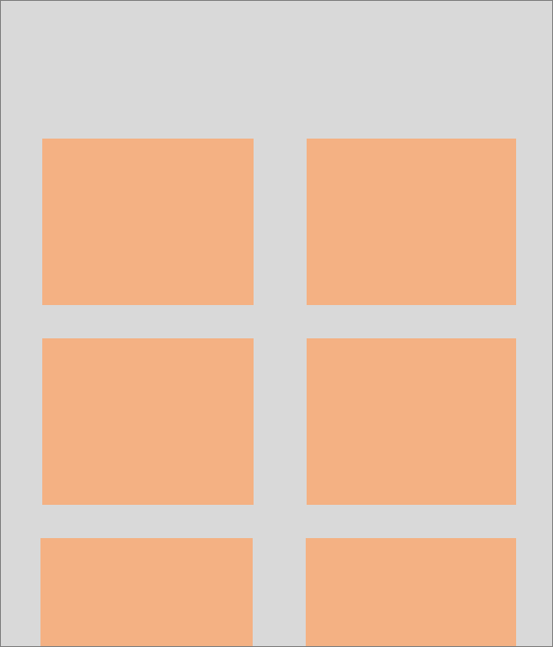
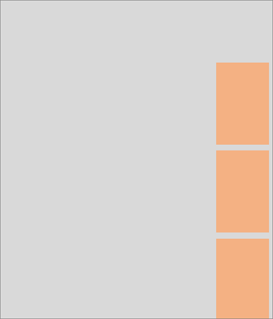
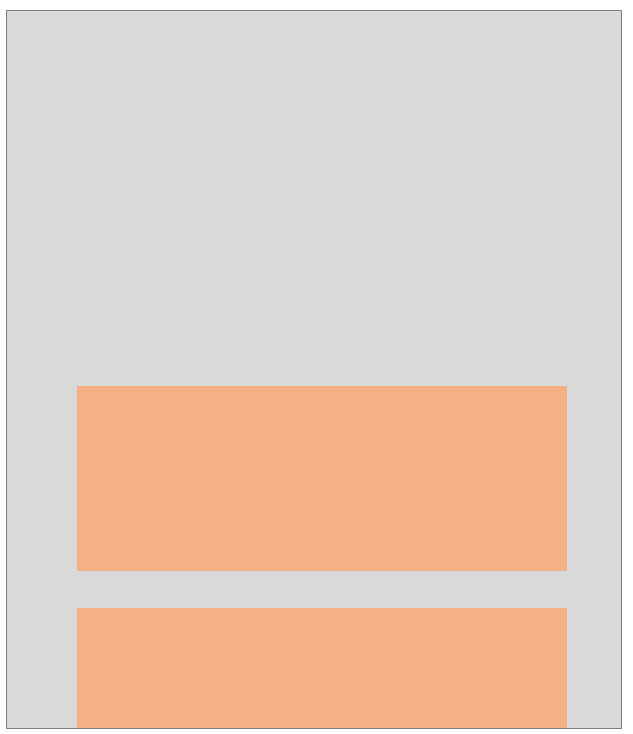
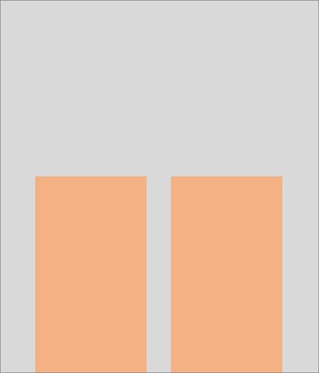

# Page Parts Overview

Parts are a special category of page designed to be embedded within another page. The hosting page can be composed of one or more page parts. Parts are useful when designing richer user experiences, by displaying information from a table that is different from the source table of the hosting page. Using parts is a great way to reuse your code across multiple pages.

## Hosting parts on a page
The following table illustrates how parts could be creatively arranged on a page to deliver unique experiences.

|Illustration of page pattern|Explanation|
|---|---|
||Pages of type **Role Center** are typically composed of multiple pages parts. These parts typically display business headlines, KPIs, and other cues to help users get an overview of their work.|
||Most page types can display a number of FactBoxes in the FactBox pane, that display information related to the current record.|
||Pages of type **Document** are  used to model transactional data that typically consists of a header and detailed lines. Since these records come from different tables, a part is used to display lines that originate from a related table.|
||Related lists can be displayed above each other. This pattern is a common pattern allowing one list to be filled by the selected record of another list. **Note:** We're working on adding guidance for more optimal layouts.|
||When records from two tables need to be compared together, parts can be displayed side by side. **Note:** We're working on adding guidance for more optimal layouts.|

## Different types of parts
Business Central offers different types of parts that display data in a specific way.

|PageType|Purpose|Hosting page types|
|----|---|---|
|[**ListParts**](devenv-designing-listparts.md)|Display a list of records.|Role Centers; FactBoxes on pages of type Card, Document, Worksheet, List, ListPlus; Tabular step in a Wizard; Subpage on a Document page.|
|[**CardParts**](devenv-designing-cardparts.md)|Flexible canvas that can be used to display almost any page controls, such as fields, cue tiles, charts, images, or control add-ins.|Role Centers; FactBoxes on pages of type Card, Document, Worksheet, List, ListPlus; Step in a Wizard.|
|[**HeadlineParts**](devenv-create-role-center-headline.md)|Display relevant insights from across the business.|Role Centers only.|

## Adding a part to a page
To add a part to a page in Visual Studio Code, you add a part control on the hosting page object that references the page part object. The part control also defines a small set of properties, such as the caption that will accompany the part. This allows separation of responsibility: the page part object defines self-contained functionality, whilst the hosting page defines how the container of the part should behave without knowledge of its' functionality.

<!-- A code snippet will be added here. -->

For more information about the properties of a part control, see [Page Properties](properties/devenv-page-property-overview.md).

## Design considerations

### Part size

The size of a part is automatically determined by the user interface and will vary depending on where the part has been embedded on the page, other content surrounding the part, and the overall available space of the display target. Developers can't specify the preferred, minimum, or maximum height or width of a part.

### Part actions
A part can define actions that operate on the fields within the part or navigate to another page. The area in which a part is embedded on a page determines how the action menu is displayed.
- In the `FactBoxes` or `RoleCenter` area of the hosting page, parts display a condensed action menu.
- In the `Content` area of the hosting page, parts will only display an expanded action menu if they satisfy the following rules:
  - parts are hosted on a card or document page.  
  - parts aren't placed within a FastTab.  

### Collapsed or expanded parts

The area in which a part is embedded on a page determines whether the part can be collapsed.
- In the `FactBoxes` or `RoleCenter` area of the hosting page, parts can't be collapsed.  
- In the `Content` area of the hosting page, parts can only be collapsed if they satisfy the following rules:
    - parts are hosted on a task dialog, card, or document page.  
    - parts aren't placed within a FastTab.  

[!INCLUDE[d365fin_long_md](includes/d365fin_long_md.md)] automatically determines whether parts are initially displayed as expanded or collapsed. For example, when a document page is opened the first time, the first two parts or FastTabs are automatically expanded and all other parts and FastTabs are shown as collapsed to provide an optimal starting experience. Users can change the state of a part to be expanded or collapsed directly within the user interface, but developers can't specify the starting state. 
 
### Choosing the visibility of parts
Parts can be hidden on the hosting page to provide an optimal starting experience. For example, a part could be hidden because it contains secondary content, or content that is needed by only some categories of users. To hide a part, set the **Visible** property of the part to `false` on the hosting page.  

When you design a page with hidden parts, users can choose to display those parts again using personalization and role customization features in the user interface. Parts can be made visible programmatically using an expression, for example, depending on whether the feature has been set up by administrators. Learn more about [Dynamic Visibility of Controls](/properties/devenv-visible-property.md#dynamic-visibility-of-controls).

> [!NOTE]  
> Parts embedded on Role Center pages can't be made visible using expressions, because the hosting Role Center page can't execute code.

### Using page background tasks

Like other page types, you can design a part page to use one or more page background tasks. However, unlike other page types, a part page won't display any data until all page background tasks have completed. For more information about this behavior, see [Designing part pages for page background tasks](devenv-page-background-tasks.md#partpages).

### Good to know

- Parts can either represent self-contained functionality, or can be contextual and exchange information with the hosting page.
- A part can't be hosted within another part. Business Central allows a maximum of one level of page nesting.
- Parts can't be placed within repeater controls.
- Parts aren't intended to be displayed on their own without a hosting page.

## See Also

[AL Development Environment](devenv-reference-overview.md)  
[Page Types and Layouts](devenv-page-types-and-layouts.md)  
[FactBoxes](devenv-adding-a-factbox-to-page.md)  
[Headlines](devenv-create-role-center-headline.md)  
[List Parts](devenv-designing-listparts.md)  
[Card Parts](devenv-designing-cardparts.md)  
[Page Extension Object](devenv-page-ext-object.md)   
[Personalizing Your Workspace](/dynamics365/business-central/ui-personalization-user)  
[Using Designer](devenv-inclient-designer.md)  
<!-- [Designing pages with multiple lists](devenv-designing-multilist-pages.md) -->
