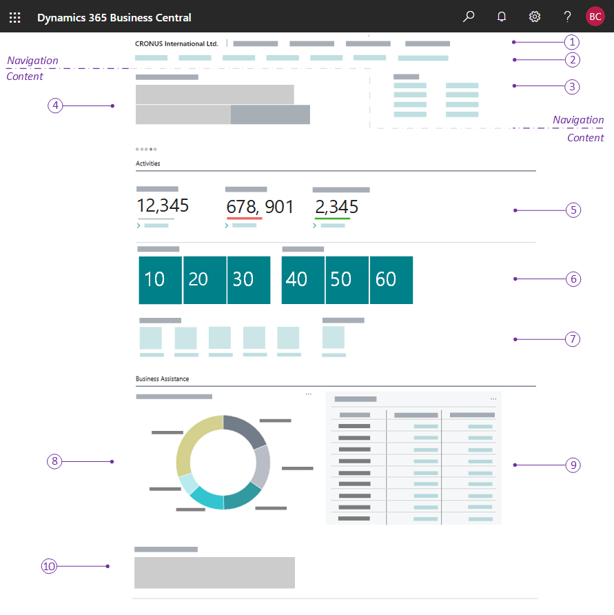

# Designing Role Centers

The strength of [!INCLUDE[d365fin_md](includes/d365fin_md.md)] is its role-tailored experience that helps users focus on the work that is important to them. The Role Center is an integral part of the role-tailored experience. And as a developer, role-tailoring should be the foundation for your Role Center design.

## About the Role Center

The Role Center is the user's entry point and home page for [!INCLUDE[d365fin_md](includes/d365fin_md.md)]. You can develop several different Role Centers, where each Role Center is customized to the profile of the intended users. For example, you could have Role Centers that target the different levels within an organization, such business owners, department leads, and information workers. 

Role Centers are based on a user-centric design model. You should design a Role Center to give users quick access to the information that is most important to them in their daily work - displaying information that is pertinent to their role in the company and enabling them to easily navigate to relevant pages for viewing data and doing tasks.

### Customizing a Role Center from the client

Users who work across multiple roles can easily switch Role Centers to shift their focus to different tasks. Users can also personalize their Role Centers by rearranging or hiding content as they like. For more information, see [Personalizing Your Workspace](/dynamics365/business-central/ui-personalization-user). 

As a developer or administrator, you can use Designer to customize a Role Center the same way that individual users personalize their own workspaces. The difference is that changes you make are applied to all users assigned to the Role Center. For more information, see [Using Designer](devenv-inclient-designer.md).

## Role Center structure

A Role Center is defined by page that has the [PageType property](properties/devenv-pagetype-property.md) set to `RoleCenter`. The Role Center page is divided into two main areas: navigation/actions area and content area. The following figure illustrates the general layout and elements of a Role Center page.

For a simple code example of a role center page, see [Simple Role Center Code Example](devenv-simple-role-center-example.md).

## Navigation and Actions area

The navigation and actions area appears at the top of the Role Center page, and provides links to other objects, such as pages, reports, and codeunits. You define the navigation area by adding actions to the Role Center page code, under the `actions` control in the page code. The navigation and actions area is subdivided into smaller areas by using different `area()` controls as described in the following table:

|  No.  |Area|Description|Usage Guidelines|
|----|-------|-----------|----------------|
|1|Navigation menus|The top-level navigation consists of one or more root menu items that expand to display links to other pages. The links can be grouped into submenus, enabling you to create a logical hierarchy. The pages targeted by the links will open in the content area of the Role Center.   You define this area with an `area(Sections)` control in the page code.|The top-level navigation should provide access to relevant entity lists for the role's areas of business. For example, typical root items for a business manager could be finance, sales, and purchasing. You should place the root items in order of importance, starting from the left.|
|2|Navigation bar|The second-level navigation displays a flat list of links to other pages. The pages targeted by the links will open in the content area of the Role Center.  You define this area with an `area(embedding)` control in the page code.|You should use these items to link to users' most useful entity lists in their business process. For example, with a business manager, these could be links to customers, sales orders, and bank accounts. You should place items in the order that reflects the business process sequence. Try to limit the number of second-level items, and consider placing items in the top-level navigation instead, if the number gets too large. |
|3|Action bar|The actions bar provides links to pages, reports, and codeunits. The links can be displayed on the root-level or grouped in a submenu. The objects targeted by these links will open in a separate window in front of the Role Center page.  You can define the actions by using the three different `area()` controls that are described below: |The action area is designed for running the most important or most often used tasks and operations required by users. Actions will typically target card type pages that enable users to create new entities, such as customers, invoices, and sales orders, or run reports. Place the most important action at the root-level, and group closely related actions in a submenu.|
|||`area(creation)` - Actions in this control will appear first in the action area, and will display with a plus (+) icon. |Use this control to target pages that enable the user to create new entities.|
|||`area(processing)` - Actions in this control will appear after the `area(creation)` items. You can group actions in submenus by using a `group` control.|Use this control to target pages that are associated with the work flow for processing documents, such as payments or sales orders. Use the `group` control to organize similar actions under a common parent.|
|||`area(reporting)` - Actions in this control will appear last in the action area. They display with a default report icon. |Use this control to target report objects.|

For more information about navigation, see [Adding to Navigation](devenv-adding-menus-to-navigation-pane.md). 

### Behavioral points of interest

- The order of the `area()` controls in the page code isn't important. However, the order of the individual actions and groups is important because they'll appear in the order in which they appear in page code.  
- In page code, if the first part in the content area is a Headline part, the actions area in the client will be automatically positioned either to the right of the Headline part or after the Headline part, depending on the browser window size. If the first part isn't a Headline, the actions area will appear directly after the navigation area, and extend the width of the workspace. 

## Content area

The content area consists of one or more parts that display content from other pages. Unlike the navigation and actions area that is completely defined in the Role Center page code, the content area consists of self-contained, independent page part objects that can be used across Role Centers and in other pages. You define the content area by adding a `layout` control in the page code, and then a `part` control for each individual part to display.  

The following table describes some of the most common parts for Role Centers, as illustrated in the previous figure.

|  No.  |Element|Description|More information|
|----|-------|-----------|----------------|
|4|Headline|Displays a series of automatically changing headlines that provide users with up-to-date information and insight into the business and daily work. This element is created by a `HeadlinePart` page type. |[Creating Role Center Headlines](devenv-create-role-center-headline.md)||
|5|Wide data cues | A set of cues for displaying large numbers, like monetary values. This is created by using a `cuegroup` control on a `CardPart` page type, where the [Layout property](properties/devenv-layout-property.md) is set to `wide`. |[Wide Cues](devenv-cues-action-tiles.md#CueWideLayout)|
|6|Data cues |Provide a visual representation of aggregated business data, such as the number of open sales invoices or the total sales for the month. These cues are created by using a `cuegroup` control on a `CardPart` page type. |[Creating Cues](devenv-cues-action-tiles.md#CreateCue)|
|7|Action cues |Tiles that link to tasks or operations, like opening another page, starting a video, targeting another URL, or running code. These cues are created by using a `cuegroup` control on a `CardPart` page type|[Action Tiles](devenv-cues-action-tiles.md#ActionTiles)|
|8|Chart|A graphical and interactive representation of your business data that can be sourced by a custom business chart control add-in or an embedded Power BI report.||
|9|CardPart or ListPart page|Displays data fields in a form or tabular layout.|[Page Object](devenv-page-object.md)|
|10|Control add-in|Displays custom content by using HTML-based control add-in.|[Control Add-in Object](devenv-control-addin-object.md)|

### Behavioral points of interest

- In general, the parts will appear in the client according to the order in which they're defined in the Role Center page code and will automatically rearrange horizontally and vertically to fill the available workspace.
- However, in the [!INCLUDE[d365fin_web_md](includes/d365fin_web_md.md)], page parts that contain cues are automatically grouped under a common **Activities** section, no matter where they are placed in the code. All other page parts are grouped under the **Business Assistance** section. Within **Activities** and **Business Assistance** sections, the parts will arrange according to the order in which they are defined in the page code.

## Development tips for overall page design

- Do not apply grouping to parts in the content area because it prevents parts from flowing to fill the available space. This gives the best experience to users with different screen resolutions or those on mobile devices.
- To achieve the best readability and discoverability, place Headlines first, followed by cues, and then the remaining parts.
- You can't add custom logic directly to a Role Center page code. Code is limited to defining navigation, actions, and parts. All other code is ignored.
- Role Centers can be highly specialized, in the fact that the navigation, actions, and content are optional. For example, you could have a single part that fills the entire workspace.
 
## Design for all display targets

- Role Center pages are also the primary entry point on mobile devices. Mobile devices will display the same content as the [!INCLUDE[d365fin_web_md](includes/d365fin_web_md.md)], but is presented in a different way to suit how users hold and interact with their mobile device.
- You can preview how your Role Center will look on mobile devices directly in Designer.
- Some limitations on mobile devices include:
  - On tablets, there's a limit on the number of cues that can be displayed.
  - On phones, there's a limit on the number of parts in the content area that can be displayed.
  - Role Center pages cannot be displayed when they are embedded in Outlook or SharePoint.

## Performance considerations

Role Centers that have many parts that process data from different sources can degrade performance. To improve responsiveness and the time it takes to sign in to the Role Center, [!INCLUDE[prod_short](includes/prod_short.md)] 2021 release wave 1 (and later) optimizes the sequence in which content is loaded. The sequence is as follows:

1. Content directly on the Role Center page object is loaded first, and users can immediately interact with it. Examples of such content are the navigation menu and actions.
2. Parts are loaded one by one from top to bottom.
3. Parts for which the [Visible property](properties/devenv-visible-property.md) evaluates to `false` won't be loaded.
4. Parts that aren't in view are loaded when the user scrolls to display them.

Here are some practical tips to help you make the most of this optimization:

- Consider hiding any parts that represent secondary content that only some users in that role will need. For more information, see [Choosing the visibility of parts](devenv-designing-parts.md#choosing-the-visibility-of-parts).
- For parts that require heavy processing, consider applying page background tasks. For more information, see [Using page background tasks](devenv-designing-parts.md#using-page-background-tasks).

## Using the Role Center in the client

To use or test the new Role Center in the client, you must first associate the Role Center page with a profile. Profiles define user roles and each profile is associated with a single Role Center page. Create a new [profile object](devenv-profile-object.md) that references your page. Then, go to **My Settings** and select the new profile.

## See Also

[AL Development Environment](devenv-reference-overview.md)  
[Page Types and Layouts](devenv-page-types-and-layouts.md)  
[Page Extension Object](devenv-page-ext-object.md)  
[Actions Overview](devenv-actions-overview.md)  
[Adding Pages and Reports to Tell Me](devenv-al-menusuite-functionality.md)  
[Personalizing Your Workspace](/dynamics365/business-central/ui-personalization-user)  
[Using Designer](devenv-inclient-designer.md)  