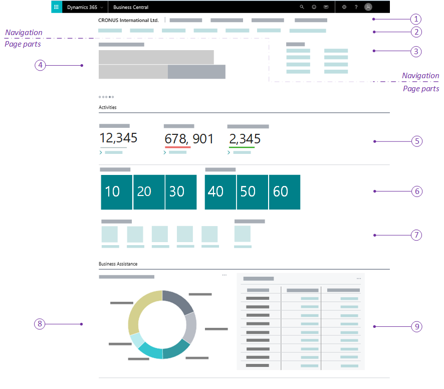

[!INCLUDE[newdev_dev_preview](includes/newdev_dev_preview.md)]

# Designing Role Centers
The Role Center is the user's entry point and home page for [!INCLUDE[d365fin_md](includes/d365fin_md.md)]. You can develop several different Role Centers, where each Role Center is customized to the profile of the intended users. For example, you could have a Role Center for sales order processors, business managers, administrators and more. A Role Center should be designed to give users quick access to the information that is most important to them in their daily work.

## Overview
A Role Center is defined by page that has the [PageType property](properties/devenv-pagetype-property) set to `RoleCenter`. The Role Center page is divided into two main areas: navigation area and content area. The following figure illustrates the general layout and elements of a Role Center page.

## Navigation area
The navigation area appears at the top of the Role Center page, and provides links to other objects, such as pages, reports, and codenits, and more. You define the navigation area by adding actions to the Role Center page. The navigation area is subdivided into smaller areas by using the `area()` control. The following table describes the elements in the navigation area:

|    |Area|Description|More information|
|----|-------|-----------|----------------|
|1|Top-level navigation|This area is defined by an `area(sections)` control. Each top-level item is defined by a `group` control under the `area(sections)` control, and the subitems are defined by `action` controls under the `group` control.|The top-level navigation should provide access to most important enitity lists for the profile's areas of business. For example, typical lists for sales order processor could be customers, sales orders, quotes, and invoices.  |
|2|Second-level|These items are defined by an `area(embedding)` control. Each item is defined by a `action` control that targets a specific object, like a page or report. |You should use these items to open the entity lists most used by the users, regardless of the business area. |
|3|Action-level|This area is defined by three different `area`controls: `area(creation)`, `area(processing)`, and  `area(reporting)`. <ul><li>Actions in the `area(creation)` control will appear first in the action menu, and will have plus icon.</li><li>Actions in an an `area(processing)` control will appear after the `area(creation)` items.</li><li>Actions in the `area(reporting)` control display last in the action area, and appear with default report icon. |The action area is designed for specific tasks and operations. These actions will typically target card type pages that enable users to create new entities, such as customers, invoices, and sales orders. |

### Behavioral considerations
If the first part in the content area is a Headline part, then in the client, the action area will be positioned either to the right of the Headline part or after the Headline part, dending on the browser window size. Otherwise, the action area will appear at the bottom of the navigation area, and extend the width of the workspace. 

## Content area
The content area consists of one or more parts that display different content. There are three part types: Page, System, amd Chart. The page part type, which is the most typical part type, is associated with a separate underlying page. The System and Chart types are only supported in the Windows client.

The following table described some of the most common parts for Role Centers, which are illustrated in the previous figure.

|    |Element|Description|More information|
|----|-------|-----------|----------------|
|4|Headline|Displays a series of automatically changing headlines that provide users with up-to-date information and insight into the business and daily work. This is created by a `HeadlinePart` page type. |[Creating Role Center Headlines](devenv-create-role-center-headline.md)||
|5|Wide cues | A set of cues for displaying large numbers, like monetary values. This is created by using a `cuegroup` control on a `CardPart` page type, where the [Layout property](properties/devenv-layout-property.md) is set to `wide`. |[Wide Cues](devenv-cues-action-tiles.md#CueWideLayout)|
|6|Normal cues |Provides a visual representation of aggregated business data, such as the number of open sales invoices or the total sales for the month. These are created by using a `cuegroup` control on a `CardPart` page type. |[Creating Cues](devenv-cues-action-tiles.md#CreateCue)|
|7|Action tiles |Tiles that link to tasks or operations, like opening another page, starting a video, targeting another resource or URL, or running code. These are created by using a `cuegroup` control on a `CardPart` page type|[Action Tiles](devenv-cues-action-tiles.md#ActionTiles)|
|8|Chart|A graphical representation of business data controlled by a the Business Chart control add-in on a page. ||
|9|CardPart page|A `CardPart` page type that displays fields in a gridlayout.||

### Behavioral considerations
- In general, the parts will appear in the client according to the order in which they are defined in code of the RoleCenter page.
- However, in the [!INCLUDE[d365fin_web_md](includes/d365fin_web_md.md)], page parts that contain cues will appear under a common **Activities** section, not matter where they are placed in the code. All other page parts under the **Business Assistance** section.  
 

## See Also
[AL Development Environment](devenv-reference-overview.md)  
[Page Extension Object](devenv-page-ext-object.md)  
[Actions Overview](devenv-actions-overview.md)  
[Adding Pages and Reports to Search](devenv-al-menusuite-functionality.md)  