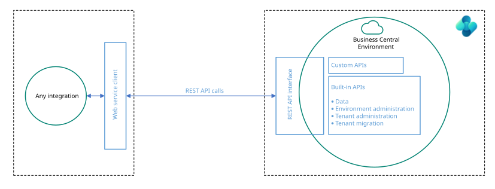

# Get started developing Connect apps for [!INCLUDE [prod_long](includes/prod_long.md)]

A Connect app creates a point-to-point connection between [!INCLUDE [prod_long](includes/prod_long.md)] and a partner solution or service. You typically use a standard REST API to interchange data. You can use any coding language that calls REST APIs to develop your Connect app. The following section explains how to get started exploring the available APIs for [!INCLUDE [prod_long](includes/prod_long.md)].

[](media/api-stack.svg#lightbox)

To explore and develop against REST APIs in [!INCLUDE [prod_long](includes/prod_long.md)], you must first sign up for a trial tenant, and then you must connect and authenticate. To do that, follow these steps:

1. Sign up for [Dynamics 365 Business Central](https://signup.microsoft.com/signup?sku=6a4a1628-9b9a-424d-bed5-4118f0ede3fd&ru=https%3A%2F%2Fbusinesscentral.dynamics.com%2FSandbox%2F%3FredirectedFromSignup%3D1).  
When you have your tenant, you can sign into the UI to explore the product and the [APIs](/dynamics-nav/api-reference/v2.0)
2. There are two different ways to connect to and authenticate against the APIs.  
    - Use Microsoft Entra ID based authentication against the common API endpoint: `https://api.businesscentral.dynamics.com/v2.0/<environment name>/api/v2.0`
    - Use basic authentication with username and password (a so-called web service access key) against the common API endpoint that includes the user domain, for example `https://api.businesscentral.dynamics.com/v2.0/production/cronus.com/api/v2.0`.  
        > [!IMPORTANT]  
        > When going into production, you should use Microsoft Entra/OAuth v2 authentication and the common endpoint `https://api.businesscentral.dynamics.com/v2.0/production/api/v2.0`. For exploring and initial development, you can use basic authentication.
        > [!IMPORTANT]  
        > Basic authentication is deprecated with Business Central 2022, release wave 1 for SaaS. Learn more in [Deprecated features in the platform - clients, server, and database](../upgrade/deprecated-features-platform.md#accesskeys).

To construct the URL for the environment, the path needs to contain the environment name. To learn how to get a list of environments deployed on the tenant, see [Getting a list of environments](../webservices/api-get-environments.md). OAuth is required for this endpoint. 

The following sections explain how to set up the two types of authentication and use Insomnia to explore the APIs.

APIs can also be explored through the [OpenAPI specification for Business Central](/dynamics-nav/api-reference/v1.0/dynamics-open-api).


## Set up Microsoft Entra ID based authentication

Sign in to the [Azure portal](https://portal.azure.com) to register [!INCLUDE [prod_long](includes/prod_long.md)] as an app and thereby provide access to [!INCLUDE [prod_long](includes/prod_long.md)] for users in the directory.

1. Follow the instructions in the [Integrating applications with Microsoft Entra ID](/azure/active-directory/develop/quickstart-register-app) article. The next steps elaborate on some of the specific settings you must enable.
2. On the **API permissions** page for your app, select the **Add a permission** button. 
3. Make sure the **Microsoft APIs** tab is selected. In the *Commonly used Microsoft APIs* section, select **Dynamics 365 Business Central** and select **Delegated permissions**.  
4. Ensure that the right permission is checked: **Financials.ReadWrite.All**. Use the search box if necessary.
5. Choose the **Add permissions** button.
    > [!NOTE]  
    > If **Dynamics 365** doesn't show up in search, it's because the tenant doesn't have any knowledge of Dynamics 365. To make it visible, an easy way is to register for a [free trial](https://signup.microsoft.com/signup?sku=6a4a1628-9b9a-424d-bed5-4118f0ede3fd&ru=https%3A%2F%2Fbusinesscentral.dynamics.com%2FSandbox%2F%3FredirectedFromSignup%3D1) for [!INCLUDE [prod_long](includes/prod_long.md)] with a user from the directory. 

6. From the **Certificates & secrets** page, in the **Client secrets** section, choose **New client secret**:
    - Type a key description (of instance app secret),
    - Select a key duration of either **In 1 year**, **In 2 years**, or **Never Expires**.
    - When you select the **Add** button, the key value is displayed, then copy, and save the value in a safe location.

    > [!NOTE]  
    > You need this key later to configure the project in Visual Studio. This key value isn't displayed again, nor is it retrievable by any other means, so record it as soon as it's visible from the Azure portal.

You set up the Microsoft Entra ID-based authentication. Next, you can explore the APIs. Learn more in the [Explore REST APIs with Insomnia and Microsoft Entra authentication](#explore-rest-apis-with-insomnia-and-microsoft-entra-authentication) section.


## Set up basic authentication (only for on-premises)

[!INCLUDE[webservice_key_deprecated](../includes/web-service-key-deprecated.md)]

If you prefer to set up an environment with basic authentication just to explore the APIs, you can skip setting up the Microsoft Entra ID based authentication for now and proceed with the steps below. If you, however, want to go into production, you must use Microsoft Entra ID/Oauth v2 authentication, see the section [Setting up Microsoft Entra ID based authentication](#set-up-microsoft-entra-id-based-authentication).

1. To set up basic authentication, sign in to your tenant. In the **Search** field, enter **Users** and then select the relevant link.
2. Select the user to add access for, and on the **User Card** page, in the **Web Service Access Key** field, generate a key.  
3. Copy the generated key and use it as the password for the username. 

Now that you have the username and password, you can connect and authenticate. In the [Explore APIs with Insomnia and basic authentication](#explore-apis-with-insomnia-and-basic-authentication-only-for-on-premises) section, we use Insomnia.

## Explore REST APIs with Insomnia and Microsoft Entra authentication

In this example, you go over the basic steps required to retrieve the list of customers in your trial tenant. This example uses Microsoft Entra authentication with the OAuth 2.0 Authorization Code grant.

1. Download and install [Insomnia](https://insomnia.rest/download) (free, open-source REST client by Kong).
2. Create a new request collection, select the **+** button, and choose **HTTP** to create a new request.
3. In the method dropdown, select **GET** and enter the base API URL in the endpoint field:  
   `https://api.businesscentral.dynamics.com/v2.0/<environment name>/api/v2.0`

   > [!TIP]  
   > When you call the base API URL, you get a list of all the available APIs. Append `$metadata` to the URL to also get information about the fields in the APIs.

4. Select the **Auth** tab and choose **OAuth 2.0** from the auth type dropdown.
5. Set **Grant Type** to **Authorization Code** and fill in the following fields:
   - **Authorization URL**: `https://login.microsoftonline.com/<your tenant domain>/oauth2/v2.0/authorize`
   - **Access Token URL**: `https://login.microsoftonline.com/<your tenant domain>/oauth2/v2.0/token`
   - **Client ID**: The Application (client) ID from the registered app in Azure portal.
   - **Client Secret**: The key you generated and copied in step 6 in [Set up Microsoft Entra ID based authentication](#set-up-microsoft-entra-id-based-authentication).
   - **Redirect URL**: The URL you specified as the redirect URI in the Azure portal app registration.
6. Expand **Advanced Options** and set:
   - **Scope**: `https://api.businesscentral.dynamics.com/.default`
   - **Credentials**: **In Request Body**
7. Select **Fetch Tokens**. The first time you sign in, you're prompted for consent. After authentication completes, the access token appears in the token panel.
8. Select **Send** to execute the call. The response pane displays the list of available APIs.

## Explore APIs with Insomnia and basic authentication (only for on-premises)

In this example, you learn the basic steps to retrieve the list of customers in your trial tenant. This example uses basic authentication.

1. In Insomnia, create a new HTTP request. In the method dropdown, select **GET** and enter the base API URL in the endpoint field. Since you're using basic authentication, include the user's domain in the URL:  
   `https://api.businesscentral.dynamics.com/v2.0/<your tenant domain>/<environment name>/api/v2.0`

   > [!NOTE]  
   > The parameter `<your tenant domain>` is your default Microsoft Entra ID GUID.

2. Select the **Auth** tab and choose **Basic Auth** from the auth type dropdown.
3. Enter the **Username** and the **Web Service Access Key** (from the previous section) as the **Password**.
4. Select **Send** to execute the call. The response pane displays the list of available APIs.

## Call an API

Each resource is uniquely identified through an ID, see the following example of calling `GET <endpoint>/companies`:  

```json
{
    "@odata.context": "<endpoint>/$metadata#companies",
    "value": [
        {
            "id": "a0a0a0a0-bbbb-cccc-dddd-e1e1e1e1e1e1",
            "systemVersion": "18453",
            "name": "CRONUS USA, Inc.",
            "displayName": "CRONUS USA, Inc.",
            "businessProfileId": ""
        }
    ]
}
```

The resource ID must be provided in the URL when trying to read or modify a resource or any of its children. The ID is provided in parenthesis `()` after the API endpoint. For example, to GET the "CRONUS USA, Inc." company details, you must call `<endpoint>/companies(a0a0a0a0-bbbb-cccc-dddd-e1e1e1e1e1e1)/`.

All resources, such as customers and invoices, exist in the context of a parent company. The [!INCLUDE[prod_long](includes/prod_long.md)] tenant can have more than one parent company. You must provide the company ID in the URL for all resource API calls. To get all customers in the "CRONUS USA, Inc." company, you must call a GET on the URL `<endpoint>/companies(a0a0a0a0-bbbb-cccc-dddd-e1e1e1e1e1e1)/customers`.

## Related information

[API developer overview](devenv-api.md)
[Using filtering with APIs](devenv-connect-apps-filtering.md)  
[Tips for working with APIs](devenv-connect-apps-tips.md)   
[Troubleshooting API calls](../webservices/dynamics-error-codes.md)    
[API performance](../webservices/web-service-performance.md)   
