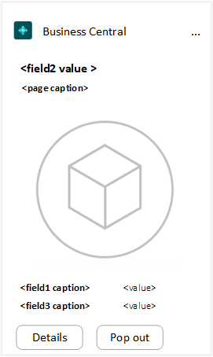
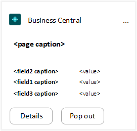
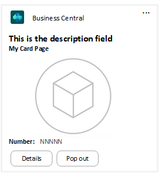
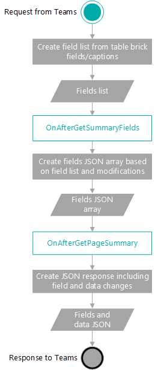
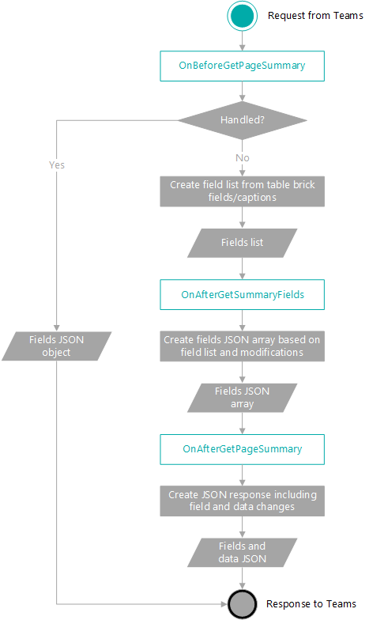
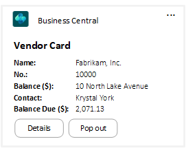
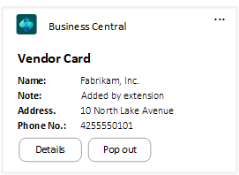
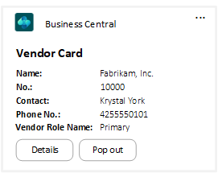
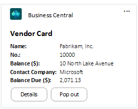

# Extending Teams Cards

[!INCLUDE [online_only](includes/online_only.md)]

In this article, you'll learn how to customize the fields that display on a Teams card. You customize the fields by using a field groups control on the source table or using events. You can also combine these two methods to achieve the results that you want.  

## Extend Teams cards by using field groups 

This section explains how to customize the fields that display on Teams card by setting metadata in [!INCLUDE [prod_short](includes/prod_short.md)] page and table objects.

###  <a name="card"></a>Understanding the card layout in Teams

The main metadata elements for displaying fields in Teams are the `Brick` [field group](devenv-field-groups.md), together with the page and field captions. However, with the lack of a `Brick` field group on a table, the `Dropdown` field group and primary keys will play a role in determining the fields that display. This section describes how the app selects and arranges fields on the card in Teams. Use this information to help define your `Brick` field group.

#### What fields are displayed

Although it's recommended, a `Brick` field group isn't required to display a card in Teams. Lacking a `Brick` field group, the app will fall back to use either `DropDown` field group or the primary key fields of on the source table, according to the following flow:

1. If a `Brick` field group exists, the app uses the fields specified by the `Brick` field group.
2. If a `Brick` field group doesn't exist, the app uses fields that are defined in `Dropdown` field group.
3. If  `Dropdown` field group doesn't exist, then the primary key fields and fields called Name or Description in the table are used.

#### How fields are arranged

The app will arrange fields on cards in Teams based on one of two templates, depending on whether a media field is included in the `Brick` field group. Except media data type fields, the order of fields on the card is determined by the field order in the `Brick` field group. You can't reposition fields, add new controls like actionable buttons, or change the overall style of a card.

The two templates and how they order fields are explained in the following table.

|With media|Without media|
|----------|-------------|
|<br /><br />The card is laid out from top to bottom as follows:<ol><li>The second field defined in `Brick` field group appears first in a large font. </li><li>The page's caption property value</li><li> The media thumbnail</li><li>The remaining brick fields in the order they're defined.</li></ol><br />Guidelines:<ul><li>For the second field, it's a good idea to use a field that best identifies the record, like a name or description field.</li><li>Don't place a media field as the second field in the `Brick` field group. It doesn't matter where you place the field otherwise - it will appear after the page caption.</li><li>If there's more than one media field in the `Brick` field group, only the first one listed is used.</li><li>BLOB data type fields aren't supported.</li></uli>|<br /><br />The card is laid out from top to bottom as follows:<ol><li>The page's caption property value</li><li>The second field defined in `Brick` field group.</li><li>The remaining brick fields in the order they're defined.</li></ol><br />Guidelines:<ul><li>BLOB data type fields aren't supported.</li></uli>|

### Using the Brick field group

By default, the fields that display on a card in Teams are based on the `Brick` [field group](devenv-field-groups.md) that's defined on a page's source table. The `Brick` field group is the same element that determines which fields display with records in list pages viewed as tiles in the client. So you'll have to keep it in mind when designing for Teams.

Use the `Brick` field group to identify a subset of table fields that best summarize a record. Typically, you include fields that allow users to quickly identify the record and give insight about the record at a glance. The following code is snippet of `Brick` field group on a table:

```
fieldgroups
{
    fieldgroup(Brick; field[, field][, field])
    {
    }
}
```

The order that you specify fields is important. For an explanation, see [Understanding the card layout in Teams](#card) in this article.

#### Example

This code example adds a simple table and card page. The `Brick` field group specifies which fields of the table will display in a Teams card, as illustrated by the following figure:



```
Table 50100 MyTable
{

    fields
    {
        field(1; Number; Integer)
        {
        }
        field(2; Description; Text[50])
        {
        }
        field(3; Inventory; Integer)
        {
        }
        field(4; Image; Media)
        {
        }
    }

    keys
    {
        key(PK; Number)
        {
        }
    }

    fieldgroups
    {
        fieldgroup(Brick; Number, Description, Image)
        {
        }
    }
}

page 50100 MyPage
{
    PageType = Card;
    ApplicationArea = All;
    UsageCategory = Administration;
    SourceTable = MyTable;
    Caption = 'My Card Page';

    layout
    {
        area(Content)
        {
            group(GroupName)
            {
                field(Number; Number)
                {
                    ApplicationArea = All;
                }
                field(Description; Description)
                {
                    ApplicationArea = All;
                }
                field(Inventory; Inventory)
                {
                    ApplicationArea = All;
                }
            }
        }
    }
}
```

For more information about how to specify the `Brick` field group. see [Displaying Data as Tiles](devenv-lists-as-tiles.md).

#### Extensibility limitations on the Brick field group

The following list provides information to keep in mind when designing table and table extension objects in your extensions:

- You can add a `Brick` field group to a new table object.
- You can add a `Brick` field group to a table extension object as long as the base table it extends doesn't already have one.
- In a table extension object, you can't add to or overwrite a `Brick` field group that's already specified for a base table.

## Extending Teams cards by using events

Business Central offers the following events for customizing the fields and data that appear in a Teams card:

|Event|Description|
|-----|-----------|
|OnBeforeGetPageSummary|Use this event to override **all data** for a Card. By handling the event, you can specify a custom set of key-value pairs that will be displayed. The platform won't attempt to select any list of fields or their corresponding values if you subscribe to this event.|
|OnAfterGetSummaryFields|Use this event to specify a custom set of fields from the same table as the record. Using this method you can add more fields than are those fields specified by the  `Brick` field group on the source table. For example, you could add fields that are added to the source table by a table extension.|
|OnAfterGetPageSummary |Use this event to modify fields and their values that are already selected for the card by the platform. For example, you could change the captions or value of a field.|

The events are part of the [Page Summary Provider](https://github.com/microsoft/ALAppExtensions/blob/master/Modules/System/Page%20Summary%20Provider/README.md) module of the Microsoft System Application.

> [!NOTE]
> In most cases, we recommend you set the `Brick` field group instead of using events to define card content. This ensures a consistent experience across the Business Central Web client, mobile devices, and Teams.

### Event flow

The following figure illustrates the sequence of the events and operations involved in building the card in Teams. The flow has been simplified for illustration purposes.

<!--  -->



### OnBeforeGetPageSummary event

The OnBeforeGetPageSummary event gives you the most control over the fields and data that appears in the card. With this event, you specify a complete set of fields as key-value pairs using JSON Array. Only these fields will appear on the card, even if the source table has a `Brick` field group or other extensions include code that modifies the card.

#### Syntax

The OnBeforeGetPageSummary event subscription has the following syntax:

```
[EventSubscriber(ObjectType::Codeunit, Codeunit::"Page Summary Provider", 'OnBeforeGetPageSummary', '', false, false)]
local procedure OnBeforeGetPageSummary(PageId: Integer; RecId: RecordId; var FieldsJsonArray: JsonArray; var Handled: Boolean);
```

#### Parameters

|Parameter|Description|
|---------|-----------|
|`PageId`|The ID of the page for which to retrieve page summary.|
|`RecId`|The underlying record ID of the source table for the page being retrieved, based on the bookmark.|
|`FieldsJsonArray`|A JSON array that includes the fields and values to display on the card, if the event is handled.|
|`Handled`|Specifies whether the event has been handled and no further execution should occur.|

#### Behavior and recommended use

This event is raised before platform tries to get summary fields for the card from the table, for example, from the `Brick` field group. So when you subscribe to this event, the fields in the `Brick` field group aren't used. Subscribing to this event prohibits other extensions from adding, modifying, or removing summary fields on the card by the other event.

For these reasons, use this event only if you don't want to use any fields of the source table in the card.

#### Example

The following code example uses the OnBeforeGetPageSummary event to change the fields on a Teams card, as shown in the following table:

|Before|After|
|------|-----|
|||

```
[EventSubscriber(ObjectType::Codeunit, Codeunit::"Page Summary Provider", 'OnBeforeGetPageSummary', '', false, false)]
local procedure OnBeforeGetPageSummary(PageId: Integer; RecId: RecordId; FieldsJsonArray: JsonArray; var Handled: Boolean)
var
    Vendor: Record Vendor;
begin
    if PageId <> Page::"Vendor Card" then
        exit;

    if not Vendor.Get(RecId) then
        exit;

    AddField(FieldsJsonArray, 'Name', Vendor.Name, 'Text');
    AddField(FieldsJsonArray, 'Note', 'Added by extension', 'Text');
    AddField(FieldsJsonArray, 'Address', Vendor.Address, 'Text');
    AddField(FieldsJsonArray, 'Phone No.', Vendor."Phone No.", 'Text');

    Handled := true;
end;

local procedure AddField(var FieldsJsonArray: JsonArray; Caption: Text; FieldValue: Text; FieldType: Text)
var
    FieldsJsonObject: JsonObject;
begin
    FieldsJsonObject.Add('caption', Caption);
    FieldsJsonObject.Add('fieldValue', FieldValue);
    FieldsJsonObject.Add('fieldType', FieldType);
    FieldsJsonArray.Add(FieldsJsonObject);
end;
```

### OnAfterGetSummaryFields event

The OnAfterGetSummaryFields event lets you add or remove from the set of fields selected by the platform. For example, if the platform automatically selects fields based on its `Brick` field group, use this event to add fields from the same table, which aren't part of the `Brick` field group.

#### Syntax

```
[EventSubscriber(ObjectType::Codeunit, Codeunit::"Page Summary Provider", 'OnAfterGetSummaryFields', '', false, false)]
local procedure OnAfterGetSummaryFields(PageId: Integer; RecId: RecordId; var FieldList: List of [Integer]);
```

#### Parameters

|Parameter|Description|
|---------|-----------|
|`PageId`|The ID of the page object in Business Central that the card is generated for.|
|`RecId`|The underlying record ID in the source table for the page being retrieved, based on the bookmark.|
|`FieldList`|The list of fields that will be returned.|

#### Behavior and recommended use

This event is raised after the platform gets the summary fields from the table. <!--It's not raised if OnBeforeGetPageSummary event has been handled.-->

The event the ideal for specifying a custom set of fields from the same table. It enables the platform to fetch the corresponding values for the current record. If you extended a table with fields, use this event to add the fields to the card.

Here are some considerations, when using this event:

- Use the FieldList to add or remove individual fields you want to show on the card in Teams.
- Fields on the card in Teams are shown in the order specified the `FieldList`.
- Don't remove all fields from the list, because you'll be removing fields that are added by other partner extensions.

#### Example

The following code example uses the OnAfterGetSummaryFields event to change the fields on a Teams card, as shown in the following table:

|Before|After|
|------|-----|
|||

```
[EventSubscriber(ObjectType::Codeunit, Codeunit::"Page Summary Provider", 'OnAfterGetSummaryFields', '', false, false)]
local procedure OnAfterGetSummaryFields(PageId: Integer; RecId: RecordId; var FieldList: List of [Integer])
var
    Vendor: Record Vendor;
begin
    if PageId <> Page::"Vendor Card" then
        exit;

    // Remove Balance Due  details 
    FieldList.Remove(Vendor.FieldNo("Balance Due (LCY)"));
    FieldList.Remove(Vendor.FieldNo("Balance (LCY)"));

    // Add contact number
    FieldList.Add(Vendor.FieldNo("Phone No."));

    // Add new field "Vendor Role Name" from extension
    FieldList.Add(Vendor.FieldNo("Vendor Role Name"));
end;
```

In the code, the **Vendor Role Name** field is defined in a table extension object that extends the **Vendor** table.

### OnAfterGetPageSummary event

This event allows you to modify, add, or remove fields included in the card through the direct access to the FieldsJsonArray.

#### Syntax

```
[EventSubscriber(ObjectType::Codeunit, Codeunit::"Page Summary Provider", 'OnAfterGetPageSummary', '', false, false)]
local procedure OnAfterGetPageSummary(PageId: Integer; RecId: RecordId; var FieldsJsonArray: JsonArray);
```

#### Parameters

|Parameter|Description|
|---------|-----------|
|`PageId`|The ID of the page for which to retrieve page summary.|
|`RecId`|The underlying record ID of the source table for the page being retrieved, based on the bookmark.|
|`FieldsJsonArray`|A Json array that lists the fields to include in the card, overriding the current fields and values set for the card. |

#### Behavior and recommended use

This event is ideal for modifying the list of fields and their values that are selected by the platform.

Use the event to change the value of existing fields or to add fields that don't already exist on the record.

#### Example

The following code example uses the OnAfterGetPageSummary event to change the fields on a Teams card, as shown in the following table:

|Before|After|
|------|-----|
|||

```
[EventSubscriber(ObjectType::Codeunit, Codeunit::"Page Summary Provider", 'OnAfterGetPageSummary', '', false, false)]
local procedure OnAfterGetPageSummary(PageId: Integer; RecId: RecordId; var FieldsJsonArray: JsonArray)
var
    FieldJsonToken: JsonToken;
    CaptionToken: JsonToken;
    fieldNo: Integer;
begin
    if PageId <> Page::"Vendor Card" then
        exit;

    // Change value of field caption
    for fieldNo := 0 to FieldsJsonArray.Count() - 1 do begin
        FieldsJsonArray.Get(fieldNo, FieldJsonToken);
        FieldJsonToken.AsObject().Get('caption', CaptionToken);
        if CaptionToken.AsValue().AsText() = 'Contact' then begin
            // FieldJsonToken.AsObject().Replace('caption', 'Contact Company');
            // FieldJsonToken.AsObject().Replace('fieldValue', 'Microsoft');
            FieldJsonToken.AsObject().Replace('caption', 'Note');
            FieldJsonToken.AsObject().Replace('fieldValue', 'Added by extension');
            FieldsJsonArray.Set(fieldNo, FieldJsonToken);
            exit;
        end;
    end;
end;
```

In the code, the **Vendor Role Name** field is defined in a table extension object that extends the **Vendor** table.

## See Also

[FAQ for Teams Integration](devenv-dev-faq-teams.md)  
[Field Groups](devenv-field-groups.md)  
[Designing List Pages](devenv-designing-list-pages.md)  
[Working With Media on Records](devenv-working-with-media-on-records.md)  
