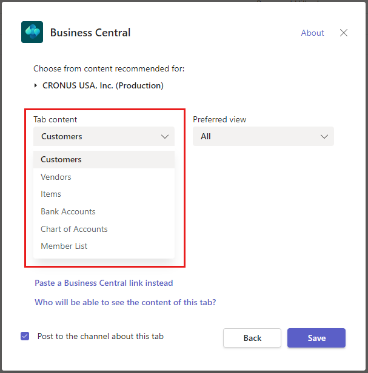

# Add and Remove Recommended Content for Business Central Tabs

This article describes how to change the recommended content presented to users when setting up a Business Central tab in a Teams channel or chat.

## Introduction

When users add a Business Central tab in a Teams channel or chat, they have the option to select recommended content on the tab configuration window.



By default, the content users can choose from is based on their role center, specifically, the actions in the navigation menu and any bookmarked list page. The recommended content only supports list pages. For more information about how users can add tabs, see [Add a Business Central Tab in Channels and Chats](/dynamics365/business-central/across-teams-tab).

As an AL developer, you can add or remove recommended content by subscribing to the `OnAfterGetPageActions` event, which has the following signature:

```al
[IntegrationEvent(false, false)]
internal procedure OnAfterGetPageActions(PageId: Integer; IncludeViews: Boolean; var ItemsJsonArray: JsonArray)
begin
end; 
```

The event provides the ID of the current user's roles center and the `ItemsJsonArray` object. The `ItemsJsonArray` object contains information about the pages that will show up in the recommended content list, including the caption and URL for the page and any of its views. The following code snippet shows an example of content inside the `ItemsJsonArray`: 

```json
{
    "caption": "Customers",
    "views": [
        {
            "caption": "balance",
            "url": "https://businesscentral.dynamics.com/?company=CRONUS%20International%20Ltd.&page=22&view=aa49406f-6f68-4565-b857-496faa0e77aa_balance48453&page=22&filter=Customer.%27Balance%20(LCY)%27%20IS%20%27>200%27"
        }
    ],
    "url": "https://businesscentral.dynamics.com/?company=CRONUS%20International%20Ltd.&page=22"
},
{
    "caption": "Vendors",
    "url": "https://businesscentral.dynamics.com/?company=CRONUS%20International%20Ltd.&page=27"
}
```

This event is published by codeunit 2915 "Page Action Provider", which is part of the **Page Action Provider** module of the system application. For more information about this module, see [ALAppExtensions GitHub repo](https://github.com/microsoft/ALAppExtensions/blob/main/Modules/System/Page%20Action%20Provider/README.md).

## Add or remove

By subscribing to the `OnAfterGetPageActions` event in your extension, you can hook into the `ItemsJsonArray` and add or remove recommended content. To subscribe the event, use the following method attribute:

```al
[EventSubscriber(ObjectType::Codeunit, Codeunit::"Page Action Provider", 'OnAfterGetPageActions', '', false, false)]
```

Consider the following code example. This example adds a custom page called *My page* to the recommended content list:

```al
codeunit 50100 UpdateRecommendedContent
{
    trigger OnRun()
    begin

    end;

    [EventSubscriber(ObjectType::Codeunit, Codeunit::"Page Action Provider", 'OnAfterGetPageActions', '', true, true)]
    local procedure AddMyPageToRecommendedContent(PageId: Integer; IncludeViews: Boolean; var ItemsJsonArray: JsonArray);
    begin
        AddRecommendedPage(ItemsJsonArray, 'My page', GetUrl(ClientType::Web, CompanyName, ObjectType::Page, Page::MyPage));
    end;

    local procedure AddRecommendedPage(var ActionsArray: JsonArray; Caption: Text; Url: Text)
    var
        ActionsJsonObject: JsonObject;
    begin
        ActionsJsonObject.Add('caption', Caption);
        ActionsJsonObject.Add('Url', Url);
        ActionsArray.Add(ActionsJsonObject);
    end;

    var
        myInt: Integer;
}
```

## See also

[Developing for Microsoft Teams Integration](devenv-develop-for-teams.md)  
[Create Business Central tabs for Teams](devenv-develop-for-teams-tabs.md)  