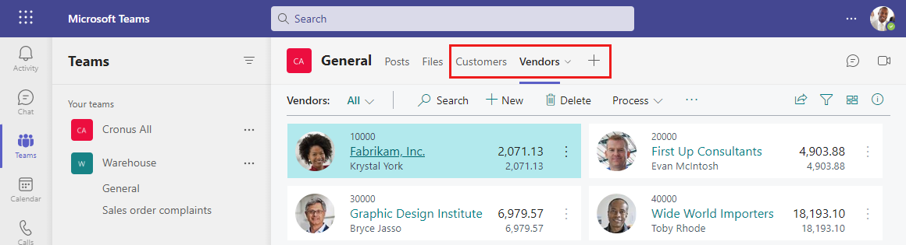

# Developing for Microsoft Teams Integration

[!INCLUDE [online_only](includes/online_only.md)]

[Microsoft Teams](https://www.microsoft.com/microsoft-365/microsoft-teams) is a Microsoft 365 product that lets you connect with others, collaborate seamlessly and simplify work. [!INCLUDE [prod_short](includes/prod_short.md)] offers an app that connects Microsoft Teams to your business data in [!INCLUDE [prod_short](includes/prod_short.md)] so users can quickly share details across team members and respond faster to inquiries. This article gives you an overview of what you can do as developer to customize displaying Business Central data and Teams channels and chats.

## Introduction to the Business Central app for Teams

In short, the app lets users:

- Add a tab that embeds Business Central data, such as a filtered list. 
- Copy a link to any Business Central record and paste it into Teams conversation to share with your coworkers. In Teams, the link will expand that into a compact card that displays a defined set of fields about the record.
- From the card in teams, users can select a button to view more details about the record. The card opens a window inside Teams that includes FactBoxes and other embedded content, such as charts.
- With the proper permissions, Business Central users in the chat or channel can edit fields, create records, start work flows, and take action from a card details or tab&mdash;without having to switch from Teams.
- Search for business contacts and view related details in a window in Teams 

## Managing, Installing, and Using the Business Central App for Teams

For more information about installing and using the [!INCLUDE [prod_short](includes/prod_short.md)] app in Teams from an admin and user perspective, see [Business Central and Microsoft Teams Integration](/dynamics365/business-central/across-teams-overview).

## Development overview

As a developer, you can influence the Business Central experience in Teams as part of your extensions using AL code. Most of the experience in Teams is powered by Business Central APIs and by embedding the Business Central Web client tailored for Teams. Business Central also offers AL events specifically for use with Teams features.

### About cards

Cards in Teams are used to summarize a Business Central page or record, and provide a convenient way for users to drill down to the full details, without leaving the Teams application. Users can create cards in different ways:

- when searching for business contacts in Teams
- when pasting a link to a Business Central record
- when using the Share to Teams feature in the Business Central Web client.

No matter how a user chooses to create a card, the resulting card is always the same. Developers can choose which fields are shown on the card, but can't choose the layout or style, or create more action buttons.

The [!INCLUDE [prod_short](includes/prod_short.md)] card is designed to work with entity pages that represent a single record. More specifically, it's designed for Card, Document, or ListPlus pages. Teams is ready to work with links to these page types and the underlying data in the source tables.

In most cases, displaying a card in Teams requires no extra development effort. But if a card doesn't display the fields and data you want, you have a couple options in AL code for making changes:

- Use a field group control on the source table

    This method primarily involves using the `Brick` field group on the page's source table.

- Use Teams-specific events

    There are currently two events that you can code against to change the fields that display in the card at runtime. We recommend that you use these events as an additive measure.

In most cases, we recommend you set the `Brick` field group instead of using events to define card content. Using the `Brick` field group ensures a consistent experience across the Business Central Web client, mobile devices, and Teams. If a table doesn't include a `Brick` field group, you should add one, then use the events to change the fields as needed.

For more information about these two development options, see [Extending Teams Cards](devenv-develop-for-teams-cards.md).

### About card details

Users can select the **Details** button on a Teams card to drill into the details of the card without leaving the Teams app. This button opens the [!INCLUDE [webclient](includes/webclient.md)] in a window that's embedded inside Teams. The window displays the target page object. The page includes any extensions to the page and its source table, role customizations, and user personalization. The experience is nearly identical to that of displaying the same record in the [!INCLUDE [webclient](includes/webclient.md)], except with some minor client differences.

You can modify or extend the layout and behavior of the page, like you would any page. The changes you make will affect the page in all [!INCLUDE [prod_short](includes/prod_short.md)] clients, not just in Teams. For more information about implementing pages, go to [Pages Overview](devenv-pages-overview.md).

### About Business Central tabs

In Teams, tabs appear at the top of channels and chats, giving participants quick access to pertinent information. Tabs are similar to card details as far as the content they display and what users can do with the content in Teams:

- A tab displays the target page object, including any extensions to the page and its source table, role customizations and user personalization.
- Apart from minor differences, a tab looks like what you'd see for the same record in the Business Central Web client.
- You can drill into the details of the record.

As a developer, you can modify or extend the layout and behavior of the source page. The changes you make will affect the page in all Business Central clients, not just in Teams. 

Business Central tabs, like card details, are designed to embed most Business Central entity page types, including Card, Document, or ListPlus. But tabs also support collection page types such as List and Worksheet. Role Center page objects aren't supported.  

Using the Graph API, you can add Business Central tabs to new or existing channels and chats in Teams. Together with the Business Central app for Teams, you can set up a Teams environment complete with teams, channels, and Business Central tabs&mdash;without requiring users to do anything extra.

For more information, go to [Create Business Central tabs for Teams](devenv-develop-for-teams-tabs.md) and [Provide Recommended Content to Business Central Tab](devenv-develop-for-teams-tab-content.md).

## Preparing your environment for development and testing

Developing for Teams integration is similar to other development activities in [!INCLUDE [prod_short](includes/prod_short.md)]. It requires Visual Studio Code, installed with the AL language extension, and knowledge of the AL language. However, because the [!INCLUDE [prod_short](includes/prod_short.md)] app for Teams only supports [!INCLUDE [prod_short](includes/prod_short.md)] online, you must deploy your extensions to an online sandbox to test the implementation. The sandbox must also be deployed to an Azure AD tenant that has access to Microsoft Teams through one of the supported Microsoft 365 plans. For more information about sandboxes, see [Sandbox Environments for Dynamics 365 Business Central Development](devenv-sandbox-overview.md).

## See Also
[FAQ for Teams Integration](devenv-dev-faq-teams.md)  
[Field Groups](devenv-field-groups.md)  
[Designing List Pages](devenv-designing-list-pages.md)  
[Working With Media on Records](devenv-working-with-media-on-records.md)  
