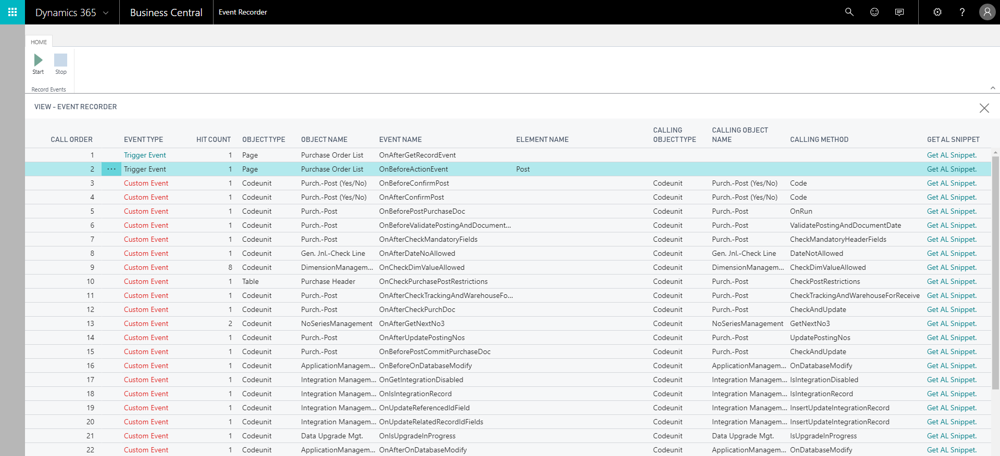

# Discoverability of Events 

You subscribe to events to extend application and interact with the base application and other extensions. This topic describes how to discover events that you can subscribe to without writing the code manually. Using the Event Recorder, you can record the events that are published and raised while performing the actions of your scenario. For example, record the events raised when you post a purchase order and identify the events that you need for your extension. You can retrieve the events in the form of AL snippet code and use them in Visual Studio Code directly. 

## Using the Event Recorder
You can launch the Event Recorder session from [!INCLUDE[d365_bus_central_md](includes/d365_bus_central_md.md)]. It can be accessed in the following two ways:

- In [!INCLUDE[d365_bus_central_md](includes/d365_bus_central_md.md)], search for **Event Recorder**.
- In Visual Studio Code, use the `Ctrl+Shift+P` keys and select the **Open Event Recorder** command to open the Event Recorder page in the [!INCLUDE[d365_bus_central_md](includes/d365_bus_central_md.md)] web client.

### How to record Events
The following steps describe how to record events when you are on the Event Recorder page.

1. To record the current session, click the **Start** button located on the actions ribbon.
2. Perform all the actions that you want to record while the Event Recorder session is on.
    For example, post a purchase order.
    > [!TIP]  
    > When the Event Recorder session is started, all the actions are recorded including the search activities. Therefore, before starting the recorder, you can open two separate windows; one, to perform the actions of your scenario; and second, to start and stop the Event Recorder session. 
3. After you have performed the actions of your scenario, navigate back to the Event Recorder page and click the **Stop** button to finish recording.  
    All the events raised while performing the actions of your scenario are recorded and can be viewed on the Event Recorder page as shown below.
    
4. Click **Get AL Snippet** to get the event subscription code in AL.
You can use the AL snippet code in Codeunits to subscribe to those events.

> [!NOTE]  
> The recorded events are not saved. When you refresh the page, the recorded events disappear.

For more information on how to subscribe to events, see [Subscribing to Events](devenv-subscribing-to-events.md).

## Recorded Events

All the recorded events display in the order they were called. The Event Recorder page provides information on the events that were raised including the details whether the raised events were trigger events or custom events. The custom events are either Business Events or Integration Events. For more information, see [Event Types](devenv-event-types.md).

You can identify the Event types, additionally, you can discover which object types and methods raised the events with the details like calling methods, object types, and object names. For more information about Events, see [Events in AL](devenv-events-in-al.md).
  
## See Also
[Events in AL](devenv-events-in-al.md)  
[Publishing Events](devenv-publishing-events.md)  
[Raising Events](devenv-raising-events.md)  
[Subscribing to Events](devenv-subscribing-to-events.md)  
[Debugging in AL](devenv-debugging.md)  
[Developing Extensions](devenv-dev-overview.md)  