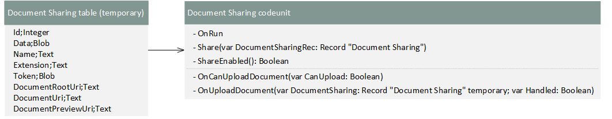
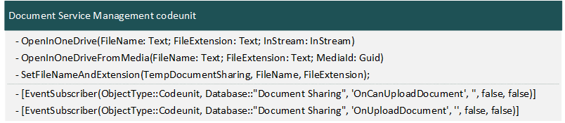

# Extending Document Sharing and OneDrive for Business Integration

Business Central developers can tap into Microsoft 365 native file viewers and file sharing capabilities. This article explains the document sharing capability. You'll learn how it's used with OneDrive for Business, and how you can extend it.

## Overview

Standard functionality in Business Central makes it easy for users to store, manage, and share files with other people through OneDrive for Business. On most pages where files are available for downloading, users will find an **Open in OneDrive** action. They'll see this action, for example, on reports in the **Report Inbox** or on files attached to records. For more information about the user experience, see [Business Central and OneDrive for Business Integration](/dynamics365/business-central/across-onedrive-overview).

In the application code, the document sharing and OneDrive capabilities are divided between the system application and the base application. The system application provides that platform working with document sharing services&mdash;the base application makes it specific to OneDrive. As an AL developer, you can use the system and base applications to extend the OneDrive capabilities. Or even target another document sharing service.

## System application

The document sharing functionality is provided by the *Document Sharing* module. This module enables document sharing flows through a valid document service, like OneDrive.

[  ](media/document-sharing-module.png)

The Document Sharing module consists of two public objects:

|Type|ID|Name|Description|
|----|----|--|-----------|
|Table|9560|Document Sharing|A temporary table that stores state information about the document to be shared, like the data BLOB, file name and type.|
|Codeunit|9560|Document Sharing|Performs the document sharing. It uses the table **9560 Document Sharing** as its source, and must be ran with a valid temporary record from the table.|

The codeunit includes the following trigger and methods:

- `OnRun()` trigger and `Share(var DocumentSharingRec: Record "Document Sharing")` procedure

   These two methods both trigger the documentation sharing flow. The difference is that `OnRun()` trigger must be invoked with a document sharing record, like `DocumentSharing.Run(TempDocumentSharing);`. The `Share(var DocumentSharingRec: Record "Document Sharing")` triggers the flow with a Document Sharing record provided.

- `ShareEnabled(): Boolean`

   The method returns true if Document Sharing is enabled. Use this method as a quick test to, for example, control visibility of a share action.

<!--The `OnRun()` method triggers the document sharing process. It must be invoked with a document sharing record, like `DocumentSharing.Run(TempDocumentSharing);`.-->

The `OnRun()` trigger and `Share(var DocumentSharingRec: Record "Document Sharing")` method raise two events when run:

- `OnCanUploadDocument(var CanUpload: Boolean)` for testing whether there are any document services that can handle the upload.

- `OnUploadDocument(var DocumentSharing: Record "Document Sharing" temporary; var Handled: Boolean)` for uploading when the document to the service.

For more information about the API, see [Document Sharing Module](https://github.com/microsoft/ALAppExtensions/blob/main/Modules/System/Document%20Sharing/README.md) in the microsoft/
ALAppExtensions repo on GitHub.

## Base application

To support integration with OneDrive for Business, the base application uses the document sharing module of the system application. Keep in mind that OneDrive itself is built on top of the SharePoint file platform. Integration with OneDrive is made available through the SharePoint service on Microsoft Azure.

> [!NOTE]
> With Business Central online the connection to the SharePoint service is done automatically. With on-premises, you have to set it up manually. For more information, see [Configuring Business Central On-premises for OneDrive Integration](/dynamics365/business-central/admin-onedrive-integration#configuring-business-central-on-premises).

The core to the base application functionality for OneDrive integration is codeunit **9510 Document Service Management**. This codeunit provides functions for storing documents to OneDrive through the SharePoint service. Some points of interest are described below.

[  ](media/document-service-mgt-cu.png)

The base application is used to specify the URL of the document to be opened in OneDrive. The document information is stored as record in the **Document Sharing** table. Documents can be stored and passed to OneDrive as either BLOB or Media data types. 

Codeunit **9510 Document Service Management** includes two procedures that run the **Document Sharing** codeunit of the system application to start the document flow:

- `OpenInOneDrive(FileName: Text; FileExtension: Text; InStream: InStream)` is used for sharing documents stored as BLOBs.
- `OpenInOneDriveFromMedia(FileName: Text; FileExtension: Text; MediaId: Guid)` is used for sharing documents stored as Media. 

These procedures call `SetFileNameAndExtension(TempDocumentSharing, FileName, FileExtension)` to set the file name and extension of the document.

The codeunit includes two event subscribers that contain the logic for passing the document to OneDrive:

- `[EventSubscriber(ObjectType::Codeunit, Database::"Document Sharing", 'OnCanUploadDocument', '', false, false)]` is called when the `OnCanUploadDocument()` event is raised by the **Document Sharing** codeunit. This subscriber is used to verify whether the document can be uploaded, otherwise the flow is stopped.

- `[EventSubscriber(ObjectType::Codeunit, Database::"Document Sharing", 'OnUploadDocument', '', false, false)]` is called when the `OnUploadDocument()` event is raised by the **Document Sharing** codeunit. This subscriber retrieves the document information and passes it to target URL.

In an extension or embed app, subscribe to these events to target different document services. If you have multiple services, provide users with a dialog that lets them choose the target.

## System and Base application interaction

The following diagram illustrates the interaction between the system and base application. The diagram has been simplified to show main points of interest.

[  ](media/onedrivesequence.png)

## Example

The following example extends the **Posted Sales Invoice** page of the base application to include an action to open a PDF version of a sales invoice in OneDrive.

```al
pageextension 50100 PostedSalesInvExt extends "Posted Sales Invoice"
{
    actions
    {
        addafter(Email)
        {
            action(OpenInOneDrive)
            {
                // The properties provide a look and feel that's consistent with the OneDrive experience in other places of the base application.
                ApplicationArea = Basic, Suite;
                Caption = 'Open in OneDrive';
                ToolTip = 'Copy the file to your Business Central folder in OneDrive and open it in a new window so you can manage or share the file.', Comment = 'OneDrive should not be translated';
                Image = Cloud;
                Promoted = true;
                PromotedCategory = Category6;
                PromotedOnly = true;

                // Enables the action if connection is enabled.
                Enabled = ShareOptionsEnabled;

                trigger OnAction()
                var
                    TempBlob: Codeunit "Temp Blob";
                    DocumentServiceManagement: Codeunit "Document Service Management";
                    InStr: InStream;
                begin
                    GetInvoice(TempBlob);

                    TempBlob.CreateInStream(InStr);

                    // Helper to invoke document sharing flow
                    DocumentServiceManagement.OpenInOneDrive(StrSubstNo(SalesInvoiceName, Rec."No."), '.pdf', InStr);
                end;
            }
        }
    }

    var
        ShareOptionsEnabled: Boolean;
        SalesInvoiceName: Label 'Sales Invoice %1';


    trigger OnOpenPage();
    var
        DocumentSharing: Codeunit "Document Sharing";
    begin
        ShareOptionsEnabled := DocumentSharing.ShareEnabled();
    end;

    local procedure GetInvoice(var TempBlob: Codeunit "Temp Blob")
    var
        ReportSelections: Record "Report Selections";
        RecRef: RecordRef;
    begin
        RecRef.GetTable(Rec);
        RecRef.SetRecFilter();

        ReportSelections.GetPdfReportForCust(TempBlob, ReportSelections.Usage::"S.Invoice", RecRef, Rec."Sell-to Customer No.");
    end;
}
```
## FAQ

### Do I have to use the base application?

No. You can just use the system application. In this case, you'll have to create a codeunit, similar **9510 Document Service Management**, that handles the storage of documents and passing them to the online service. The codeunit should subscribe to the events raised by codeunit **9560 Document Sharing**.

<!-- 
### Can I replace OneDrive with SharePoint as the target?

Yes, programmatically.

### Can I show a dialog so the user can choose between OneDrive and SharePoint when they do Open in OneDrive?

Yes, programmatically.

### Can I add a second action, Open in SharePoint, that mirrors Open in OneDrive?

Yes, programmatically
-->
### Can I move files to OneDrive in the background?

No, this feature is designed for user interaction.

### Can I specify filename and folder?

Yes, when you set record on the Document Sharing temporary table. But we'll provide better support for this scenario in a later release.

<!--
### I use environments with identical company names, so that dumps files in the same folder. Can I introduce environment name in the folder structure?
-->

## See Also

[Business Central and OneDrive for Business Integration](/dynamics365/business-central/across-onedrive-overview)  
[Overview of the System Application](devenv-system-application-overview.md)  
[Extending Application Areas](devenv-extending-application-areas.md)  