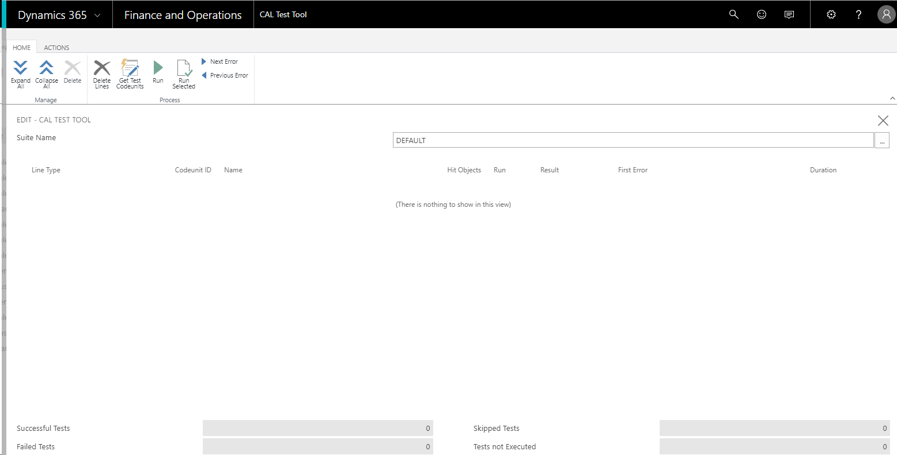
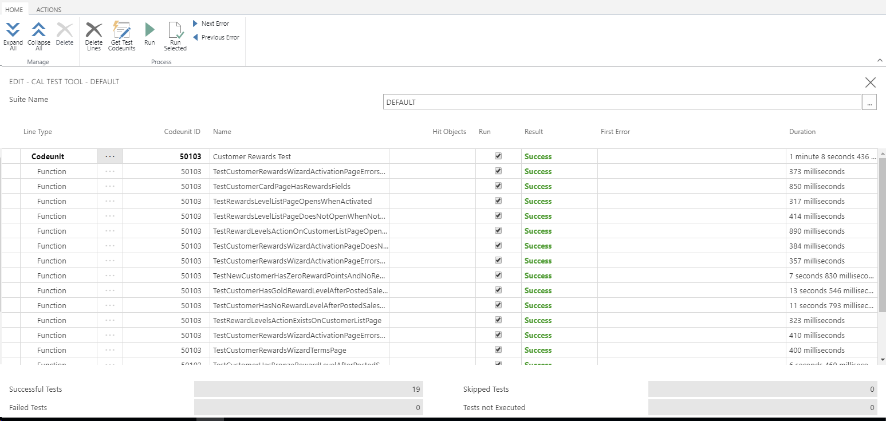

# Testing the Advanced Sample Extension
It is required to submit tests with your extension in order to pass validation. This walkthrough builds on the advanced sample extension which you can read about here [Building an Advanced Sample Extension](devenv-extension-advanced-example.md). If you are new to building extensions, we suggest that you get familiar with [Building your first sample extension that uses new objects and extension objects](devenv-extension-example.md). This walkthrough goes through how you develop the test for the sample CustomerRewards extension.

For information about submitting your app to AppSource, see [Checklist for Submitting Your App](devenv-checklist-submission.md).

## Prerequisites
To complete this walkthrough, you will need:
- Dynamics 365 Business Central Docker container-based development environment
For more information, see [Get started with the Container Sandbox Development Environment](devenv-get-started-container-sandbox.md) and [Running a Container-Based Development Environment](devenv-running-container-development.md)    
- [Visual Studio Code](https://code.visualstudio.com/Download)   
- The [[!INCLUDE[d365al_ext_md](../includes/d365al_ext_md.md)]](https://marketplace.visualstudio.com/items?itemName=ms-dynamics-smb.al) for Visual Studio Code

## Identifying the areas of the extension that need to be tested 
Before writing tests for your extension, you need to identify all the areas of the extension that need to be tested.  

- Ensure that your tests cover all the setup and usage scenario steps found in the [user scenario document](../compliance/apptest-userscenario.md). This includes Assisted Setup, pages, fields, actions, events, and other controls and objects used by your extension.  
- The CRONUS demo company will be used for the purpose of this walkthrough. If your app requires setup within the core product or any additional data, remember to include that in your tests. 
- As part of your tests, remember to include tests that verify that the extension works as expected for **a user that does not have SUPER permissions**. For more information, see [Special Permission Sets](../administration/administration-special-permission-sets.md).
- Your tests **should not make any requests to an external service**. Mock your external calls to prevent this from happening. 

In the sample test we will consider the following: 

- Logic in our **Install** codeunit. 

- **Assisted Setup - Customer Rewards Wizard** page. We will verify that the wizard behaves as expected. It can be used to completion without errors. The Assisted Setup contains code that mimics making calls to an external service or API. Because our tests cannot make requests to an external service, we will mock the requests and the responses. 

- **Reward Level** page. We will verify that the page behaves as expected when the user opens it whether Customer Rewards is activated or not. 

- **Customer List** page. We will verify that our new **Reward Levels** action exists on the page and that it behaves as expected whether the extension is activated or not. 

- **Customer Card** page. We will verify that the page has the **Reward Level** and **Reward Points** field that we added. 

- **New Customer** should have zero reward points and corresponding reward level if defined. 

- Different scenarios involving Customers and Sales Orders to verify that **Reward Points** work as expected and that reward levels for reward points work as defined by the user. 

- Each test will also verify that the extension works for a user that does not have SUPER permissions. 

## Writing the tests 
We will first create a new project (CustomerRewardsTest) for the tests. You are required to separate the CustomerRewards extension and the tests into separate projects.  

Before we can start writing the tests for the extension, we need to do the following: 

+ Specify the dependencies between the extension (CustomerRewards) and the test (CustomerRewardsTest) projects.  
Our CustomerRewardsTest project will be referencing objects from the CustomerRewards project and so we will need to specify this in the `dependencies` setting in the CustomerRewardsTest project's app.json file. The `dependencies` setting takes a list of dependencies, where each dependency specifies the `appId`, `name`, `publisher`, and `version` of the base project/package that the current project/package will depend on.  

> [!NOTE]  
> Another prerequisite is to update the app.json with a dependency to the test toolkit.

```
 {
  ...  
  "dependencies": [ 
    { 
      "appId": "c228bdcf-7112-480b-a832-da81971b6feb", 
      "name": "CustomerRewards", 
      "publisher": "Microsoft", 
      "version": "1.0.0.0" 
    } 
  ], 
  "test": "13.0.0.0"
   ...
}
```

For more information, see [JSON Files](devenv-json-files.md). 

After setting the `dependencies` value, you will be prompted to download the symbols from the base project/package if they are not present.  

## Application Test Toolkit 
We will be using the Application Test Toolkit to automate and run the tests that we write. The toolkit includes: 

- Codeunits with test functions to test various application areas. 

- Codeunits with generic and application-specific functions to reduce duplication of test code. 

- Application objects for running application tests such as the **Test Tool** page. 

In order to install the Application Test Toolkit:
1. Open the NavContainerHelper prompt found on the Desktop. You will see a list of functions that you can run on the container.
2. Run the `Import-TestToolkitToBCContainer` function with `-containerName` parameter to import the test toolkit into the application database. 

```
Import-TestToolkitToBCContainer -containerName <name-of-container> 
```

Alternatively, if you use the `New-BCContainer` function from the NavContainerHelper PowerShell module to create your containers on Docker, you can add the `-includeTestToolkit` flag. This will install the Application Test Toolkit during the creation of your container. 

Without further configuration, the Import-TestToolkitToBCContainer and New-BCContainer with -includeTestToolkit will install the framework, the libraries, and all base application tests. Both the Import-TestToolkitToBCContainer and New-BCContainer cmdlets support two additional parameters, which limits the number of apps installed:

- `-includeTestFrameworkOnly` installs the Test Framework only. This option includes the Test Runner and low-level functions such as *Any* and *Assert*.

- `-includeTestLibrariesOnly` installs the Test Framework and the Test Libraries only. Beside the Test Framework, this option includes functionality that is shared between base application tests.

## Describing your tests 
To help you design the relevant tests for your functionality, you can write scenarios that outline what you want to test, and you can write test criteria in the GIVEN-WHEN-THEN format. By adding comments based on feature, scenario, and GIVEN-WHEN-THEN, you add structure to your test code and make tests readable. 

The following sections provide an overview of the tags that we recommend you to use. 

### FEATURE Tag 

```
// [FEATURE] [<FeatureTag1>] [<FeatureTagN>]
```

`FeatureTag` represents the name of the feature, application area, functional area, or another aspect of the application. This list of tags must point to an area of your solution that is touched by the test. Order tags in descending importance. Start with the most important tags referring to the WHEN or THEN steps. The `[FEATURE]` tag can be set for the whole test codeunit. This means all tests in this codeunit will inherit the list of tags set there. If a test is supposed to have the same list of tags as the codeunit has, you do not have to add the `[FEATURE]` tag for this test. Add the tags only if the test has something specific to say. 
 
### SCENARIO Tag 

```
// [SCENARIO <ScenarioID>] <TestDescription>` 
``` 

`ScenarioID` links the test to a work item for the functionality. For example, if you use Visual Studio Online or Team Foundation Server, `[SCENARIO 12345]` represents a work item with the ID 12345. 

TestDescription represents a short description of the purpose of the test, such as *Annie can apply a deferral template to a purchase order*. 

### GIVEN-WHEN-THEN Tags 

The `GIVEN-WHEN-THEN` tags provide a framework for the specific test criteria. 

|Tag |Description|
|----|------------ |
|GIVEN |Describes one step in setting up the test. If you feel a need to add an AND, you should probably add a separate GIVEN. In most of cases, in order to run an action under test, you must prepare the database. Tests can be complex, so you can add more than one GIVEN. They can come in one block or comment particular lines of code. Do not try to repeat code and comment each line. Instead, add information of a higher level that would be valuable when reading without the test code. |
|WHEN |Describes the action under test. A test is to test one thing. There should be only one WHEN in a test. It is the line of code that changes the state of something that we are going to verify. If you feel a need to add more than one WHEN followed by different verification, you should split this test in two or more tests. |
|THEN |Describes what is verified by the test. All tests must have a verification part. If there is no verification, the test does not test anything. You can add more than one THEN tag. | 

We can now begin writing the tests for the extension. 

### MockCustomerRewardsExtMgt codeunit object 

The 50102 **MockCustomerRewardsExtMgt** codeunit contains all the code that mocks the process of validating the activation code for Customer Rewards. Because we cannot make requests to external services in the tests, we define a subscriber method **MockOnGetActivationCodeStatusFromServerSubscriber** for handling the **OnGetActivationCodeStatusFromServer** event when it is raised in the **Customer Rewards Ext. Mgt.** codeunit. The **EventSubscriberInstance** property for this codeunit is set to **Manual** so that we can control when the subscriber function is called. We want the subscriber method to be called only during our tests. We also define a Setup procedure that modifies the **Customer Rewards Ext. Mgt. Codeunit ID** in the **Customer Rewards Mgt. Setup** table so that the actual **OnGetActivationCodeStatusFromServerSubscriber** will not handle **OnGetActivationCodeStatusFromServer** event when it is raised. 

```
codeunit 50102 MockCustomerRewardsExtMgt 

{ 

    // When set to Manual subscribers in this codeunit are bound to an event by calling the BINDSUBSCRIPTION method.  
    // This enables you to control which event subscriber instances are called when an event is raised.  
    // If the BINDSUBSCRIPTION method is not called, then nothing will happen when the published event is raised. 

    EventSubscriberInstance = Manual; 
    var 
        DummyResponseTxt: Text; 
        DummySuccessResponseTxt: Label '{"ActivationResponse": "Success"}', Locked = true; 
        DummyFailureResponseTxt: Label '{"ActivationResponse": "Failure"}', Locked = true; 

    // Mocks the response text for testing success and failure scenarios 

    procedure MockActivationResponse(Success: Boolean); 
    begin 
        if Success then 
            DummyResponseTxt := DummySuccessResponseTxt 
        else 
            DummyResponseTxt := DummyFailureResponseTxt; 
    end; 

    // Modifies the default Customer Rewards Ext. Mgt codeunit to this codeunit to prevent the  
    // OnGetActivationCodeStatusFromServerSubscriber in Customer Rewards Ext. Mgt from handling 
    // the OnGetActivationCodeStatusFromServer event when it is raised  

    procedure Setup(); 
    var 
        CustomerRewardsExtMgtSetup: Record "Customer Rewards Mgt. Setup"; 
    begin 
        CustomerRewardsExtMgtSetup.Get; 
        CustomerRewardsExtMgtSetup."Customer Rewards Ext. Mgt. Codeunit ID" := Codeunit::MockCustomerRewardsExtMgt; 
        CustomerRewardsExtMgtSetup.Modify; 
    end; 

    // Subscribes to OnGetActivationCodeStatusFromServer event and handles it when the event is raised 

    [EventSubscriber(ObjectType::Codeunit, Codeunit::"Customer Rewards Ext. Mgt.", 'OnGetActivationCodeStatusFromServer', '', false, false)] 

    local procedure MockOnGetActivationCodeStatusFromServerSubscriber(ActivationCode: Text); 
    var 
        ActivationCodeInfo: Record "Activation Code Information"; 
        ResponseText: Text; 
        Result: JsonToken; 
        JsonRepsonse: JsonToken; 
    begin 
        if(MockGetHttpResponse(ActivationCode, ResponseText)) then begin 
            JsonRepsonse.ReadFrom(ResponseText); 

            if(JsonRepsonse.SelectToken('ActivationResponse', Result)) then begin 
                if(Result.AsValue().AsText() = 'Success') then begin 
                    if ActivationCodeInfo.FindFirst then 
                        ActivationCodeInfo.Delete; 
                        ActivationCodeInfo.Init; 
                        ActivationCodeInfo.ActivationCode := ActivationCode; 
                        ActivationCodeInfo."Date Activated" := Today; 
                        ActivationCodeInfo."Expiration Date" := CALCDATE('<1Y>', Today); 
                        ActivationCodeInfo.Insert; 
                end; 
            end; 
        end; 
    end; 

    // Mocks making calls to external service 

    local procedure MockGetHttpResponse(ActivationCode: Text; var ResponseText: Text): Boolean; 
    begin 
        if ActivationCode = '' then 
            exit(false); 

        ResponseText := DummyResponseTxt; 

        exit(true); 
    end; 
} 
```

## Customer Rewards Test codeunit object 
A test codeunit must have its **Subtype** property set to **Test** and the test methods must be decorated with the `[Test]` attribute. When a test codeunit runs, it executes the **OnRun** trigger, and then executes each test method in the codeunit. By default, each test function runs in a separate database transaction, but you can use the **TransactionModel** attribute on test methods to control the transactional behavior. The outcome of a test method is either SUCCESS or FAILURE. If any error is raised by either the code that is being tested or the test code, then the outcome is FAILURE and the error is included in the results log file. Even if the outcome of one test method is FAILURE, the next test methods are still executed. 

In addition to the Application Test Toolkit, the following features are available to help you test your extension: 

### Test pages 
Test pages mimic actual pages, but do not present any UI on a client computer. Test pages let you test the code on a page by using AL to simulate user interaction with the page. You can access the fields on a page and the properties of a page or a field by using the dot notation. You can open and close test pages, perform actions on the test page, and navigate around the test page by using AL methods. 

### UI handlers 
To create tests that can be automated, you must handle cases when user interaction is requested by code that is being tested. UI handlers run instead of the requested UI. UI handlers provide the same exit state as the UI. For example, a test method that has a ConfirmHandler handles CONFIRM method calls. If code that is being tested calls the CONFIRM method, then the ConfirmHandler method is called instead of the CONFIRM method. You write code in the ConfirmHandler method to verify that the expected question is displayed by the CONFIRM method and you write AL code to return the relevant reply. The following table describes the available UI handlers.  

|Function Type|Syntax example|Purpose|
|-------------|-------|-------|
|MessageHandler |<br>`[MessageHandler]` </br> `procedure MessageHandler(Msg : Text[1024]);`|This handler is called when a message function is invoked in the code. The parameter type, **Text**,  contains the text of the function.
|ConfirmHandler |<br>`[ConfirmHandler]` </br> `procedure ConfirmHandlerNo(Question: Text[1024]; var Reply: Boolean);`|This handler is called when a confirm function is invoked in the code. The parameter type, **Text**,  contains the text of the function and the parameter **Reply** if the response to confirm is *yes* or *no*.|
|StrMenuHandler |<br>`[StrMenuHandler]` </br> `procedure StrMenuHandler(Option: Text[1024]; var Choice: Integer; Instruction: Text[1024]);`|This handler is called when a StrMenu function is invoked in code. The parameter type, **Text**,  contains the text of the function and **Choice** is the option chosen in the StrMenu. **Options** is the list of the different option values and **Instruction** is the leading text.| |
|PageHandler |<br>`[PageHandler]` </br> `procedure MappingPageHandler(var MappingPage: TestPage 1214);`|This handler is called when a non-modal page is invoked in the code. **TestPage** is the specific page in this case.|
|ModalPageHandler |<br>`[ModalPageHandler]` </br> `procedure DevSelectedObjectPageHandler(var DevSelectedObjects: TestPage 89015);`|This handler is called when a modal page is invoked in the code. **TestPage** is the specific page in this case.||
|ReportHandler |<br>`[ReportHandler]` </br> `procedure VendorListReportHandler(var VendorList: Report 301);`|This handler is called when a report is invoked in the code. **Report** is the specific report in this case.| 
|RequestPageHandler |<br>`[RequestPageHandler]` </br> `procedure SalesInvoiceReportRequestPageHandler(var SalesInvoice: TestRequestPage 206);`|This handler is called when a report is invoked in the code.  **TestRequestPage** refers to the specific report ID.| 

You must create a specific handler for each page that you want to handle. Any unhandled UI in the test methods of the test codeunit causes a failure of the test.  

### ASSERTERROR statement 
When you test your extension, you should test that your code performs as expected under both successful and failing conditions. These are called positive and negative tests. To test how your extension performs under failing conditions, you can use the ASSERTERROR keyword. The ASSERTERROR keyword specifies that an error is expected at run time in the statement that follows the ASSERTERROR keyword. If a simple or compound statement that follows the ASSERTERROR keyword causes an error, then execution successfully continues to the next statement in the test function. If a statement that follows the ASSERTERROR keyword does not cause an error, then the ASSERTERROR statement itself fails with an error, and the test function that is running produces a FAILURE result. 

The 50103 **Customer Rewards Test** codeunit contains all the tests for the Customer Rewards extension. For each test method, we follow the following pattern: 

- Initialize and set up the conditions for the test. 

- Invoke the business logic that you want to test. 

- Validate that the business logic performed as expected. 

Let us look some of the sample tests. 

### TestOnInstallLogic Test 
This test verifies that the logic we defined in our Install codeunit works as expected. We first call a helper method **Initialize** which initializes and cleans up any objects that will be needed for the test. The Initialize method also binds our mock codeunit **MockCustomerRewardsExtMgt** to our test codeunit so that any events raised during our test can be handled by the subscriber methods specified in our mock codeunit. 

Next, we invoke the **SetDefaultCustomerRewardsExtMgtCodeunit** method, which is the method defined in our Install codeunit. 

And finally, we verify using the **Assert** codeunit from the Application Test Toolkit, that the **Customer Rewards Mgt. Setup** table contains the expected codeunit ID. 

### TestCustomerRewardsWizardActivationPageErrorsWhenInvalidActivationCodeEntered Test 
This is one of the tests that focus on the **Customer Rewards Assisted Setup Guide**. The test verifies that an error message is displayed when a not valid activation code is entered in the wizard.  

First, **Initialize** is called to clean up previous state and bind our mock subscriber methods to the test codeunit. Additionally, we set our MockActivationResponse to return FAILURE since we are mocking a not valid validation of the activation code. We also use the **Library - Lower Permissions** codeunit to restrict the users permission to one that does not have the SUPER permission.   

Next, we open the **Customer Rewards Wizard** by using a Customer Rewards Wizard, the TestPage object is used to mimic the actual page. On the page, the activation code is entered and then the Activate action is invoked.

And finally, we verify that an error message is displayed because the validation of the activation code failed. If no other error is reported then we are also able to conclude that the functionality in this test can be run without the need for a SUPER permission.  

### TestRewardLevelsActionExistsOnCustomerListPage Test 
This test verifies that the new **Reward Levels** action exists on the Customer List page. 

### TestCustomerHasBronzeRewardLevelAfterPostedSalesOrders Test 
This is one of the tests that considers the interaction between Customers, Sales Orders, and Reward Levels. This test verifies that when two sales orders are made for a new customer, that customer accrues two reward points. Consequently, he attains the corresponding reward level for two points, which is the BRONZE reward level. 

First, the test is initialized by calling Initialize. The extension is activated and then a BRONZE reward level for two points or more is set up in the **Reward Level** table. 

Next, a new **Customer** is created using the **LibrarySales** codeunit from the Application Test Toolkit. And then, the **LibrarySales** codeunit is used again to create and post two sales orders for the previously created customer. 

Finally, to verify that the customer got the correct reward points and level, we open the **Customer Card** using its corresponding TestPage and then verify the values in the **Reward Points** and **Reward Level** fields. 

There are many more areas that we look at in the sample test. See the full codeunit below for the rest of the tests. 

```
codeunit 50103 "Customer Rewards Test" 

{ 
    // [FEATURE] [Customer Rewards] 

    Subtype = Test; 
    TestPermissions = Disabled; 

    var 
        Assert: Codeunit Assert; 
        LibraryLowerPermissions: Codeunit "Library - Lower Permissions"; 
        LibrarySales: Codeunit "Library - Sales"; 
        MockCustomerRewardsExtMgt: Codeunit MockCustomerRewardsExtMgt; 
        ActivatedTxt: Label 'Customer Rewards should be activated'; 
        NotActivatedTxt: Label 'Customer Rewards should not be activated'; 
        BronzeLevelTxt: Label 'BRONZE'; 
        SilverLevelTxt: Label 'SILVER'; 
        GoldLevelTxt: Label 'GOLD'; 
        NoLevelTxt: Label 'NONE'; 

    [Test] 

    procedure TestOnInstallLogic(); 
    var 
        CustomerRewardsExtMgtSetup: Record "Customer Rewards Mgt. Setup"; 
        CustomerRewardsInstallLogic: Codeunit "Customer Rewards Install Logic"; 

    begin 
        // [Scenario] Check default codeunit is specified for handling events on install 
        // [Given] Customer Rewards Mgt. Setup table 

        Initialize; 

        // [When] Install logic is run 
        CustomerRewardsInstallLogic.SetDefaultCustomerRewardsExtMgtCodeunit; 

        // [Then] Default Customer Rewards Ext. Mgt codeunit is specified 
        Assert.AreEqual(1, CustomerRewardsExtMgtSetup.Count, 'CustomerRewardsExtMgtSetup must have exactly one record.'); 

        CustomerRewardsExtMgtSetup.Get; 

        Assert.AreEqual(Codeunit::"Customer Rewards Ext. Mgt.", CustomerRewardsExtMgtSetup."Customer Rewards Ext. Mgt. Codeunit ID", 'Codeunit does not match default'); 

    end; 

    [Test] 

    procedure TestCustomerRewardsWizardTermsPage(); 
    var 
        CustomerRewardsWizardTestPage: TestPage "Customer Rewards Wizard"; 

    begin 
        // [Scenario] Check Terms Page on Wizard 
        // [Given] The Customer Rewards Wizard 
        Initialize; 

        // Using permissions that do not include SUPER 
        LibraryLowerPermissions.SetO365BusFull; 

        // [When] The Wizard is opnened 
        CustomerRewardsWizardTestPage.OpenView; 

        // [Then] The terms page and fields behave as expected 
        Assert.IsFalse(CustomerRewardsWizardTestPage.EnableFeature.AsBoolean, 'Enable feature should be unchecked'); 
        Assert.IsFalse(CustomerRewardsWizardTestPage.ActionNext.Visible, 'Next should not be visible'); 
        Assert.IsFalse(CustomerRewardsWizardTestPage.ActionBack.Visible, 'Back should not be visible'); 
        Assert.IsFalse(CustomerRewardsWizardTestPage.ActionFinish.Enabled, 'Finish should be disabled'); 

        CustomerRewardsWizardTestPage.EnableFeature.SetValue(true); 

        Assert.IsTrue(CustomerRewardsWizardTestPage.EnableFeature.AsBoolean, 'Enable feature should be checked'); 
        Assert.IsTrue(CustomerRewardsWizardTestPage.ActionNext.Visible, 'Next should be visible'); 
        Assert.IsFalse(CustomerRewardsWizardTestPage.ActionFinish.Enabled, 'Finish should be disabled'); 

        CustomerRewardsWizardTestPage.Close; 
    end; 

    [Test] 
    procedure TestCustomerRewardsWizardActivationPageErrorsWhenNoActivationCodeEntered(); 
    var 
        CustomerRewardsExtMgt: Codeunit "Customer Rewards Ext. Mgt."; 
        CustomerRewardsWizardTestPage: TestPage "Customer Rewards Wizard"; 

    begin 
        // [Scenario] Error message when user tries to activate Customer Rewards without activation code. 
        // [Given] The Customer Rewards Wizard 
        Initialize; 
        Commit; 

        // Using permissions that do not include SUPER 
        LibraryLowerPermissions.SetO365BusFull; 
        Assert.IsFalse(CustomerRewardsExtMgt.IsCustomerRewardsActivated, NotActivatedTxt); 

        // [When] User invokes activate action without entering activation code 
        OpenCustomerRewardsWizardActivationPage(CustomerRewardsWizardTestPage); 
        Assert.IsTrue(CustomerRewardsWizardTestPage.ActionBack.Visible, 'Back should be visible'); 
        Assert.IsFalse(CustomerRewardsWizardTestPage.ActionFinish.Enabled, 'Finish should be disabled'); 

        // [Then] Error message displayed 
        asserterror CustomerRewardsWizardTestPage.ActionActivate.Invoke; 
        Assert.AreEqual(GETLASTERRORTEXT, 'Activation code cannot be blank.', 'Invalid error message.'); 
        Assert.IsFalse(CustomerRewardsExtMgt.IsCustomerRewardsActivated, NotActivatedTxt); 
    end; 

    [Test] 
    procedure TestCustomerRewardsWizardActivationPageErrorsWhenShorterActivationCodeEntered(); 
    var 
        CustomerRewardsExtMgt: Codeunit "Customer Rewards Ext. Mgt."; 
        CustomerRewardsWizardTestPage: TestPage "Customer Rewards Wizard"; 

    begin 
        // [Scenario] Error message when user tries to activate Customer Rewards with short activation code. 
        // [Given] The Customer Rewards Wizard 
        Initialize; 
        Commit; 

        // Using permissions that do not include SUPER 
        LibraryLowerPermissions.SetO365BusFull; 
        Assert.IsFalse(CustomerRewardsExtMgt.IsCustomerRewardsActivated, NotActivatedTxt); 

        // [When] User invokes activate action after entering short activation code 
        OpenCustomerRewardsWizardActivationPage(CustomerRewardsWizardTestPage); 
        CustomerRewardsWizardTestPage.Activationcode.SetValue('123456'); 

        // [Then] Error message displayed 
        asserterror CustomerRewardsWizardTestPage.ActionActivate.Invoke; 
        Assert.AreEqual(GETLASTERRORTEXT, 'Activation code must have 14 digits.', 'Invalid error message.'); 
        Assert.IsFalse(CustomerRewardsExtMgt.IsCustomerRewardsActivated, NotActivatedTxt); 
    end; 

    [Test] 
    procedure TestCustomerRewardsWizardActivationPageErrorsWhenLongerActivationCodeEntered(); 
    var 
        CustomerRewardsExtMgt: Codeunit "Customer Rewards Ext. Mgt."; 
        CustomerRewardsWizardTestPage: TestPage "Customer Rewards Wizard"; 

    begin 
        // [Scenario] Error message when user tries to activate Customer Rewards with long activation code. 
        // [Given] The Customer Rewards Wizard 
        Initialize; 
        Commit; 

        // Using permissions that do not include SUPER 
        LibraryLowerPermissions.SetO365BusFull; 
        Assert.IsFalse(CustomerRewardsExtMgt.IsCustomerRewardsActivated, NotActivatedTxt); 

        // [When] User invokes activate action after entering long activation code 
        OpenCustomerRewardsWizardActivationPage(CustomerRewardsWizardTestPage); 
        CustomerRewardsWizardTestPage.Activationcode.SetValue('123456789012345'); 

        // [Then] Error message displayed 
        asserterror CustomerRewardsWizardTestPage.ActionActivate.Invoke; 
        Assert.AreEqual(GETLASTERRORTEXT, 'Activation code must have 14 digits.', 'Invalid error message.'); 
        Assert.IsFalse(CustomerRewardsExtMgt.IsCustomerRewardsActivated, NotActivatedTxt); 
    end; 

    [Test] 
    procedure TestCustomerRewardsWizardActivationPageErrorsWhenInvalidActivationCodeEntered(); 
    var 
        CustomerRewardsExtMgt: Codeunit "Customer Rewards Ext. Mgt."; 
        CustomerRewardsWizardTestPage: TestPage "Customer Rewards Wizard"; 

    begin 
        // [Scenario] Error message when user tries to activate Customer Rewards with invalid activation code. 
        // [Given] The Customer Rewards Wizard 
        Initialize; 
        Commit; 

        // Using permissions that do not include SUPER 
        LibraryLowerPermissions.SetO365BusFull; 
        Assert.IsFalse(CustomerRewardsExtMgt.IsCustomerRewardsActivated, NotActivatedTxt); 
        MockCustomerRewardsExtMgt.MockActivationResponse(false); 

        // [When] User invokes activate action after entering invalid but correct length activation code 
        OpenCustomerRewardsWizardActivationPage(CustomerRewardsWizardTestPage); 
        CustomerRewardsWizardTestPage.Activationcode.SetValue('12345678901234'); 

        // [Then] Error message displayed 
        asserterror CustomerRewardsWizardTestPage.ActionActivate.Invoke; 
        Assert.AreEqual(GETLASTERRORTEXT, 'Activation failed. Please check the activtion code you entered.', 'Invalid error message.'); 
        Assert.IsFalse(CustomerRewardsExtMgt.IsCustomerRewardsActivated, NotActivatedTxt); 
    end; 

    [Test] 
    procedure TestCustomerRewardsWizardActivationPageDoesNotErrorWhenValidActivationCodeEntered(); 
    var 
        CustomerRewardsExtMgt: Codeunit "Customer Rewards Ext. Mgt."; 
        CustomerRewardsWizardTestPage: TestPage "Customer Rewards Wizard"; 

    begin 
        // [Scenario] Customer Rewards is activated when user enters valid activation code. 
        // [Given] The Customer Rewards Wizard 
        Initialize; 
        Commit; 

        // Using permissions that do not include SUPER 
        LibraryLowerPermissions.SetO365BusFull; 
        Assert.IsFalse(CustomerRewardsExtMgt.IsCustomerRewardsActivated, NotActivatedTxt); 
        MockCustomerRewardsExtMgt.MockActivationResponse(true); 

        // [When] User invokes activate action after entering valid activation code 
        OpenCustomerRewardsWizardActivationPage(CustomerRewardsWizardTestPage); 
        CustomerRewardsWizardTestPage.Activationcode.SetValue('12345678901234'); 
        CustomerRewardsWizardTestPage.ActionActivate.Invoke; 
        CustomerRewardsWizardTestPage.Close; 

        // [Then] Customer Rewards is activated 
        Assert.IsTrue(CustomerRewardsExtMgt.IsCustomerRewardsActivated, ActivatedTxt); 
    end; 

    [Test] 
    procedure TestRewardsLevelListPageDoesNotOpenWhenNotActivated(); 
    var 
        CustomerRewardsExtMgt: Codeunit "Customer Rewards Ext. Mgt."; 
        RewardLevelListTestPage: TestPage "Rewards Level List"; 

    begin 
        // [Scenario] Error opening Reward Level Page when Customer Rewards is not activated 
        // [Given] Unactivated Customer Rewards  
        Initialize; 
        Commit; 

        // Using permissions that do not include SUPER 
        LibraryLowerPermissions.SetO365BusFull; 
        Assert.IsFalse(CustomerRewardsExtMgt.IsCustomerRewardsActivated, NotActivatedTxt); 

        // [When] User opens Reward Level Page 
        // [Then] Error message      
        asserterror RewardLevelListTestPage.OpenView; 
        Assert.AreEqual(GETLASTERRORTEXT, 'Customer Rewards is not activated', 'Invalid error message.'); 
    end; 

    [Test] 
    procedure TestRewardsLevelListPageOpensWhenActivated(); 
    var 
        CustomerRewardsExtMgt: Codeunit "Customer Rewards Ext. Mgt."; 
        RewardLevelListTestPage: TestPage "Rewards Level List"; 

    begin 
        // [Scenario] Reward Level Page opens when Customer Rewards is activated 
        // [Given] Activated Customer Rewards  
        Initialize; 
        Commit; 

        // Using permissions that do not include SUPER 
        LibraryLowerPermissions.SetO365BusFull; 
        Assert.IsFalse(CustomerRewardsExtMgt.IsCustomerRewardsActivated, NotActivatedTxt); 
        ActivateCustomerRewards; 
        Assert.IsTrue(CustomerRewardsExtMgt.IsCustomerRewardsActivated, ActivatedTxt); 

        // [When] User opens Reward Level Page 
        // [Then] No error 
        RewardLevelListTestPage.OpenView; 
    end; 

    [Test] 
    procedure TestRewardLevelsActionExistsOnCustomerListPage(); 
    var 
        CustomerListTestPage: TestPage "Customer List"; 

    begin 
        // [Scenario] Reward Level action exists on customer list page 
        // [Given] Customer List Page  

        CustomerListTestPage.OpenView; 

        // Using permissions that do not include SUPER 
        LibraryLowerPermissions.SetO365BusFull; 

        // [Then] Reward levels action exists on custome list page 
        Assert.IsTrue(CustomerListTestPage."Reward Levels".Visible, 'Reward Levels action should be visible'); 
    end; 

    [Test] 

    [HandlerFunctions('CustomerRewardsWizardModalPageHandler')] 

    procedure TestRewardLevelsActionOnCustomerListPageOpensCustomerRewardsWizardWhenNotActivated(); 
    var 
        CustomerRewardsExtMgt: Codeunit "Customer Rewards Ext. Mgt."; 
        CustomerListTestPage: TestPage "Customer List"; 

    begin 
        // [Scenario] Reward Levels Action Opens Customer Rewards Wizard When Not Activated 
        // [Given] Unactivated Customer Rewards 
        Initialize; 
        Commit; 

        // Using permissions that do not include SUPER 
        LibraryLowerPermissions.SetO365BusFull; 
        Assert.IsFalse(CustomerRewardsExtMgt.IsCustomerRewardsActivated, NotActivatedTxt); 

        // [When] User opens Customer List page and invokes action 
        CustomerListTestPage.OpenView; 
        CustomerListTestPage."Reward Levels".Invoke; 

        // [Then] Wizard opens. Caught by CustomerRewardsWizardModalPageHandler 
    end; 

    [Test] 

    [HandlerFunctions('RewardsLevelListlPageHandler')] 
    procedure TestRewardLevelsActionOnCustomerListPageOpensRewardsLevelListPageWhenActivated(); 
    var 
        CustomerRewardsExtMgt: Codeunit "Customer Rewards Ext. Mgt."; 
        CustomerListTestPage: TestPage "Customer List"; 

    begin 
        // [Scenario] Reward Levels Action Opens Reward Level Page When Activated 
        // [Given] Activated Customer Rewards 
        Initialize; 
        Commit; 

        // Using permissions that do not include SUPER 
        LibraryLowerPermissions.SetO365BusFull; 
        Assert.IsFalse(CustomerRewardsExtMgt.IsCustomerRewardsActivated, NotActivatedTxt); 
        ActivateCustomerRewards; 
        Assert.IsTrue(CustomerRewardsExtMgt.IsCustomerRewardsActivated, ActivatedTxt); 

        // [When] User opens Customer List page and invokes action 
        CustomerListTestPage.OpenView; 
        CustomerListTestPage."Reward Levels".Invoke; 

        // [Then] Wizard opens. Caught by RewardsLevelListlPageHandler 
    end; 

    [Test] 
    procedure TestCustomerCardPageHasRewardsFields(); 
    var 
        CustomerRewardsExtMgt: Codeunit "Customer Rewards Ext. Mgt."; 
        CustomerCardTestPage: TestPage "Customer Card"; 

    begin 
        // [Scenario] Customer Card Page Has Reward Fields When Opened 
        // [Given] Customer Card Page 

        // Using permissions that do not include SUPER 
        LibraryLowerPermissions.SetO365BusFull; 

        // [When] Customer card page is opened 
        CustomerCardTestPage.OpenView; 

        // [Then] Reward fields are exist 
        Assert.IsTrue(CustomerCardTestPage.RewardLevel.Visible, 'Reward Level should be visible'); 
        Assert.IsFalse(CustomerCardTestPage.RewardLevel.Editable, 'Reward Level should not be editable'); 
        Assert.IsTrue(CustomerCardTestPage.RewardPoints.Visible, 'Reward Points should be visible'); 
        Assert.IsFalse(CustomerCardTestPage.RewardPoints.Editable, 'Reward Points should not be editable'); 
    end; 

    [Test] 
    procedure TestNewCustomerHasZeroRewardPointsAndNoRewardLevel(); 
    var 
        Customer: Record Customer; 
        CustomerRewardsExtMgt: Codeunit "Customer Rewards Ext. Mgt."; 
        CustomerCardTestPage: TestPage "Customer Card"; 

    begin 
        // [Scenario] A new customer Has Zero Reward Points And No Reward Level 
        // [Given] Activated Customer Rewards 
        Initialize; 
        Commit; 

        // Using permissions that do not include SUPER 
        LibraryLowerPermissions.SetO365BusFull; 
        ActivateCustomerRewards; 
 
        // [When] New Customer 
        LibrarySales.CreateCustomer(Customer); 
        CustomerCardTestPage.OpenView; 
        CustomerCardTestPage.GoToRecord(Customer); 
 
        // [Then] No Reward level 
        VerifyCustomerRewardLevel(CustomerCardTestPage.RewardLevel.Value, NoLevelTxt); 

        // [Then] Reward Point is zero 
        VerifyCustomerRewardPoints(CustomerCardTestPage.RewardPoints.AsInteger, 0); 
    end; 

    [Test] 
    procedure TestCustomerHasCorrectRewardPointsAfterPostedSalesOrders(); 
    var 
        Customer: Record Customer; 
        CustomerRewardsExtMgt: Codeunit "Customer Rewards Ext. Mgt."; 
        CustomerCardTestPage: TestPage "Customer Card"; 

    begin 
        // [Scenario] Customer Has Correct Reward Points After 4 Posted Sales Orders 
        // [Given] Activated Customer Rewards and Customer         
        Initialize; 
        Commit; 

        // Using permissions that do not include SUPER 
        LibraryLowerPermissions.SetO365BusFull; 
        ActivateCustomerRewards; 

        // New Customer 
        LibrarySales.CreateCustomer(Customer); 

        // [When] 4 Sales Orders 
        CreateAndPostSalesOrder(Customer."No."); 
        CreateAndPostSalesOrder(Customer."No."); 
        CreateAndPostSalesOrder(Customer."No."); 
        CreateAndPostSalesOrder(Customer."No."); 

        // [Then] Customer has 4 reward points 
        CustomerCardTestPage.OpenView; 
        CustomerCardTestPage.GoToRecord(Customer); 
        VerifyCustomerRewardPoints(CustomerCardTestPage.RewardPoints.AsInteger, 4); 
    end; 

    [Test] 
    procedure TestCustomerHasNoRewardLevelAfterPostedSalesOrders(); 
    var 
        Customer: Record Customer; 
        CustomerRewardsExtMgt: Codeunit "Customer Rewards Ext. Mgt."; 
        CustomerCardTestPage: TestPage "Customer Card"; 

    begin 
        // [Scenario] Customer Has 1 Reward Point and No Reward Level After 1 Posted Sales Orders 
        // [Scenario] Because Lowest Level requires at least 2 points 
        // [Given] Activated Customer Rewards,  Customer, Bronze level for 2 points and above 
        Initialize; 
        Commit; 

        // Using permissions that do not include SUPER 
        LibraryLowerPermissions.SetO365BusFull; 
        ActivateCustomerRewards; 
        AddRewardLevel(BronzeLevelTxt, 2); // 2 points required for BRONZE level 
 
        // New Customer 
        LibrarySales.CreateCustomer(Customer); 
        CustomerCardTestPage.OpenView; 
        CustomerCardTestPage.GoToRecord(Customer); 

        // Verify 0 points and no reward level before sales order 
        VerifyCustomerRewardPoints(CustomerCardTestPage.RewardPoints.AsInteger, 0); 
        VerifyCustomerRewardLevel(CustomerCardTestPage.RewardLevel.Value, NoLevelTxt); 

        // [When] 1 Sales Order 
        CreateAndPostSalesOrder(Customer."No."); 
 
        // [Then] Customer has 1 points and no reward level after sales order 
        CustomerCardTestPage.GoToRecord(Customer); 
        VerifyCustomerRewardPoints(CustomerCardTestPage.RewardPoints.AsInteger, 1); 
        VerifyCustomerRewardLevel(CustomerCardTestPage.RewardLevel.Value, NoLevelTxt); 
    end; 

    [Test] 
    procedure TestCustomerHasBronzeRewardLevelAfterPostedSalesOrders(); 
    var 
        Customer: Record Customer; 
        CustomerRewardsExtMgt: Codeunit "Customer Rewards Ext. Mgt."; 
        CustomerCardTestPage: TestPage "Customer Card"; 

    begin 
        // [Scenario] Customer Has 2 Reward Points and Bronze Reward Level After 2 Posted Sales Orders 
        // [Scenario] Because Bronze Level requires at least 2 points 
        // [Given] Activated Customer Rewards,  Customer, Bronze level for 2 points and above 
        Initialize; 
        Commit; 

        // Using permissions that do not include SUPER 
        LibraryLowerPermissions.SetO365BusFull; 
        ActivateCustomerRewards; 
        AddRewardLevel(BronzeLevelTxt, 2); // 2 points required for BRONZE level 

        // New Customer 
        LibrarySales.CreateCustomer(Customer); 

        // [When] 2 Sales Order 
        CreateAndPostSalesOrder(Customer."No."); 
        CreateAndPostSalesOrder(Customer."No."); 

        // [Then] Customer has 2 points and bronze reward level  
        CustomerCardTestPage.OpenView; 
        CustomerCardTestPage.GoToRecord(Customer); 
        VerifyCustomerRewardPoints(CustomerCardTestPage.RewardPoints.AsInteger, 2); 
        VerifyCustomerRewardLevel(CustomerCardTestPage.RewardLevel.Value, BronzeLevelTxt); 
    end; 

    [Test] 
    procedure TestCustomerHasSilverRewardLevelAfterPostedSalesOrders(); 
    var 
        Customer: Record Customer; 
        CustomerRewardsExtMgt: Codeunit "Customer Rewards Ext. Mgt."; 
        CustomerCardTestPage: TestPage "Customer Card"; 

    begin 
        // [Scenario] Customer Has 3 Reward Points and Silver Reward Level After 3 Posted Sales Orders 
        // [Scenario] Because Silver Level requires at least 3 points 
        // [Given] Activated Customer Rewards,  Customer, Bronze level from 2 points, Silver level from 3 points 
        Initialize; 
        Commit; 

        // Using permissions that do not include SUPER 
        LibraryLowerPermissions.SetO365BusFull; 
        ActivateCustomerRewards; 
        AddRewardLevel(BronzeLevelTxt, 2); // 2 points required for BRONZE level 
        AddRewardLevel(SilverLevelTxt, 3); // 3 points required for SILVER level 

        // New Customer 
        LibrarySales.CreateCustomer(Customer); 

        // 2 Sales Order 
        CreateAndPostSalesOrder(Customer."No."); 
        CreateAndPostSalesOrder(Customer."No."); 

        // Verify 2 points and bronze reward level  
        CustomerCardTestPage.OpenView; 
        CustomerCardTestPage.GoToRecord(Customer); 
        VerifyCustomerRewardPoints(CustomerCardTestPage.RewardPoints.AsInteger, 2); 
        VerifyCustomerRewardLevel(CustomerCardTestPage.RewardLevel.Value, BronzeLevelTxt); 

        // [When] 3rd Sales Order 
        CreateAndPostSalesOrder(Customer."No."); 

        // [Then] Customer has 3 points and silver reward level  
        CustomerCardTestPage.GoToRecord(Customer); 
        VerifyCustomerRewardPoints(CustomerCardTestPage.RewardPoints.AsInteger, 3); 
        VerifyCustomerRewardLevel(CustomerCardTestPage.RewardLevel.Value, SilverLevelTxt); 
    end; 

    [Test] 
    procedure TestCustomerHasGoldRewardLevelAfterPostedSalesOrders(); 
    var 
        Customer: Record Customer; 
        CustomerRewardsExtMgt: Codeunit "Customer Rewards Ext. Mgt."; 
        CustomerCardTestPage: TestPage "Customer Card"; 

    begin 
        // [Scenario] Customer Has 4 Reward Points and Gold Reward Level After 4 Posted Sales Orders 
        // [Scenario] Because Gold Level requires at least 4 points 
        // [Given] Activated Customer Rewards,  Customer 
        // [Given] Bronze level from 2 points, Silver level from 3 points, Gold level from 4 points       
        Initialize; 
        Commit; 

        // Using permissions that do not inlcude SUPER 
        LibraryLowerPermissions.SetO365BusFull; 
        ActivateCustomerRewards; 
        AddRewardLevel(BronzeLevelTxt, 2); // 2 points required for BRONZE level 
        AddRewardLevel(SilverLevelTxt, 3); // 3 points required for SILVER level 
        AddRewardLevel(GoldLevelTxt, 4); // 4 points required for GOLD level 

        // New Customer 
        LibrarySales.CreateCustomer(Customer); 
 
        // 3 Sales Order 
        CreateAndPostSalesOrder(Customer."No."); 
        CreateAndPostSalesOrder(Customer."No."); 
        CreateAndPostSalesOrder(Customer."No."); 
 
        // Verify 3 points and silver reward level  
        CustomerCardTestPage.OpenView; 
        CustomerCardTestPage.GoToRecord(Customer); 
        VerifyCustomerRewardPoints(CustomerCardTestPage.RewardPoints.AsInteger, 3); 
        VerifyCustomerRewardLevel(CustomerCardTestPage.RewardLevel.Value, SilverLevelTxt); 
 
        // [When] 4th Sales Order 
        CreateAndPostSalesOrder(Customer."No."); 

        // [Then] Customer has 4 points and gold reward level  
        CustomerCardTestPage.GoToRecord(Customer); 
        VerifyCustomerRewardPoints(CustomerCardTestPage.RewardPoints.AsInteger, 4); 
        VerifyCustomerRewardLevel(CustomerCardTestPage.RewardLevel.Value, GoldLevelTxt); 
    end; 

    local procedure OpenCustomerRewardsWizardActivationPage(VAR CustomerRewardsWizardTestPage: TestPage "Customer Rewards Wizard"); 
    begin 
        CustomerRewardsWizardTestPage.OpenView; 
        CustomerRewardsWizardTestPage.EnableFeature.SetValue(true); 
        CustomerRewardsWizardTestPage.ActionNext.Invoke; 
    end; 

    local procedure Initialize(); 
    var 
        ActivationCodeInfo: Record "Activation Code Information"; 
        RewardLevel: Record "Reward Level"; 
        Customer: Record Customer; 

    begin 
        Customer.ModifyAll(RewardPoints, 0); 
        ActivationCodeInfo.DeleteAll; 
        RewardLevel.DeleteAll; 
        UnbindSubscription(MockCustomerRewardsExtMgt); 
        BindSubscription(MockCustomerRewardsExtMgt); 
        MockCustomerRewardsExtMgt.Setup; 
    end; 

    local procedure ActivateCustomerRewards(); 
    var 
        ActivationCodeInfo: Record "Activation Code Information"; 

    begin 
        ActivationCodeInfo.Init; 
        ActivationCodeInfo.ActivationCode := '12345678901234'; 
        ActivationCodeInfo."Date Activated" := Today; 
        ActivationCodeInfo."Expiration Date" := CALCDATE('<1Y>', Today); 
        ActivationCodeInfo.Insert; 
    end; 

    local procedure CreateAndPostSalesOrder(SellToCustomerNo: Code[20]); 
    var 
        SalesHeader: Record "Sales Header"; 
        SalesLine: Record "Sales Line"; 
        LibraryRandom: Codeunit "Library - Random"; 
        SalesOrderTestPage: TestPage "Sales Order"; 

    begin 
        LibrarySales.CreateSalesHeader(SalesHeader, SalesHeader."Document Type"::Order, SellToCustomerNo); 
        LibrarySales.CreateSalesLine(SalesLine, SalesHeader, SalesLine.Type::Item, '', 1); 
        SalesLine.VALIDATE("Unit Price", LibraryRandom.RandIntInRange(5000, 10000)); 
        SalesLine.MODIFY(TRUE); 
        LibrarySales.PostSalesDocument(SalesHeader, true, true); 
    end; 

    local procedure AddRewardLevel(Level: Text; MinPoints: Integer); 
    var 
        RewardLevel: Record "Reward Level"; 

    begin 
        if RewardLevel.Get(Level) then begin 
            RewardLevel."Minimum Reward Points" := MinPoints; 
            RewardLevel.Modify; 
        end else begin 
            RewardLevel.Init; 
            RewardLevel.Level := Level; 
            RewardLevel."Minimum Reward Points" := MinPoints; 
            RewardLevel.Insert; 
        end; 
    end; 

    local procedure VerifyCustomerRewardLevel(ExpectedLevel: Text; ActualLevel: Text); 
    begin 
        Assert.AreEqual(ExpectedLevel, ActualLevel, 'Reward Level should be the same.'); 
    end; 
 
    local procedure VerifyCustomerRewardPoints(ExpectedPoints: Integer; ActualPoints: Integer); 
    begin 
        Assert.AreEqual(ExpectedPoints, ActualPoints, 'Reward Points should be the same.'); 
    end; 

    [ModalPageHandler] 
    procedure CustomerRewardsWizardModalPageHandler(var CustomerRewardsWizard: TestPage "Customer Rewards Wizard"); 
    begin 
    end; 

    [PageHandler] 
    procedure RewardsLevelListlPageHandler(var RewardsLevelList: TestPage "Rewards Level List"); 
    begin 
    end; 
} 

``` 

At this point you can publish and run your tests on your tenant by pressing Ctrl+F5. 

## Run the tests 
In order to run the tests, follow the steps below.

1. Open the **Test Tool** page (130401). 
  
2. Choose **Get Test Codeunits** and then choose **Select Test Codeunits**. 
3. Select your test codeunits and then choose the **OK** button.

You can now see all the test methods from your test codeunits. 

4. Now, choose **Run** or **Run Selected** to run all the tests in the test codeunit or only the selected tests. The **Result** column indicates whether a test was a SUCCESS or FAILURE. A summary is also presented at the bottom of the page. 


## Failing Tests 
Let us look at what to do if you have a failing test. To create a failing test, we will modify the **SetDefaultCustomerRewardsExtMgtCodeunit** method in codeunit 50100 **Customer Rewards Install Logic** to the following: 

``` 
procedure SetDefaultCustomerRewardsExtMgtCodeunit(); 
    var 
        CustomerRewardsExtMgtSetup: Record "Customer Rewards Mgt. Setup"; 

    begin 
        CustomerRewardsExtMgtSetup.DeleteAll; 
        CustomerRewardsExtMgtSetup.Init; 
        // Default Customer Rewards Ext. Mgt codeunit to use for handling events  
        // Changing 
        // CustomerRewardsExtMgtSetup."Customer Rewards Ext. Mgt. Codeunit ID" := Codeunit::"Customer Rewards Ext. Mgt.";
        // To
        CustomerRewardsExtMgtSetup."Customer Rewards Ext. Mgt. Codeunit ID" := 0; 
        CustomerRewardsExtMgtSetup.Insert; 
    end; 
``` 
Now, anytime the **SetDefaultCustomerRewardsExtMgtCodeunit** method in the install codeunit is run, the **Customer Rewards Ext. Mgt. Codeunit ID** in the **Customer Rewards Mgt. Setup** table will be set to 0. 

Press Ctrl+F5 to publish the updated tests to your tenant and then run them.


The test TestOnInstallLogic should now have a Failure result with the error message:  
```
"Assert.AreEqual failed. Expected:<50101> (Integer). Actual:<0> (Integer). Codeunit does not match default." 
```

The error message shows that the actual result in one of our Assert statements differed from what was expected. According to the error message, the Assert statement was expecting a value of 50101 but actually got a value of 0. We can also tell where in our code this is happening because of the message; "Codeunit does not match default", which we defined earlier when we wrote our tests. If we had no idea where the error occurred, we can click on the error message to open the **Test Results** page and then choose the **Call Stack** action. 


Choosing the **Call Stack** action will give you a message alert that contains an ordered list of method calls up to the one that caused the error. 


The list of method calls is arranged from the most recent at the top to the oldest at the bottom. In our example, we can tell that the `Assert(CodeUnit 130000).AreEqual` (the first on the list) was the last method to be run, indicating where the error was found. Because we did not modify the Assert codeunit, then the wrong values or results must have been passed to it. The next item on the list, `"Customer Rewards Test"(CodeUnit 50103).TestOnInstallLogic_Scope_1248196953` line 35 points to the method that was run before the final one that caused the error. This time, it is in the TestOnInstallLogic method of codeunit 50103 Customer Rewards Test after line 35.  


On line 36 of codeunit 50103 **Customer Rewards Test**, we can see the Assert statement that throws the error. We tested that the result should be `Codeunit::"Customer Rewards Ext. Mgt."` which is 50101, when our install logic is run, however, the result of the test indicated that we got a result of 0. This implies that our install logic is not working as expected. To fix this, we need to examine all the previous lines of code in the method to figure out where we went wrong. This will lead us to line 31, where the **SetDefaultCustomerRewardsExtMgtCodeunit** method call is made. 


When you go into the **SetDefaultCustomerRewardsExtMgtCodeunit** method, codeunit 50100 **Customer Rewards Install Logic**, you will see the change we made to cause the test to fail. Revert it so that `CustomerRewardsExtMgtSetup."Customer Rewards Ext. Mgt. Codeunit ID"` now stores `Codeunit::"Customer Rewards Ext. Mgt."`, instead of 0. Publish the updated extension and tests to your tenant and run the tests again. The test **TestOnInstallLogic** should pass now because the actual result matches what is expected.  

### Conclusion
At this point, the Customer Rewards sample extension can be published and installed on your sandbox. 

## See Also  
[Developing Extensions](devenv-dev-overview.md)  
[Getting Started with AL](devenv-get-started.md)  
[How to: Publish and Install an Extension](devenv-how-publish-and-install-an-extension-v2.md)  
[Converting Extensions V1 to Extensions V2](devenv-upgrade-v1-to-v2-overview.md) 

