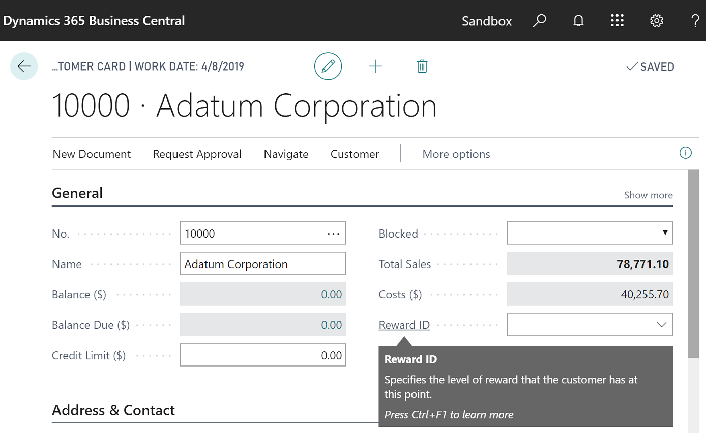

# Building Your First Sample Extension With Extension Objects, Install Code, and Upgrade Code
This walkthrough will guide you through all the steps that you must follow to create a sample extension in AL. New objects and extension objects will be added to the base application for a simple reward feature for customers. Every section of this exercise includes code that serves for installing, customizing, or upgrading this sample extension. The final result can be published and installed on your tenants.

## About this walkthrough

This walkthrough illustrates the following tasks:

- Developing a sample extension with a table, a card page, and a list page.

- Deploying the sample extension to your development sandbox environment.  

- Using the [!INCLUDE[d365fin_long_md](includes/d365fin_long_md.md)] Designer to modify visual aspects of the extension. 

- Creating extension objects that can be used to modify page and table objects.

- Initializing the database during the installation of the extension.

- Upgrading and preserving data during the upgrade of the extension.

## Prerequisites

To complete this walkthrough, you will need:

- The [!INCLUDE[d365fin_long_md](includes/d365fin_long_md.md)] tenant.

- Visual Studio Code.

- The [!INCLUDE[d365al_ext_md](../includes/d365al_ext_md.md)] for Visual Studio Code.

For more information on how to get started with your first extension for [!INCLUDE[d365fin_long_md](includes/d365fin_long_md.md)], see [Getting Started](devenv-get-started.md).

## Rewards extension overview

The extension enables the ability to assign one of three reward levels to customers: GOLD, SILVER, and BRONZE. Each reward level can be assigned a discount percentage. Different types of objects available within the AL development environment will build the foundation of the user interface, allowing the user to edit the information. If you look for another option to update the layout of a page, you can use the Designer drag-and-drop interface. Additionally, this exercise contains the install code that will create the base for the reward levels. The upgrade code is run to upgrade the extension to a newer version and it will change the BRONZE level to ALUMINUM. Following all the steps of this walkthrough allows you to publish the extension on your tenant and create a possible new feature for your customers.  

## Reward table object

The following code adds a new table **50100 Reward** for storing the reward levels for customers. The table consists of three fields: **Reward ID**, **Description**, and **Discount Percentage**. For example, the **Description** field must contain a value of type text and it cannot exceed the limit of 250 characters. The second field contains three properties that are used to set the range of the discount percentage assigned to every customer. Properties can be created for every field, depending on the scope. 

> [!TIP]
> Type `ttable` followed by the Tab key. This snippet will create a basic layout for a table object.

```AL
table 50100 Reward
{
    DataClassification = ToBeClassified;

    fields
    {
        // The "Reward ID" field represents the unique identifier 
        // of the reward and can contain up to 30 Code characters. 
        field(1;"Reward ID";Code[30])
        {
            DataClassification = ToBeClassified;
        }

        // The "Description" field can contain a string 
        // with up to 250 characters.
        field(2;Description;Text[250])
        {
            // This property specified that 
            // this field cannot be left empty.
            NotBlank = true;
        }

        // The "Discount Percentage" field is a Decimal numeric value
        // that represents the discount that will 
        // be applied for this reward.
        field(3;"Discount Percentage";Decimal)
        {
            // The "MinValue" property sets the minimum value for the "Discount Percentage" 
            // field.
            MinValue = 0;

            // The "MaxValue" property sets the maximum value for the "Discount Percentage"
            // field.
            MaxValue = 100;
            
            // The "DecimalPlaces" property is set to 2 to display discount values with  
            // exactly 2 decimals.
            DecimalPlaces = 2;
        }
    }

    keys
    {
        // The field "Reward ID" is used as the primary key of this table.
        key(PK;"Reward ID")
        {
            // Create a clustered index from this key.
            Clustered = true;
        }
    }
}
```

For more information about table properties, see [Table Properties](properties/devenv-table-properties.md).

## Reward card page object

The following code adds a new page **50101 Reward Card** for viewing and editing the different reward levels that are stored in the new **Reward** table. Pages are the primary object that a user will interact with and have a different behavior based on the type of page that you choose. The **Reward Card** page is of type Card and it is used to view and edit one record or entity from the **Reward** table. 

> [!TIP]
> Use the snippet `tpage, Page` to create the basic structure for the page object.

```AL
page 50101 "Reward Card"
{
    // The page will be of type "Card" and will render as a card.
    PageType = Card;

    // The page will be part of the "Tasks" group of search results.
    UsageCategory = Tasks;

    // The source table shows data from the "Reward" table.
    SourceTable = Reward;

    // The layout describes the visual parts on the page.
    layout
    {
        area(content)
        {
            group(Reward)
            {
                field("Reward Id";"Reward ID")
                {
                    // ApplicationArea sets the application area that 
                    // applies to the page field and action controls. 
                    // Setting the property to All means that the control 
                    // will always appear in the user interface.
                    ApplicationArea = All;
                }

                field(Description;Description)
                {
                    ApplicationArea = All;
                }

                field("Discount Percentage";"Discount Percentage")
                {
                    ApplicationArea = All;
                }
            }
        }
    }
}
```

For more information about the types of pages in AL, see [Pages Overview](devenv-pages-overview.md).

## Reward list page object

The following code adds the **50102 Reward List** page that enables users to view the contents of the **Reward** table and edit specific records by selecting them and viewing them in the **Reward Card** page. 

> [!TIP]
> Use the snippet `tpage, Page of type list` to create the basic structure for the page object. 

```AL
page 50102 "Reward List"
{
    // Specify that this page will be a list page.
    PageType = List;

    // The page will be part of the "Lists" group of search results.
    UsageCategory = Lists;

    // The data of this page is taken from the "Reward" table.
    SourceTable = Reward;

    // The "CardPageId" is set to the Reward Card previously created.
    // This will allow users to open records from the list in the "Reward Card" page.
    CardPageId = "Reward Card";

    layout
    {
        area(content)
        {
            repeater(Rewards)
            {
                field("Reward ID";"Reward ID")
                {
                    ApplicationArea = All;
                    ToolTip = 'Specifies the level of reward that the customer has at this point.';
                }

                field(Description;Description)
                {
                    ApplicationArea = All;
                }

                field("Discount Percentage";"Discount Percentage")
                {
                    ApplicationArea = All;
                }
            }
        }
    }
}
```

After you have created the objects, update the **startupObjectId** in the `launch.json` file to 50102, the ID of the **Reward List** page and select the Ctrl+F5 shortcut to see the new page in your sandbox environment. You will be asked to sign in to your [!INCLUDE [prod_short](includes/prod_short.md)], if you have not already done so.  

> [!TIP]
> Information about your sandbox environment and other environments is stored as configurations in the `launch.json` file. For more information, see [JSON Files](devenv-json-files.md).  

## Designer

[!INCLUDE[d365fin_long_md](includes/d365fin_long_md.md)] Designer works in the browser and allows modifying the current page. It enables users to add existing table fields, move fields around, or remove fields from the page. Users can make changes to display the information they need, where they need it by using drag-and-drop components.  
To show how the Designer changes the design of a page, you begin by adding two new fields to the **Reward** table. These fields will be used later on to exemplify the Designer's properties. 

```AL
field(4;"Minimum Purchase";Decimal)
{
    MinValue = 0;
    DecimalPlaces = 2;
}

field(5;"Last Modified Date";Date)
{
    // The "Editable" property sets a value that indicates whether the field can be edited 
    // through the UI.
    Editable = false;
}

```
The **Last Modified Date** field requires constant changes to remain accurate. To keep it updated, triggers will be used. Triggers are predefined methods that are executed when certain actions happen. They are added by default when you use the `ttable` template, but you can also use the `ttriger` snippet to add them manually. Now you can add code to the triggers.  

```AL
    // "OnInsert" trigger executes when a new record is inserted into the table.
    trigger OnInsert();
    begin
        SetLastModifiedDate();
    end;

    // "OnModify" trigger executes when a record in the table is modified.
    trigger OnModify();
    begin
        SetLastModifiedDate();
    end;

    // "OnDelete" trigger executes when a record in the table is deleted.
    trigger OnDelete();
    begin
    end;

    // "OnRename" trigger executes when a record in a primary key field is modified.
    trigger OnRename();
    begin
        SetLastModifiedDate();
    end;

    // On the current record, the value of the "Last Modified Date" field to the current 
    // date.
    local procedure SetLastModifiedDate();
    begin
        Rec."Last Modified Date" := Today();
    end;
```

From this point, changes to the **Reward Card** page can be done either manually by adding the code below in Visual Studio Code or by using the Designer's functions to add the same fields. Both ways lead to the same results, but the Designer speeds up the process. 


```AL
field("Minimum Purchase";"Minimum Purchase")
{
    ApplicationArea = All;
}

field("Last Modified Date";"Last Modified Date")
{
    ApplicationArea = All;
}

```

Using the F6 key shortcut in Visual Studio Code launches the browser and enters the Designer. You can also use the Designer from the [!INCLUDE[prod_short](includes/prod_short.md)] client, by selecting  **Designer**.

> [!NOTE]  
> Every time you start designing, you create a new extension and the changes you make in the Designer will apply to all users.

To add the same fields and customize the **Reward Card** page, follow the next steps:

- Navigate to the **Reward Card** page by choosing **+ new**.  
- Enter the Designer mode from the UI and select **More** from the Designer bar. 
- Select **Field** from the Designer bar to show the list of available fields. 
- Drag the **Minimum Purchase** and **Last Modified Date** fields from the list onto the page in the **Reward group**. 
- Choose the **Reward** in the group caption to enable the value to be edited. Change the caption to **Info** and press **Enter**.

After making these adjustments, finish up your design by choosing **Stop Designing**, which allows you to name the extension with an option to download code, and save the extension for the tenant. If you choose not to download the code at the end, you can still pull the changes via the **Alt+F6** key shortcut from Visual Studio Code. You can also uninstall the extension by opening the **Extension Management** page.  
For more information about Designer, see [Designer](devenv-inclient-designer.md).  

## Customer table extension object

The **Customer** table, like many other tables, is part of the [!INCLUDE[d365fin_long_md](includes/d365fin_long_md.md)] service and it cannot be modified directly by developers. To add additional fields or to change properties on this table, developers must create a new type of object, a table extension.
The following code creates a table extension for the **Customer** table and adds the `Reward ID` field. 

> [!TIP]
> Use the snippet `ttableext` to create a basic structure for the table extension object.

```AL
tableextension 50103 "Customer Ext" extends Customer
{
    fields
    {
        field(50100;"Reward ID";Code[30])
        {
            // Set links to the "Reward ID" from the Reward table.
            TableRelation = Reward."Reward ID";

            // Set whether to validate a table relationship.
            ValidateTableRelation = true;

           // "OnValidate" trigger executes when data is entered in a field.
            trigger OnValidate();
            begin

            // If the "Reward ID" changed and the new record is blocked, an error is thrown. 
                if (Rec."Reward ID" <> xRec."Reward ID") and
                    (Rec.Blocked <> Blocked::" ") then
                begin
                    Error('Cannot update the rewards status of a blocked customer.')
                end;
            end;
        }
    }
}

```

## Customer card page extension object

A page extension object can be used to add new functionality to pages that are part of the [!INCLUDE[prod_long](includes/prod_long.md)] service. The following page extension object extends the **Customer Card** page object by adding a field control, **Reward ID**, to the **General group** on the page. The field is added in the layout section, while in the actions section the code adds an action to open the **Reward List** page.  

> [!TIP]
> Use the shortcuts `tpageext` to create the basic structure for the page extension object.

```AL
pageextension 50104 "Customer Card Ext" extends "Customer Card"
{
    layout
    {   
        // The "addlast" construct adds the field control as the last control in the General 
        // group.
        addlast(General)
        {
            field("Reward ID";"Reward ID")
            {
                ApplicationArea = All;

                // Lookup property is used to provide a lookup window for 
                // a text box. It is set to true, because a lookup for 
                // the field is needed.
                Lookup = true;
            }
        }
    }

    actions
    {
        // The "addfirst" construct will add the action as the first action
        // in the Navigation group.
        addfirst(Navigation)
        {
            action("Rewards")
            {
                ApplicationArea = All;

                // "RunObject" sets the "Reward List" page as the object 
                // that will run when the action is activated.
                RunObject = page "Reward List";
            }
        }
    }
}
```

At this point, reward levels can be created and assigned to customers. To do that, update the `startupObjectId` value in launch.json to 21 and select the Ctrl+F5 key to open the page.

## Help links

This app is relatively straightforward, but we want users of your app to be able to get unblocked and learn more just like all other users of [!INCLUDE [prod_short](includes/prod_short.md)]. First, configure your app to get context-sensitive links to Help, and then apply tooltips to the fields in your pages.  

### Configure context-sensitive links to Help

At an app level, you can specify where the Help for your functionality is published in the app.json file. Then, for each page in your app, you specify which Help file on that website is relevant for that particular page. For more information, see [Configure Context-Sensitive Help](../help/context-sensitive-help.md).  

Open the app.json file, and then change the value of the `contextSensitiveHelpUrl` property to point at the right location on your website. In this example, you publish Help for your app at *https://mysite.com/documentation*.  

```json
"contextSensitiveHelpUrl": "https://mysite.com/documentation/",
```

Next, you set the [ContextSensitiveHelpPage property](properties/devenv-contextsensitivehelppage-property.md) for the **Reward Card** and **Reward List** pages:

```AL
    // The target Help topic is hosted on the website that is specified in the app.json file.
    ContextSensitiveHelpPage = 'sales-rewards';
```

The following example illustrates the properties for the **Reward List** page after you have specified the context-sensitive Help page.

```AL
page 50102 "Reward List"
{
    // Specify that this page will be a list page.
    PageType = List;

    // The page will be part of the "Lists" group of search results.
    UsageCategory = Lists;

    // The target Help topic is hosted on the website that is specified in the app.json file.
    ContextSensitiveHelpPage = 'sales-rewards';

    // The data of this page is taken from the "Reward" table.
    SourceTable = Reward;

    // The "CardPageId" is set to the Reward Card previously created.
    // This will allow users to open records from the list in the "Reward Card" page.
    CardPageId = "Reward Card";

...
```

You can specify the same relative link for **Reward Card**, **Reward List**, and the customization of the **Customer** page, or you can specify different targets. For more information, see [Page-level configuration](../help/context-sensitive-help.md#page-level-configuration).  

### Add tooltips

Even the best designed user interface can still be confusing to some. It can be difficult to predict specifically what users will find confusing, and that is why the base application includes tooltips for all controls and actions. For more information, see [Help users get unblocked](../user-assistance.md#help-users-get-unblocked).  

For the purposes of this walkthrough, add the following tooltip to the properties of the **Reward ID** field on all three pages:

```AL
ToolTip = 'Specifies the level of reward that the customer has at this point.';
```

The following example illustrates the tooltip:

```AL
field("Reward ID";"Reward ID")
{
ApplicationArea = All;
ToolTip = 'Specifies the level of reward that the customer has at this point.';
}
```

If you now deploy the app, you will be able to read the tooltip text for the **Reward ID** field, and if you choose the *Learn more* link or press Ctrl+F1, a new browser tab opens the equivalent of `https://mysite.com/documentation/sales-rewards`.  



## Install code

After installing the extension, the **Reward List** page is empty. This is the result of the fact that the **Reward** table is also empty. Data can be entered manually into the **Reward** table by creating new records from the **Reward List** page. However, this task slows down the process, especially because the **Reward** table should be initialized with a standard number of reward levels when the extension is installed. To solve this, install codeunits can be used. A codeunit is an object that can be used to encapsulate a set of related functionality represented by procedures and variables. An install codeunit is a codeunit with the [Subtype property](properties/devenv-subtype-codeunit-property.md) set to Install. This codeunit provides a set of triggers that are executed when the extension is installed for the first time and when the same version is re-installed. 

In this example, the following install codeunit initializes the **Reward** table with three records representing the 'GOLD', 'SILVER', and 'BRONZE' reward levels. 

> [!TIP]
> Use the shortcuts `tcodeunit` to create the basic structure for the codeunit.

```AL
codeunit 50105 RewardsInstallCode
{
    // Set the codeunit to be an install codeunit. 
    Subtype = Install;
    
    // This trigger includes code for company-related operations. 
    trigger OnInstallAppPerCompany();
    var
        Reward : Record Reward;
    begin
        // If the "Reward" table is empty, insert the default rewards.
        if Reward.IsEmpty() then begin
            InsertDefaultRewards();
        end;
    end;

    // Insert the GOLD, SILVER, BRONZE reward levels
    procedure InsertDefaultRewards();
    begin
        InsertRewardLevel('GOLD', 'Gold Level', 20);
        InsertRewardLevel('SILVER', 'Silver Level', 10);
        InsertRewardLevel('BRONZE', 'Bronze Level', 5);
    end;

    // Create and insert a reward level in the "Reward" table.
    procedure InsertRewardLevel(ID : Code[30]; Description : Text[250]; Discount : Decimal);
    var
        Reward : Record Reward;
    begin
        Reward.Init();
        Reward."Reward ID" := ID;
        Reward.Description := Description;
        Reward."Discount Percentage" := Discount;
        Reward.Insert();
    end;

}
```
For more information about install code, see [Writing Extension Install Code](devenv-extension-install-code.md).

## Upgrade code
When you upgrade an extension to a newer version, if any modifications to the existing data are required to support the upgrade, you must write upgrade code in an upgrade codeunit. In this example, the following upgrade codeunit contains code that changes the BRONZE reward level to customer records to ALUMINUM. The upgrade codeunit will run when you run the [Start-NAVAppDataUpgrade](/powershell/module/microsoft.dynamics.nav.apps.management/start-navappdataupgrade) cmdlet.


> [!IMPORTANT]
> Remember to increase the `version` number of the extension in the app.json file.

```AL
codeunit 50106 RewardsUpgradeCode
{
    // An upgrade codeunit includes AL methods for synchronizing changes to a table definition 
    // in an application with the business data table in SQL Server and migrating existing 
    // data.
    Subtype = Upgrade;

    // "OnUpgradePerCompany" trigger is used to perform the actual upgrade.
    trigger OnUpgradePerCompany();
    var
        InstallCode : Codeunit RewardsInstallCode;
        Reward : Record Reward;

        // "ModuleInfo" is the current executing module. 
        Module : ModuleInfo;
    begin
        // Get information about the current module.
        NavApp.GetCurrentModuleInfo(Module);

        // If the code needs to be upgraded, the BRONZE reward level will be changed into the
        // ALUMINUM reward level.
        if Module.DataVersion.Major = 1 then begin
            Reward.Get('BRONZE');
            Reward.Rename('ALUMINUM');
            Reward.Description := 'Aluminum Level';
            Reward.Modify();
        end;
    end;
}
```
For more information about writing and running upgrade code, see [Upgrading Extension](devenv-upgrading-extensions.md).  

## Instrumenting your app with telemetry

[!INCLUDE[prod_short](includes/prod_short.md)] emits telemetry data for several operations that occur when extension code is run. Create an Application Insights resource in Azure if you don't have one. For more information, see [Create an Application Insights resource](/azure/azure-monitor/app/create-new-resource). Now, add the Application Insights Key to the extension manifest (app.json file):

```json
"applicationInsightsKey": ["<instrumenation key>"]
```

Replace `<instrumenation key>` with your key.

You can configure your extension to send this data to a specific Application Insights resource on Microsoft Azure. For more information, see [Sending Extension Telemetry to Azure Application Insights](devenv-application-insights-for-extensions.md).

## Conclusion

This walkthrough demonstrated how an extension can be developed. The main AL objects and extension objects were used to store the reward levels, to view, and to edit them. The Designer was introduced as an alternative to modify visual aspects of page objects and to customize them from the web client instead of using code. Up to this point, the table and the page objects were empty, but the install codeunits were added and allowed to initialize the **Reward** table with a standard number of reward levels when the extension was installed. An upgrade code section was also included in this exercise to create a full picture of all processes involved when an extension is built. As a result, a user is enabled to assign one of the three reward levels to a customer and to change this scenario by upgrading the version of the extension. 

> [!TIP]  
> To try building a more advanced Customer Rewards sample extension, see [Building an Advanced Sample Extension](devenv-extension-advanced-example.md).

## See Also

[Developing Extensions](devenv-dev-overview.md)  
[Getting Started with AL](devenv-get-started.md)  
[How to: Publish and Install an Extension](devenv-how-publish-and-install-an-extension-v2.md)  
[Converting Extensions V1 to Extensions V2](devenv-upgrade-v1-to-v2-overview.md)  
[Configure Context-Sensitive Help](../help/context-sensitive-help.md)  
[Sending Extension Telemetry to Azure Application Insights](devenv-application-insights-for-extensions.md)  
