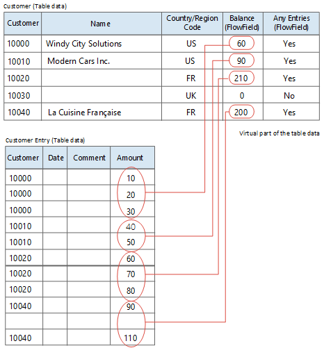

# FlowFields
FlowFields display the result of the calculation described in the [CalcFormula Property](properties/devenv-calcformula-property.md). For example, the **Account Balance** field in the General Ledger Account table shows the balance of the account and is calculated as the sum of the NetAmount fields for all General Journal entries in the account.  
  
FlowFields increase performance in activities such as calculating the balance of your customers. In traditional database systems, this involves a series of accesses and calculations before a result is available. By using FlowFields, the result is immediately available. You can further optimize the performance of Flowfields by enabling or disabling SIFT. For more information, see [SumIndexField Technology (SIFT)](devenv-sift-technology.md).
  
FlowFields are not physical fields that are stored in the database. They are a description of a calculation and a location for the result to be displayed. Because the information in FlowFields exists only at run time, values in FlowFields are automatically initialized to 0 (zero). To update a FlowField, use the [CalcFields Method (Record)](methods-auto/record/record-calcfields-method.md). If a FlowField is the direct source expression of a control on a page, then the FlowField is automatically calculated when the page is displayed.  
  
## FlowField types  
There are seven types of FlowFields. Each is described in the following table.  
  
|FlowField type|Field type|Description|  
|--------------|----------------|-----------------|  
|**Sum**|Decimal, Integer, BigInteger, or Duration|The sum of a specified set in a column in a table.|  
|**Average**|Decimal, Integer, BigInteger, or Duration|The average value of a specified set in a column in a table.|  
|**Exist**|Boolean|Indicates whether any records exist in a specified set in a table.|  
|**Count**|Integer|The number of records in a specified set in a table.|  
|**Min**|Any|The minimum value in a column in a specified set in a table.|  
|**Max**|Any|The maximum value in a column in a specified set in a table.|  
|**Lookup**|Any|Looks up a value in a column in another table.|  

### Example  
Consider the Customer table in the following illustration. This table contains two FlowFields. The field named **Any Entries** is a FlowField of the Exist type, and the **Balance** field is a FlowField of the Sum type.  
  
   
  
The figure shows that the value in the Balance FlowField for customer number 10000 (Windy City Solutions) is retrieved from the Amount column in the Customer Entry table. The value is the sum of the amount fields for the entries that have the customer number 10000.  
  
```  
Sum = 10 + 20 + 30 = 60.  
```  
  
The values shown in the **Balance** column in the Customer table for customers 10010, 10020, and 10040 are found in the same way. For customer number 10030 the value is 0 (zero), as there are no entries in the Customer Entry table that have a Customer No. that equals 10030.  
  
In this example, the Balance FlowField in the Customer table reflects the sum of a specific subset of the Amount fields in the Customer Entry table. How the calculation of a FlowField is to be made, is defined in a calculation formula. The calculation formula for the **Balance** field is:  
  
```  
Sum("Customer Entries".Amount WHERE(CustNo=FIELD(CustNo)))  
```  
  
Correspondingly, the **Any Entries** field, which indicates whether any entries exist, has the following definition:  
  
```  
Exist("Customer Entries" WHERE(CustNo=FIELD(CustNo)))  
```  

## See Also  
[CalcFields Method (Record)](methods-auto/record/record-calcfields-method.md)  
[Create FlowFields and FlowFilters](devenv-creating-flowfields-and-flowfilters.md)  