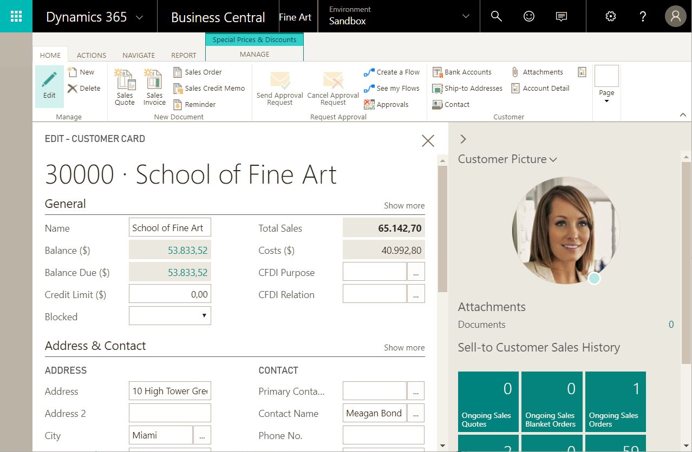

[!INCLUDE[d365fin_dev_blog](includes/d365fin_dev_blog.md)]

# Using Designer
When developing extensions in the AL development environment you have a wide range of possibilities. Designer in [!INCLUDE[d365fin_long_md](includes/d365fin_long_md.md)] complements the development experience in Visual Studio Code, as it provides an easy and convenient way of making immediate adjustments to your design by simply dragging and dropping the components on the page.  

Here is a quick overview of capabilities in **Designer**: 

|Features                           |Applies to                       | 
|-----------------------------------|---------------------------------|
|Add components                     |fields and columns               |
|Move components                    |fields, columns, cues, and parts |
|Remove components                  |fields, columns, cues, and parts |
|Set the [Importance property](properties/devenv-importance-property.md) to determine whether a field displays in the FastTab heading when the FastTab is collapsed or only when the users selects **Show more**.|fields|
|Set freeze pane and clear freeze pane |columns                       |
|Adjust column width |columns                       |
|Edit caption                       |FastTab, cards, FactBox          |
|Save extension/download code       |general                          |
|Preview design                     |general                          |

## Important points to note

- Every time you start designing, you are effectively creating a new extension. Your changes are immediately visible to other users.

- The changes you make in Designer will apply to **all** users.

- You cannot remove specific fields that are bound to a page and a field must belong to an underlying table.

- You can only add fields, columns, or tiles to its applicable view from list, tall tiles, and wide tiles views. Some components cannot be moved using drag-and-drop and are restricted to the view that they are in.

- You can only add fields/columns, from a predefined list, which is based on the source table. You cannot create new ones.  

## Start designing

You can start Designer by choosing  **Designer** in the top right corner of any page that you want to make modifications to, and start designing using drag-and-drop components. You can also launch the browser, and enter Designer, using the **F6** shortcut in Visual Studio Code. After you are done with the adjustments, finish up your design by choosing **Stop Designing**, which allows you to name the extension with an option to download code, and save the extension for the tenant. If you choose not to download the code at the end, you can still pull the code using the **Ctrl+F7** shortcut. You can also uninstall the extension from the **Extension Management** page or even download the source from there. 

> [!NOTE]  
> With this preview you can only add existing table fields. Adding pages, groups, parts, and actions is not yet supported.

## Drag-and-drop components
In Designer, you design and modify the current page; you can add existing table fields, move fields around, or remove fields from the page. You can make changes to display the information by using drag-and-drop components. 

## How it works
A pane to the right lets you add components. Here you can see all of the table fields that are available for the specific page. The table fields displayed are based on the underlying table or tables. The field can have a status of **Placed**, which means that the field already exists on the page. A status of **Ready** means that the field does not already exist on the page, and that you can place it.

You can edit the caption of a FastTab, a card, FactBox by clicking the caption and start writing. Simple, clear, and plain.

If you want to remove a field, column, part, or a cue, you must select the arrowhead indicator  or  placed on the component, and then choose **Remove**. 

**Set freeze pane and clear freeze pane** locks one or more columns to the left, even when you scroll horizontally. You can set the freeze pane, by selecting the arrowhead indicator  or  of the column that you want as the last column of the freeze pane, and then choose **Set Freeze Pane**. If you want to set the freeze pane back to its original designed location, select the arrowhead indicator  or  for the current freeze pane column, and then choose **Clear Freeze Pane**.

## Preview design

The display type icons let you preview the changes you made on desktop, tablet, and phone clients. This way you can make sure that your design will work on the intended display target(s). You can flip to display tablet and phone designs in portrait and landscape orientation. 

## Controlling User Access to Designer

Accessing Designer is controlled on a user or user group basis by the **D365 EXTENSION MGT** permission set. If a user is assigned this permission set, then Designer is available for the user in the client. To prohibit a user from using Designer, just remove the user from the **D365 EXTENSION MGT** permission set.

## See Also
[Developing Extensions](devenv-dev-overview.md)  
[Getting Started with AL](devenv-get-started.md)  
[AL Development Environment](devenv-reference-overview.md)
