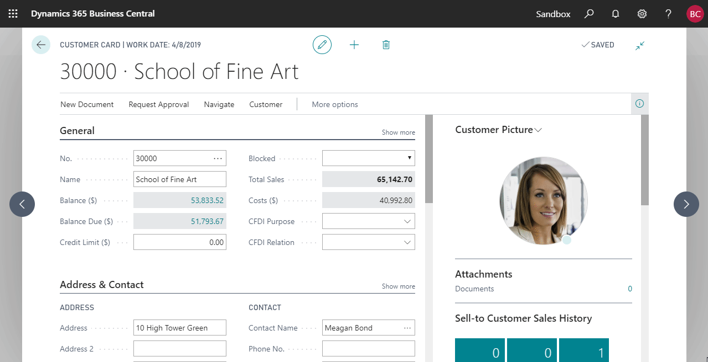
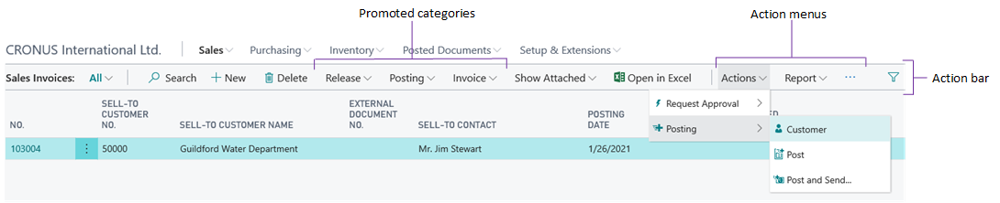

# Using Designer

When developing extensions in the AL development environment, you have a wide range of possibilities. Designer in [!INCLUDE[d365fin_long_md](includes/d365fin_long_md.md)] complements the development experience in Visual Studio Code, as it provides an easy and convenient way of making immediate adjustments to your design by simply dragging and dropping the components on the page.  
Here is a quick overview of capabilities in **Designer**: 

|Features      |Applies to    | 
|--------------|--------------|
|Add components    |fields and columns               |
|Move components   |fields, columns, cues, parts, actions and action groups |
|Remove components |fields, columns, cues, parts, actions and action groups |
|Change field importance, like showing in collapsed FastTab header or under **Show More** |fields|
|Exclude field from Quick Entry|fields, columns| 
|Set freeze pane and clear freeze pane |columns|
|Adjust column width |columns |
|Edit caption        |FastTab, cards, FactBox    |
|Save extension/download code |general           |
|Preview design               |general           |

## Important points to note

- Every time you start designing, you are effectively creating a new extension. Your changes are immediately visible to other users.

- The changes you make in Designer will apply to **all** users.

- You cannot remove specific fields that are bound to a page and a field must belong to an underlying table.

- You can only add fields, columns, or tiles to its applicable view from list, tall tiles, and wide tiles views. Some components cannot be moved using drag-and-drop and are restricted to the view that they are in.

- You can only add fields/columns, from a predefined list, which is based on the source table. You cannot create new ones.

- In the client, users can change the many of these settings for their workspace only by using personalization (see [Personalizing Your Workspace](/dynamics365/business-central/ui-personalization-user)).  

## Start and stop designing

In the [!INCLUDE[prodshort](includes/prodshort.md)] client, you start Designer by choosing  **Designer** in the top right corner of any page that you want to make modifications to, and start designing using drag-and-drop components. In Visual Studio Code, you can start Designer by using the **F6** shortcut, which launches a browser that opens the [!INCLUDE[prodshort](includes/prodshort.md)] client in Designer.

After you are done with the adjustments, finish up your design by choosing **Stop Designing**, which allows you to name the extension with an option to download code, and save the extension for the tenant. If you choose not to download the code at the end, you can still pull the code using the **F7** shortcut. You can also uninstall the extension from the **Extension Management** page or even download the source from there.

## Drag-and-drop components

In Designer, you design and modify the current page; you can add existing table fields, move fields around, remove fields from the page, hide and move actions, and more. You can make changes to display the information by using drag-and-drop components. 

## Working with fields

To add a field or column to a page, in the banner, choose **More**, and then choose **Field**. A pane to the right appears that lets you add fields. Here you can see all of the table fields that are available for the specific page. The table fields displayed are based on the underlying table or tables. The field can have a status of **Placed**, which means that the field already exists on the page. A status of **Ready** means that the field does not already exist on the page. To add a field, drag and drop it to the desired location. 

If you want to remove a field or column, select the arrowhead indicator  or  on the component, and then choose **Remove**.

You can edit the caption of a FastTab for a group of fields by selecting the caption and start writing. Simple, clear, and plain.

## Setting the freeze pane

**Set freeze pane and clear freeze pane** locks one or more columns to the left, even when you scroll horizontally. You can set the freeze pane, by selecting the arrowhead indicator  or  of the column that you want as the last column of the freeze pane, and then choose **Set Freeze Pane**. If you want to set the freeze pane back to its original designed location, select the arrowhead indicator  or  for the current freeze pane column, and then choose **Clear Freeze Pane**.

## Setting the Importance on Field

Fields on non-list type pages, such as card and document type pages, include Designer options for setting the importance. The following table describes the options for setting the importance in Designer and how it corresponds to the [Importance property](properties/devenv-importance-property.md) in the page code.

|Option|Description|Importance property value|
|----|----|---|
|**Show under "Show more"**|Sets the field so that appears only when the user selects **Show more**. |Additional|
|**Show always**|Sets the field to always display on the page (regardless of whether the user selects **Show more** or **Show less**) but not in the FastTab heading if it is collapsed.|Standard|
|**Show when collapsed**|Sets the field to always display on the page (regardless of whether the user selects **Show more** or **Show less**) and also in the header of the FastTab when the FastTab is collapsed.|Promoted|

## Setting the Quick Entry on Fields

You can use Designer to set the [QuickEntry property](properties/devenv-quickentry-property.md) on a field. The **QuickEntry** property determines whether the field is given input focus or skipped when users navigate through fields on a page by pressing the ENTER (return) key. You use Quick Entry to help accelerate keyboard data entry by focusing only those fields a user typically needs to fill-in.

To set the QuickEntry property from Designer, select the field or column heading, and then choose either **Include in Quick Entry** (sets the **QuickEntry** property to `true`) or **Exclude from Quick Entry** (sets the **QuickEntry** property to `false`).  

For more information about Quick Entry, from a user perspective, see [Accelerating Data Entry Using Quick Entry](/dynamics365/business-central/ui-enter-data?branch=master#QuickEntry) in the [!INCLUDE[prodshort](includes/prodshort.md)] Application Help.

## Working with Actions

Designer lets you make adjustments to the actions that are defined in the action bar of a page. You can move, remove, hide, and show individual actions or action groups.  

> [!NOTE]
> You cannot modify actions that are defined on pages that are shown in parts, such as in FactBoxes or embedded lists. 

> [!TIP]
> In Designer, to run an action as normal, select the action and press Ctrl+Click.

### Remove, hide, and show actions and groups

Actions and actions groups that are already hidden appear dimmed. To change the state of an action or action group, select it, and then choose one of the following options:

|Option|What it does|
|------|------------
|**Remove**|This option is available for the actions that are shown only in a promoted category or actions that are shown in both a promoted category and another action menu.   Choosing **Remove** deletes the action from the selected location so that it no longer appears.   If the action is only shown in the promoted category, it will automatically be shown in the action menu where it is originally defined.  You cannot remove actions on a Role Center pages; you can only hide them.|
|**Hide**|This option is available for actions or action groups that currently are shown only in an action menu (not in a promoted category). Like **Remove**, choosing **Hide** will make the action or action group disappear from the action bar in the client. However, in Designer, the action or action group appears dimmed.|
|**Show**|This option appears if the action or action group has been previously hidden (dimmed). Choosing this option will make the action or action group appear in the action bar.|

### Move actions and action groups

Designer lets you move actions within the action bar. For example, you can move an action from an action menu to a promoted category or from one promoted category to another, move an action within an action group or to a different action group.  

To move an action or action group, drag and drop it to the desired location, just like with fields and columns.  

- You can move individual actions into the promoted categories, but you cannot change the order of the actions in the category.
- You cannot move an action group into a promoted category.
- To move an action or action group into an empty action group, drag the action or action group to the target group and drop it in the **Drop an action here** box.
- On Role Center pages, you cannot move actions among the different areas that are defined by the `area(creation)`, `area(processing)`, and `area(reporting)` controls.

## Preview design on different display targets

The display type icons let you preview the changes you made on desktop, tablet, and phone clients. This way you can make sure that your design will work on the intended display target(s). You can flip to display tablet and phone designs in portrait and landscape orientation. 

## Controlling User Access to Designer

Accessing Designer is controlled on a user or user group basis by the **D365 EXTENSION MGT** permission set. If a user is assigned this permission set, then Designer is available for the user in the client. To prohibit a user from using Designer, just remove the user from the **D365 EXTENSION MGT** permission set.

## See Also

[Developing Extensions](devenv-dev-overview.md)  
[Getting Started with AL](devenv-get-started.md)  
[AL Development Environment](devenv-reference-overview.md)
