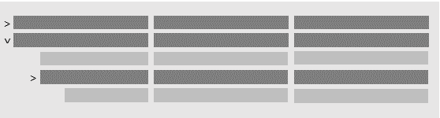

# Designing Indented Hierarchy Lists

This article explains how to indent specific rows in a list.

## Overview

Using the indentation properties in AL, you can display rows in a parent-child structure.


A row that's indented from a row above it is considered a *child* of that row. The row above is considered the *parent*. Indenting rows can help organize related records in the list and make it more readable for the user.

There are two kinds of indented hierarchy lists: fixed and collapsible. In a fixed hierarchy, rows that are indented are always shown. In a collapsible, users can collapse and expand parent rows to show and hide child records.


### Sample table and page

To demonstrate how indented hierarchy works, we'll use a basic table and page. For more detailed implementations, see the **Item Categories** and **Chart of Accounts** pages. You find these pages in the base application.

#### Table

```
table 50100 MyTable
{
    fields
    {      
        field(1; Number; Code[10])
        {
        }
        field(2; Name; Text[50])
        {
        }
        field(3; Indent; Integer)
        {
        }
    }
    
    keys
    {
        key(PK; Number)
        {
        }
    }
}
```

#### Page

```
page 50100 MyPage
{
    PageType = List;
    ApplicationArea = All;
    UsageCategory = Lists;
    SourceTable = MyTable;
    Editable = true;

    layout
    {
        area(Content)
        {
            repeater(Control1)
            {
                field(Number; Number)
                {
                }
                field(Name; Name)
                {
                }
                field(Indent; Indent)
                {
                }
            }
        }
    }
}  
```

Typically, you wouldn't display the **Indent** field because it's only used for layout purposes.

In the client, run the page and add records to the table. Be sure to set the **Indent** field.

## Setting up a fixed indented hierarchy

In a fixed hierarchy, child rows are always shown, as illustrated in the following figure.


In the figure, indentation is applied to the second column. Setting up the fixed indented hierarchy involves configuring two properties on the page object: IndentColumn and IndentationControls.

- The [IndentationColumn Property](properties/devenv-indentationcolumn-property.md) controls which records get indented and by how much. You set the property to either a field in the page's source table or to a variable. The important thing, is that property resolves to an integer. This integer determines the indentation level.

- The [IndentationControls property](properties/devenv-indentationcontrols-property.md) specifies which column in the list gets indented.

### Example

Working with the sample page, let's indent records based on the value of the **Indent** column. You'll apply the indentation to **Name** column. For this hierarchy, you set the IndentationColumn and IndentationControls to the repeater of the page as shown in the following code:

<!-- 
```
repeater(Control1)
{
    IndentationColumn = Indent;
    IndentationControls = Name;
    ...

```

Now, the code will indent each record based on the value of the **Indent** field.

-->
```
page 50100 MyPage
{
    PageType = List;
    ApplicationArea = All;
    UsageCategory = Lists;
    SourceTable = MyTable;
    Editable = true;

    layout
    {
        area(Content)
        {
            repeater(Control1)
            {
                IndentationColumn = Indent;// IndentationColumn = IndentVariable;
                IndentationControls = Name;

                field(Number; Number)
                {
                }
                field(Name; Name)
                {
                }
                field(Indent; Indent)
                {
                }
            }
        }
    }

    //trigger OnAfterGetRecord()
        //begin
          //IndentVariable := Indent;
        //end;

        //var
           //IndentVariable: Integer;
}  
```

You can achieve the same results using a variable instead of the table field for the IndentationColumn property. Look at the commented lines of code in the example above. 

## Setting up a collapsible indented hierarchy

In a collapsible hierarchy, users can collapse and expand parent rows to show and hide child records.



Setting up a collapsible hierarchy is similar to the fixed indented list, except for the properties that you set. A collapsible hierarchy involves three properties: IndentColumn, ShowsAsTree, and TreeInitialState.

- Like in fixed indented hierarchy, the [IndentationColumn Property](properties/devenv-indentationcolumn-property.md) is an integer data type field or variable that determines which records get indented and by how much.
- The [ShowAsTree Property](properties/devenv-showastree-property.md) makes the hierarchy collapsible.
- The [TreeInitialState Property](properties/devenv-treeinitialstate-property.md), which is optional, specifies whether the list is collapsed or expanded when the page opens.  

Unlike fixed indented lists, a collapsible hierarchy always indents the left-most visible column in the repeater. If users customize the user interface and move another column to display first, that column will be indented instead.  


### Example

Working with the sample page, let's indent records based on the value of the **Indent** column. Records will indent on the **Number** column and parent records will be collapsible. For this hierarchy, you add the IndentationColumn, ShowAsTree, and TreeInitialState properties to the pages' repeater: 

<!--
```
repeater(Control1)
{
    IndentationColumn = Indent;
    ShowAsTree = true;
    TreeInitialState = CollapseAll;

   ...
}

```
-->
```
page 50100 MyPage
{
    PageType = List;
    ApplicationArea = All;
    UsageCategory = Lists;
    SourceTable = MyTable;
    Editable = true;

    layout
    {
        area(Content)
        {
            repeater(Control1)
            {
                IndentationColumn = Indent; // IndentationColumn = IndentVariable;
                ShowAsTree = true;
                TreeInitialState = CollapseAll;

                field(Number; Number)
                {
                }
                field(Name; Name)
                {
                }
                field(Indent; Indent)
                {
                }
            }
        }
    }

    //trigger OnAfterGetRecord()
        //begin
          //IndentVariable := Indent;
        //end;
    
        //var
           //IndentVariable: Integer;
}  
```

You can achieve the same results using a variable instead of the table field for the IndentationColumn property. Look at the commented lines of code in the example above. 

## Design and behavior considerations

When using an indented hierarchy, consider the following behavior:

- In a fixed hierarchy indentation works best on a single column.

    You can specify more than one column with the IndentationControl property. However, in the UI, the columns may not appear as expected.
- In a collapsible hierarchy:

    - The IndentationControl property is ignored. Records are always indented on the first column only.

    - Users can change whether the page opens with rows collapsed or expanded, essentially overriding the TreeInitialState property. They change the behavior by selecting the **Toggle Expand All / Collapse All** button in the header of the first column. It stays this way, until they delete personalization on the page.

- When indentation is specified, it's no longer possible to use sorting on the columns in the repeater control.  
- Right-aligned data in columns, such as the integer data type, won't appear as indented.

- Indentation is used to visually communicate structure, without modifying the table of records itself. There is no tightly-defined *parent-child* relationship between records, so you must implement additional logic if records need to relate together. For example, if a user deletes a parent record, Business Central will not delete all of its child records.  


## See Also

[IndentationColumn Property](properties/devenv-indentationcolumn-property.md)  
[IndentationControl Property](properties/devenv-indentationcontrols-property.md)  
[ShowAsTree Property](properties/devenv-showastree-property.md)  
[TreeInitialState Property](properties/devenv-treeinitialstate-property.md)
