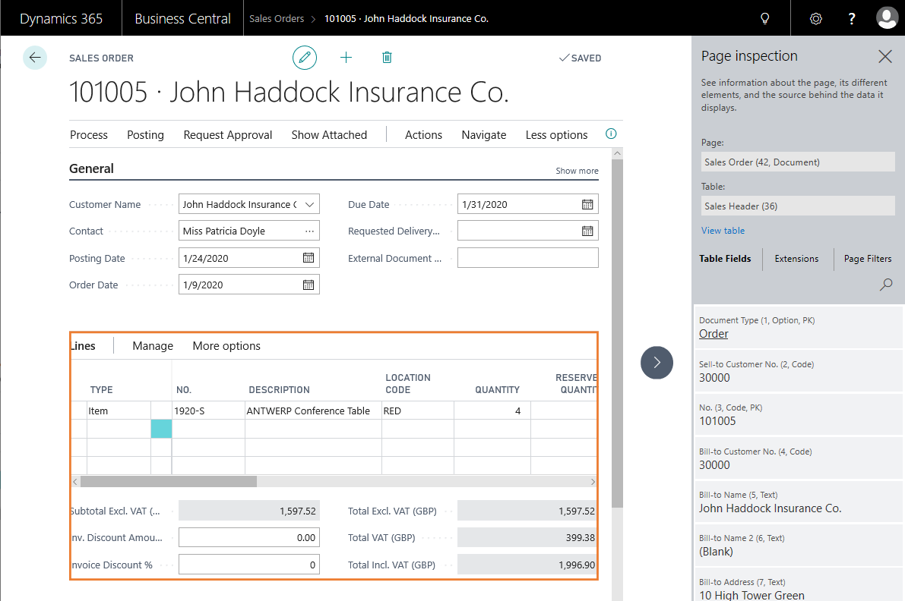
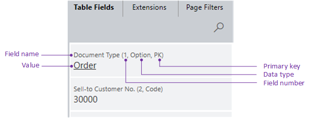
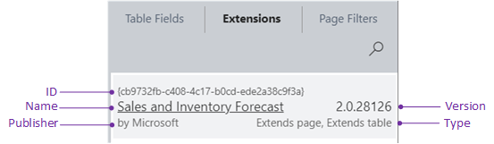
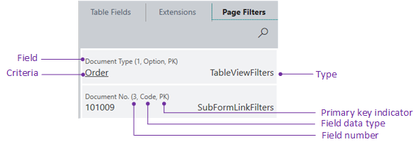

# Inspecting and Troubleshooting Pages

The [!INCLUDE[webclient](includes/webclient.md)] includes a page inspection feature that lets you get details about a page. Page inspection provides insight into the page design, the different elements that form the page, and the source behind the data it displays. Page inspection helps you:

- Learn the data model behind a page.
- Discover pages and parts that can be reused in your application design.
- Troubleshoot data issues without having to do tasks like copying the production database, viewing the entire source table, or digging into SQL.
- Debug the application, complementing [Designer](devenv-inclient-designer.md).

## Working with Page Inspection

You start page inspection from the **Help & Support** page. Choose the question mark in the top-right corner, choose **Help & Support**, and then choose **Inspect pages and data**. Or, you can just use the keyboard shortcut **Ctrl+Alt+F1**.

The **Page inspection** pane opens on the side. The following figure illustrates the **Page Inspection** pane on the **Sales Order** page.

When the **Page Inspection** pane first opens, it shows information that pertains to the main page object.

Use the keyboard or pointing device to move focus to different elements on the page. When you select a FactBox or a part on the main page, a border will highlight the area. The **Page Inspection** pane then shows information about the selected element. For example, the previous figure shows information about the list part in the **Sales Order** page.

As you navigate to other pages in the application, the **Page Inspection** pane will automatically update with page information as you move along.

## What Page Inspection Shows

The page inspection pane shows the information for the main page or page part, including:

- The page's source table (if any) and fields.
- Extensions that affect the page.
- Current filters applied to the page.

The following sections describe details about what is shown.

> [!NOTE]
> If you do not see all details described below, you might not have the required permissions. For more information, see [Controlling Access to Page Inspection Details](/dynamics365/business-central/across-inspect-page?#controlling-access-to-page-inspection).

> [!TIP]
> To copy the values of a field or entity under one of the tabs to the clip board, select the field or entity and press Ctrl+C.

### [Page](#tab/page)

The **Page** field shows information about the main page or a selected (highlighted) subpage in a part. The field shows the following information:

- The name, as specified by its [Name property](./properties/devenv-properties.md)
- The ID as specified by the [ID property](./properties/devenv-properties.md).
- The type, as specified by the [PageType property](properties/devenv-pagetype-property.md).

#### Elements shown with limited information  

- Role Center pages
    
    If a page has the type Role Center, the **Table** field doesn't appear. Because the Role Center consists of several parts, there's no more information shown. To see more details, select the different parts that make up the Role Center.

- Report request pages and previews

    If you open a report request page or preview for inspection, the only information shown in the Page Inspection pane is the report's name and ID.

    [!INCLUDE [send-report-excel](includes/send-report-excel.md)]

- System parts, such as Links or Notes, and parts containing charts.

### [Table](#tab/table)

If the main page or the selected page part has a source table, the **Table** field displays information about the source table. The source table is specified by the page's [SourceTable property](properties/devenv-sourcetable-property.md). The **Table** field shows the following information:

- The name, as specified by its [Name property](./properties/devenv-properties.md)
- The ID as specified by the [ID property](./properties/devenv-properties.md).

If the page uses a query object as a data source, the table field shows the query name and ID instead.

#### View Table

If a page has a source table, the **View table** link is available. This link opens the table in a separate browser window, so you can see all records and fields in the table.

> [!NOTE]
> To view a table, you must have read permission on the table and direct execute permission on the system object **1350 Run table**. This is granted by a permission set on your user account. For more information, see [Managing Users and Permissions](/dynamics365/business-central/ui-how-users-permissions).

### [Table Fields](#tab/tablefields)

The **Table Fields** tab displays information about all fields in the source table for the current record, including fields that don't appear on the page.

Each field is shown with the following information:

- Field name as specified by the [Name property](./properties/devenv-properties.md).
- Field number as specified by the [Field No property](properties/devenv-field-no.-property.md).
- Data type as specified by the [Data Type property](./properties/devenv-properties.md).
- If the field is a primary key, it's indicated by **PK**. A primary is  specified by the [Key property](./properties/devenv-properties.md).
- Value of the field.
- If the field is added by an extension, the name of the extension appears under the value.

#### What field information isn't shown

- Page fields that aren't bound to the source table by the [SourceExp property](./properties/devenv-properties.md).
- The value of fields that have a data type of blob, byte, media, or mediaset.

### [Extensions](#tab/extensions)

The **Extensions** tab displays installed extensions that affect the selected page or its source table.

Except for the type and performance information, the data that's shown is defined in the extension's app.json file, which is configured during development. For more information, see [App.json](devenv-json-files.md#Appjson).

#### Type

There are four different extension types:

- **Adds page** indicates that the extension adds the page object.
- **Extends page** indicates that the extension modifies the page, like adding a field, action, or code. In AL, these modifications are done by a page extension object.
- **Adds table** indicates that the extension adds the table object.
- **Extends table** indicates that the extension modifies the source table, like adding a field or code. In AL, these modifications are specified by a table extension object.  

#### Performance

The performance information includes two values. The first value indicates the time (in milliseconds) it took to run the extension in the call stack. The second value indicates the number of event subscribers run in the extension.

> [!TIP]
> You can get more performance data for extensions by using Application Insights and viewing the AL method traces. For more information, see [Analyzing Long Running AL Methods Telemetry](../administration/telemetry-al-method-trace.md).

> [!NOTE]
> For [!INCLUDE[prod_short](includes/prod_short.md)] on-premises, the performance data will only be shown if AL function timing is enabled on the [!INCLUDE[server](includes/server.md)] instance. For more information, see [Configuring Business Central Server](../administration/configure-server-instance.md#General).  

### [Page Filters](#tab/pagefilters)

The **Page Filters** tab displays the current filters used on the current page. The tab shows filters set by code, set in list views, or defined by the user in the filter pane of the page.

The following table describes the different filter types.

|Type|Description|
|----|-----------|
|UserFilters|Filter that is defined by the client user, by using the Filter pane (see [Filtering](/dynamics365/business-central/ui-enter-criteria-filters#Filtering)), or defined in code by using filter methods like [SetFilter](methods-auto/record/record-setfilter-method.md) or [SetRange](methods-auto/record/record-setrange-method.md).|
|TableViewFilter|Filter that is defined on the page by the [SourceTableView property](properties/devenv-sourcetableview-property.md)|
|SubFormLinkFilters|Filter that is defined by the [SubPageLink property](properties/devenv-subpagelink-property.md) on a `part` control that contains the subpage.|
|FormViewFilters|Filter that is defined by the [RunPageView property](properties/devenv-runpageview-property.md) of the action that opens the page.|

---

## See Also

[AL Development Environment](devenv-reference-overview.md)  
[Page Extension Object](devenv-page-ext-object.md)  
[Actions Overview](devenv-actions-overview.md)  
[Adding Pages and Reports to Search](devenv-al-menusuite-functionality.md)  
[Personalizing Your Workspace](/dynamics365/business-central/ui-personalization-user)  
[Using Designer](devenv-inclient-designer.md)