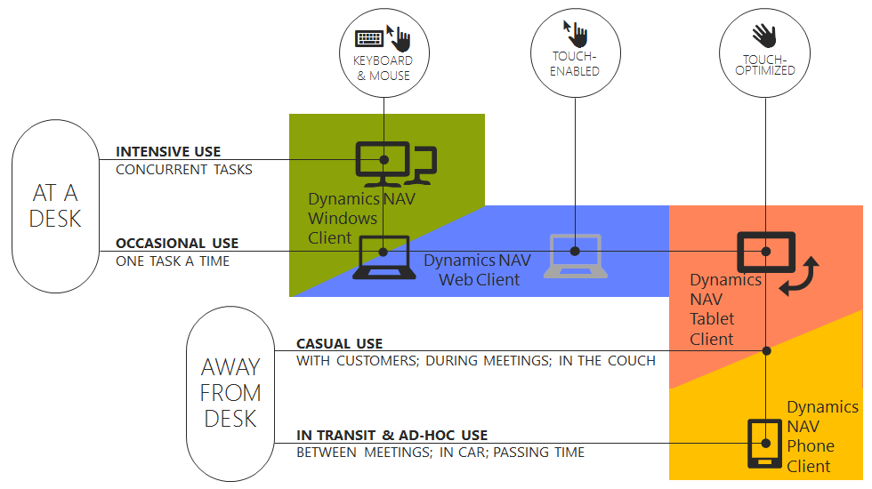

# Introducing the Dynamics 365 Business Central Universal App
The app displaying the [!INCLUDE[nav_tablet](includes/nav_tablet_md.md)] and [!INCLUDE[nav_phone](includes/nav_phone_md.md)] is targeted at users in small and medium sized businesses that want to access data from a tablet or a phone. Some of the advantages of offering this solution are portability and flexibility, when the user is away from the desk, on the train, between meetings, passing time and so on.  
  
 The tablet is lighter than a laptop, and thereby provides portability. Most tablets have an on-screen keyboard, but the keyboard plays a less central role on the tablet, and this forces you to have to consider the touch experience.  
  
 The phone is a very light device and has an even smaller screen than tablets, which is why the tasks that usually make sense to perform using the phone are brief and typically reading of data or very lightweight data entry, such as approving an invoice or getting an overview of the business. Designing for the [!INCLUDE[nav_tablet](includes/nav_tablet_md.md)] you are used to optimizing for the touch experience; when you design for the [!INCLUDE[nav_phone](includes/nav_phone_md.md)] it is only about touch optimization.  
  
 Studies show that design for phone apps must cater for one-hand use; and in some cases, when switching to a panorama view, users will use both hands. The [!INCLUDE[nav_phone](includes/nav_phone_md.md)] layout is designed to support these needs, which allows the important data and buttons to be available within thumbs reach.  
  
 Having a [!INCLUDE[d365fin_long_md](includes/d365fin_long_md.md)] solution that runs on a smaller device brings it in the hands of many more users and your app is easy to distribute. Other advantages are that using a tablet or phone, you can capture data closer to the source, for example, at the customer site, and thereby improve accuracy and reduce end-to-end time.  
  
 The following illustration shows the intended use of the various [!INCLUDE[d365fin_long_md](includes/d365fin_long_md.md)] clients.  
  
  
  
 As illustrated, the [!INCLUDE[nav_tablet](includes/nav_tablet_md.md)] and [!INCLUDE[nav_phone](includes/nav_phone_md.md)] do not replace the [!INCLUDE[nav_windows](includes/nav_windows_md.md)] or [!INCLUDE[nav_web](includes/nav_web_md.md)]. Instead, they offer a touch interface for a limited set of application scenarios compared to the [!INCLUDE[nav_windows](includes/nav_windows_md.md)] and [!INCLUDE[nav_web](includes/nav_web_md.md)]. The [!INCLUDE[nav_windows](includes/nav_windows_md.md)] and [!INCLUDE[nav_web](includes/nav_web_md.md)] support more complex business processes and heavier data entry than is possible on the [!INCLUDE[nav_tablet](includes/nav_tablet_md.md)] and [!INCLUDE[nav_phone](includes/nav_phone_md.md)].  
  
 [!INCLUDE[nav_windows](includes/nav_windows_md.md)] is optimized for intensive use, and the user can have multiple windows open at the same time, for example, to compare sales orders, or do more things at a time. This is not possible in either [!INCLUDE[nav_web](includes/nav_web_md.md)] or [!INCLUDE[nav_tablet](includes/nav_tablet_md.md)].  
  
 In the following documentation, you will see mentions of [!INCLUDE[nav_tablet](includes/nav_tablet_md.md)], [!INCLUDE[nav_phone](includes/nav_phone_md.md)], and *Dynamics 365 Business Central Universal App*. [!INCLUDE[nav_tablet](includes/nav_tablet_md.md)] and [!INCLUDE[nav_phone](includes/nav_phone_md.md)] describe the interface tailored to the category of mobile device, which is one of the tools available for developers for designing mobile solutions, whereas *Dynamics 365 Business Central Universal App* is the common name for the app across all devices; the end result made with these tools.  
  
## Considering the User Scenarios  
 When you design your solution for the [!INCLUDE[nav_tablet](includes/nav_tablet_md.md)] and the [!INCLUDE[nav_phone](includes/nav_phone_md.md)], you must make sure that scenarios are simple enough to be meaningful and usable. The tablet and phone designs are meant for lighter tasks and useful, for example, for traveling salespeople or service technicians who need a portable, online, easy-to-use app that provides an overview, for example, of daily tasks and items in stock.  
  
 Depending on the scenarios that your tablet and phone solution will support, it will either make sense to create a new Role Center for tablet and phone only, or share the same Role Center across all of the client types. In some cases it can make sense to have a user sign in with two different profiles, one for a desktop client and one for mobile devices. In other cases, duplicating pages and designing specific duplicates to be device-oriented is the best solution.  
  
 If you have existing page objects that you want to make available on [!INCLUDE[nav_tablet](includes/nav_tablet_md.md)] or [!INCLUDE[nav_phone](includes/nav_phone_md.md)], we strongly recommend that you plan time to evaluate carefully which actions, sections, and fields will be needed for the user scenarios you want to enable. Fields and actions that are not needed should not be visible to users of your app. The UI must be simplified significantly to work well on a small device.  
  
## Supported Credential Types  
 [!INCLUDE[nav_tablet](includes/nav_tablet_md.md)] and [!INCLUDE[nav_phone](includes/nav_phone_md.md)] support the same credential types as [!INCLUDE[nav_windows](includes/nav_windows_md.md)] and [!INCLUDE[nav_web](includes/nav_web_md.md)]. For more information, see [Authentication and Credential Types](../administration/users-credential-types.md).  
  
## See Also  
 [Developing for the Dynamics 365 Business Central Universal App](devenv-Developing-for-the-business-central-Universal-App.md)   
 [Getting Started Developing for the Dynamics 365 Business Central Universal App](devenv-Getting-Started-Developing-business-central-universal-App.md)   
 [Differences and Limitations When Developing Pages for the Dynamics 365 Business Central Universal App](devenv-differences-and-limitations-developing-pages-business-central-universal-app.md)