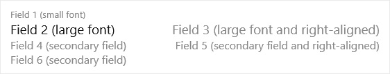

# Displaying Data as Tiles

In the client, on list type pages (such as `List`, `ListPart`, and `ListPlus`), users have the option to view the page in the tile view. The tile view shows records as tiles (or bricks) instead of as rows. Tiles optimize space and readability of data, and is especially useful for images, like on a page that show items, customers, and contacts. The tile view compresses up to six columns of data. By default, the tile view will display the first six fields of the page's source table. This article describes how you can customize the tile view for list type pages.  

## Tile view in the client

Users switch between the list and tile view by selecting the **View layout options** icon in the action bar at the top right-hand corner of the page. If tiles contain a media field type, then there are two tile view options: **Tiles** and **Tall Tiles**. The same information is displayed except with **Tall Tiles**, images are larger and display at the top of the tiles. 

Tiles are interactive. A context menu is available in the upper right corner. The context menu contains the actions that are defined for the record, just as in the list view. To drill down to a card page for a record, the user selects the tile.
  

## Customizing the tile view in AL

You specify the data that you want shown in the tile view in the source table of the page by adding a `Field Group` that has the name `Brick`:

```
    fieldgroups
    {
        fieldgroup(Brick; <field 1>, <field 2>, <field 3>, <field 4>, <field 5>, <field 6>)
        {
            
        }
    }
```

You can specify up to six fields.

> [!IMPORTANT]  
>  By default, the `Field Group` named `DropDown` is interpreted as `Brick` when a `Brick`definition has not been set. The `DropDown` is typically set on entities such as customer, vendor, and items. For more information, see [Field Groups (Drop-Down Controls)](devenv-field-groups.md). 

### Field layout in tiles
The order of the fields determines how they appear in the layout of the tile, regardless of the order the fields appear in the page object definition. Depending on the number of columns that you define in the `Field Group`, the layout will dynamically change. Up to 6 fields can be displayed in a tile, and therefore, there are six possible layouts as shown in this illustration:  

   

The fields 2 and 3 are shown in a large font and should contain data that identifies the brick, for example, the Customer Name and Balance as you can see in the Customer list in, for example, the [!INCLUDE[nav_web](includes/nav_web_md.md)]. 

### Including images in tiles

To display an image in the brick, you include a `Media` data type field in the `Field Group` definition. You do not have to include a field control for the media field in the page object, because the image will be shown in the tile view automatically.

The image will be displayed on the left side of the tile (or at the top in the **Tall Tiles** view), regardless of its position in the `Field Group` definition. If an image does not exist for a certain record, a default picture is displayed instead.

For information including media on records, see [Working With Media on Records](devenv-working-with-media-on-records.md).

### Styling text in tiles

Just as in the list view, the tile view supports the [Style Property](properties/devenv-style-property.md) and [StyleExpr Property](properties/devenv-styleexpr-property.md) that you apply on the page field controls. These properties, for example, let you mark numbers as favorable or unfavorable. 


## Example
The following code is a simple example of a table that includes `Field Group` control for displaying data in the tile view of a list page.

```
Table 50100 MyTable
{

    fields
    {
        field(1; Number; Integer)
        {
        }

        field(2; Description; Text[50])
        {
        }
        field(3; Inventory; Integer)
        {
        }
        field(4; Image; Media)
        {
        }
    }

    keys
    {
        key(PK; Number)
        {
        }
    }

    fieldgroups
    {
        fieldgroup(Brick; Number, Description, Inventory, Image)
        {
        }
    }
}

page 50100 MyListPage
{
    PageType = List;
    ApplicationArea = All;
    UsageCategory = Lists;
    SourceTable = BrickTableTest;
    Editable = true;
    CardPageId = MyCardPage;

    layout
    {
        area(Content)
        {
            repeater(GroupName)
            {
                field(Number; Number)
                {
                    ApplicationArea = All;
                }
                field(Description; Description)
                {
                    ApplicationArea = All;
                }
                field(Inventory; Inventory)
                {
                    ApplicationArea = All;
                    Style = Attention;
                }
            }
        }
    }
}
```
<!-- 
### To display data as tiles  

1.  In the [!INCLUDE[nav_dev_short](includes/nav_dev_short_md.md)], on the **Tools** menu, choose **Object Designer** to open the Object Designer window.  

2.  In **Object Designer**, choose **Tables**, select a table, and then choose the **Design** button to open **Table Designer**. For example, select table **18**, the **Customer** table.  

3.  To open the **Field Groups** window, choose **View**, and then choose **Field Groups**.  

4.  Select the first row in the **Field Groups** window, and in the **Name** field, type **Brick**.  

5.  In the **Field List** window, make a selection from the fields in the source table. Select more rows by using the **Shift** key. Choose the **OK** button to add the fields to the **Field Groups** table.  

6.  Close the windows and then choose **Save and Compile**.  

## Define fields to display in tile view

To specify which fields are included in a tile for a record in a list page object, you use the `Brick` field group name. The following example defines the `Brick` field group that includes two fields of a table object:


```
table 50101 MyTable
{
    DataClassification = ToBeClassified;
    
    
    fields
    
    {
        field(1;MyField1; Integer)
        {
            DataClassification = ToBeClassified;
            
        }
        field(2;MyField2; Integer)
        {
            DataClassification = ToBeClassified;
            
        }
    }

    keys
    {
        key(PK; MyField)
        {
            Clustered = true;
        }
    }

    fieldgroups
    {
        fieldgroup(Brick; MyField1, MyField2)
        {
            
        }
    }

```
-->
## See Also  
[Designing List Pages](devenv-designing-list-pages.md)  
[Working With Media on Records](devenv-working-with-media-on-records.md)  
