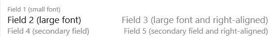

# Displaying Data as Tiles for Lists

In the client, on `List` type pages, users can view the page in the tile view. The tile view shows records as tiles (or bricks) instead of as rows. Tiles optimize space and readability of data. Tiles are especially useful for images, like on a page that show items, customers, and contacts. Business Central also provides Microsoft Teams integration, which enables users to display an interactive, visual representation of records in a Teams chat. These features both use the same design concept, which is based defining a `Brick` field group on the an entities source table.

By default, the tile view will display the first five fields that are defined in page's `repeater` control. This article describes how you can customize the tile view for list type pages.

> [!NOTE]
> The `Brick` field group is also used to define the fields that appear when a record is shown in a Microsoft Teams conversation. For more information, see [Extending Teams Cards](devenv-develop-for-teams-cards.md).

## Tile view in the client

To switch between the list and tile view, users selecting the **View layout options** icon in the action bar of the page. If tiles contain a media field type, then there are two tile view options: **Tiles** and **Tall Tiles**. The same information is displayed except with **Tall Tiles**, images are larger and display at the top of the tiles. 

Tiles are interactive. A context menu is available in the upper right corner. The context menu contains the actions that are defined for the record, like in the list view. To drill down to a card page for a record, the user selects the tile.
  

## Customizing the tile view in AL

You specify the data that you want shown in the tile view in the source table of the page by adding a `Field Group` that has the name `Brick`:

```AL
    fieldgroups
    {
        fieldgroup(Brick; <field 1>, <field 2>, <field 3>, <field 4>, <field 5>)
        {
            
        }
    }
```

There's no limit on the number fields that you can display in a tile. However, we recommend that you limit tiles to five data fields and one image field.

> [!IMPORTANT]  
>  By default, the `Field Group` named `DropDown` is interpreted as `Brick` when a `Brick`definition has not been set. The `DropDown` is typically set on entities such as customer, vendor, and items. For more information, see [Field Groups (Drop-Down Controls)](devenv-field-groups.md). 

### Field layout in tiles

The order of the fields determines how they appear in the layout of the tile, no matter the order in the page object. Depending on the number of columns that you define in the `Field Group`, the layout will dynamically change. This concept is illustrated in the following figure:

   

The fields 2 and 3 are shown in a large font. These fields should typically contain data that identifies the brick. For example, in the **Customers** list, the **Customer Name** and **Balance** are displayed in fields 2 and 3. 

### Including images in tiles

To display an image in the brick, you include a `Media` data type field in the `Field Group` definition. You don't have to include a field control for the media field in the page object, because the image will be shown in the tile view automatically.

The image will be displayed on the left side of the tile (or at the top in the **Tall Tiles** view), whatever its position in the `Field Group` definition. If an image doesn't exist for a certain record, a default picture is displayed instead.

For information including media on records, see [Working With Media on Records](devenv-working-with-media-on-records.md).

### Styling text in tiles

Like the list view, the tile view supports the [Style Property](properties/devenv-style-property.md) and [StyleExpr Property](properties/devenv-styleexpr-property.md). You apply these properties on the page field controls. These properties, for example, let you mark numbers as favorable or unfavorable. 


## Example
The following code is a simple example of a table that includes `Field Group` control for displaying data in the tile view of a list page.

```AL
Table 50100 MyTable
{

    fields
    {
        field(1; Number; Integer)
        {
        }

        field(2; Description; Text[50])
        {
        }
        field(3; Inventory; Integer)
        {
        }
        field(4; Image; Media)
        {
        }
    }

    keys
    {
        key(PK; Number)
        {
        }
    }

    fieldgroups
    {
        fieldgroup(Brick; Number, Description, Inventory, Image)
        {
        }
    }
}

page 50100 MyListPage
{
    PageType = List;
    ApplicationArea = All;
    UsageCategory = Lists;
    SourceTable = BrickTableTest;
    Editable = true;
    CardPageId = MyCardPage;

    layout
    {
        area(Content)
        {
            repeater(GroupName)
            {
                field(Number; Number)
                {
                    ApplicationArea = All;
                }
                field(Description; Description)
                {
                    ApplicationArea = All;
                }
                field(Inventory; Inventory)
                {
                    ApplicationArea = All;
                    Style = Attention;
                }
            }
        }
    }
}
```
<!-- 
### To display data as tiles  

1.  In the [!INCLUDE[nav_dev_short](includes/nav_dev_short_md.md)], on the **Tools** menu, choose **Object Designer** to open the Object Designer window.  

2.  In **Object Designer**, choose **Tables**, select a table, and then choose the **Design** button to open **Table Designer**. For example, select table **18**, the **Customer** table.  

3.  To open the **Field Groups** window, choose **View**, and then choose **Field Groups**.  

4.  Select the first row in the **Field Groups** window, and in the **Name** field, type **Brick**.  

5.  In the **Field List** window, make a selection from the fields in the source table. Select more rows by using the **Shift** key. Choose the **OK** button to add the fields to the **Field Groups** table.  

6.  Close the windows and then choose **Save and Compile**.  

## Define fields to display in tile view

To specify which fields are included in a tile for a record in a list page object, you use the `Brick` field group name. The following example defines the `Brick` field group that includes two fields of a table object:


```
table 50101 MyTable
{
    DataClassification = ToBeClassified;
    
    
    fields
    
    {
        field(1;MyField1; Integer)
        {
            DataClassification = ToBeClassified;
            
        }
        field(2;MyField2; Integer)
        {
            DataClassification = ToBeClassified;
            
        }
    }

    keys
    {
        key(PK; MyField)
        {
            Clustered = true;
        }
    }

    fieldgroups
    {
        fieldgroup(Brick; MyField1, MyField2)
        {
            
        }
    }

```
-->
## See Also  
[Designing List Pages](devenv-designing-list-pages.md)  
[Working With Media on Records](devenv-working-with-media-on-records.md)  
