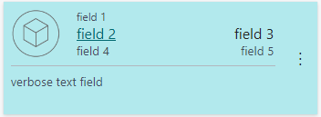
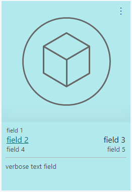
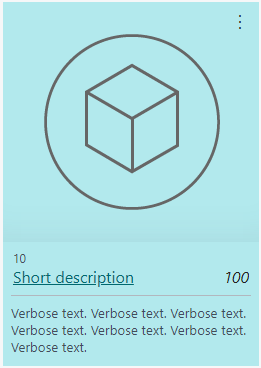

# Displaying Data as Tiles for Lists

In the client, on `List` type pages, users can view the page in the tile view. The tile view shows records as tiles (or bricks) instead of as rows. Tiles optimize space and readability of data. Tiles are especially useful for images, like on a page that show items, customers, and contacts. Business Central also provides Microsoft Teams integration, which enables users to display an interactive, visual representation of records in a Teams chat. These features both use the same design concept, which is based on defining a `Brick` field group on the entity's source table.

By default, the tile view will display the first five fields that are defined in page's `repeater` control. This article describes how you can customize the tile view for list type pages.

> [!NOTE]
> The `Brick` field group is also used to define the fields that appear when a record is shown in a Microsoft Teams conversation. For more information, see [Extending Teams Cards](devenv-develop-for-teams-cards.md).

## Tile view in the client

To switch between the list and tile view, users selecting the **View layout options** icon in the action bar of the page. If tiles contain a media field type, then there are two tile view options: **Tiles** and **Tall Tiles**. The same information is displayed except with **Tall Tiles**, images are larger and display at the top of the tiles. 

Tiles are interactive. A context menu is available in the upper right corner. The context menu contains the actions that are defined for the record, like in the list view. To drill down to a card page for a record, the user selects the tile.
  
## Customizing the tile view in AL

You specify the data that you want shown in the tile view in the source table of the page by adding a `Field Group` that has the name `Brick`. The following code illustrates the syntax, but it will depend on the fields you want to display:

```AL
    fieldgroups
    {
        fieldgroup(Brick; <field 1>, <field 2>, <field 3>, <field 4>, <field 5 >, <image field>, <verbose text field>
        {
            
        }
    }
```

There's no limit on the number of fields you can display in a tile. However, we recommend that you limit tiles to five data fields and one image field.

> [!IMPORTANT]  
> By default, the `Field Group` named `DropDown` is interpreted as `Brick` when a `Brick`definition has not been set. The `DropDown` is typically set on entities such as customer, vendor, and items. For more information, see [Field Groups (Drop-Down Controls)](devenv-field-groups.md). 

### Field layout in tiles

The order of the fields determines how they appear in the layout of the tile, no matter the order in the page object. Depending on the number of columns that you define in the `Field Group`, the layout will dynamically change. This concept is illustrated in the following figure:

|Tile|Tall tile|
|----|---------|
|   |   |

- Field 1 appears in small font in its own row of the tile.
- Fields 2 and 3 are shown in a large font and appear in the same row under primary field 1. These fields should typically contain data that identifies the brick. For example, in the **Customers** list, the **Customer Name** and **Balance** are displayed in fields 2 and 3. 
- Remaining fields appear in rows of two.
- A verbose field appears at the bottom of the tile, separated by a line.

### Including images in tiles

To display an image in the brick, you include a `Media` data type field in the `Field Group` definition. You don't have to include a field control for the media field in the page object, because the image will be shown in the tile view automatically.

The image will be displayed on the left side of the tile or at the top in the **Tall Tiles** view, no matter what its position is in the `Field Group` definition. As long as you're don't want a verbose text field, you can position the image field anywhere in the `Field Group` definition. If an image doesn't exist for a certain record, a default picture is displayed instead.

For information including media on records, see [Working With Media on Records](devenv-working-with-media-on-records.md).

### Styling text in tiles

Like the list view, the tile view supports the [Style Property](properties/devenv-style-property.md) and [StyleExpr Property](properties/devenv-styleexpr-property.md). You apply these properties on the page field controls. These properties, for example, let you mark numbers as favorable or unfavorable. 

### Verbose text in tiles

When records are best represented by a longer, more descriptive text, you can design tiles to display verbose text. To display verbose text, the following requirements must be met:

- The field must be a text field and the size greater than or equal to 100 characters
- The field is added as the last field in the `Field Group` definition, but can't be in the first, second, or third position.
- On the rendered tile in the UI, the field must be appear on the left side of the tile.

If these conditions are met, the tile expands to display the field in up to three rows of text.

## Example

The following code is a simple example of a table that includes `Field Group` control for displaying data in the tile view of a list page. The following figure illustrates how a tall tile with an image will appear on the page.

   

```AL
Table 50100 MyTable
{

    fields
    {
        field(1; Number; Integer)
        {
        }

        field(2; Description; Text[50])
        {
        }
        field(3; Inventory; Integer)
        {
        }
        field(4; Image; Media)
        {
        }
        field(5; DescriptionLong; Text[100])
        {
        }
    }

    keys
    {
        key(PK; Number)
        {
        }
    }

    fieldgroups
    {
        fieldgroup(Brick; Number, Description, Inventory, Image, DescriptionLong)
        {
        }
    }
}

page 50100 MyListPage
{
    PageType = List;
    ApplicationArea = All;
    UsageCategory = Lists;
    SourceTable = BrickTableTest;
    Editable = true;
    CardPageId = MyCardPage;

    layout
    {
        area(Content)
        {
            repeater(GroupName)
            {
                field(Number; Number)
                {
                    ApplicationArea = All;
                }
                field(Description; Description)
                {
                    ApplicationArea = All;
                }
                field(Inventory; Inventory)
                {
                    ApplicationArea = All;
                    Style = Attention;
                }
                field(DescriptionLong; DescriptionLong)
                {
                    ApplicationArea = All;
                }
            }
        }
    }
}
```

## See Also

[Designing List Pages](devenv-designing-list-pages.md)  
[Working With Media on Records](devenv-working-with-media-on-records.md)  
