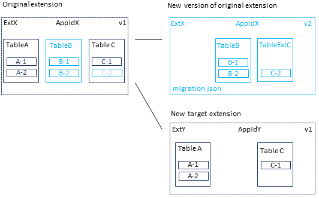

# Moving Tables and Fields to Extensions Down the Dependency Graph

[!INCLUDE[2019_releasewave2_15.3_onprem](../includes/2019_releasewave2_15.3_onprem.md)]

This article explains how to move tables and fields from an extension to another extension that is down the dependency graph.

> [!TIP]
> For more information about the general concepts for moving tables and fields between extensions, see [Migrating Tables and Fields Between Extensions](devenv-migrate-table-fields.md). This article explains the the difference between moving up and down the dependency graph.

## Overview

The steps in this article are based on the example illustrated in the following figure. Although your scenario is different, the concept and process are much the same.

 

In the example, **TableB** and **Field C-2** are customizations. You'll keep these elements in the original extension, but create a new version without **TableA** and **TableC**. You'll move **TableA** and **TableC** down the dependency chain to a new, separate extension.

## Prerequisite

If you're moving [enum type](../developer/devenv-extensible-enums.md) fields, then your solution must be running on [!INCLUDE[prod_short](../includes/prod_short.md)] 2020 release wave 1, version 16.5 or later. For more information, see [Known Issues](../upgrade/known-issues.md#enum).

## Create receiving extension (Ext Y)

The receiving extension will contain the table and fields that you want to move. In this example, these objects include **TableA** and **TableC**.

1. Create an AL project for the receiving extension.

2. Add a table object definition for **TableA**.

    The table definition (schema) must include the full schema of the releasing extension **Ext X**, with the same field definitions. You can add new fields.

3. Add a table object definition for **TableC**.

    The table definition (schema) must include the full schema of the releasing extension **Ext X**, with the same field definitions, except don't include field **C-2**. You can add new fields.

4. Make a note of the `ID` of the new extension. You'll use this ID in the next task.

    For purposes of the example, the ID is `11111111-aaaa-2222-bbbb-333333333333`.

5. Compile the extension package.

## Create new version of releasing extension (Ext X v2)

1. In the releasing extension AL project, add a migration.json file that points to the ID of the target extension.

    ```json
    { 
    "apprules": [ 
        { 
            "id": "11111111-aaaa-2222-bbbb-333333333333"
        } 
    ] 
    } 
    ```

    For more information, see [The Migration.json File](devenv-migration-json-file.md).

2. Modify the app.json file as follows:

    - Ensure that `"target": "OnPrem"`.
    - Increase the `"version"` value.
    - In the `"dependencies"` parameter, set up a dependency on the new receiving extension **Ext Y**.

    For more information, see [App.json file](devenv-json-files.md#Appjson).
3. Complete the following steps for **TableC**.

    1. Add a table extension object **TableExtC**.
    2. In table extension object **TableExtC**, add a field definition for field **C-2** that matches its definition in the original **TableC** object.
    3. Delete the original **TableC** object.

4. Delete the entire table object for **TableA**.
5. Compile a new version of the extension package.

## Deploy extensions

1. Uninstall the old version of the releasing extension **Ext X**.

2. Publish the new receiving extension **Ext Y** and releasing extension version **Ext X v2**.

3. Synchronize the receiving extension **Ext Y**.

    This step creates empty database tables for **TableA** and **TableC** that are owned by the receiving extension **Ext Y**.

    > [!IMPORTANT]
    > The receiving extension must always be synchronized first.

4. Synchronize the new version of the releasing extension **Ext X v2**.

    This step first reads rules in the migration.json file of the extension, then does the following operations in the database:

    <!--
    - Migrates the data from the original tables **TableA** and **TableC** to the receiving extension tables.
    - Deletes the original tables  **TableA** and **TableC** owned by the releasing extension **Ext X**.
    - Deletes column **C-1** from the releasing table **Ext X**.
    -->
    
    - Creates a companion table for field **C-2** of the table extension object **TableExtC**.
    - Copies data from column **C-2** in the original **TableC** to new companion table **TableExtC**.
    - Temporarily renames the new empty tables **TableA** and **TableC** made by receiving extension **Ext Y**. 
    - Renames the original tables **TableA** and **TableC** that include the data. Instead of including the ID of the releasing extension **Ext X**, the names are changed to include the ID of the receiving extension **Ext Y**. This step essentially transfers ownership from **Ext X** to **Ext Y**.
    - Deletes the unused column for **C-2** in the original table **TableC**.
    - Deletes the empty, renamed tables of **Ext Y**.

5. Install the receiving extension **Ext Y**.
6. Run [Start-NAVAppDataUpgrade cmdlet](/powershell/module/microsoft.dynamics.nav.apps.management/start-navappdataupgrade) on the new releasing extension version **Ext X v2**.  

    This step basically installs the new extension version. You run a data upgrade because an earlier version has been installed and is still published.

## See Also

[Migrating Tables and Fields Between Extensions](devenv-migrate-table-fields.md)  
[Moving Tables and Fields to Extension Up the Dependency Graph](devenv-migrate-table-fields-up.md)  
[Upgrading Extensions](devenv-upgrading-extensions.md)  
[Publishing and Installing an Extension](devenv-how-publish-and-install-an-extension-v2.md)  
[JSON Files](devenv-json-files.md)  

