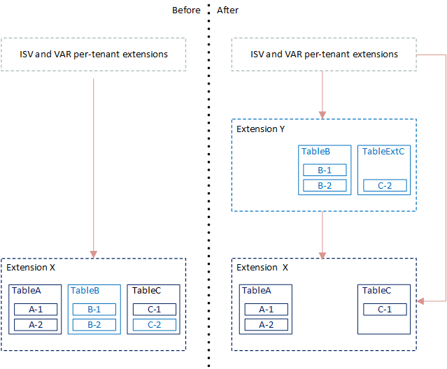
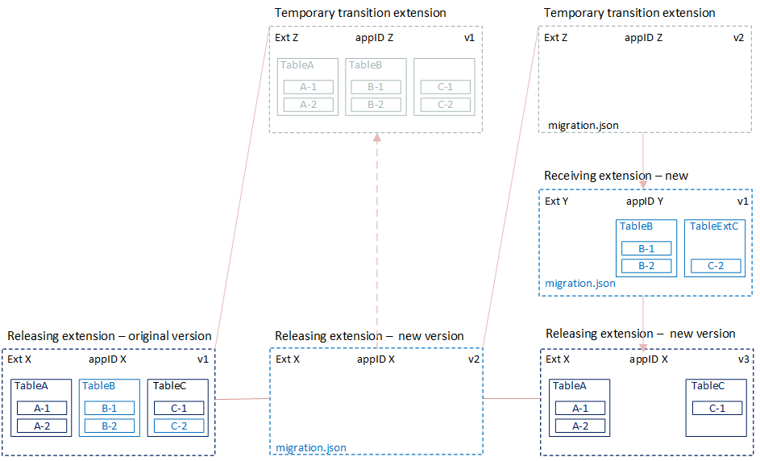

# Moving Tables and Fields to Extensions Up the Dependency Graph

[!INCLUDE[2019_releasewave2_15.3_onprem](../includes/2019_releasewave2_15.3_onprem.md)]

This article explains how to move tables and fields from an extension to another extension that is up the dependency graph.

> [!TIP]
> For more information about the general concepts for moving tables and fields between extensions, see [Migrating Tables and Fields Between Extensions](devenv-migrate-table-fields.md). This article explains the the difference between moving up and down the dependency graph.

## Overview

The steps are based on the example illustrated in the following figure. Although your scenario is different, the concept and process are much the same.



In the example, **TableB** and **Field C-2** are customizations. You'll move these elements from the original extension up to a new extension. This new extension will have a dependency on the original extension. You'll keep **TableA** and **TableC** in the original extension.

To accommodate data migration, you'll have to create an extension that is only used for deployment. This extension is **Ext Z** in the figure. There are two stages of deployment:



- In the first stage, **Ext Z** temporarily takes ownership of tables and fields from **Ext X**.
- In the second stage, **Ext Z** releases ownership to extensions **Ext X** and **Ext Y**. You uninstall and unpublish transition extension **Ext Z**  when you finish deployment.

This process is a two-step process because we only support moving down the dependency graph. So instead, the concept is to first move the tables' ownership  to an extension above the receiving extensions in the dependency graph. Then, the extensions are moved down. This concept essentially turns the process into a two-step, move-down process.

**Ext Z** is used just as a temporary extension for moving ownership. So, it only includes schema objects. As a result, customers can't run on the tenant until both steps have been done.

> [!NOTE]
> You can only use this process for on-premise solutions.

## Prerequisite

If you're moving [enum type](../developer/devenv-extensible-enums.md) fields, then your solution must be running on [!INCLUDE[prod_short](../includes/prod_short.md)] 2020 release wave 1, version 16.5 or later. For more information, see [Known Issues](../upgrade/known-issues.md#enum).

## Create transition extension (Ext Z v1)

The transition extension will contain replicas of all table object definitions in the releasing extension, except logic code. In the illustration, these objects include **TableA**, **TableB**, and **TableC** and current their field definitions. The transition extension is **Ext Z**.

1. Create an AL project for the transition extension.

2. Add a table object that exactly matches the table object definitions for **TableA**, **TableB**, and **TableC** in the releasing extension.

3. Compile the extension package.

3. Make a note of the `ID` of the new extension. You'll use this ID in the next task.

    For purposes of the example, the ID is `11111111-aaaa-2222-bbbb-333333333333`. The value for your extension will be different.

## Create empty version of releasing extension (Ext X v2)

In this step, you create a new version of the releasing extension that doesn't contain any objects. It only contains a `migration.json` file that points to **Ext Z**.

1. In the releasing extension AL project, add a migration.json file that points to the ID of the transition extension **Ext Z**.

    ```json
    { 
    "apprules": [ 
        { 
            "id": "11111111-aaaa-2222-bbbb-333333333333"
        } 
    ] 
    } 
    ```

    For more information, see [The Migration.json File](devenv-migration-json-file.md).
2. Delete all objects from the extension. The objects include **TableA**, **TableB**, and **TableC**.
3. In the app.json file, increase the `version` value. Ensure that `"target": "OnPrem"`.
4. Compile a new version of the extension package.

## Create receiving extension (Ext Y v1)

You now create a new extension that contains the customization you want to move from the releasing. In this example, the customizations include **TableB** and a **TableExtC**.

1. Create an AL project for **Ext Y**.
2. In the app.json file, set up a dependency on the releasing extension **Ext X**.

   ```json
     "dependencies": [{"id": "77777777-eeee-8888-ffff-999999999999", "name": "releaseextension", "publisher": "Default publisher", "version": "1.0.0.0"}],
   ```
  
  For purposes of the example, the ID is `77777777-eeee-8888-ffff-999999999999`. The value for your extension will be different.
3. Add a table definition and code for **TableB** that exactly matches the definition in the original releasing extension.
4. Add a table extension object called **TableExtC**. Then, add a field definition for field **C-2** that matches its definition in the original **TableC** object of the releasing extension.
5. Compile the extension package.
6. Make a note of the `ID` of the new extension. You'll use this ID in the next task.

    For purposes of the example, the ID is `44444444-cccc-5555-dddd-666666666666`. The value for your extension will be different. 

## Create final version of releasing extension (Ext X v3)

In this step, you create another version of the releasing extension **Ext X**. This version will contain the objects and code that you want to finally publish.

1. Create an AL project for **Ext X**.
2. Add a table definition and code for **TableA** that exactly matches the definition in the original releasing extension.
3. Add a table object for **TableC** and field definition for **C-1** that matches the definitions in the original **TableC** object of the releasing extension.
4. In the app.json file, increase the `version` value.
5. Compile the extension package.
6. Make a note of the `ID` of the extension. You'll use this ID in the next task.

    For purposes of the example, the ID is `77777777-eeee-8888-ffff-999999999999`. The value for your extension will be different.

## Create new empty version of transition extension (Ext Z v2)

In this step, you create a new version of **Ext Z** that only contains a `migration.json` file. This `migration.json` file points the IDS of **Ext X** and **Ext Y**. The file is used to release ownership.

1. In the extension AL project, add a migration.json file that points to the IDs of the releasing extension **Ext X** and receiving extension **Ext Y**.

    ```json
    { 
    "apprules": [ 
        { 
            "id": "77777777-eeee-8888-ffff-999999999999"
        }
        { 
            "id": "44444444-cccc-5555-dddd-666666666666"
        }
    ] 
    } 
    ```

    For more information, see [The Migration.json File](devenv-migration-json-file.md).

2. Delete the object definitions for **TableA**, **TableB**, and **TableC**.
3. In the app.json file, increase the `version` value.
4. Compile the extension package.

## Deploy the extensions

1. Uninstall the current version of the releasing extension **Ext X**.
2. Complete the following steps for the first stage of deployment:

    1. Publish the transition extension **Ext Z** and empty version of **Ext X v2**.
    2. Synchronize the transition extension **Ext Z**.

       This step creates empty database tables **TableA**, **TableB**, and **TableC** that are owned by **Ext Z**.

       > [!IMPORTANT]
        > Extensions receiving table objects must be synced first. Extension releasing/giving away table objects must be synced last.

    3. Synchronize the releasing extension **Ext X v2**.

        This step will read the migration.json of the extension. Then transfer ownership of the original tables **TableA**, **TableB**, and **TableC** to **Ext Z**.

3. Complete the following steps for the second stage of deployment:

    1. Publish the next version for **Ext Z v2** and **Ext X v3**, and the first version of **Ext Y**.
    2. Synchronize the extensions in the following order: **Ext X v3**, **Ext Y v1**, and **Ext Z v2**.

       Synchronize **Ext Z v2** last. When you synchronize **Ext Z v2**, ownership of the tables is transferred from **Ext Z** to **Ext X** and **Ext Y**.

4. Run [Start-NAVAppDataUpgrade cmdlet](/powershell/module/microsoft.dynamics.nav.apps.management/start-navappdataupgrade) on the new releasing extension version**Ext X v3**.

    This step basically installs the new extension version. You run a data upgrade because an earlier version has been installed and is still published.

5. Install the new receiving extension **Ext Y v1**.

6. Unpublish both versions of **Ext Z**.

<!--
PS C:\Windows\system32> Publish-NAVApp bc160 -Path "C:\Users\jswymer\Documents\AL\ExtX\Default publisher_ExtX_1.0.0.0.app" -SkipVerification
PS C:\Windows\system32> Sync-NAVApp bc160 -Name extx
PS C:\Windows\system32> install-NAVApp bc160 -Name extx
PS C:\Windows\system32> Publish-NAVApp bc160 -Path "C:\Users\jswymer\Documents\AL\ExtZ\Default publisher_ExtZ_1.0.0.0.app" -SkipVerification
PS C:\Windows\system32> Publish-NAVApp bc160 -Path "C:\Users\jswymer\Documents\AL\ExtX-1\Default publisher_ExtX_1.0.0.1.app" -SkipVerification
PS C:\Windows\system32> Sync-NAVApp bc160 -Name extZ
PS C:\Windows\system32> Sync-NAVApp bc160 -Name extX -Version 1.0.0.1
PS C:\Windows\system32> Publish-NAVApp bc160 -Path "C:\Users\jswymer\Documents\AL\ExtZ-1\Default publisher_ExtZ_1.0.0.2.app" -SkipVerification
PS C:\Windows\system32> Publish-NAVApp bc160 -Path "C:\Users\jswymer\Documents\AL\ExtX - 2\Default publisher_ExtX_1.0.0.2.app" -SkipVerification
PS C:\Windows\system32> Publish-NAVApp bc160 -Path "C:\Users\jswymer\Documents\AL\ExtY\Default publisher_ExtY_1.0.0.0.app" -SkipVerification
PS C:\Windows\system32> Sync-NAVApp bc160 -Name extX -Version 1.0.0.2
PS C:\Windows\system32> Sync-NAVApp bc160 -Name extY -Version 1.0.0.0
PS C:\Windows\system32> Sync-NAVApp bc160 -Name extZ -Version 1.0.0.2
PS C:\Windows\system32> uninstall-NAVApp bc160 -Name extX -Version 1.0.0.0
PS C:\Windows\system32> Start-NAVAppDataUpgrade bc160 -Name extX -Version 1.0.0.2
PS C:\Windows\system32> install-NAVApp bc160 -Name extY -Version 1.0.0.0
PS C:\Windows\system32> Start-NAVAppDataUpgrade bc160 -Name extX -Version 1.0.0.2
-->

## See Also

[Migrating Tables and Fields Between Extensions](devenv-migrate-table-fields.md)  
[Moving Tables and Fields to Extension Down the Dependency Graph](devenv-migrate-table-fields-down.md)  
[Upgrading Extensions](devenv-upgrading-extensions.md)  
[Publishing and Installing an Extension](devenv-how-publish-and-install-an-extension-v2.md)  
[JSON Files](devenv-json-files.md)  
