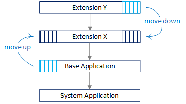

# Migrating Tables and Fields Between Extensions

[!INCLUDE[2019_releasewave2_15.3_onprem](../includes/2019_releasewave2_15.3_onprem.md)]

Data migration allows you to move table and field data between extensions. The concepts and processes in this article apply to large-scale and small-scale data migrations. A large-scale migration is typically upgrade scenario, like upgrading from [!INCLUDE[prod_short](../developer/includes/prod_short.md)] version 14 to version 16. Small-scale migrations are scenarios where you want to move a limited number of objects from one extension to another.

## Overview

The move is divided into two phases: development and deployment. However, before you begin, you have to determine the direction of the migration within the dependency graph.

### Limitations

- The concepts discussed in this article pertain only to AL. They're not supported in C/AL.
- You can only move fields from a table object to a table extension or move entire tables from one extension to another.
- You can't:
    - Move table extensions to other extensions.
    - Merge multiple table extensions into one extension.
    - Split table extensions into multiple extensions.

    Although you can't use this feature for these scenarios, you can achieve the scenarios by other means, which require more manual work. Examples include obsoleting, copying/re-IDing/renaming, moving data, and more. 

## Determining the migration direction in the dependency graph

The process to migrate tables and fields to another extension depends on the migration's direction in the dependency graph. The following figure illustrates a simplified extension dependency graph. From top to bottom, an extension is dependent on any extension below it in the graph.

  

### When to move down

Typical move-down scenarios include:

- Moving to a shared extension.

    You want to move common tables to a separate extension that other extensions can have a dependency on.

- Transitioning from a customized base application extension with its own ID to an extension on top of the Microsoft Base Application.

    You have a customized base application extension with its own ID. You want to transition to the Microsoft Base Application. In this case, customizations remain in the current extension. Base objects are removed and ownership transferred to Microsoft Base Application.
    
    This scenario is typical for embed ISV apps and on premises solutions moving to the cloud. It's also relevant for solutions that will remain on-premises for the foreseeable future. Use it to refactor code customizations into cleaner, standard base with extensions as part of upgrading.

For more information, see [Moving Tables and Fields to Extension Down the Dependency Graph](devenv-migrate-table-fields-down.md).

### When to move up

Typical move-up scenarios include:

- Splitting an extension in two, with one dependent on the other.

- Extracting the system application from the base application.

- Transitioning from a customized base application extension with Microsoft ID to the Microsoft Base Application.

    You have a customized base application extension that reuses the Microsoft application ID. You want to transition to the standard Microsoft Base Application. In this case, customizations are moved out of the base application up into new extensions. The new extensions have new application IDs and dependencies to the standard Microsoft base application. The customization objects are removed from the custom base application and ownership transferred to the new extensions.

For more information, see [Moving Tables and Fields to Extension Up the Dependency Graph](devenv-migrate-table-fields-up.md).

## Development

Development involves making application code changes required for the move. In short, the work involves:

- Creating the *releasing extension* version

    You create a new version of the original extension. This new version contains the tables or fields you want to keep in the extension. The tables and fields that you want to move are deleted from this extension. They're moved to the *receiving extension*.
- Creating the *receiving extension*

    You create new extension that includes the table and fields that you want moved. It essentially includes those tables and fields deleted from the releasing extension.

The key to the move is the *migration.json* file. You add the file to the project for the releasing extension. This file provides a pointer to the ID of new receiving extension where tables and fields are to be moved to. The *migration.json* is used in the deployment phase. Its purpose is to transfer ownership of tables and fields in the database from one extension to another. For more information, see [Migration.json File](devenv-migration-json-file.md).

## Deployment

The deployment phase is when the data is migrated to new tables in the database. In this phase, ownership of tables and fields is switched from one extension to another. Deployment involves publishing, syncing, upgrading, and installing extensions.

The order that you synchronize extensions is important:

- The receiving extensions must be synchronized first.
- The releasing extensions, which include those extensions that include the migration.json file, must be synchronized last.

    These extensions are synchronized last because the tables are moved during the synchronization of the releasing extensions. At the end of the synchronization process, the system checks for breaking changes introduced by the extension. If the extension isn't synchronized last, breaking changes will be detected.

## See Also

[Publishing and Installing an Extension](devenv-how-publish-and-install-an-extension-v2.md)  
[JSON Files](devenv-json-files.md)  
[Upgrading Extensions](devenv-upgrading-extensions.md)  
