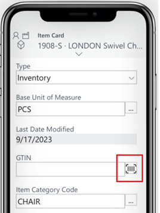

<!--Remove all the comments in this template before you sign-off or merge to the main branch.-->

<!--This template provides the basic structure of a concept article. See [Write a concept article](write-a-concept-article.md) in the contributor guide. To provide feedback on this template contact [bace feedback team](mailto:templateswg@microsoft.com).-->

<!--H1 - Required. This should match the title you entered in the metadata. Set expectations for what the content covers, so customers know the content meets their needs. Should NOT begin with a verb.-->

# Adding barcode scanning to the mobile app

[!INCLUDE[2023-releasewave2](../includes/2023-releasewave2.md)], update 23.1

Business Central offers native barcode scanning support in the mobile app and AL language, enabling developers to provide barcode scanning capability to users of the mobile app. Barcode scanning works on supported phones and tablets, either using the device's camera or a dedicated Android barcode scanner device. There are three different supported scenarios for adding barcode scanning to the mobile. The approach you choose depends design needs, the scanner, and the device's operating system. The following table provides an overview. 

|Scenario|Description|Device camera| Dedicated scanner|iOS device|Android device|
|-|-|-|-|-|-|
|UI button on a field|The user scans a barcode by manually selecting a button next to a field|||||
|AL action|An operation or action, like when the page opens, triggers the barcode scanner.||||||
|Barcode event |events|||||

The new barcode scanning feature supports three different scenarios, each with varying levels of complexity. The scenarios range from simple user interface (UI) features to more advanced approaches that cater to ISVs.


## Requirements

- The field used for barcode scanning is either [text](datatype) and code data type, which are the only two data types that support barcode scanning.

- Business Central app version 4.0 or later


## Add a barcode scanning button on a field

The simplest way to provide barcode scanning capability in the mobile app is by adding a barcode scanning button on a field that starts the barcode scanner capability of the device's camera. 



This scanning is highly efficient and responsive. Once a barcode is scanned, its value is entered in the field on the page, and the focus moves to the next quick-entry field on the page. 


To enable the barcode scanning button on a field, set the [ExtendedDatatype](properties/devenv-extendeddatatype-property.md) property to `Barcode`. You can set ExtendedDatatype on either the field in the table or page. The property instructs  the mobile client to display the barcode button when the page is opened on a supported device.

The following illustrates a code example that adds a field with a barcode scanning button to the **Item** card page.


```al
pageextension 50101 ItemBarcode extends "Item Card"
{
    layout
    {
        addlast(Item)
        {
            field("Barcode"; Rec.GTIN)
            {
                Caption = 'Barcode';
                ExtendedDatatype = Barcode;
            }
        }
    }
}
```

## AL action

AL developers are also able to trigger the barcode scanning UI via an AL-based action, so the barcode scanning can be started via a button, link, or some other semiautomated logic (for instance, when a page is opened). Also supported on iOS and Android platforms, this scenario uses the same camera-based scanning technology as scenario 1 and returns the scanned barcode value to AL code for further processing.

1. 


Scenario 3: Barcode event

This scenario targets professional hardware devices, typically with laser-based barcode scanners, offering greater flexibility to developers. It's only supported by hardware barcode scanners, such as Zebra or Datalogic, running Android 11 and above (there’s no support for iOS). With this scenario, developers register a barcode subscriber that listens for subsequent barcode events on the AL side. When the hardware scans a barcode, its value is sent to the Business Central mobile app and then to AL code. In other words, AL code can intercept an event from an Android device and process the decoded barcode further. Additionally, this scenario supports scanning barcodes and building up a document without interacting with any UI.
## Section heading

<!--add your content here-->

<!--Next steps - Required. Provide at least one next step and no more than three. Include some context so the customer can determine why they would click the link.-->
## Next steps

<!--Remove all the comments in this template before you sign-off or merge to the main branch.-->
