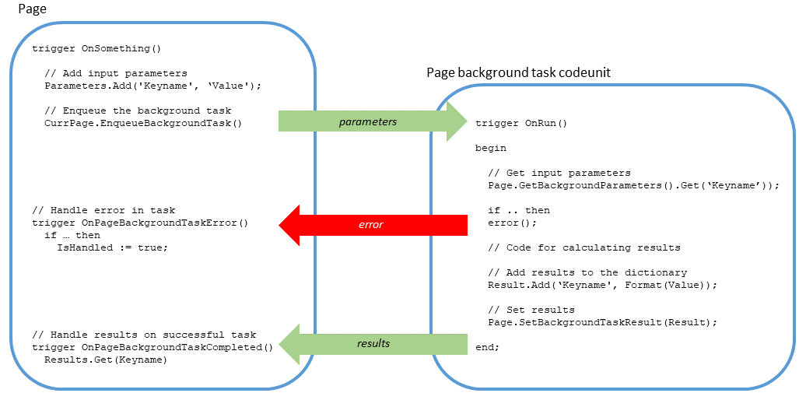
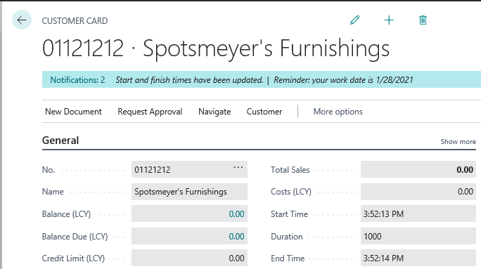

# Page Background Tasks

[!INCLUDE[2019_releasewave2](../includes/2019_releasewave2.md)]

To improve the performance of a page, you can develop the page to run read-only computations and long processes asynchronously in background tasks. Background tasks make a page quicker to open and more responsive, faster for users to enter information. Users aren't blocked from working while waiting for the computations to finish. Typical place where you might use background tasks is on cues and pages in FactBoxes.

## About background tasks

When a page opens in the client, a session is established between the page and the [!INCLUDE[server](includes/server.md)] instance. Consider this session as the *parent session*. As a user works on the page, the user can sometimes be blocked from continuing until a process has completed. This situation is where background tasks can be beneficial.

A page background task is a *child session* that runs processes from a codeunit in the background. The user can continue to work on the page while the task runs. It's similar to other background sessions. The difference is that when the process completes, the child session is ended. The parent session is notified with results of the task. Then, the client will handle the results on the [!INCLUDE[server](includes/server.md)] instance.

<!--multithreading/asynchronous -->

### Background task flow

A background task is a multithread operation between the parent and child sessions. The following diagram illustrates the flow of a background task. In the illustration, the threads start in the order: THREAD A, THREAD B, THREAD C.  

[](media/page-background-task-flow-v4.png#lightbox)

### Background task characteristics and behavior

A page background task has the following characteristics:
- Does read-only operations; it can't write to or lock the database​.
- Runs on the same [!INCLUDE[server](includes/server.md)] instance as the parent session.
- The parameters that are passed to and returned from page background task are in the form of a `dictionary<string, string>`.
- Calls `OpenCompany` and executes in its own transaction.
- The callback triggers can't execute UI operations, except notifications and control updates.
- If the calling page or session closes or the current record is changed, the background task is canceled.
- It has a default and maximum timeout, which cancels the task automatically.
- Doesn't insert session event records; it relies on the parent session event records.
- Runs isolated from the parent session. Apart from the completion and error triggers, it can't call back to the parent session.
- There's a limit on the number of background tasks per session. If there are more tasks than the threshold specified per session, then the requests are queued.
- Executed synchronously from web services.
- Not counted as part of the license calculation.

### Background tasks API

The API for background tasks includes the following methods and triggers:

|Type|Name|Description|
|----|----|-----------|
|Methods|[EnqueueBackgroundTask](methods-auto/page/page-enqueuebackgroundtask-method.md)|Creates and queues a background task that runs the specified codeunit (without a UI) in a child session of the page session. If the task completes successfully, the **OnPageBackgroundTaskCompleted** trigger is invoked. If an error occurs, the **OnPageBackgroundTaskError** trigger is invoked. If the page is closed before the task completes, the task is canceled.|
||[GetBackgroundParameters](methods-auto/page/page-getbackgroundparameters-method.md)|Gets the page background task input parameters.|
||[SetBackgroundTaskResult](methods-auto/page/page-setbackgroundtaskresult-method.md)|Sets the page background task result as a dictionary. When the task is completed, the OnPageBackgroundCompleted trigger will be invoked on the page with this result dictionary|
||[RunPageBackgroundTask](methods-auto/testpage/testpage-runpagebackgroundtask-method.md)|Runs the page background task codeunit in the current session.|
||[CancelBackgroundTask](methods-auto/page/page-cancelbackgroundtask-method.md)|Attempt to cancel a page background task.|
|Triggers|[OnPageBackgroundTaskCompleted](triggers/devenv-onpagebackgroundtaskcompleted-trigger.md)|Runs after a page background task has successfully completed.|
||[OnPageBackgroundTaskError](triggers/devenv-onpagebackgroundtaskerror-trigger.md)|Runs when an error occurs in a page background task. |

## How to create a page background task

The following figure illustrates the application objects and code involved in creating a background task. The code has been simplified for demonstration purposes.



The general steps are as follows:

1. Create a background task codeunit that includes the logic that you want to run in the background.
2. On the page, complete the following steps:
    1. Add code that creates (or *enqueues*) the page background task at runtime.
    2. Add code to the [OnPageBackgroundTaskCompleted trigger](triggers/devenv-onpagebackgroundtaskcompleted-trigger.md) to handle the results of the background task and update the UI.
    3. Add code to the [OnPageBackgroundTaskError trigger](triggers/devenv-onpagebackgroundtaskerror-trigger.md) to handle errors that occur in the background task.

These steps are described in more details in the following sections. To help explain page background tasks, the sections use a simple example. The example extends the **Customer** card page to include a page background task. The task gets the current system time, waits a specified number of milliseconds, and gets the system time again. The page is extended with three new fields: **Start Time**, **Duration**, and **End Time**. In the page UI, these fields are updated with results of the background task, along with a notification when the task completes.



## Creating a background task codeunit

You create a codeunit that does the computations that you want to run in the background. You'll also have to include code that collects the results of computations and passes them back to the calling page for handling.

The background task codeunit is a standard codeunit, which you create like any other codeunit, except it has the following characteristics:

- The OnRun() trigger is invoked without a record.
- It can't display any UI.
- It can only read from the database; not write to the database. If there's code that attempts to write to the database at runtime, an error occurs. The error informs the user that they don't have permission to do the operation on the table. For example, if the code tried to insert a record, an error similar to the following message would occur: `You don't have the following permissions on TableData 50125: Insert`.
- Casting must be manually written in code by using Format() and Evaluate() methods.

For general information about creating a codeunit, see [Codeunit Object](devenv-codeunit-object.md).

### Getting the input parameters from the page background task

When a page background task is enqueued, it can include a set of parameters that can be used in the computations that are done in the background task codeunit. The parameters are a collection of key and value pairs. The parameters are passed as a dictionary of text to the codeunit's OnRun trigger when the page background task session starts.

To get the parameters, call the [GETBACKGROUNDPARAMETERS method](methods-auto/page/page-getbackgroundparameters-method.md):

```
Parameters :=  Page.GetBackgroundParameters()
```
​
Use the [EVALUATE method](methods-auto/system/system-evaluate-method.md) to convert the parameters to the required data type calculations.

### Defining and setting the results​

The results that are computed by the codeunit must be in the form of a dictionary of text. When the codeunit completes successfully, the results are passed to the parent session in a call to the `OnPageBackgroundCompleted` trigger, which will be explained later in this article.

The basic steps for defining the results are as follows:

1. Define a variable of the data type `Dictionary of [Text, Text]` for holding the results.
2. Use the [Add](methods-auto/dictionary/dictionary-add-method.md) to add key-value pairs for the results to the dictionary.
3. Call the SETBACKGROUNDTASKRESULT method to set the results in the background task.

    ```
    Page.SetBackgroundTaskResult(Result: Dictionary[Text, Text])​
    ```
    
### Example

In this example, the page background task codeunit is used to get the current system time. Then, after waiting a short period of time, it gets the system time again. The waiting period is defined by an input parameter (called `Wait`) that was passed to the background task from the parent session. 
<!-- 
```
codeunit 50100 PBTDataSumConcatRow​
{​
  TableNo = PBTData;​
​
  trigger OnRun()​
  var​
    RecId: Code[10];​
    Result: Dictionary of [Text, Text];​
  begin​
    if not Evaluate(RecId, Page.GetBackgroundParameters().Get('RecId')) then​
      Error('RecId could not be parsed.');​
​
    if not Get(RecId) then​
      Error('PBTData record ID %1 was not found.', RecId);​
​
    Result.Add('Sum', Format(IntA + IntB + IntC));​
    Result.Add('Concat', TextA + '-' + TextB);​
​
    Page.SetBackgroundTaskResult(Result);​
  end;​
}​
```
-->
```
codeunit 50100 PBTWaitCodeunit
{
    trigger OnRun()
    var
        Result: Dictionary of [Text, Text];
        StartTime: Time;
        WaitParam: Text;
        WaitTime: Integer;
        EndTime: Time;
    begin
        if not Evaluate(WaitTime, Page.GetBackgroundParameters().Get('Wait')) then
            Error('Could not parse parameter WaitParam');

        StartTime := System.Time();
        Sleep(WaitTime);
        EndTime := System.Time();

        Result.Add('started', Format(StartTime));
        Result.Add('waited', Format(WaitTime));
        Result.Add('finished', Format(EndTime));

        Page.SetBackgroundTaskResult(Result);
    end;
}

```

## Enqueuing a background task on the page

To create a page background task, you call the [ENQUEUEBACKGROUNDTASK method](methods-auto/page/page-enqueuebackgroundtask-method.md) from the page code to run the page background task codeunit. The basics steps are as follows:

1. Define any input parameters for the background task.

    The ENQUEUEBACKGROUNDTASK method can pass parameters to the background task that can be used as input to the task. Input parameters must have the data type  `Dictionary of [Text, Text]`. For example, the following code defines a `Dictionary of [Text, Text]` variable and adds a single key and value pair to dictionary on the variable.

    ```
    var
        TaskParameters: Dictionary of [Text, Text];
    begin

        TaskParameters.Add('Wait', '1000');
      ...
    end
    ```

2. Define a global variable of the data type `Integer` that will be used to assign the background task an identification number.

    You don't have to assign a value to this variable. The ID is assigned automatically when the background task is enqueued.

3. Call the ENQUEUEBACKGROUNDTASK method.

    First, determine where in the code that you want to call the background task from. Typically, you call the ENQUEUEBACKGROUNDTASK method from a page trigger.

    > [!IMPORTANT]
    > It's important that the ID of the current record of the page remains static after the ENQUEUEBACKGROUNDTASK method call is made and while the background task is running; otherwise the task will be cancelled. For this reason, we recommend that you don't enqueue the background task from the `OnOpenPage` or `OnValidate` triggers. Instead, use the `OnAfterGetCurrRecord` trigger.

    Once you've determined the location, add the following code to enqueue the background task:
    
    ```
    CurrPage.EnqueueBackgroundTask(TaskID, CodeunitId, Parameters, Timeout, ErrorLevel)
    ```

    |Parameter|Description|Required|
    |---------|-----------|--------|
    |`TaskId`|The variable that is defined for the task ID. This variable must be a global variable.​|Yes|
    |`CodeunitId`|The ID of the background task codeunit. |Yes|
    |`Parameters`|The dictionary variable that is defined for the input parameters to the background task|No|
    |`Timeout`|The number of milliseconds that the page background task can run before it's automatically canceled. You can set it to run for a maximum of 600,000 ms (10 minutes). When the task is canceled, the `OnPageBackgroundTaskError` trigger is called. <br /><br />By default, the task timeout is controlled by the **Page Background Task Default Timeout** and **Page Background Task Max Timeout** settings on the server instance. For more information, see [Timeout](methods-auto/page/page-enqueuebackgroundtask-method.md#timeout).<br /><br />**Note:** You can add code to re-enqueue a task when an error occurs. For more information, see [Re-enqueuing background tasks](#reenqueue). |No|
    |`ErrorLevel`|The severity level for unhandled errors that occur in the background task. The severity level will determine how the errors are shown in the client UI. Values include: <ul><li>`PageBackgroundTaskErrorLevel::Ignore` specifies that errors are ignored and have no effect in the client.  </li><li>`PageBackgroundTaskErrorLevel::Warning` gives errors a severity level of warning. Warnings appear as a notification in the client.  </li><li>`PageBackgroundTaskErrorLevel::Error` gives errors a severity level of error.  Errors appear as a notification in the client. This value is the default.|No|

### <a name="reenqueue"></a>Re-enqueuing background tasks

There are some scenarios where you want to enqueue a page background task again, after it's been initially enqueued. For example:

- You want to refresh the data on the page, like a part in a FactBox.
- You want to re-enqueue a task if it times out. When a page background task exceeds the specified timeout, the background task is canceled and an error with error code **ChildSessionTaskTimeout** occurs.

To re-enqueue a page background task, call the ENQUEUEBACKGROUNDTASK method on either the `OnPageBackgroundTaskCompleted` or `OnPageBackgroundTaskError` triggers, depending on your scenario. For detailed examples, see the PageBackgroundTask.AutoRefresh project in the [BCTech GitHub repository](https://github.com/microsoft/BCTech/tree/master/samples/PageBackgroundTask.AutoRefresh).

> [!NOTE]
> Use this pattern cautiously to avoid endless looping and applying excessive load on the server. Also, consider the **Child Sessions Max Queue Length** limit of the server instance. If this limit is exceeded, enqueuing will fail.

### Design considerations and limitations

- The enqueued page background task stores the record ID of the current page. If the current record ID on the page changes, or the page is closed, the task is canceled. 
- On list pages, it's recommended not to enqueue a page background task from `OnAfterGetRecord` trigger, unless you're aware of the consequences. If you enqueue a page background task from the `OnAfterGetRecord`, the task will be immediately canceled after the first row is retrieved. The reason is that the `OnAfterGetRecord` trigger is called on every row. Because the record changes for each row, the page background task is canceled when the trigger runs after the first row.
- ​By default, only five page background tasks can be run simultaneously for a parent session. If there are more than five, they're queued and run when a slot becomes available as other tasks finish.​ If you're using version 15.2 or later, you can increase or decrease this value by changing the **Child Sessions Max Concurrency** setting of the server instance. You can also change the **Child Sessions Max Queue Length** setting to specify the maximum number of child sessions that can be queued per parent session of a page background task. If this value is exceeded, an error occurs. For more information, see [Configuring Business Central Server - Asynchronous Processing](../administration/configure-server-instance.md#PBT).
  the Page.Rec is different.


<!--
- If a timeout occurs, you can re-schedule the task in the completion trigger by using the automatic refresh capability. ​For more information and samples, see the [BCTech GitHub repository](https://github.com/microsoft/BCTech/tree/master/samples/PageBackgroundTask.AutoRefresh).
-->
### Example

The following example extends **Customer Card** page of the base application to include three fields for displaying times that are calculated in a page background task.

```
pageextension 50100 CustomerCardExt extends "Customer Card"
{
    layout
    {
        addlast(General)
        {

            field(starttime;starttime)
            {
                ApplicationArea = All;
                Caption = 'Start Time';
                Editable = false;
            }

            field(durationtime;durationtime)
            {
                ApplicationArea = All;
                Caption = 'Duration';
                Editable = false;
            }

            field(endtime;endtime)
            {
                ApplicationArea = All;
                Caption = 'End Time';
                Editable = false;
            }
        }
    }

    var
        // Global variable used for the TaskID
        WaitTaskId: Integer;
        
        // Variables for the three fields on the page 
        starttime: Text;
        durationtime: Text;
        endtime: Text;

    trigger OnAfterGetCurrRecord()
    var
        //Defines a variable for passing parameters to the background task
        TaskParameters: Dictionary of [Text, Text];
    begin
         TaskParameters.Add('Wait', '1000');

        CurrPage.EnqueueBackgroundTask(WaitTaskId, Codeunit::PBTWaitCodeunit, TaskParameters, 1000, PageBackgroundTaskErrorLevel::Warning);
    end;
}

```

<!--
var​
  TaskSumId: Integer;​
​
trigger OnAfterGetRecord()​
var​
  TaskParameters: Dictionary of [Text, Text];​
begin​
  if (TaskSumId > 0) then​
    Currpage.CancelBackgroundTask(TaskSumId);​
​
  TaskParameters.Add('RecId', Id);​
  CurrPage.EnqueueBackgroundTask(TaskSumId, 50100, TaskParameters, 1000, PageBackgroundTaskErrorLevel::Warning);​
end;
```

-->
## Coding the background task completion trigger to handle the results

When a page background task completes successfully, the `OnPageBackgroundTaskComplete` trigger of the page in the parent session is called, and the results of the task are passed to the trigger. The results are passed as a dictionary of text. You add code to the trigger to handle the results. This operation typically includes updating the record in the page UI with the calculated values and caching the results in the database. The `OnPageBackgroundTaskComplete` trigger has the following signature:

``` 
trigger OnPageBackgroundTaskCompleted(TaskId: Integer; Results: Dictionary of [Text, Text])  
``` 

|Parameter|Description|
|---------|-----------|
|`TaskId`|The ID that is assigned to the background task.|
|`Results`|The results of the background task|

### Design considerations and limitations 

- Use the value of `TaskID` parameter assigned by the ENQUEUEBACKGROUNDTASK method call to identify a specific task.
- The client user must have the appropriate write permission to cache results in the database​.
- Calling the UPDATE method has no effect in the trigger.​
- Except for notifications, the trigger can't render UI in the client. ​
​
### Example

The following example modifies the `OnPageBackgroundTaskCompleted` trigger to update the page with the started and finished times that were calculated in the page background task, and displays a notification that the times have been updated.

``` 
    trigger OnPageBackgroundTaskCompleted(TaskId: Integer; Results: Dictionary of [Text, Text])
    var
        started: Text;
        waited: Text;
        finished: Text;
        PBTNotification: Notification;
    begin
        if (TaskId = WaitTaskId) then begin
            Evaluate(started, Results.Get('started'));
            Evaluate(waited, Results.Get('waited'));
            Evaluate(finished, Results.Get('finished'));

            starttime := started;
            durationtime := waited;
            endtime := finished;
            PBTNotification.Message('Start and finish times have been updated.');
            PBTNotification.Send();
        end;
    end;
```
<!--
```
trigger OnPageBackgroundTaskCompleted(TaskId: Integer; Results: Dictionary of [Text, Text])​
var​

begin​
  if (TaskId = TaskSumId) then begin​
    Evaluate(RecordSumAsync, Results.Get('Sum'));​
    Results.Get('Concat', RecordTextContatAsync);​
  end;​
end;
```
-->
## Handling errors

Within the page background task flow, errors can occur in three different locations:

- The page background task codeunit.
   
    > [!NOTE]
    > A background task timeout will also result in an error.
- The `OnPageBackgroundTaskError` trigger of the page.
- The `OnPageBackgroundTaskCompleted` trigger of the page.

With errors that occur in the page background codeunit, you can control how the errors affect the client UI and the resultant data. For example, some errors are more severe than others. Users should be notified when an error occurs in some cases. Other times, the error can be ignored. 

Errors that occur while executing the `OnPageBackgroundTaskError` or `OnPageBackgroundTaskCompleted` always display in the client with the severity level of error (`PageBackgroundTaskErrorLevel:Error`).

### Handling errors that occur in the background task

When an error occurs in the page background task codeunit, the `OnPageBackgroundTaskError` trigger of the page in the parent session is automatically called with information about the error. To handle these errors, you can either use the `OnPageBackgroundTaskError` trigger as-is, that is with no custom code, or you can add custom code to the trigger to handle the errors separately.

The `OnPageBackgroundTaskError` trigger has the following signature:

```
trigger OnPageBackgroundTaskError(TaskId: Integer; ErrorCode: Text; ErrorText: Text; ErrorCallStack: Text; var IsHandled: Boolean)​
```

The following table describes the parameters of the trigger:

|Parameter|Description|
|---------|-----------|
|`TaskId`|Specifies the ID assigned to the background task.|
|`ErrorCode`|Specifies the error code assigned to the error that occurred in the background task, for example, `NDBCS:Deadlock` or `DB:FatalCode`. The error code is assigned by the [!INCLUDE[server](includes/server.md)] instance.|
|`ErrorText`|Specifies the error message of the error that occurred in the background task.|
|`ErrorCallStack`|Specifies the error's call stack on the [!INCLUDE[server](includes/server.md)] instance.|
|`IsHandled`|Specifies whether the error is handled. The default is `false`. |

####  Using the `OnPageBackgroundTaskError` trigger as-is

<!--
If you don't add any code to the `OnPageBackgroundTaskError`, then all errors that occurs in the page background task will appear in the client UI with the severity level that was specified for the background task when it was enqueued by the ENQUEUEBACKGROUNDTASK method.
-->
If you want all errors that occur in the background task to be handled according to the severity level that was specified for the background task when it was enqueued, then don't add any code to the `OnPageBackgroundTaskError` trigger. In this case, the `ErrorLevel` parameter of the `ENQUEUEBACKGROUNDTASK` method call determines how the error is handled in the client.

- If the `ErrorLevel` is `PageBackgroundTaskErrorLevel:Ignore`, then error doesn't affect the client, and there's no indication on the page that the error occurred.
- If the `ErrorLevel` is `PageBackgroundTaskErrorLevel:Warning` or `PageBackgroundTaskErrorLevel:Error`, the error message displays as a notification on the page. There's currently no distinction in the notification as to whether the error is a warning or error.  

For this implementation, you can either add the empty `OnPageBackgroundTaskError` trigger or omit the trigger entirely.
<!--
|`ErrorLevel`|Description|
|------------|---------|
|`PageBackgroundTaskErrorLevel:Ignore`|The error is ignored; the client UI is not affected.|
|`PageBackgroundTaskErrorLevel:Warning`|The error appears with the severity level **Warning**.|​
|`PageBackgroundTaskErrorLevel:Error`|The error appears ith the severity level **Error**.|​

-->
#### Customizing the OnPageBackgroundTaskError trigger

When `OnPageBackgroundTaskError` is called, it includes information about the error, such as the error code, error text, and call stack. You can add code to the trigger that handles errors based on this information. You do this by using the `ÌsHandled` boolean variable in your code:

- If `IsHandled` is set to `true`, the error thrown in the background task is ignored and handled by code that you add in the trigger. Here, you can add code to update the UI and associated record, similar to what can be done by `OnPageBackgroundTaskCompleted` trigger.  
- If `IsHandled` is set to `false`, which is the default, the error in the background task is displayed in the client with the severity level that was specified by `ErrorLevel` parameter when the background task when was enqueued.​

### Example

The following example modifies the `OnPageBackgroundTaskError` trigger to display a more user-friendly notification in the client when the error `Could not parse parameter WaitParam` or timeout occurs in the page background task.
<!--
```
trigger OnPageBackgroundTaskError(TaskId: Integer; ErrorCode: Text; ErrorText: Text; ErrorCallStack: Text; var IsHandled: Boolean)​
begin​
  if (TaskId = TaskSumId) then begin​
    if (ErrorCode = 'NDBCS:Deadlock') then begin​
      // Suppress the error, and show -2000 for this example​
      IsHandled := true;​
      RecordSumAsync := -2000;​
      exit;​
    end else if (ErrorCode = 'DB:FatalCode') then begin​
      // Throws a new error message with the severity PageBackgroundTaskErrorLevel:Error​
      Error('Fatal error while calculating data');​
    end;​
​
   // IsHandled = false, so the original error will be displayed in the client​
   // with the severity specified at enqueuing, and with ErrorText as content.​
   end;​
end;
```
-->
```
trigger OnPageBackgroundTaskError(TaskId: Integer; ErrorCode: Text; ErrorText: Text; ErrorCallStack: Text; var IsHandled: Boolean)
var
    PBTErrorNotification: Notification;
begin
    if (ErrorCode = 'ChildSessionTaskTimeout') then begin
        IsHandled := true;
    PBTErrorNotification.Message('Something went wrong. The start and finish times haven''t been updated.');
    PBTErrorNotification.Send();
    end
    
    else if (ErrorText = 'Child Session task was terminated because of a timeout.') then begin
        IsHandled := true;
        PBTErrorNotification.Message('It took too long to get results. Try again.');
        PBTErrorNotification.Send();
    end
end;
```
 
## Testing page background tasks

The TestPage data type includes the RUNBACKGROUNDTASK method that allows you to run unit tests for page background task codeunit. The following code is an example of a text codeunit that uses the RUNBACKGROUNDTASK method to test the page background task codeunit used in this article:

```
codeunit 50122 MyPBTCodeunit
{
    Subtype = Test;
    trigger OnRun()
    begin
        CustomerCard.OpenEdit();

        // Adds the parameters to be used as input to the background task
        TaskParameters.Add('Wait', '1000');

        // Runs the background task codeunit
        Results := CustomerCard.RunPageBackgroundTask(50100, TaskParameters);
        
        // Returns the results in the client
        Message('Start time: ' + '%1' + ', Duration :' + '%2' + ', Finished time: ' + '%3', Results.Get('started'), Results.Get('waited'), Results.Get('finished'));
    end;

    var
        CustomerCard: TestPage "Customer Card";

        Results: Dictionary of [Text, Text];
        TaskParameters: Dictionary of [Text, Text];
}
```

## Debugging page background tasks

Like with other code in the application, you debug page background tasks by using the integrated debugger (see [Debugging](devenv-debugging.md)). However, there are a couple limitations to be aware of:

- Only one session can be debugged at a time.
- If a breakpoint in a child session is hit, the child session will become the debugged session.​
- Other sessions will continue to run normally.​
- In other sessions, the breakpoints and error sessions will be ignored until the child session is completed.

## Monitoring page background tasks

To monitor page background tasks, you can use the **# Active child session** performance counter and the event log.

The **# Active child session** performance counter monitors the number of active child sessions (page background tasks) on the [!INCLUDE[server](../developer/includes/server.md)] instance.

In the event log, events that occur in the child session are recorded in the **Server > Admin** channel log and tagged with **Session type: ChildSession**. Events that occur in the parent session, such as in the `OnPageBackgroundTaskError` or `OnPageBackgroundTaskCompleted` triggers, are tagged with **Session type: Background**.

## <a name="partpages"></a>Designing part pages for page background tasks

Parts are a special category of page designed to be embedded within another page. Part type pages include ListPart, CardPart, and HeadlinePart. Like other page types, you can design a part page to use one or more page background tasks. However, unlike other page types, a part page won't display any data until all page background tasks have completed. This condition applies to synchronous data that's not reliant on the background tasks. In the user-interface, dashes (-) appear for field values while the page background tasks run. To work around this behavior, separate the synchronous data into a separate page part.

## See Also

[Configuring Business Central Server - Asynchronous Processing](../administration/configure-server-instance.md#PBT)  
[Business Central Performance Counters](../administration/performance-counters.md)  
[Monitoring Business Central Server Events](../administration/monitor-server-events.md)  
[Page Parts Overview](devenv-designing-parts.md)  
