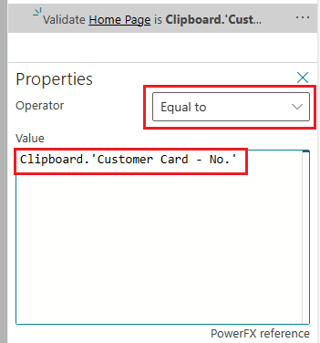

# Use page scripting tool for acceptance testing (preview)

[!INCLUDE [preview-banner](~/../shared-content/shared/preview-includes/file-name.md)]

The page scripting tool in the Business Central web client lets you record your interactions with the user interface (UI), such as opening pages, selecting actions, filling in fields, and so on. You can then replay the recording to automatically replicate the exact same actions in the UI that were done during recording. As the recording is replayed, you receive real-time status feedback on whether an action succeeds or fails. A primary use of the page scripting tool is testing business processes and scenarios in the application and validating they continue to work as expected after changes or updates to the application. This testing is often referred to as user acceptance testing (UAT). The page scripting tool makes the testing easier and faster because it eliminates the need to manually go through each scenario in the UI.

[!INCLUDE [preview-note](~/../shared-content/shared/preview-includes/production-ready-preview-dynamics365.md)]

## What is captured?

The page scripting tool captures both the user interactions with the UI and the resulting actions done by the application by its underlying source code. The page scripting tool focuses on capturing actions coming from executing AL code. It's not a generic HTML automation tool. For example, it can't automate control add-ins, embedded Power BI reports, or anything outside of the Business Central web client experience.

## Prerequisites

- To record, your user account must have the **PAGESCRIPTING - REC** permission set or equivalent permissions.
- To play back a recording, your user account must have the **PAGESCRIPTING - PLAY** permission set or equivalent permissions.

## Start the page scripting tool

You can start the page scripting tool from the role central or any page. In the upper-right corner, select the **Settings**  icon > **Page Scripting**.

The **Page Scripting** pane opens on the right side, as illustrated in the following figure:

:::image type="content" source="media/page-scripting-2.svg" alt-text="Shows the page scripting pane in Business Central.":::

Now you ready to start a new recording or play an existing recording. 

<!--
1. In the **Page Scripting** pane, select the **Start new** button in the pane or the **New recording** icon in the control bar at the top.

   Recording starts, as indicated by solid red circle in the control bar.
1. Run through the task as you typically would.

   As you interact with the application, your actions and  actions you do are added in sequence to the **Page Scripting** pane.

1. If you want to pause the recording select the **Stop** button in the control bar. To resume recording, select the **Start recording** button.
1. When you are done, select the **Stop** button.

1. To play back the recording right away, select the **Play** button.
1. To save the recording to file so you run it later or share with someone, select the **Save** icon in the control bar.

The sections that follow explain other capabilities of the page scripting tool for recording and replaying interactions. -->

> [!NOTE]
> In this article, *control* refers to page controls, like fields, cues or filters.

## Record

This section outlines the basic steps to making a recording with the page scripting tool. Sections that follow explain specific details and aspects about recording. 
  
1. Open the page where you want to start recording.

1. In the **Page Scripting** pane, select the **Start new** button or the **New recording**  button in the control bar at the top.

   The **Start recording**  button in the control bar turns red to indicate that you're recording.

1. Go back to the page and run through the task that you want to record.

   As you interact with the application, your interactions actions and the resulting actions done by the application itself are added in sequence as steps in the **Page Scripting** pane.

1. At any time during recording, you can do the following actions.

   - To pause recording, select the **Stop**  button in the control bar.
   - To resume recording and continue actions, select the **Start recording**  button in the control bar.
   - To delete the last captured step, select **...** next to the step and then select **Delete**.
   - To hide the page scripting pane, select the upper most  in the top right corner. Recording continues. To show the page scripting tool again, select **Settings**  > **Page Scripting**.
   - To cancel recording and exit the page scripting tool, select the **Close recording**  button in the **Recording** bar.

1. When you're done recording, select the **Stop**  button.
1. To play back the recording right away, select the **Play**  button.

   You can replay the recording as long as you don't close the page.
1. To save the recording to file so you can run it later or share with someone, select the **Save**  button in the control bar.

## Options for capturing steps during recording

During recording, you can manually insert special steps by right clicking a page control and selecting an appropriate option. These options are explained in the following sections.

### Copy and paste control values

The page scripting tool comes with its own clipboard. The clipboard lets you copy values of controls and then paste the values in others controls or expressions, or even use them to [validate results](#validate-control-values). Copy and paste are available from the right-click context menu on a control.

- To copy a control value to the clipboard, right-click the control and then select **Page Scripting** > **Copy**. The value is saved to the clipboard for pasting later.
- To paste a control value from the clipboard to another control, select **Page Scripting** > **Paste** > select the value from the list. Pasting a value from the clipboard creates an *input* step in the **Page Scripting** pane.

### Use session info (user ID)

When recording, you have access to session information, such as the user ID. This information can be used in expressions and defining conditions. For example, suppose you have a list page that can be filtered based on the current signed in user. To insert the user ID in a control, like a filter, right-click the control and then select **Page Scripting** > **Paste**> **Session Info** > **User ID**.

An input step with property value `Session.'User ID'` is added in the **Page Scripting** pane.

### Validate control values

While recording, you can insert validation steps that assert that a control has a specific value when the recording is played back. When you insert a validation step, you can choose to validate using the control's current value, a value from the clipboard, or a custom value that you define using Power Fx.

To add a validation step:

1. Right-click the control that you want to validate.
1. In the content menu, select **Page Scripting** > **Validate** > **Current Value**.
1. Select **Is** *[current value]* or a value under the **is equal to clipboard entry** (only appears if there you previously copied a value to the clipboard).

   A validate step is added to the **Page Scripting** pane.
1. If you want to modify the value to be validated, go to the step, select ***...** > **Properties**. In the **Properties** area, change the **Operator** and **Value** fields as needed.

   

### Make steps conditional

Another option during the recording is to insert conditional steps. During playback, conditional steps are only run if the condition is met. For example, suppose you only want to do some steps if there are no current rows in a list.

When you insert a conditional step, you can choose to base the condition on the control's current value, a value copied to the clipboard, or a value that you define using [Power Fx](#use-expressions-in-properties).

To insert conditional steps:

1. Right-click the control you want to apply the conditional steps to.

   If you consider the list example previously mentioned, you right-click a column.
1. In the context menu, select **Page Scripting** > **Add conditional steps when** and then the desired option. Continuing with the list example, you select **Page Scripting** > **Add conditional steps when** > **Row count** > **is 0**.  

   A *conditional branch step* is added to the **Page Scripting** pane, for example, **When rows count is 0**. The **End Scope** button appears at the top of the step list to indicate that the next steps you add are the conditional steps.

1. Return to the page and go through steps that you want run if the condition is met.
1. When you're finished adding conditional steps, select **End scope** in the **Page Scripting** pane.
1. If you want to modify the condition, go the conditional step in the **Page Scripting** pane, and then select **...** > **Properties**. In the **Properties** area, change the **Operator** and **Value** fields to set the comparison rule and value.

### Add a wait step

When recording is eventually played back, it can be convenient to have a time delay after some steps before the next step runs. You add this delay while recording by inserting a wait step immediately after a captured step. You can only add a wait step on the last step listed in the page scripting tool&mdash;you can't insert wait steps between earlier steps.  

To add a wait step:

1. In the **Page Scripting** pane, go to the last step and select **...** > **Add step** > **Wait**.
1. In the **Wait Time** box, type the number of milliseconds that you want to wait before the next step runs.
1. Go back to the page and continue the test you're recording.

## Edit captured steps

During recording and playback, you can edit a captured step. The editing options for a step depend on whether your recording or playing back a recording and what kind of action the step runs. This section explains some of the options. 

### Change step properties

Some steps, like conditional steps or validation steps, have properties that you can modify to change the behavior. To access the properties for a step in the **Page Scripting** pane, select  **...** > **Properties**.  

#### Use expressions in properties

Property values and conditions are typically through actions done during recording. However, these values and conditions are represented as Microsoft Power Fx expressions. Power Fx is the low-code language used across Microsoft Power Platform. It's a general-purpose, strong-typed, declarative, and functional programming language.

Here are a couple examples:

- To validate that a previously copied value is incremented in a validate step, use the expression: `Clipboard.'SO Processor Activities - ReadyToShip' + 1`.
- To generate a "random" name to use in an input step, use the expression: `"Customer " & Today()`.

[Learn more about Power Fx.](/power-platform/power-fx/overview)

### Handle optional pages

Sometimes a page doesn’t always show in a recorded flow because it depends on data or settings. An example is the confirmation dialog shown when closing a sales order. To handle this situation, you can make the page an optional page, which means that the steps under the page only run if the page is shown.

To make a page optional:

1. In the **Page Scripting** pane, locate the recorded step that opens optional page. The step has the similar to **Page X was shown**, where **X** is the name.
1. On the step, select **...** > **Make this an optional page**.

   The steps that follow the optional page are indented to indicate that they're only run if the page is shown.

## Play a recording

There are three ways to play back a recording. You can play a recording that you captured, as long as you don't close the page scripting tool, by selecting the **Play**  button in the control bar. You can also play a recording that was saved to a file or shared as a link.

- To play a recording saved as a file, select either the **Open** button in the **Page Scripting** pane or the **Open recording**  button in the control bar. Locate and open the file, and then select **Play**  button in the control bar.
- To play a recording that you have as a link, select the link to open page scripting tool in Business Central, and then select **Play**  button in the control bar.

During playback, you can do the following operations:

- Move a step forward or backward by selecting **Previous**  and **Next** . When you go back a step, changes made aren't undone though. 
- Go back to the start by selecting **Rewind** . 
- Run to a given step by selecting the step in the **Page Scripting** pane > **...** > **Run to here**.
- Hide the **Page Scripting** pane by selecting the  in the upper right corner. Playback continues. To show the page scripting tool again, select **Settings**  > **Page Scripting**.

As the steps are played back, the results are recorded next to each step. A green circle with a checkmark indicates the step succeeded. A red circle with an exclamation mark indicates that the step failed. 

## Save a recording to a file

You can save the recording as YAML file that can be downloaded, shared, edited, and reopened for playback. To save, select the **Save**  button in the control bar.

> [!TIP]
> To add a description to a recording, select **...** in the **Recording** bar at the top, then type the text in the **Description** field.

## Share a recording as a link

You can share a recording or a playback as a link (URL) that you can share with others. The link includes the full recording along with the results that occurred during playback. To share a recording as a link, select **Share**  > **Copy Link** in the control bar.

## Best practices and tips

- Start recording from a well-known place, like the role center. Playback always starts from current page.
- When you select a value in a grid, filter it so that the desired value is the first one.
- Create new entities to use in a test hwnever possible. For example, create a new customer to use in the new sales order test.
- Avoid dependencies on data that might not be available during playback.
- Break down recording to small parts for easier maintenance, for example:
  - Recording 1: setup user.
  - Recording 2: create customer.
  - Recording 3: create sales order.
  - Recording 4: post sales order.
