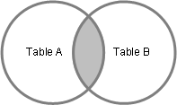
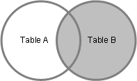
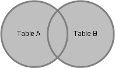

# Linking and Joining Data Items to Define the Query Dataset

[!INCLUDE[prodshort](includes/prodshort.md)] queries enable you to retrieve records from one or more tables and combine the specific records into rows in a single dataset. In AL, each table is specified as a data item. The data included in the dataset is a result of how the data items are linked and joined together.

> [!TIP]
> The concept of linking and joining data items in AL is similar to Join clauses in SQL Select statements on tables in SQL Server. For those familiar with SQL Joins, when describing links and joins in AL, this article provides the equivalent SQL SELECT statement in most cases.

## Sample Tables and Query

To demonstrate data item links and joins, this article uses the following sample tables and query.  
  
### Salesperson/Purchaser Table

The **Salesperson/Purchaser** table contains a list of salespersons. Each salesperson is identified by a unique code. The following is a simplified version of the **Salesperson/Purchaser** table for demonstration purposes. 
  
|Code|Name|  
|----------|----------|  
|AA|Annette|  
|BB|Bart|  
|DD|Debra|  
|JJ|John|  
  
### Sales Header Table

The **Sales Header** table contains a list of sales orders. Each sales order has a unique number, includes the name of the customer to sell to, and is assigned to a salesperson by the **Salesperson\_Code** column. The following is a simplified version of the **Sales Header** table for demonstration purposes. 
  
|No.|Sell-to Customer Name|Salesperson Code|  
|--------|------------------------------|-----------------------|  
|1000|Autohaus|AA|  
|2000|Blanemark|DD|  
|3000|Candoxy|JJ|  
|4000|New Concepts||  
  
### Sample Query

The following query object links the **Sale Header** table with the **Salesperson/Purchaser** table on the **Salesperson\_Code** and **Code** fields, as specified by the [DataItemLink Property](properties/devenv-dataitemlink-query-property.md). In the example, the [SQLJoinType Property](properties/devenv-sqljointype-property.md) is set to **InnerJoin**.

```AL
query 50100 "Sample Query"
{
    QueryType = Normal;
    Caption = 'Sales Overview';

    elements
    {
        dataitem(Salesperson_Purchaser; "Salesperson/Purchaser")
        {
            column(Salesperson; Name)
            {

            }
            dataitem(Sales_Header; "Sales Header")
            {
                DataItemLink = "Salesperson Code" = Salesperson_Purchaser.Code;
                // Change the SqlJoinType value to suit the desired results: LeftOuterJoin, InnerJoin, RighOuterJoin, FullJoin, CrossJoin.
                SqlJoinType = InnerJoin;

                column(Order_Number; "No.")
                {

                }
                column(Sell_to_Customer; "Sell-to Customer Name")
                {

                }
            }
        }
    }
}
```  

## How to link and join data items

When you add data items to a query object in AL, you define them in a specific hierarchy, one after another, where each lower data item is embedded within the definition of the upper data item. The order of the data items determines the sequence in which data items are linked and joined to produce the results in the dataset.  
  
In short, to join two data items, you set the [DataItemLink](properties/devenv-DataItemLink-query-property.md) and [SqlJoinType](properties/devenv-SqlJoinType-property.md) properties on the lower data item in the query object.

 
<!--

-   The DataItemLink property links one or more columns of the lower data item to the upper data item by associating a field in the lower table with a common field in the upper table.
  
-   The SqlJoinType property determines which records to combine into the results, based on the values of the fields that are linked by the DataItemLink property.  

    By default, the SqlJoinType property is set to **Left Outer Join**.  The remainder of this article desribes the 
-->
### Set the DataItemLink Property

The [DataItemLink Property](properties/devenv-DataItemLink-query-property.md) sets up a reference or association between one or more fields in the source table of a lower data item tables with a field in the source table of the upper data item. In a query, two data item tables typically will have columns that have values that are common to both tables. For example, the **Salesperson** table and **Sales Header** table have the **Code** column and **Salesperson\_Code** column in common.  To create a link between these two tables, you could set the DataItemLink property of the **Sales Header** data item as follows:

```AL
DataItemLink = "Salesperson Code" = Salesperson_Purchaser.Code;
```  
  
The [DataItemLink Property](properties/devenv-DataItemLink-query-property.md) sets up an "equal to" \(=\) comparison condition between two columns of the data items. When the query is run, the query compares each row of the two data items to find records that having matching values for the columns. Records that have matching column values are combined into a row in the resulting dataset. In some cases, there will be records that do not have matching values. You use the [SqlJoinType Property](properties/devenv-SqlJoinType-property.md) to include records that do not have matching column values. 
<!--
The basic steps for linking and joining two data items are as follows:

1. First, two data items are *linked* together by associating a field in the table of one data item with a common field in the table of the other data item.
2. Then, records of the tables are combined into a dataset by *joining* the data items. There are several different join types that control which records that included in the resulting dataset depending on whether or not the values of the linked fields match.

> [!TIP]
> The concept of linking and joining data items in AL is similar to Join clauses in SQL Select statements on tables in SQL Server. If you are familiar with SQL Joins, when describing links and joins in AL, this article provides the equivalent SQL SELECT statement in most cases.-->

### Set the SqlJoinType Property

The [SqlJoinType Property](properties/devenv-SqlJoinType-property.md) the determines which records to combine into the results, based on the values of the fields that are linked by the DataItemLink property. You use this property to limit the records that are included in the resulting dataset based on the specified conditions. By default, the SqlJoinType property is `LeftOuterJoin`, so if you omit this property, a `LeftOuterJoin` is performed.

> [!TIP]
> In SQL join statements, tables are designated as either left or right. In AL query objects, because data items are arranged vertically, when joining data items, the *left* corresponds to the upper data item (table) and *right* corresponds to the lower data item (table).

### Linking More Than Two Data Items  

A query links data items in the order that they appear in AL, starting from the top and then working downward. When you have more than two data items, lower data items are linked to the resulting dataset of the linked data items above it. For example, when you link the first two data items, the query generates a dataset. When you add another data item, it is linked to the dataset of the first linked pair of data items, where it applies the conditions that are specified by its [DataItemLink Property](properties/devenv-DataItemLink-query-property.md) and [SqlJoinType Property](properties/devenv-SqlJoinType-property.md). The following code adds another data item to the sample query:  


```AL
query 50100 "Sample Query"
{
    QueryType = Normal;
    Caption = 'Sales Overview';

    elements
    {
        dataitem(Salesperson_Purchaser; "Salesperson/Purchaser")
        {
            column(Salesperson; Name)
            {

            }
            dataitem(Sales_Header; "Sales Header")
            {
                DataItemLink = "Salesperson Code" = Salesperson_Purchaser.Code;
                SqlJoinType = InnerJoin;

                column(Order_Number; "No.")
                {

                }
                column(Sell_to_Customer; "Sell-to Customer Name")
                {

                }
                dataitem(Sales_Line; "Sales Line")
                {
                    DataItemLink = "Sell-to Customer No." = Sales_Header."Sell-to Customer No.";
                }
            }
        }
    }
}
```
  
This pattern continues for each additional data item.  


<!--   
   

## How Data Item Links Work  

When you add data items in AL, they are arranged in a hierarchy, one after another, where the lower dat item is embedded withing the upper dataitem.  The order of the data items determines the sequence in which data items are linked. In SQL SELECT statements, this hierarchy corresponds to designating tables as left and right, where the upper data item would be on the left and the lower data item would be on the right.  
  
 To create a link between two data items in Query Designer, you set the DataItemLink property and the DataItemLinkType property on the lower data item in Query Designer.  
  
-   The DataItemLink property links one or more columns of the lower data item table to the upper data item table.  
  
-   The SqlJoinType property determines which records to include in the results based on the value of fields in the columns that are linked by the DataItemLink property.  
  
> [!NOTE]  
>  By default, the SqlJoinType property is set to **Left Outer Join**.  
  
 For example, the following illustration shows the Query Designer and **Properties** window for linking the Sales Header table to the Salesperson/Purchaser table. You set the DataItemLink property and the DataItemLinkType property on the Sales Header data item because it is the lower data item in Query Designer.  
  
   
  
### Linking More Than Two Data Items
  
A query links data items in the order that they appear in Query Designer, starting from the top and then working downward. When you have more than two data items, subsequent data items are linked to the resulting dataset of the linked data items above it. For example, when you link the first two data items, the query generates a dataset. When you add another data item, the data item is linked to the dataset of the first linked pair of data items, where it applies the conditions that are specified by its DataItemLink property and DataItemLinkType property. The following illustration shows an example with three data items.  
  
   
  
 This pattern continues for each additional data item.  


## Setting the DataItemLink Property

 The DataItemLink property sets up a reference between one or more columns of the data item tables for combining records. In a query, two data item tables typically will have columns that have values that are common to both tables. For example, the Salesperson table and Sales Header table have the Code column and Salesperson\_Code column in common. To create a link between these two tables, you could add the following value in the DataItemLink property of the **Sales Header** data item.  
  
|Field|Reference DataItem|Reference Field|  
|-----------|------------------------|---------------------|  
|Salesperson code|Salesperson\_Purchaser|Code|  
  
 The DataItemLink property sets up "equal to" \(=\) comparison condition between two columns of the data items. When the query is run, the query compares each row of the two data items to find records that having matching values for the columns. Records that have matching column values are combined into a row in the resulting dataset. In some cases, there will be records that do not have matching values. You use the DataItemLinkType property to include records that do not have matching column values.  
  
## Setting Up the DataItemLinkType Property

 You use the data item link type to limit the records that are included in the resulting dataset based on the conditions of the DataItemLink property. You have the following options from which to choose:  
  
-   Exclude Row If No Match  
  
-   Use Default Values If No Match  
  
-   SQL Advanced Options  
  
     The SQL Advanced Options provide alternatives to **Always Include** and **Include Matches Only** that correspond to joins in SQL SELECT statements. For more information, see [SQL Advanced Options for Data Item Link Types](SQL-Advanced-Options-for-Data-Item-Link-Types.md).  
 
### Exclude Row If No Match  
 The resulting dataset of the **Exclude Row If No Match** link type contains only records from both data item tables that have matching values for the columns that are linked by the DataItemLink property. The query finds the records from each data item that have matching column values, and then, for each pair of records, a row is added to the dataset that includes the columns from the two data items.  
  
 For example, the following table shows the resulting dataset of the sample query when the DataItemLinkType property is set to **Exclude Row If No Match**.  
  
|Name|No|Sell\_to\_Customer\_Name|  
|----------|--------|------------------------------|  
|Annette|1000|Autohaus|  
|Debra|2000|Blanemark|  
|John|3000|Candoxy|  
  
 The records for **Bart** in the Salesperson table and **New Concepts** in the Sales Header table do not have matching records in the opposing table, so they are excluded from the resulting dataset.  
  
### Use Default Values If No Match  
 The resulting dataset of the **Use Default Values If No Match** link type contains all the records from the upper data item or data items; even if a record does not have a matching value in the linked column of lower data item as specified by the DataItemLink property. For each record in the upper data item, the query adds a row in the dataset that combines columns from the upper and lower data item. When a record does not have a matching record in the lower data item, the columns from the lower data item include the default value for the data type of the table field that specifies the column. For example, if the field has an integer data type, then the default value is 0.  
  
 For example, the following table shows the resulting dataset of the sample query when the DataItemLinkType property is set to **Use Default Values If No Match**.  
  
|Name|No|Sell\_to\_Customer\_Name|  
|----------|--------|------------------------------|  
|Annette|1000|Autohaus|  
|Bart|null|null|  
|Debra|2000|Blanemark|  
|John|3000|Candoxy|  
  
 The record for **Bart** in the Salesperson table does not have a matching record in the Sales Header table, so a row is included but the columns from the Sale Header table are given a null value. The record in the Sale Header table for **New Concepts** is not included in the resulting dataset because it does not have a matching column in the Salesperson table.  
 -->

## <a name="InnerJoin"></a> InnerJoin

 `InnerJoin` creates a dataset by combining records from data item tables where a match is found between the columns that are linked by the [DataItemLink Property](properties/devenv-DataItemLink-query-property.md) of the lower data item. `Inner Join` uses an "equal to" comparison operator to match rows from the lower data item table with rows from the upper data item table that is based on the values of the linked columns.  
  
-   Each pair of matching records is combined into a row in the dataset.  
  
-   Records from the upper and lower data item tables that do not have a matching column in the lower data item table are excluded from the resulting dataset.  
  
 The following illustration shows an `InnerJoin` type between tables A and B. The shaded area indicates the records that are included in the resulting dataset.  
  
   
  
### Dataset Example

The following table shows the resulting dataset for an `InnerJoin` between the **Sales Header** table and **Salesperson/Purchaser** table in sample query.  
  
|Salesperson|Order_Number|Sell\_to\_Customer|  
|----------|----------------------------|------------------------------|  
|Annette|1000|Autohaus|  
|Debra|2000|Blanemark|  
|John|3000|Candoxy|  
  
The records for **Bart** in the Salesperson table and **New Concepts** in the **Sales Header** table do not have matching records in the opposing table, so they are excluded from the resulting dataset.  
  
### SQL SELECT Statement for Inner Join

To specify an inner join with an SQL statement, you can do either of the following:  
  
- Use a WHERE clause.  
- Use the INNER JOIN condition with an ON clause.  
  
The following two examples show how to create an inner join on the **Salesperson/Purchaser** and **Sales Header** tables with SQL statements. These two statements result in the same dataset.  
  
```  
SELECT "Salesperson/Purchaser".Name, "Sales Header"."No.", "Sales Header"."Sell-to Customer Name"  
FROM "Salesperson/Purchaser" INNER JOIN "Sales Header"  
  ON "Salesperson/Purchaser".Code = "Sales Header"."Salesperson Code"  
```  
  
```  
SELECT "Salesperson/Purchaser".Name, "Sales Header"."No.", "Sales Header"."Sell-to Customer Name"  
FROM "Salesperson/Purchaser", "Sales Header"  
WHERE "Salesperson/Purchaser".Code = "Sales Header"."Salesperson Code"  
```  
  
##  <a name="LeftOuterJoin"></a> LeftOuterJoin

A `LeftOuterJoin` resembles the `InnerJoin` except that the resulting dataset set contains every record from the upper data item table, even if a record does not have a matching value in the lower data item for columns that are linked by the [DataItemLink Property](properties/devenv-DataItemLink-query-property.md).  
  
-   For each record in the upper data item, a row is added in the dataset that combines columns from the upper and lower data item.  
  
-   When a record in the upper data item table has no matching record in the lower data item table, columns coming from the lower data item table have null values.  
  
 The following illustration shows a `LeftOuterJoin` type between tables A and B. The shaded area indicates the records that are included in the resulting dataset. In the sample query, the **Salesperson/Purchaser** table is considered the left table.  
  
   
  
### Dataset Example
 
The following table shows the resulting dataset for a `LeftOuterJoin` between the **Sales Header** table and **Salesperson/Purchaser** table in sample query.
  
|Salesperson|Order_Number|Sell\_to\_Customer|  
|----------|--------|------------------------------|  
|Annette|1000|Autohaus|  
|Bart|null|null|  
|Debra|2000|Blanemark|  
|John|3000|Candoxy|  
  
The record for **Bart** in the Salesperson/Purchaser table does not have a matching record in the **Sales Header** table, so a row is included but the columns from the **Sale Header** table are given null values. The record for **New Concepts** in the **Sale Header** table is not included in the resulting dataset because it does not have a matching column in the **Salesperson/Purchaser** table.  
  
### SQL SELECT Statement for Left Outer Join
 
 To specify a left outer join with an SQL statement, you use the LEFT OUTER JOIN condition.  
  
 The following example shows how to create a left outer join on the **Salesperson/Purchaser** and **Sales Header** tables by using a SQL statement.  
  
```  
SELECT "Salesperson/Purchaser".Name, "Sales Header"."No.", "Sales Header"."Sell-to Customer Name"  
FROM "Salesperson/Purchaser" LEFT OUTER JOIN "Sales Header"  
  ON "Salesperson/Purchaser".Code = "Sales Header"."Salesperson Code"  
```  
  
##  <a name="RightOuterJoin"></a> RightOuterJoin

 A `RightOuterJoin` resembles the inner join except that the resulting dataset set contains every record from the lower data item table, even if a record does not have a matching value in the upper data item for columns that are linked by the [DataItemLink Property](properties/devenv-DataItemLink-query-property.md).  
  
-   For each record in the lower data item, a row is added in the dataset that combines columns from the lower and upper data item tables.  
  
-   When a record in the lower data item table has no matching record in the upper data item table, columns coming from the upper data item table have null values.  
  
 The following illustration shows a `RightOuterJoin` type between tables A and B. The shaded area indicates the records that are included in the resulting dataset.  
  
   
  
### Dataset Example

The following table shows the resulting dataset for a `RightOuterJoin` between the **Salesperson/Purchaser** table and **Sales Header** table in the sample query. The **Sales Header** table is considered the right table.  
  
|Salesperson|Order_Number|Sell\_to\_Customer|
|----------|--------|------------------------------|  
|Annette|1000|Autohaus|  
|Debra|2000|Blanemark|  
|John|3000|Candoxy|  
|null|4000|New Concept|  
  
The record for **New Concepts** in the Sales Header table does not have a matching record in the **Salesperson/Purchaser** table, so a row is included but the columns from the **Salesperson/Purchaser** table are given null values. The record for **Bart** in the **Salesperson/Purchaser** table is not included in the resulting dataset because it does not have a matching column in the **Sales Header** table.  
  
### SQL SELECT Statement for Right Outer Join

To specify a right outer join with an SQL statement, you use the RIGHT OUTER JOIN condition.  
  
The following example shows how to create a right outer join on the **Salesperson/Purchaser** and **Sales Header** tables by using a SQL statement.  
  
```  
SELECT "Salesperson/Purchaser".Name, "Sales Header"."No.", "Sales Header"."Sell-to Customer Name"  
FROM "Salesperson/Purchaser" RIGHT OUTER JOIN "Sales Header"  
  ON "Salesperson/Purchaser".Code = "Sales Header"."Salesperson Code"  
```  
  
##  <a name="FullOuterJoin"></a>FullOuterJoin

 A `FullOuterJoin` contains all the records from the upper data item table, and all records from the lower data item, including records that do not have a matching value for columns that are linked by the [DataItemLink Property](properties/devenv-DataItemLink-query-property.md).  
  
-   Each pair of records from the data items that have matching column values are combined into a row in the dataset.  
  
-   Records from the upper data item table that do have a matching column are included in a row, where the columns from lower data item table have null values.  
  
-   Records from the lower data item table that do have a matching column are included in a row, where the columns from upper data item table have null values.  
  
 The following illustration shows a `FullOuterJoin` type between tables A and B. The shaded area indicates the records that are included in the resulting dataset.  
  
   
  
### Dataset Example

The following table shows the resulting dataset for a full outer join between the **Sales Header** table and **Salesperson/Purchaser** table in sample query.  
  
|Salesperson|Order_Number|Sell\_to\_Customer|
|----------|--------|------------------------------|  
|Annette|1000|Autohaus|  
|Bart|null|null|  
|Debra|2000|Blanemark|  
|John|3000|Candoxy|  
|null|4000|New Concept|  
  
 The records for **Bart** in the Salesperson/Purchaser table and **New Concepts** in the Sales Header table are included in a row, even though they not have matching values for columns.  
  
### SQL SELECT Statement for Full Outer Join  
 To specify a full outer join with an SQL statement, you use the FULL OUTER JOIN condition.  
  
 The following example shows how to create a full outer join on the **Salesperson/Purchaser** and **Sales Header** tables by using a SQL statement.  
  
```  
SELECT "Salesperson/Purchaser".Name, "Sales Header"."No.", "Sales Header"."Sell-to Customer Name"  
FROM "Salesperson/Purchaser" FULL OUTER JOIN "Sales Header"  
  ON "Salesperson/Purchaser".Code = "Sales Header"."Salesperson Code"  
```  
  
##  <a name="CrossJoin"></a> CrossJoin

 A `CrossJoin` contains rows that combine each row from the upper data item table with each row from a lower data item table. Cross joins are also called Cartesian products. A cross join does not apply any comparisons between columns of data items, so the [DataItemLink Property](properties/devenv-DataItemLink-query-property.md) is left blank.  
  
### Dataset Example

The following table shows the resulting dataset for a `CrossJoin` between the **Sales Header** table and **Salesperson/Purchaser** table in sample query.  
  
|Salesperson|Order_Number|Sell\_to\_Customer|
|----------|--------|------------------------------|  
|Annette|1000|Autohaus|  
|Annette|2000|Blanemark|  
|Annette|3000|Candoxy|  
|Annette|4000|New Concept|  
|Bart|1000|Autohaus|  
|Bart|2000|Blanemark|  
|Bart|3000|Candoxy|  
|Bart|4000|New Concept|  
|Debra|1000|Autohaus|  
|Debra|2000|Blanemark|  
|Debra|3000|Candoxy|  
|Debra|4000|New Concept|  
|John|1000|Autohaus|  
|John|2000|Blanemark|  
|John|3000|Candoxy|  
|John|4000|New Concept|  
  
### SQL SELECT Statement for Cross Join  
 To specify a cross join with a SQL statement, you can do either of the following:  
  
-   Use the CROSS JOIN condition  
  
-   Create an implicit join, which has no join condition, without using a WHERE clause  
  
 The following examples shows how to create a cross join of the **Salesperson/Purchaser** and **Sales Header** tables by using a SQL statement.  
  
```  
SELECT "Salesperson/Purchaser".Name, "Sales Header"."No.", "Sales Header"."Sell-to Customer Name"  
FROM "Salesperson/Purchaser" CROSS JOIN "Sales Header"  
```  
  
```  
SELECT "Salesperson/Purchaser".Name, "Sales Header"."No.", "Sales Header"."Sell-to Customer Name"  
FROM "Salesperson/Purchaser", "Sales Header"  
```

## See Also

 [Query Object](devenv-query-object.md)  
 [Filtering Queries](devenv-query-filters.md)  
 [Aggregating Data](devenv-query-totals-grouping.md)  