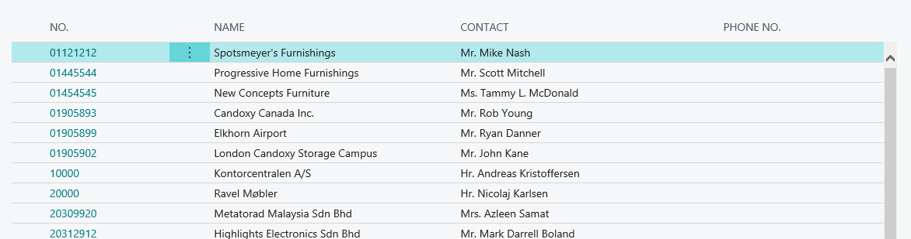

# Working with Repeater Controls

A repeater is a control used to define a list of records that are bound to its source table of a page. These are displayed as rows and columns, where each row is a record and each column is a field. 

You add a `repeater()` control within the `area(Content)` control of a page, and then you nest a `field()` control for each of the fields from the table specified in the [SourceTable Property](properties/devenv-sourcetable-property.md) that you want to include. The order of the field controls determines the order in which they appear on the page.

A list is the characteristic element of the layout of pages of the type **List** and **ListPart**. You define the type of a page using the [PageType Property](properties/devenv-pagetype-property.md) property. List pages are designed for using a single `repeater()` control, which must be defined at the beginning of the content area. If you include more than one repeater or another control like a group or grid, the page might not behave as expected. If you want to design a page that includes controls in the content area other than a repeater, then try using a **Worksheet** page type instead.

<!--elaborate on and correct this-->
Pages of the type **API** are also designed to integrate a repeater control, but they cannot be displayed in the user interface.

The following figure illustrates how the list part created by a repeater in a page appears in the Web Client.



> [!NOTE]
> The Web client does not support displaying Repeater controls that contain other Parts or FlowFilter fields.

## List layout customization

You can make various changes to customize the appearance of the list of a page and determine which data is displayed. This can be done using AL code or directly from the Web Client.

To the improve the visibility and readability of the list you can set some properties at control and field level. For example, you can specify the width of a column using the [Width Property](properties/devenv-width-property.md) or set row indentation using the [IndentationColumn Property](properties/devenv-IndentationColumn-property.md) and the [IndentationControls Property](properties/devenv-IndentationControls-property.md).

You should also consider limiting the number columns and enabling a freeze column, by setting the [FreezeColumn Property](properties/devenv-freezecolumn-property.md), as well as applying filters to display only the most relevant data and minimize scrolling. This is particularly important when it comes to mobile devices, where there are restrictions as to how much content can be shown. You can do this by the way you define the structure of the page or you may use views<!-- to filter and sort table fields and apply layout changes-->. For more information, see [Views](devenv-views.md).

Alternatively, you can add, move or hide fields and make adjustments like modifying the column width from the user interface. To apply these changes you use the Designer tool. For more information, see [Using Designer](devenv-inclient-designer.md). If these changes are meant for just one particular user, then you use the Personalize tool. For more information, see [Personalizing Your Workspace](ui-personalization-user.md). You can also sort the data and apply filters directly using the Filter Pane. For more information, see [Sorting, Searching, and Filtering](ui-enter-criteria-filters.md).

You can also use the Tile View to display records as tiles (or bricks) instead of as rows and optimize the space and readability of data. For more information on how to customize the tile view, see [Displaying Data as Tiles](devenv-lists-as-tiles.md).


## Example

The following example shows how the repeater control is used to define a list page for the Customer table.

```
page 50111 SampleCustomerList
{
    PageType = List;
    ApplicationArea = All;
    SourceTable = Customer;
    UsageCategory = Lists;
    CardPageId = 50112;
    Caption = 'Sample Customers';

    layout
    {
        area(Content)
        {
            // Sets the No., Name, Contact, and Phone No. fields in the Customer table to be displayed as columns in the list. 
            repeater(Group)
            {
                field("No."; "No.")
                {
                    ApplicationArea = All;

                }
                field(Name; Name)
                {
                    ApplicationArea = All;

                }
                field(Contact; Contact)
                {
                    ApplicationArea = All;
                }

                field(Phone; "Phone No.")
                {
                    ApplicationArea = All;

                }
            }
        }
    }

    actions
    {
        area(Processing)
        {
            action("Ledger Entries")
            {
                ApplicationArea = All;
                RunObject = page "Customer Ledger Entries";
                trigger OnAction();
                begin

                end;
            }
        }
    }

}
```

You can use page customizations to modify the layout of a page for concrete users. The following code hides the `"Phone No."` column from the users with `Accountant` profile.

```
profile Accountant
{
    Description = 'Functionality for finance staff performing any AR or AP work and managerial reporting.';
    RoleCenter = "Accountant Role Center";
    Customizations = MyCustomization;
}

pagecustomization MyCustomization customizes "Customer List"
{
    layout
    {
        modify("Phone No.")
        {
            Visible = false;
        }
    }
}

```

## See Also
[Pages Overview](devenv-pages-overview.md)  
[Designing List Pages](devenv-designing-list-pages?tabs=about.md)  
[Page Customization Object](devenv-page-customization-object.md)