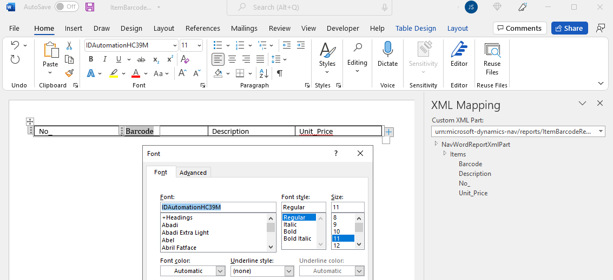
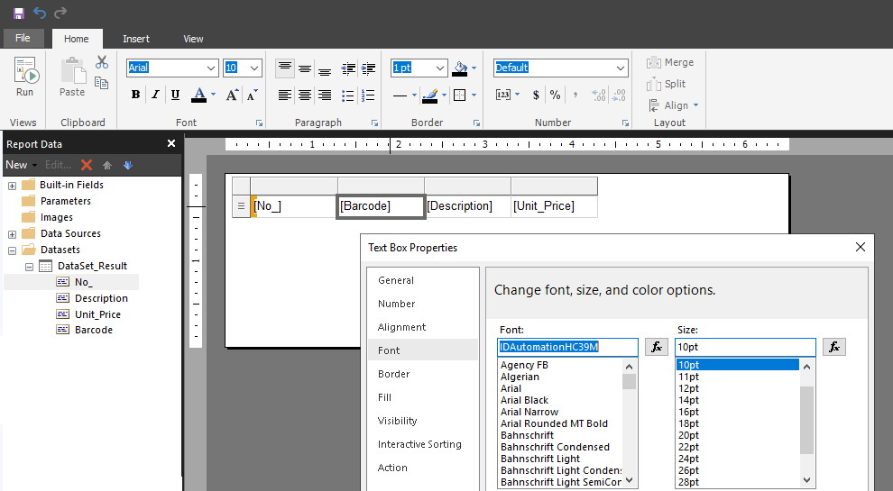

# Adding Barcodes to Reports

[!INCLUDE[2021_releasewave1](../includes/2021_releasewave1.md)]

This article explains how to add barcodes to reports using the barcode functionality in [!INCLUDE[prod_short](includes/prod_short.md)].

## Overview

The barcode functionality lets you convert an alphanumeric value in a report dataset into a barcode on a generated report. The functionality is provided by the **Barcode** module of the System Application. The module includes the objects and tools that you need to add barcodes to reports. This section provides a brief overview of the **Barcode** module. For more information about the module, see the [AL Extensions on GitHub](https://github.com/microsoft/ALAppExtensions/tree/master/Modules/System/Barcode).

### Barcode providers and encoders API

There are two key components involved in barcodes: the barcode provider and the barcode encoder. A *barcode provider* includes a library of different barcode fonts and symbologies available for use in reports. *Barcode encoders* are the components of the provider that encode the data strings of a report dataset to a specific font specification and symbology.

The **Barcode** module provides an API that lets you create custom barcode providers and encoders for one-dimensional and two-dimensional fonts. The API consists of several public objects, including:

- Interfaces for the barcode providers and encoders
- Enums for the barcode symbologies
- A table object for storing encode settings. For example, you can enable an extended character set or checksums in Code39, or change the code set used in Code128.

### Built-in providers and font support

The **Barcode** module also includes the following predefined providers and encoders that implement the interfaces. These providers support several fonts from [IDAutomation](https://www.idautomation.com).

- Codeunit 9215 **IDAutomation 1D Provider** is the barcode provider for IDAutomation one-dimensional fonts
- Codeunit 9221 **IDAutomation 2D Provider** is the barcode provider for IDAutomation two-dimensional fonts

<!-- codeunit 9223 **Dynamics 2D Provider** is the  barcode provider for IDAutomation single dimension fonts-->

With Business Central online, the IDAutomation fonts are automatically available as part of the service. So you can start adding barcodes to reports right away. For a description of the available fonts, see [Barcode Fonts with Business Central Online](devenv-report-barcode-fonts.md).

For Business Central on-premises, you'll have to purchase and install the barcode fonts. If you choose the IDAutomation fonts, you can use the same built-in providers and encoders as Business Central online - without making any changes. Or, you can purchase fonts from other providers, then use the API to create custom barcode providers and encoders.

## Getting started

The tasks involved in creating a report that displays a barcode are as follows:

1. (optional) Install the fonts on your development computer or virtual machine.

    You don't need the barcode fonts installed on the computer you're using when developing a report and its layouts. <!-- It's possible during development to use a font in a layout without having the font installed on the machine that you use to develop the layout.--> Without the font, the report won't show the barcode. But if you then test the report, for example in an online sandbox, it will be shown on the report.

2. If you don't want to use the built-in IDAutomation providers and encoders, create your own provider and encoders using the API.

   When creating your own, adhere to the interface in the Barcode module. Use the built-in providers and encoders as a starting point. Consider contributing to the open-source project if you do.

3. In AL code, add the barcode to a report or report extension object.

    1. Determine the source of the data string that you want to display as a barcode in the report, for example, like a field in the underlying table.
    2. Add a column to the report dataset to hold the encoded string for the barcode.
    3. Encode the data string as the barcode.

       To represent a string as a barcode in a report, you encode it according to the symbology you want. For this step, you add code to:
       - Declare the provider by using the barcode provider interface
       - Declare the barcode font by using the barcode symbology enum
       - Call the font encoder on the data string

      For an example of how it's done, see [Adding the barcode to the report dataset](#reportobj).

4. In the report layout, add the barcode field and apply the barcode font to the field.

    For more information, see [Adding the barcode to the report layout](#reportlayout).

## <a name="reportobj"></a>Adding the barcode to the report dataset in AL

The following code shows an example report that displays the **No.** field of the **Item** table as a barcode. The first example uses the Code 39 one-dimensional font from the built-in IDautomation barcode provider. The example generates both a Word and RDL layout. The second example shows how you to do the same for a QR-Code two-dimensional barcode.

# [One-dimensional](#tab/1d)

```al
report 50100 ItemBarcodeReport1D
{
    UsageCategory = Administration;
    ApplicationArea = All;
    DefaultLayout = Word;
    Caption = 'Item Barcodes';
    WordLayout = 'ItemBarcodes.docx';
    RDLCLayout = 'ItemBarcodes.rdl';

    dataset
    {
        dataitem(Items; Item)
        {
            DataItemTableView = SORTING("No.");
            RequestFilterFields = "No.";
            RequestFilterHeading = 'Items';

            // Column that provides the data string for the barcode
            column(No_; "No.")
            {
            }

            column(Description; Description)
            {
            }

            column(Unit_Price; "Unit Price")
            {
            }

            // Column that stores the barcode encoded string
            column(Barcode; EncodedText)
            {
            }

            trigger OnAfterGetRecord()
            var
                BarcodeString: Text;
                BarcodeSymbology: Enum "Barcode Symbology";
                BarcodeFontProvider: Interface "Barcode Font Provider";

            begin
                // Declare the barcode provider using the barcode provider interface and enum
                BarcodeFontProvider := Enum::"Barcode Font Provider"::IDAutomation1D;

                // Declare the font using the barcode symbology enum
                BarcodeSymbology := Enum::"Barcode Symbology"::"Code39";

                // Set data string source 
                BarcodeString := "No.";

                // Validate the input. This method is not available for 2D provider
                BarcodeFontProvider.ValidateInput(BarcodeString, BarcodeSymbology);

                // Encode the data string to the barcode font
                EncodedText := BarcodeFontProvider.EncodeFont(BarcodeString, BarcodeSymbology);
            end;
        }
    }

    var
        // Variable for the barcode encoded string
        EncodedText: Text;
}
```

# [Two-dimensional](#tab/2d)

```al
report 50101 ItemBarcodeReport2D
{
    UsageCategory = Administration;
    ApplicationArea = All;
    DefaultLayout = Word;
    Caption = 'Item Barcodes';
    WordLayout = 'ItemBarcodes.docx';
    RDLCLayout = 'ItemBarcodes.rdl';

    dataset
    {
        dataitem(Items; Item)
        {
            DataItemTableView = SORTING("No.");
            RequestFilterFields = "No.";
            RequestFilterHeading = 'Items';

            // Column that provides the data string for the barcode
            column(No_; "No.")
            {
            }

            column(Description; Description)
            {
            }

            column(Unit_Price; "Unit Price")
            {
            }

            // Column that stores the barcode encoded string
            column(Barcode; EncodedText)
            {
            }

            trigger OnAfterGetRecord()
            var
                BarcodeString: Text;
                BarcodeSymbology: Enum "Barcode Symbology 2D";
                BarcodeFontProvider: Interface "Barcode Font Provider 2D";

            begin
                // Declare the barcode provider using the barcode provider interface and enum
                BarcodeFontProvider := Enum::"Barcode Font Provider 2D"::IDAutomation2D;

                // Declare the font using the barcode symbology enum
                BarcodeSymbology := Enum::"Barcode Symbology 2D"::"QR-Code";

                // Set data string source 
                BarcodeString := "No.";

                // Encode the data string to the barcode font
                EncodedText := BarcodeFontProvider.EncodeFont(BarcodeString, BarcodeSymbology);
            end;
        }
    }

    var
        // Variable for the barcode encoded string
        EncodedText: Text;
}
```

---

## <a name="reportlayout"></a>Adding the barcode to the report layout

When done modifying the report or report extension objects, build the project to create the layout documents. Then create the report layouts as usual (see [Creating an Word Layout Report](devenv-howto-report-layout.md) or [Creating an RDL Layout Report](devenv-howto-rdl-report-layout.md)). <!-- Each supported symbology has a corresponding font installed in Business Central online. --> 

To display the barcode the layout, you'll have to do two things:

1. Add the barcode encoded string column from the dataset to the layout.

   Referring to the example above, you'd add the `Barcode` column.

2. Apply the barcode font to the barcode column by using the text features of Word or Report Builder.

   - For Word layouts:

     In Word, select barcode column control, press Ctrl+D, then enter or select the barcode font name.  

     [  ](media/report-layout-barcode-word-clip.png)

   - For RDLC layouts

     You can use Microsoft Report Builder or modify the XML of .rdl file directly from Visual Studio Code. In Microsoft Report Builder, right-click the barcode column control, select **Text Box Properties** > **Font**.

     [  ](media/report-layout-barcode-rdl-clip.png)

     The following code snippet illustrates how to make the same modifications directly in the .rdl file from Visual Studio Code:

     ```xml
     ...
        <TablixCell>
            <CellContents>
            <Textbox Name="Barcode">
                <Paragraphs>
                <Paragraph>
                    <TextRuns>
                    <TextRun>
                        <Value>=Fields!Barcode.Value</Value>
                        <Style>
                            <FontFamily>IDAutomationHC39M</FontFamily>
     ...
     ```

   When using IDAutomation fonts, specifying the font is different for one-dimensional and two-dimensional fonts:

   - One-dimensional barcode fonts can have several versions, where each version has a different name. For example, Code 39 includes **IDAutomationHC39S**, **IDAutomationHC39M**, and many more. In this case, set the font to match the specific font version you want.
   - Two-dimensional barcodes, other than Maxicode, use the same font name. To specify a two-dimensional font, use **IDAutomation2D**.
   - For Maxicode two-dimensional barcode, use **IDAutomation2D MaxiCode**.

    > [!IMPORTANT]
    > When modifying a report layout for production environment, it's important that the font you specify is installed on the Business Central service. Otherwise, the barcode won't display correctly on the report. So for Business Central online, be sure to specify a purchased font name (like **IDAutomationHC39M**); not an evaluation font name (like **IDAutomationSHC39M Demo**). For more information, see [Font versions and names](devenv-report-barcode-fonts.md#font).

## Setting up Business Central on-premises deployment

With [!INCLUDE[prod_short](includes/prod_short.md)] on-premises, you'll have to install the barcode fonts on the computer that runs the [!INCLUDE[server](includes/server.md)]. As a minimum, you must install the fonts for the user that runs the [!INCLUDE[server](includes/server.md)] instance, that is, the service account. It's easiest just to install the font for all users.

To install the fonts, follow the instructions from the font supplier or see [Add a Font](https://support.microsoft.com/en-us/office/add-a-font-b7c5f17c-4426-4b53-967f-455339c564c1). After you install the fonts, restart your computer.


## See Also

[Request Pages](devenv-request-pages.md)  
[Creating an RDL Layout Report](devenv-howto-rdl-report-layout.md)  
[Creating a Word Layout Report](devenv-howto-report-layout.md)  
[Developing Extensions](devenv-dev-overview.md)  
[AL Development Environment](devenv-reference-overview.md)  
