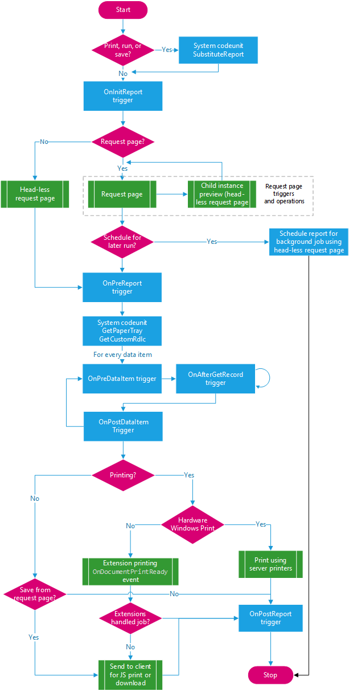
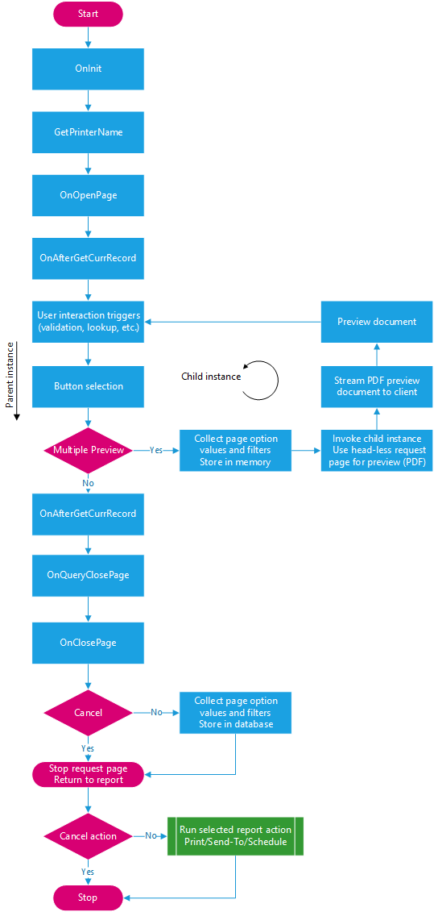
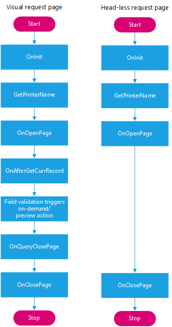

# Report Triggers and Runtime Operations

This article describes the triggers and operations that are executed when a report is run. The triggers and operations will depend on a few things, like:

- Whether the report has request page
- What action the user takes on the request page, like preview, print, and schedule
- What preview mode the report uses

Some triggers are invoked in the report, while others are invoked on the request page. Understanding the sequence of the triggers and operations will help you design reports that work as expected.

## Overall report trigger and operations

For starters, look at the following diagram that illustrates the general overall flow when a report is invoked. The flow is broken down even further in the [next section](#requestpage), which discusses triggers and operations related to request pages.

  

When you start the report run, the [OnInitReport Trigger](triggers-auto/report/devenv-oninitreport-report-trigger.md) is called. If the OnInitReport doesn't end the processing of the report, then the request page for the report is run, if one is enabled. The page triggers for the request page are called. On the request page, you select the options that you want for this report. You can also decide to cancel the report run. If you decide to continue, then the [OnPreReport Trigger](triggers-auto/report/devenv-onprereport-report-trigger.md) is called. At this point, no data has yet been processed. When the OnPreReport trigger has been run, the first data item is processed unless the processing of the report was ended in the OnPreReport trigger.  

> [!TIP]
> For more information about the print triggers and operations, see [Developing Printer Extensions in Business Central](devenv-reports-printing.md#overview).

### How data items are processed

Data items are processed one after the other, each in the same way. When there are no more data items, the [OnPostReport Trigger](triggers-auto/report/devenv-onpostreport-report-trigger.md) is called to do any necessary post processing, for example, removing temporary files.  

The process for each data item is as follows:

1. Before the first record is retrieved, the [OnPreDataItem Trigger](triggers-auto/reportdataitem/devenv-onpredataitem-reportdataitem-trigger.md) is called.
2. Data item records are processed one at a time.

   Processing a record involves executing the record triggers and outputting data. After a record is retrieved from the data item, the [OnAfterGetRecord (Data Items) Trigger](triggers-auto/reportdataitem/devenv-onaftergetrecord-reportdataitem-trigger.md) is called.

    If there's an indented data item, its records are also processed. After the last record in the indented data item, the control returns to the point from which processing was started. In the case, it's the next record of the data item on the next highest level.

3. After the last record has been processed, the [OnPostDataItem Trigger](triggers-auto/reportdataitem/devenv-onpostdataitem-reportdataitem-trigger.md) is called.  

## <a name=requestpage></a> Request page and preview triggers and operations

The section outlines the triggers and operations that are related to the report request page and report preview. The following diagram illustrates the main trigger and operation sequence. The focus is on the triggers and actions related to the request page invocation and button actions. See the sections that follow for details about some of the concepts shown.



### <a name="modes"></a>Request page preview modes

Request pages can invoke the preview window in two different modes: *preview & close* and *multiple-preview*. The mode will affect the report behavior, depending on the trigger implementation in the current report. The following table describes the two preview modes.

|Preview mode|Description|
|------------|----------|
|preview & close| The preview & close mode is the only mode supported in Business Central 2020 release wave 1 (version 16) and earlier. This mode invokes the preview action within the current report instance, referred to as the *primary instance*. In this mode, the request page closes when the user previews the report. The user will then have to run the report again if the preview doesn't show the expected result.<br><br>In the client, a request page that uses this mode will include the **Preview & Close** button. |
|multiple-preview|The multiple-preview mode was introduced in Business Central 2020 release wave 1 (version 17.). It provides users the ability to preview a report multiple times, without closing the request page. When the preview action is selected, the mode first captures the values in the visible request page controls and filters. Then, it invokes a new report instance, referred to as the *child instance*, to generate the preview document based on the settings. The request page in the original report instance will remain available after the user closes the preview window.<br><br>In the client, a request page that uses this mode will include the **Preview** button.|

For more information to help your design, see [Key Design Guidelines and Considerations](#multiplepreview).

#### How the mode is set

By default, reports use the multiple-preview mode. The mode is determined by two report properties: [SaveValues](properties/devenv-savevalues-property.md) and [AllowScheduling](properties/devenv-allowscheduling-property.md), as outlined in the following table:

|SaveValues|AllowSheduling = true|AllowSheduling = false|
|----------|---------------------|----------------------|
|SaveValues = true|Multiple-preview|Preview & close|
|SaveValues = false|Preview & close|Preview & close|

### <a name="headless"></a>Visible and head-less request page flows

There are two different request page flows that can be invoked in the process: a *visual request page* and a *head-less request page*. The request page flow used will depend on various design factors. Each type has a different trigger sequence.

The visual request page flow is used on the request page instance that appears for the user in the client. In this case, the triggers are executed on the primary instance.

The head-less request page flow shows the triggers that are executed when a report runs without a visible request page. The head-less flow occurs under the following conditions:

- In the child instance, when a report uses the multiple-preview mode
- When a report is scheduled to run in the background
- When a report is invoked with the request page XML data in the parameter list
- When a report that doesn't have an enabled request page

The following diagram highlights the basic trigger sequence for a request page for the two possible request pages.

 

The key differences between the two flows are the [OnAfterGetCurrRecord](triggers-auto/requestpageextension/devenv-onaftergetcurrrecord-requestpageextension-trigger.md) and [OnQueryClosePage](triggers-auto/requestpageextension/devenv-onqueryclosepage-requestpageextension-trigger.md) triggers in the visual flow. Only visible user interface elements are transferred to the child instances through the request page XML data. User interaction triggers, like lookup, validate, and other page triggers, aren't invoked in head-less reports flows.

> [!NOTE]
> The `GetPrinterName` procedure in the diagram isn't an actual AL-enabled trigger. Instead, it's a call from platform to the application code that subscribes to the GetPrinterName event, which will return the selected printer name for the current report.

### <a name="child"></a>Detailed child instance triggers and operations in multiple-preview mode

With multiple-preview mode, a child instance is created off the parent visual request page. The child instance collects data from visual request page, then uses the head-less request page to process data items and build the PDF preview.
The new instance will rerun most the report triggers and some request page triggers.

The following snippet lists the actual triggers that are invoked when a report is run. It starts from when the user first selects preview, and continues through printing.

- Lines prefixed with `ROOT` indicate triggers that are run in the primary instance.
- Lines marked with `--PAGE` are triggers invoked from the request page. All other triggers originate from the report object itself.
- Lines prefixed with `CHILD` indicate triggers that are run in the child instance.
- For simplicity, only one record in each nested data item is shown.

```
ROOT OnAfterSubstituteReport
ROOT OnInitReport
ROOT OnInit                        --PAGE
ROOT OnAfterHasCustomLayout
ROOT OnAfterGetPrinterName
ROOT OnOpenPage                    --PAGE
ROOT OnAfterGetCurrRecord          --PAGE
	CHILD OnInitReport             --PAGE
	CHILD OnInit                   --PAGE 
	CHILD OnOpenPage               --PAGE
	CHILD OnClosePage              --PAGE 
	CHILD OnPreReport
	CHILD OnAfterGetPaperTrayForReport
	CHILD MasterRecord - OnPreDataItem
		CHILD MasterRecord - OnAfterGetRecord 1
			CHILD MasterRecordLines - OnPreDataItem
				CHILD MasterRecordLines - OnAfterGetRecord 101
			CHILD MasterRecordLines - OnPostDataItem
		CHILD MasterRecord - OnPostDataItem
	CHILD OnAfterHasCustomLayout
	CHILD OnPostReport
	CHILD OnMergeDocumentReport
ROOT OnQueryClosePage              --PAGE
ROOT OnClosePage                   --PAGE
ROOT OnPreReport
ROOT OnAfterGetPaperTrayForReport
ROOT MasterRecord - OnPreDataItem
	ROOT MasterRecord - OnAfterGetRecord 1		
		ROOT MasterRecordLines - OnPreDataItem
			ROOT MasterRecordLines - OnAfterGetRecord 101
		ROOT MasterRecordLines - OnPostDataItem
ROOT MasterRecord - OnPostDataItem
ROOT OnPostReport	
ROOT OnMergeDocumentReport
```

## Key design guidelines and considerations

### <a name="multiplepreview"></a>Multiple-preview mode

- Avoid the following implementations:  

  - Set global variables in page triggers
  - Use the OnQueryClose page trigger to change global variables in the report
  - Depend on instance methods to be called to set state variables before report invocation
  - The request pages that have `SaveValues` property set to `false`.

  If you have reports that use any of these implementations, refactor them to ensure report content renders as expected.

  > [!NOTE]
  > If a legacy report depends on global variable state, the developer can use a single instance codeunit to transfer variable state between the two running instances. The state is the set in the primary object and read from the child object.

    For more information about the flow, see [Request page and preview triggers and operations](#requestpage).

- Only visible user interface elements are transferred to the preview in child instances.

    User interaction triggers from the visible request page, like lookup, validate, and other page triggers, aren't invoked in head-less request page flow in the child instance. Design these triggers so that they don't affect variables that are hidden in the object. For more information, see [Visible and head-less request page flows](#headless).

- **OnInitReport** trigger calls

  **OnInitReport** trigger is run when the report initially invoked, and again for every preview of the report in the child instance. This condition, in some cases, can mean that before the report is even executed, the **OnInitReport** trigger has already run twice. For more information, see [Detailed child instance triggers and operations in multiple-preview mode](#child).

- The design of some reports may make it impossible or undesirable to run in the multiple-preview mode.

    In these cases, the report should run in the preview & close mode. So as a developer, you set the `AllowScheduling` property to `false` in the report object declaration. Optionally, you can set the `SaveValues` property of request page to `false`, in which case, the mode will revert to preview & close mode. However, this configuration isn't recommended, because it removes the ability to save current settings for later use.

    For more information, see [Request Page Preview Modes](#modes).

### General

- Defining methods that have the same name in the report and table

    If you have two methods with the same name, one defined in a report and the other in a table that is referenced by the report, you cannot invoke the method defined in the report directly. By default, a call to the method invokes the method that's defined in the table. This behavior occurs when the method is called from a source expression or a trigger.

## See Also

[Report and DataItem triggers](triggers/devenv-report-and-data-item-triggers.md)  
[Report Object](devenv-report-object.md)  
[Triggers](triggers/devenv-triggers.md)  
