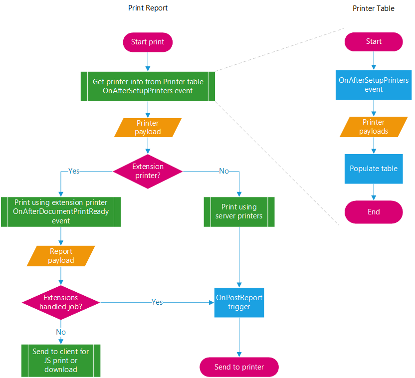
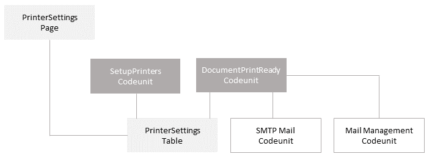

# Developing Printer Extensions in Business Central

This article provides an overview about how to add code that enables [!INCLUDE[prodshort](../developer/includes/prodshort.md)] reports to be sent from the client directly to a web-connected printer, like an email printer or through a cloud printing service.

Without any customized code, there's no way to send a report directly to a printer for printing. The only way to print a report from the client is to download it first (as a .pdf file), and then send it to a printer. But you can create extensions that are designed to send reports to  web-connected printers. For example, if you have an email printer, you create an extension that sends print jobs directly to the printer's email address.

## Overview

To accommodate printing, the system publishes two events that you can subscribe to: [OnAfterSetupPrinters](devenv-onaftersetupprinters-event.md) and [OnAfterDocumentPrintReady](devenv-onafterdocumentprintready-event.md). The following figure illustrates the runtime execution of the events:



Throughout the print process, the system compiles the report into a PDF file and passes it in a stream object, then finally sends the PDF file the printer.

#### OnAfterSetupPrinters event

You subscribe to the OnAfterSetupPrinters event to set up different printers that users can use on reports, which they select from the **Printer Selections** page. The OnAfterSetupPrinters event is a global integration event that is published from codeunit **44 Report Managements**. It has the following declaration:  

```
[IntegrationEvent(false, false)]
local procedure OnAfterSetupPrinters(var Printers: Dictionary of [Text[250], JsonObject]);
```

The *Printers* parameter is a [Dictionary of [Text, Text]](methods-auto/dictionary/dictionary-data-type.md) type that includes a collection of key-value pairs that define different printer setups. The key specifies a name for the printer. The value is a JSON object that specifies settings supported by the printer. The settings include information like paper size, paper trays, default copies, and more. The JSON object is referred to as the *payload*.

The OnAfterSetupPrinters event is raised when the following operations occur:

- When you open a page that uses the virtual table **Printer** as its source.
- From page **64 Printer Selections** in the base application, when you access the **Printer Name** field for selecting a printer for a report. This field has a lookup to the **Printer** table.
- From a report request page, when you select the **Print** or **Preview** action for a report. But only if the report is set up to use a specific printer from the **Printer Selections** page.

#### OnAfterDocumentPrintReady

You subscribe to the OnAfterDocumentPrintReady event to specify what happens when the user selects the **Print** action on a report request page. You use OnAfterDocumentPrintReady event subscribers to provide instructions on how and where to send to the report for printing. For example, with email printing, the OnAfterDocumentPrintReady event subscriber would construct and send an email to a target printer. 

The OnAfterDocumentPrintReady event is also a global integration event that is published from codeunit **44 Report Managements**. It has the following declaration:

```
IntegrationEvent(false, false)]
local procedure OnAfterDocumentPrintReady(ObjectType: Option "Report","Page"; ObjectId: Integer; ObjectPayload: JsonObject; DocumentStream: InStream; var Success: Boolean);
```

The event is raised when the use selects the **Print** action on the request page of a report. Two parameters of interest are *DocumentStream* and *ObjectPayload*. *DocumentStream* is an Upstream object that contains the report data to be printed. The *ObjectPayload* is a JsonObject type object that combines the printer payload and report metadata. The report metadata includes information like the company name, MIME type, views, and more. This combination is referred to as the *report payload*. 

## Development Overview

To develop a printer extension, you create codeunits that subscribe to the OnAfterSetupPrinters and OnAfterDocumentPrintReady events. Plus, you would typically add other objects to support the printing. For example, you could create a table that stores printer setups and a page that enables users to manage them. <!--As a good example, check out the **Send To Email Printer** extension that is available with Business Central. The following figure provides a simplified overview of the objects that make up this extension. -->




<!--
The following figure illustrates a simplified development flow:


-->

For more information about using the OnAfterSetupPrinters and OnAfterDocumentPrintReady events to create a printer extension, see [Creating a Printer Extension](devenv-reports-create-printer-extension.md).
<!--
> [!TIP]
> These articles will explain the usage through simple examples. To see a detailed implementation in action, check out the **Send To Email Printer** extension that included with Business Central.

articles will explain how to subscribe to and use the events:

[Setting Up Printers With the OnAfterSetupPrinters event](devenv-reports-setup-printers.md)

[Handling Print Action with the OnAfterSetupPrinters Event](devenv-reports-handle-print-action.md)-->

## See Also  

<!--[Troubleshooting Email Printing](devenv-report-troubleshooting-printing.md)  -->
 [Events in AL](devenv-events-in-al.md)   
 [Publishing Events](devenv-publishing-events.md)   
 [Raising Events](devenv-raising-events.md)   
 [Subscribing to Events](devenv-subscribing-to-events.md)  