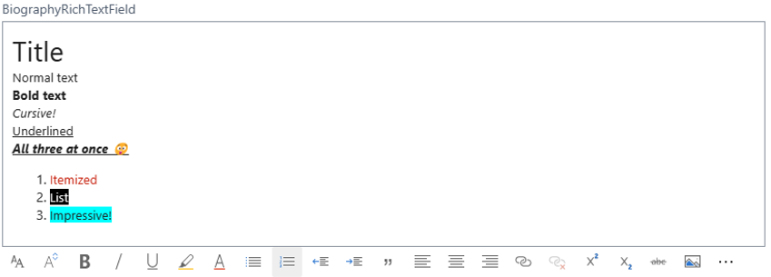

# Rich Text and content controls

[!INCLUDE [2023-releasewave2](../includes/2023-releasewave2.md)]

The Rich Text feature in [!INCLUDE [prod_short](includes/prod_short.md)] is designed to handle multimedia content, such as social media posts, email bodies, quick annotations, file contents, or any field that requires a mix of text, tables, links, and images. It's best suited for cases where the user needs to author, view, or modify unstructured information and requires a moderate amount of space to work comfortably. The rich text control enables rich multimedia content editing. With that you get a multiline textbox with a rich toolbar, corresponding keyboard shortcuts, and the ability to author or paste in pictures, tables, and formatted text. A typical use case of a Rich Text Editor is the email editor. They require significant screen space to function correctly and fill the available horizontal space and stretch vertically up to a limit. The control includes a toolbar and shortcuts for formatting text (for example, for changing the font or font size), making text italic, bold, and more. There's also the option to add tables, images, and hyperlinks.
The following image shows an example of the Rich Text Editor containing multiple different types of text formatting.



The Rich Text feature can be applied to Blob, BigText, and Text data types without any size limits. A Rich Text control must be placed on its own in a group (for example, in a FastTab). When the content of the Rich Text control is persisted in the database, it's saved as HTML. Media-like pictures are embedded in the HTML content itself and aren't persisted in a separate table, nor in online file storage. The size and type of data means that the control’s content is best persisted by using a table field of the Blob data type.

> [!NOTE]  
> The Rich Text feature isn't intended for simple text formatting, such as bold, italic, and underline, but that will be supported in a future update.

## Creating a Rich Text Editor

Creating a control, which renders a Rich Text Editor is done with a few steps, but it takes a bit more work to combine the control with a persisted value on a record. In the following section, you'll see an example of how to persist the value of a Rich Text Editor in a table's blob field.

### Example: Creating a Rich Text Editor backed by a Blob field

This example uses triggers and streams to achieve persistence of the rich text value. The code comments inside the example explain the design pattern. The example uses `Text`, but the pattern is also applicable to using the `BigText` data type.

```AL
table 50100 MyTable
{
    fields
    {
        field(1; MyIntegerField; Integer) { }
        field(2; RichTextBlob; Blob) { Description = 'Contains a rich text value'; }
    }

    /// <summary>
    /// Reads the RichTextBlob value into a stream and outputs the value as a text representation.
    /// </summary>
    /// <returns>A text value, which can be used with a Rich Text Editor.</returns>
    procedure GetRichText(): Text
    var
        InStream: Instream;
        TextValue: Text;
    begin
        Rec.CalcFields(Rec.RichTextBlob);
        Rec.RichTextBlob.CreateInStream(InStream);
        InStream.ReadText(TextValue);

        exit(TextValue);
    end;

    // 
    /// <summary>
    /// Saves the text parameter in the RichTextBlob field.
    /// </summary>
    /// <param name="MyRichText">The value to save in blob field.</param>
    procedure SaveRichText(RichText: Text)
    var
        OutStream: OutStream;
    begin
        Rec.RichTextBlob.CreateOutStream(OutStream);
        OutStream.WriteText(RichText);
        Rec.Modify();
    end;
}

page 50100 MyPage
{
    PageType = Card;
    SourceTable = MyTable;

    layout
    {
        area(Content)
        {
            group(FastTabGroup)
            {
                // Rich Text Editor is required to be alone in a FastTab group, which is a group that is at the root-level of the page
                field("Rich Text Editor"; RichText)
                {
                    Caption = 'My Rich Text Editor.';

                    // Both ExtendedDataType and Multiline are required to render a Rich Text Editor
                    ExtendedDataType = RichContent;
                    MultiLine = true;

                    // Ensures that the value from the RichText variable is persisted in the record
                    trigger OnValidate()
                    begin
                        Rec.SaveRichText(RichText);
                    end;
                }
            }
        }
    }
    
    // Ensures that when the page loads, the persisted value is read into the Rich Text Editor control
    trigger OnAfterGetCurrRecord()
    begin
        RichText := Rec.GetRichText();
    end;

    var
        RichText: Text;
}

```

### Good to know

- The rich text control stretches to the sides of the page and to a maximum height, but it can't be reduced to a single line field, nor stretched to fill the entire screen.
- It can't be used with repeater controls.
- A rich text control has limited UI customization through, for example, personalization.
- The toolbar can't be customized.
- Extensions can transform a field into a `RichContent` type as long as the full code pattern matches the expected pattern.
- Images are embedded in the HTML.
- The `RichContent` value of `ExtendedDataType` can't be set directly on a table field, if you try, you'll get a compiler error.
- The Rich Text Editor must specify `MultiLine = true`.
- The placement of the Rich Text Editor must be on a root-level group on the page (that is, a FastTab group), and it must be the only control in that group.

## See also

[Blob data type](methods-auto/blob/blob-data-type.md)  
[BigText data type](methods-auto/bigtext/bigtext-data-type.md)  
[Text data type](methods-auto/text/text-data-type.md)  
[ExtendedDataType Property](properties/devenv-extendeddatatype-property.md)   