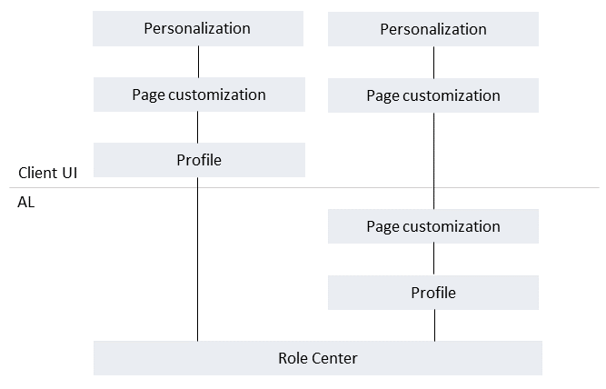

# Customizing the User Interface for User Roles

The strength of [!INCLUDE[prodshort](includes/prodshort.md)] is its role-tailored experience that helps users focus on the work that is important to them. [!INCLUDE[prodshort](includes/prodshort.md)] offers several features for developers, application administrators, and end-users, that can be used to customize the the pages that users work with in the client. These features customize the pages on different layers, as illustrated in the following figure. Some customization is done in AL extensions, while others can be done from the client.



## Role Centers

The Role Center is first layer of customization. The Role Center is the user's entry point and home page for [!INCLUDE[prodshort](includes/prodshort.md)], displaying information that is pertinent to the user's role in the company and enabling them to easily navigate to relevant pages for viewing data and performing tasks. You can develop several different Role Centers, where each Role Center is customized to the profile of the intended users.

A Role Center is created in AL by the `rolecenter` page type. 

For more information, see [Designing Role Centers](devenv-designing-role-centers.md).

## Page extensions and designer

A [page extension object](devenv-page-ext-object.md) extends a page object by adding, moving or hiding UI elements that are defined in the page's source code. Page extensions can be created in Visual Studio Code or from the client using [Designer](devenv-inclient-designer.md). Changes made by page extensions affect the UI for all users, regardless of which profile they belong to.

## Profiles and page customizations 

A *profile* is the mechanism that makes a Role Center and its associated pages available to users in the client and enables you to build an individual experience for the specific user role. In the client, profiles are referred to as **Roles**. Users sign in to the client under a specific role, which they can switch from the **My Settings** page. Different profiles can use the same Role Center. Profiles can be created as part of an extension by writing AL code or they can be created from the client by a user who has the proper permissions, typically an administrator or consultant.

On top of the profile are *page customizations*. Page customizations modify the layout of elements on specific pages. For example, you can move or hide actions, fields, columns on list, or entire parts; exactly the same modifications that can be done using personalization. The page customizations will be seen by all users of the profile. Like profiles, page customizations can be made in AL as part of an extension or from the client by modifying the profile. Customizations that are made from the client will take precedence over the customizations in AL. <!--Page customizations are substractive between layers. This means, for example, if an element such as an action or part is removed at by an extension, it cannot be added by customizing the profile in the client or by personalization.-->

For more information about profiles and page customization in AL, see [Designing Profiles](devenv-design-profiles.md). For information about using the client, [Customizing the Workspace for Profiles (Roles)](/dynamics365/business-central/ui-personalization-manage?) in the [!INCLUDE[prodshort](includes/prodshort.md)] Application Help.

<!--

- In AL code, profiles are created by using the [profile object](devenv-profile-object.md).
- In the client, profiles are managed from the **Profiles** page. For more information, see [Understanding Users, Roles, and Profiles](/dynamics365/business-central/admin-users-profiles-roles) in the [!INCLUDE[prodshort](includes/prodshort.md)] Application Help.

<!--
## Page customizations


- In AL code, you create extension-based page customizations by using the [page customization object](devenv-page-customization-object.md).
- In the client, you create page customizations for profiles from the **Profiles** page. For more information, see [Customizing the Workspace for Profiles (Roles)](/dynamics365/business-central/ui-personalization-manage) in the [!INCLUDE[prodshort](includes/prodshort.md)] Application Help.

-->
## Personalization

The last layer of customization is personalization. This is done strictly in the client by end-users for customizing their own workspaces. The changes that users make take precedent over page customizations made on the profile. The changes will only be seen by the user; not other users.  For more information, see [Personalizing Your Workspace](/dynamics365/business-central/ui-personalization-user) in the [!INCLUDE[prodshort](includes/prodshort.md)] Application Help.

<!--
## Using the client to create AL profiles and page customizations

Creating profiles and page customizations from the client can be a useful alternative to writing AL code directly in Visual Studio Code because you are working with the user interface just as the users would. This is especially advantageous for consultants, application administrators, and less technical users. But a consequence of using the client alone is that the profile-related changes pertain only to the tenant in which they were made. In contrast, profiles and page customizations that are extension-based are published to the application server instance and available for installation on all tenants.

However, you can export user-defined profiles and page customizations from the client to files (.al type) that contain the changes as AL code. Once you have the files, you can include them in a Visual Studio Code project and compile them into an extension package that can be published and available to all tenants. To export user-defined profiles and page customizations from the client, open the **Profiles (Roles)** page, and select the **Export User-Created Profiles** action. A .zip file is downloaded to your computer. The zip files contains .al files for the profile and page customizations, plus an app.json and profiles.json file.  

### Exported profiles

Profiles that are created in the client are indicated as **\(user-created\)**. Each user-created profile is exported to a separate .al file that contains the `profile` object that defines the profile and the page customizations it uses. For example, you created a profile with the ID **MyProfile** that uses the role center page **9022 Business Manager Role Center**, and you customized the Business Manager Role Center itself, plus the **Customer** list page. The exported zip file would contain file called **PROFILE.MyProfile.al** that includes the following code:

```
profile MyProfile
{
  CaptionML = ENU='My Profile';
  Enabled = true;
  ProfileDescriptionML = ENU='This is my sample profiles';
  Promoted = true;
  RoleCenter = 9022;
  Customizations = Configuration1; Configuration2;
}
```

### Exported page customizations for user-created profiles

Page customizations that are made to user-created profiles are exported to an .al files that include a `pagecustomization` object that defines the modification to the page. A separate file is created for each customized page. Referring to the example above, the zip file would include two files: **PageCustomization._Business Manager Role Center_.Configuration1.al** and **PageCustomization._Customer List_.Configuration2.al**. The files include code similar to the following:

```
pagecustomization Configuration1 customizes "Business Manager Role Center"
{
  layout
  {
    modify(Control16)
    {
    Visible = false;
    }
  }
  actions
  {
  }
}
```

And:

```
pagecustomization Configuration2 customizes "Customer List"
{
  layout
  {
    modify("Balance (LCY)")
    {
    Visible = false;
    }
  }
  actions
  {
  }
}
```

### Exported page customizations for extension-based profiles

Page customizations that are made to extension-based profiles are exported to two types of .al files. The first file includes a `profileextension` object that specifies which profile has been modified and includes references to the page customization object files. The second file type includes a `pagecustomization` object that defines the modification to the page. A separate file is created for customized page. For example, if you customized the **Customer** page for the **Business Manager** profile that is provided by the Base Application extension, the zip file would contain two files: **ProfileExtension._BUSINESS MANAGER.al** and **PageCustomization._Customer List_.Configuration2.al**. The files will contain code similar to the following:

```
profileextension BUSINESSMANAGER_1 extends "BUSINESS MANAGER"
{
  Customizations = Configuration3;
}
```

And:

```
pagecustomization Configuration3 customizes "Customer List"
{
  layout
  {
    modify("Balance Due (LCY)")
    {
    Visible = false;
    }
  }
  actions
  {
  }
}
```

> [!IMPORTANT]
> Currently, the `profileextension` object and profiles.json are only used internally for managing profiles from the client. You cannot develop and compile these in AL with Visual Studio Code. This will be be supported in a future release.  
-->
## See Also
[Developing Extensions](devenv-dev-overview.md)  
[AL Development Environment](devenv-reference-overview.md)  
[Page Object](devenv-page-object.md)  
[Page Extension Object](devenv-page-ext-object.md)  
[Page Extension Properties](properties/devenv-page-property-overview.md)   
