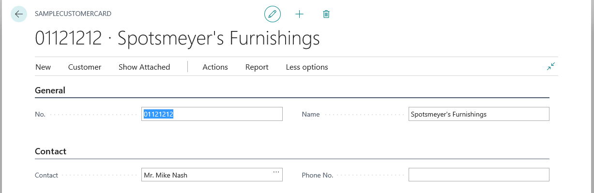

# Simple Card Page Code Example

The AL code in this article creates a simple card page that displays records from an existing table.



For a more detailed explanation of the list page, see [Designing Card and Document Pages](devenv-designing-card-pages.md).

```
page 50112 SampleCustomerCard
{
    PageType = Card;
    ApplicationArea = All;
    UsageCategory = Administration;
    SourceTable = Customer;

    //Defines the names for promoted categories for actions.
    PromotedActionCategories = 'New,Process,Report,Manage,New Document,Request Approval,Customer';

    layout
    {
        area(Content)
        {
            //Defines a FastTab that has the heading 'General'.
            group(General)
            {
                field("No."; "No.")
                {
                    ApplicationArea = All;

                }
                field(Customer; Name)
                {
                    ApplicationArea = All;

                }
            }

            //Defines a FastTab that has the heading 'Contact'.
            group(Contact)
            {
                field(Name; Contact)
                {
                    ApplicationArea = All;

                }
                field(Phone; "Phone No.")
                {
                    ApplicationArea = All;

                }
            }
        }
    }

    actions
    {
        area(Processing)
        {

            //Defines action that display under the 'Actions' menu.
            action("New Sales Quote")
            {
                ApplicationArea = All;
                RunObject = page "Sales Quote";
                Promoted = true;
                PromotedCategory = New;
                Image = NewSalesQuote;
                trigger OnAction();
                begin

                end;
            }
            action("Banks Account")
            {
                ApplicationArea = All;
                RunObject = page "Customer Bank Account List";
                Promoted = true;

                //Promotes the action to the category named 'Customer'.
                PromotedCategory = Category7;
                Image = BankAccount;
                trigger OnAction();
                begin

                end;
            }

        }
        area(Reporting)
        {

            //Defines action that display under the 'Report' menu.
            action("Statement")
            {
                ApplicationArea = All;
                RunObject = codeunit "Customer Layout - Statement";
                trigger OnAction();
                begin

                end;
            }
        }
    }
    var
        myInt: Integer;
}

```

## See Also
[AL Development Environment](devenv-reference-overview.md)  
[Page Extension Object](devenv-page-ext-object.md)  
[Actions Overview](devenv-actions-overview.md)  
[Adding Pages and Reports to Search](devenv-al-menusuite-functionality.md)  
[Personalizing Your Workspace](/dynamics365/business-central/ui-personalization-user)  
[Using Designer](devenv-inclient-designer.md)  